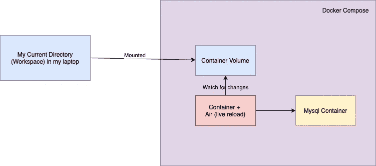

# 今天我学习了:Golang Live-使用 Docker Compose + Air 为开发重新加载

> 原文：<https://medium.easyread.co/today-i-learned-golang-live-reload-for-development-using-docker-compose-air-ecc688ee076?source=collection_archive---------0----------------------->

## 今天我学到了一些关于在开发中为 Golang 应用程序尝试实时重载的小事情。


Photo by [Jeremy Perkins](https://unsplash.com/@jeremyperkins?utm_source=medium&utm_medium=referral) on [Unsplash](https://unsplash.com?utm_source=medium&utm_medium=referral)

今天，我试图为我的 Golang 应用程序创建一个实时重载。只是 REST API 的一个简单应用。

供您参考， ***实时重新加载*** 是一种在每次文件更改时重新加载我们的应用程序的机制。因此它将与您的代码保持同步。我不确定这和热装弹是一样的。但是人们说实时重载是在文件改变时重新加载应用程序。和热重新加载，只会刷新更改的文件，而不会丢失应用程序的状态，所以它不会重新启动整个应用程序。

同样基于[这个 Stackoverflow 的回答](https://stackoverflow.com/a/41429055/4075313)，

> **实时重新加载**当文件改变时，重新加载或刷新整个应用程序。例如，如果你在导航中深入四个链接并保存了更改，实时重新加载将重新启动应用程序，并将应用程序加载回初始路线。
> 
> **热重装**仅刷新已更改的文件，不会丢失应用的状态。例如，如果您导航到四个链接深处并保存了对某个样式的更改，则状态不会改变，但新样式会出现在页面上，而不必导航回您所在的页面，因为您仍在同一页面上。

我想，对于这篇文章，我可以说这是一个实时重新加载，因为我不确定我们是否能为 Golang 使用热重新加载。因为对于 Golang 来说，每一次改动，我们都需要从重新编译到重新运行，重新启动应用。所以最有可能的办法就是用直播重装，而不是热重装。

# 背景

不过在说细节之前，我想先说一下背景，为什么这么多年后我才学会这个实弹-重装？

我已经和 Golang 一起工作了 3 年，但是我从来没有在我的项目中使用过实时重载。这并不是因为我是一个无知的人，我确实想使用 live-reload 进行开发。

但是对于 Golang 的情况，我有几个原因，为什么我没有使用它。

*   **Golang 是一种编译型编程语言。**我认为编译编程语言不可能实时重载。因为我们需要编译应用程序并运行它。嗯，从技术上来说，我没有错，甚至我们可以创建一个实时重新加载工具，来观察变化和重新编译应用程序(在远处，这是实时编译运行)
*   **Golang 运行/构建速度非常快**与市场上的任何编译编程语言相比，这也是我当时不考虑实时重载的原因之一。
*   制作我自己的实时重装工具。嗯，这只是重新发明轮子，更不用说建造它所需要的时间是不值得的。甚至有时候当我在做一个更大的项目时，我会后悔没有开始制作自己的实时重载工具。
*   **我试过一些工具，但对性能感到失望。**实际上，我以前试过一次，我忘了是什么工具了，但那时候，它消耗了我很多笔记本电脑资源。它使我的笔记本电脑滞后。我也尝试过一些有实时重新加载功能的框架，但是每次我保存文件的时候都会消耗很多资源。这不但没有提高我的工作效率，反而因为笔记本电脑的滞后而让我压力更大。
*   **我的项目相对来说依赖于小的依赖**(库、框架、数据库、任何额外的层)，所以编译和运行应用程序在那时还不是问题。

所以，现在我正在寻找一个实时重载功能，因为我的项目越来越大，依赖关系也越来越大。喜欢它依赖于 Google Pubsub，Firebase，Mongo，Postgres，Redis，所有其他的库。只是启动 app，需要时间。因此，当开发新功能时，只在本地运行它确实需要时间。那是我试图考虑使用实时重新加载来提高效率的时候。至少，减少了人工干预(如编译和构建应用程序)所需的时间。当你在 LOL 区域时，即使是毫秒也很重要。

因此，我有一些实时重新加载的标准，

*   最重要的是，它没有让我的笔记本电脑滞后。性能是最重要的，我不想被一个滞后的笔记本电脑所困扰。我在使用一个具有实时重载功能的 Go 框架时有过糟糕的经历，这让我很沮丧。开始的时候，它工作得很好，但是后来当我频繁地修改时，它让我的笔记本电脑像地狱一样滞后。即使在编辑器中输入，它也会被延迟。
*   可配置！我希望这些工具可以用我自己的设置进行实时重新加载配置。
*   易于使用和携带。所以无论环境如何，每个人都可以使用它。总的来说，我会说，至少是 dockerized。自从我知道 docker 现在已经成为工程师的标配工具。

基于这个标准，我试着在网上找到许多工具。我发现了一些好的工具，但是后来，我记得，我的同事为我们公司的内部项目使用了一个 live reload。

出于好奇，我尝试探索这个工具。它被命名为“空气”。资源库可以在这里找到， [**Air**](https://github.com/cosmtrek/air) 。

# 空中实弹

第一印象，我感到怀疑，因为它就像另一个实时重新加载工具。我必须安装它，然后在我的项目中运行它。但是，当我查看 Github 回购协议时，他们提供的成功解决方案是，

*   **可配置。**我可以根据需要配置我的设置。
*   **便携。**由于它只是一个二进制文件，我可以用它来对接，并使它可移植。

## 设置我的实时重新加载环境

要使用 Air live-reload 工具，请参见 Github 存储库中的。但是对我来说，我使用 Docker compose 来管理我的 live-reload 开发环境。

所以我需要的是，

*   我将开发的应用程序。
*   在我的笔记本电脑上安装了 docker。
*   用于开发的 docker 文件。
*   docker-编写开发文件。
*   自定义配置

所以这个想法是，我将使用 docker-compose 来管理使用 Air 的实时重新加载。



Live reload idea with Docker compose + Air

**1。制作开发用 docker 文件** 第一步是制作开发用 docker 文件。

docker 文件基本上只是下载安装 Air 二进制，并使其成为 docker 的入口点。

如果你从上面的 docker 文件中看到，你会看到这一行

```
RUN curl -fLo install.sh https://raw.githubusercontent.com/cosmtrek/air/master/install.sh \    && chmod +x install.sh && sh install.sh && cp ./bin/air /bin/air
```

这只是为了获得安装脚本，然后运行它，并使其成为`**/bin**`文件夹。

之后，我们将为开发制作 docker-compose 文件。

**2。为开发制作 Docker-Compose 文件**

下一步是基于前面的 docker 文件创建 docker-compose。如您所见，在 docker-compose 文件中，我将 dockerfile 设置为`**dev.Dockerfile**`

```
web:
    build:
      context: .
      dockerfile: dev.Dockerfile
```

另外，另一件重要的事情是，我将卷链接设置为当前目录，

```
volumes:
      - ./:/app
```

这意味着容器将使用我的当前目录，并将其附加到容器中的`**/app**`。因此，如果我的目录中有任何更改，它也会更改容器中的文件。

**3。设置您的应用程序配置** 因为我们将进行实时重新加载，所以，我们还需要为我们的应用程序提供一个配置文件以便能够运行。配置文件可以不同，通常，人们使用 ENV 变量或`**.env**`文件。或者只是一个配置文件，如`**config.jso**n`或`**config.toml**`等。

如果您想实时重新加载应用程序，您需要定义它。假设你需要运行应用程序，你需要什么配置。

在我的例子中，我将在本地创建一个名为`**config.toml**`的文件

```
title="Configuration File for Menekel"
debug=true
contextTimeout="2"
[server]
  address= ":9090"
[database]
  host="mysql"
  port="3306"
  user="root"
  pass="root"
  name="article"
```

这个配置也将被复制到容器中，因此我们将能够在容器中运行它。

**4。设置空气配置**

下一步是，创建空气配置。创建一个名为`**.air.toml**`的新文件，然后根据需要进行配置。我将尝试从这里的配置中分解出任何重要的配置术语。

**a. CMD 语法**

```
[build]
//...
**cmd = "go build -o ./tmp/app/engine app/main.go"**
//....
```

上面的粗体字是编译应用程序所需的命令。在我的情况下，我只是使用`**go build -o ./tmp/app/engine app/main.go**`。所以如果你们想把它复制到应用程序中，确保构建命令是正确的。

**b. BIN 语法**

```
[build]
//....
**bin = "tmp/app"
//....**
```

上面的粗体文本只是编译后的二进制文件存在的目录。

**c. FULL_BIN 语法**

```
[build]
//...
**full_bin = "./tmp/app/engine http"
/...**
```

上面的下一个是你的应用程序编译后的启动方式。在我的例子中，要运行编译后的应用程序，我需要传递参数`**http**`来确定我想要运行 HTTP 服务器。

因此，如果您的应用程序不需要任何参数，您就不必添加任何额外的参数。

如果您的应用程序使用 ENV 变量，您还需要像这样传递它，

```
full_bin = "**ENV1=mysql ENV2=localhost .**/tmp/app/engine http**"**
```

> 技巧:
> -确保你的应用程序能够读取`**.env**`文件，这样你就不必在 Air config 中列出所有的 ENV。
> -使用配置文件，但承担后果。

**d. INCLUDE_EXT 和 EXCLUDE_DIR 语法**

```
[build]
//...
**include_ext = ["go", "yaml"]**
**exclude_dir = ["tmp"]**
//...
```

`**include_ext**`将会监视每一个列出扩展名的文件。如果项目中的任何文件有任何更改，都会触发 Air 重新编译应用程序。

`**exclude_dir**`告诉我们，该目录上的任何更改都不会触发 Air 重新编译应用程序。

**e .延迟语法**

```
[build]
//...
**delay = 1000 # ms**
//...
```

有时，我们可能会做太频繁的更改，所以为了减少即时构建每个保存的文件，我们可以添加一个延迟。所以它不会直接编译频繁改动的应用。这是非常有用的，因为编译和重新运行应用程序将消耗 CPU，如果我们过于频繁地编译，将使我们的笔记本电脑滞后。有了这个，我们可以配置延迟来降低编译应用程序的速度。

**5。最后一步:让一切运转起来。**

最后一步是，您可以使用 docker-compose 运行应用程序，

```
**$ docker-compose up -d**
```

检查你终端的日志，

```
**$ docker-compose logs -f**
```

看这里的演示，

# 结论

试过这个之后，至少我可以更快的找到工作。如果更改太频繁，我只需要在配置中添加延迟，这样就不会影响我的笔记本电脑资源。

例子库可以在这里看到， [**门克尔**](https://github.com/golangid/menekel) ，或者你可以检查这个[公关](https://github.com/golangid/menekel/pull/4)如果你想知道我做了什么改变，增加了实时重装。

此外，如果你们有任何更好的想法，工具，让我知道，把评论放在下面，这样其他人也可以尝试。

如果你们觉得这很有用，请鼓掌并分享，这样其他人也可以看到它，传播爱和知识。