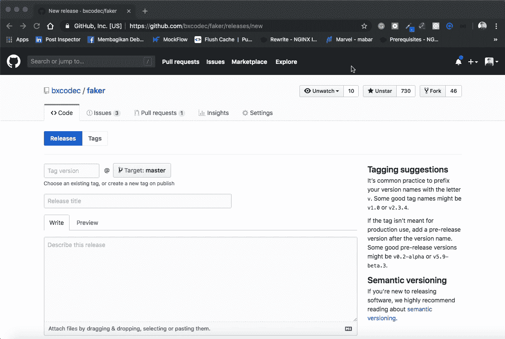

# 今天我学习了:如何远程删除 Git-Tag。

> 原文：<https://medium.easyread.co/today-i-learned-how-to-delete-git-tag-remotely-caa95dc3a495?source=collection_archive---------1----------------------->

## 一个简单的命令来拯救你的日子:)

**TLDR；**

```
# delete remotely
$ git push --delete origin tagName# delete tag in your local
$ git tag -d tagName
```


Photo by [Yancy Min](https://unsplash.com/@yancymin?utm_source=medium&utm_medium=referral) on [Unsplash](https://unsplash.com?utm_source=medium&utm_medium=referral)

我的日常生活是使用 Git，在我的例子中是 Github。既在我的作品中，也在我的业余时间(做一个开源的兼职项目)。目前，我维护着我的两个开源项目，它们是:

*   faker([https://github.com/bxcodec/faker](https://github.com/bxcodec/faker)
*   明白了([https://github.com/bxcodec/gotcha](https://github.com/bxcodec/gotcha))

有一段时间，我在发布我的项目的新功能时犯了无数的错误，无论是在我目前的工作中还是在我的兼职项目中。就像我写这个故事前的几分钟一样。

当我想发布我的一个开源项目`faker`时，就会发生这种情况。当发布它的时候，我不小心碰到了我的输入键盘，但是我还没有完成指定版本。这导致 Github 在那里创建了一个新的标签，破坏了之前版本的语义版本顺序。

因此，要解决这个问题，因为在 Github 中我们不能改变标签名，要么删除它并创建一个，要么就让它这样。这就是我学习 git 标签删除的方法。

只需一个简单的命令，我就可以远程和本地删除标签。

```
# delete remotely
$ git push --delete origin tagName#delete tag in your local
$ git tag -d tagName
```

但是，我们也可以在 Github 本身做到这一点，*TBH，我刚刚想到这一点，我认为这是我刚刚意识到的 Github 的一个新功能。从一年前开始，我不能在 Github 中删除标签，除非使用我的终端命令。

以下是如何用 Github web 界面删除标签。



demo delete Tag with Github

只是它。希望能帮到别人:)