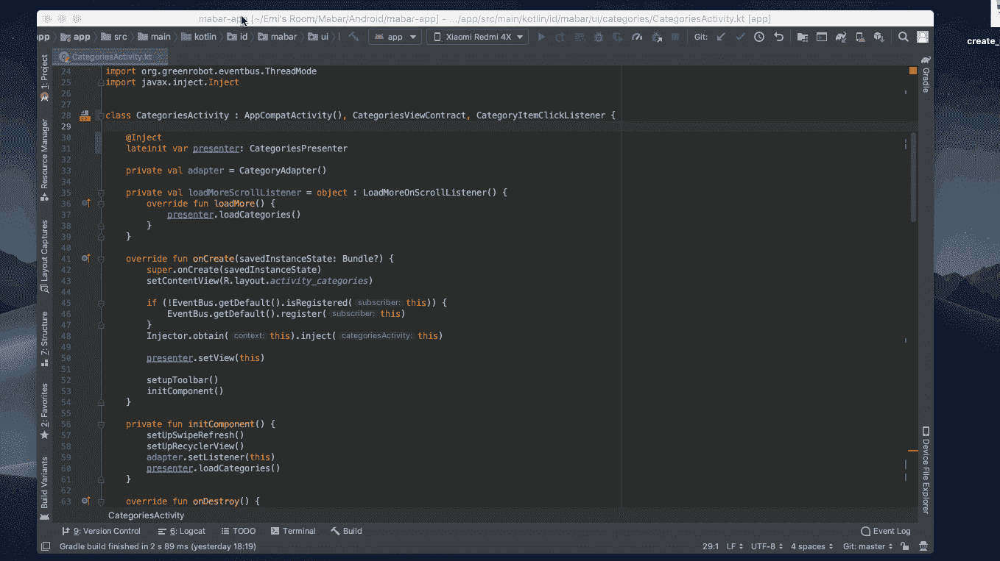
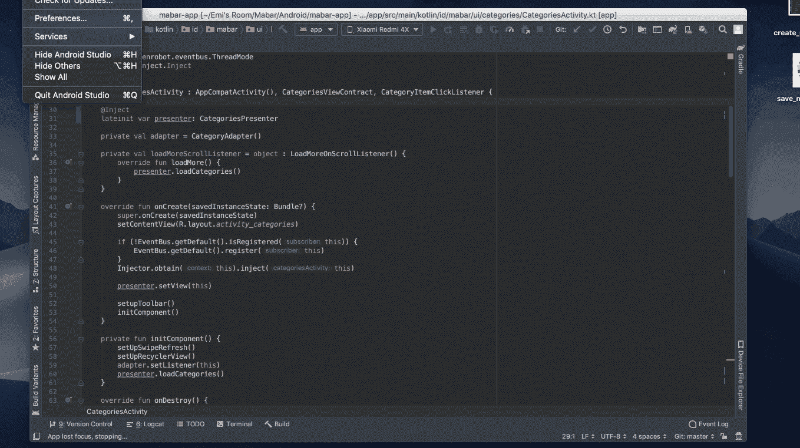

# Today I Learned: How To Setup Macro in Android Studio

> 原文：<https://medium.easyread.co/today-i-learned-how-to-setup-macro-in-android-studio-ca3a5cecf06d?source=collection_archive---------4----------------------->

## Auto Format di Android Studio

Hai, *finally* saya *comeback* setelah sudah cukup lama sekali sejak tulisan terakhir saya di tahun lalu. Karena saya adalah orang yang *moody* , maka perasaan saya sangat mempengaruhi segala pekerjaan sampingan saya, untungnya tidak mempengaruhi pekerjaan utama saya.

*Nah* , kabar saya sebenarnya baik-baik saja dan kali ini saya ingin menuliskan hal yang baru saya pelajari kira-kira dua minggu lalu dan meskipun mungkin sangat sepele bahkan saya merasa cupu baru mengetahuinya, tetapi karena saya baru tahu dan *amaze* dengan hal tersebut, *saya rasa saya harus menulisnya* 😛.

Photo by [Aziz Acharki](https://unsplash.com/@acharki95?utm_source=unsplash&utm_medium=referral&utm_content=creditCopyText) on [Unsplash](https://unsplash.com/search/photos/amazing?utm_source=unsplash&utm_medium=referral&utm_content=creditCopyText)

Sesuai dengan judulnya, kurang lebih sekitar 2 minggu lalu saya belajar cara menambahkan *macros* ke dalam Android Studio. *Sebelumnya apa itu macros?*

> Macros provide a convenient way to automate repetitive procedures you do frequently while writing code. You can record, edit and play back macros, assign a shortcut to them, and share them.

*Nah* , berdasarkan penjelasan di atas, *macros* adalah sebuah *shortcut* untuk melakukan beberapa prosedur yang biasa dilakukan berulang dalam suatu waktu saat sedang menulis kode. Contohnya, biasanya setelah saya menulis barisan kode, saya akan melakukan beberapa prosedur seperti *optimize import* file, reformat code dan indentasi dan lain sebagainya. Karena Android Studio sendiri sudah secara otomatis menyimpan file yang di ubah jadi saya tidak perlu lagi menyimpan file yang saya kerjakan. Untuk mempermudah pekerjaan tersebut, biasanya saya melakukan beberapa *command* atau perintah. *Nah* , bagaimana jika semua hal tersebut cukup dilakukan dengan satu *command* atau perintah saja? Tentu saja hal tersebut dapat dilakukan dengan *macros* . Prosedur berulang tersebut dapat kamu gabungkan ke dalam satu *shortcut* saja.

Pada tulisan kali ini, saya akan mencontohkan cara membuat *macros* untuk prosedur *Optimize Import* dan *Reformat Code* . Berbagai prosedur yang biasanya kalian jalankan atau yang tersedia dapat di lihat di [sini](https://developer.android.com/studio/intro/keyboard-shortcuts) .

## Sekarang langkah-langkah untuk membuat macros ialah

*   Pada menu Android Studio, pilih
    ***Edit > Macros > Start Macro Recording*** *.*
*   Saat multi merekam, lakukan *command* yang biasa kalian jalankan, misalnya pada *Mac* , untuk *optimize import* menggunakan *command* `ctrl + option + o` dan untuk reformat menggunakan `option + cmd + l`
*   Selain langsung menjalankan *command* nya seperti dengan *shortcut* di atas, kamu dapat menjalankannya dari menu Android Studio, pilih
    ***Code > Optimize Import* dan *Code > Reformat Code***
*   Setelah selesai pilih kembali menu
    ***Edit > Macros > Stop Macro Recording***
*   Selanjutnya akan muncul dialog untuk menyimpan *macros* *recording* yang sudah kita lakukan

Create Macros

*Nah* , *taraa* akhirnya *macros* kamu sudah bisa dijalankan.

Untuk menjalankan *macros* buka kembali menu Android Studio, lalu pilih
***Edit > Macros > Pilih nama macros yang kamu simpan*** tadi misalnya ***Reformat , Optimize dan Save*** .

Tetapi tentu saja bolak balik membuka menu Edit untuk menjalankan perintah *macros* juga sungguh merepotkan. Lalu bagaimana jika hal tersebut kita tambahkan lagi *shortcut* untuk mengubahnya? Tentu saja kita dapat melakukannya.

Langkah untuk melakukannya ialah edit *macros* yang kita simpan tadi dan tambahkan *shortcut* untuk menjalankan *macro* tersebut.

## Langkah menambahkan shortcut pada *macros* ialah

*   Pilih menu ***Android Studio > Preferences*** . Pada *search bar* , ketik *macros*
*   Jika sudah muncul daftar *macros* yang ada, klik kanan pada *macros* yang kita ingin ubah
*   Pilih ***Add Keyboard Shortcut*** dan masukkan *shortcut* yang kita inginkan misalnya `cmd + s`
*   Pilih simpan. Saat menyimpan dengan *shortcut* tertentu biasanya akan ada *warning* kalau *shortcut* tersebut sudah digunakan oleh prosedur yang lain. Jika kamu yakin ingin mengubahnya, tekan **OK,** tetapi jika kamu tidak yakin, kamu dapat mencoba dengan *shortcut* lain.

Save dan Edit Macros

Sekarang akhirnya kamu memiliki *custom macros* yang dapat kamu lakukan dengan satu langkah saja saat menulis kode. Bagaimana? Berguna bukan? 😉

Tentu saja mungkin sudah banyak yang mengetahui cara ini, tetapi saya ingin sekali membantu rekan-rekan yang mungkin belum tahu langkah *magic* ini. Seperti yang saya sampaikan di atas, bahwa masih banyak *shortcut* lain yang tersedia atau yang mungkin sering kalian lakukan. Kalian dapat menambah dan menghapus *macros* apa saja dan pekerjaan menjadi lebih mudah.

Jadi sekian cerita dari saya mengenai apa yang saya pelajari kemarin. Cukup senang karena hal ini membantu saya. Semoga saya menemukan banyak hal baru lainnya yang bisa saya bagikan secepatnya. **Selamat koding :)**