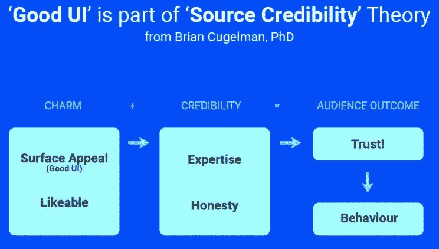
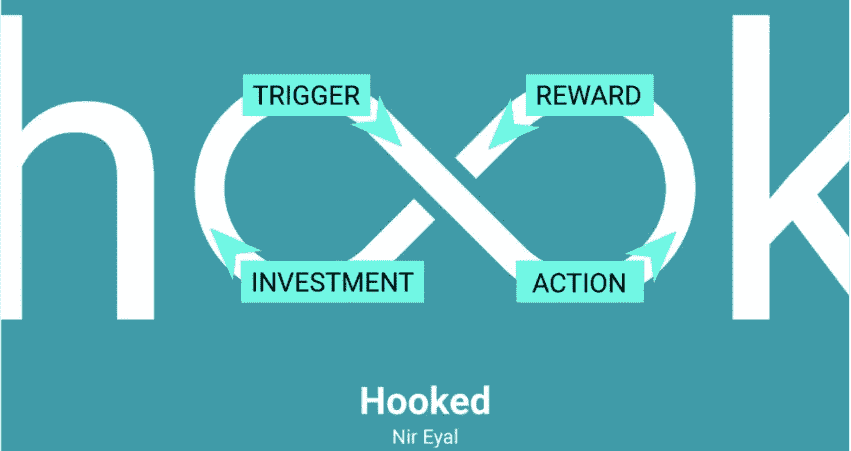
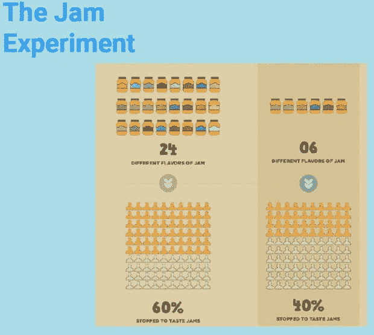
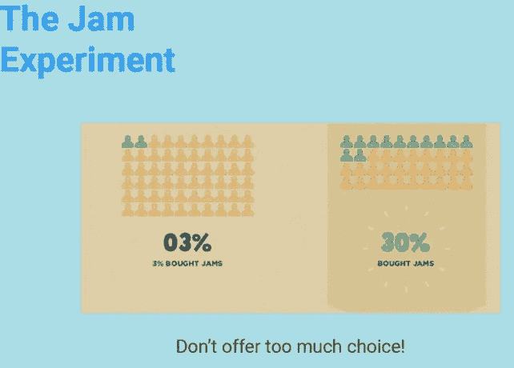

# Today I Learned : Implementing Psychology to UI/UX Design

> 原文：<https://medium.easyread.co/today-i-learned-implementing-psychology-to-ui-ux-design-910ee4fe91b?source=collection_archive---------1----------------------->

## Part of [Today I Learned Series](https://medium.com/easyread/today-i-learned/home) in Easyread

Hai, halooo. Tulisan saya kali ini merupakan kelanjutan dari apa yang saya dapat dari *event Tech Day* yang saya ikuti beberapa hari yang lalu, yaitu **GDP Venture Tech Day** . Pada *event* tersebut saya mengikuti 2 topik, yaitu ***Best Practices in Android*** dan ***Implementing Psychology to UI/UX Design*** *.* Tulisan saya sebelumnya sudah membahas mengenai [*Best Practices* pada Android](https://medium.com/easyread/today-i-learned-best-practices-in-android-1103a6dae8d6) *. Nah* , sedangkan tulisan ini akan membahas topik Implementasi Psikologi pada *UI/UX Design* .

Kebetulan topik yang disampaikan cukup mudah dipahami meskipun oleh orang *non-design* seperti saya. Jadi saya akan membagikan beberapa hal yang saya dapat melalui tulisan ini.

# Implementing Psychology to UI/UX Design by — Michael Hioe & Ezra Marcella

Biasanya saat pengerjaan aplikasi, seorang *programmer* akan menolak pembuatan aplikasi dengan *design* yang menarik dan cantik. Menurut mereka, design yang dibuat oleh seorang *UI* / *UX Designer* akan memperlama proses pengerjaan aplikasi. Hal ini membuat terbentuknya pemikiran bahwa *design* yang cantik, proses pengerjaannya akan lama. Akan tetapi setiap *design* yang telah dibuat oleh *UI* / *UX Designer* tentu saja sudah memiliki pertimbangan sendiri.

## *Nah* , apa saja pertimbangan *UI* / *UX Designer* dalam membuat rancangannya?

**Good UI Build Trust** Pada dasarnya, sebuah produk akan di *judge* atau dinilai *user* dalam kurun waktu 1 menit setelah mereka melihat produk tersebut. Sehingga penilaian mereka terhadap aplikasi akan menentukan seberapa besar keinginan mereka untuk memakai aplikasi tersebut. Produk yang sama sekalipun dapat memberikan kesan berbeda kepada *user* ketika melihatnya. Oleh karena itu, sebuah *UI* yang baik dapat dikatakan sebagai cara pertama untuk membangun kepercayaan dengan *user* mengenai produk yang kita sediakan.

Image from Slide Presentation

*Nah* , karena **Good UI** merupakan gerbang pertama yang harus dilewati oleh *user* maka tentu saja kita harus memastikan bahwa aplikasi kita dapat dipercaya. Elemen dari aplikasi yang **Good UI** ialah
- **Clean** , jangan memberikan terlalu banyak informasi yang tidak relevan.
- **Surface Appeal** , d *on’t tell them, but show them, because seeing is believing.*
- **Likeable** , meningkatkan persepsi *user* untuk percaya.
- **Expertise** , tidak ada yang benar atau salah, tetapi sebuah produk yang detil akan lebih disukai.
- **Honesty** , munculkan hal-hal yang menunjukkan keamanan.

**Making Action become Behaviour and Habit** *Nah* , setelah mendapatkan ini, tentu saja pada akhirnya ialah kita ingin mengetahui ***User Behaviour*** saat memakai aplikasi kita. Dan dengan **Good UI** kita sudah mendapatkan *user* untuk kita lihat *behaviour* -nya.

Image from Slide Presentation

Seperti pada konsep diatas, kita melihat sebuah *infinite loop* antara **Trigger-Action-Reward-Investment** . Hal inilah yang perlu kita bangun dalam aplikasi kita.
- **Trigger** , sebuah *event* yang akan memancing *user* untuk kembali memakai aplikasi kita. Misalnya faktor eksternal, yaitu: *push notification* (merupakan salah satu *event* yang harus diimplementasikan karena akan memancing *user* untuk membuka kembali aplikasi kita), atau *button* di *social media* atau *e-commerce* . Selain itu ada juga faktor internal, yaitu yang mempengaruhi otak kita yaitu perasaan senang, sedih, cemas, dll.
- **Action** , jika *user* sudah terpancing dengan umpan yang kita berikan maka ia akan melakukan sebuah *action* pada aplikasi kita. Misalnya melanjutkan pembelian, membuka notifikasi dan melanjutkan berselancar di aplikasi kita.
- **Reward** , *user* akan sangat senang jika mendapatkan sesuatu dari aplikasi kita. Yang didapat bisa bermaca-macam. Misalnya, **tribe** yaitu kepuasan jumlah *like* atau *follow* pada postingan sosial media yang dapat mereka pergunakan. Selain itu dibagi juga seperti, **hunt** yaitu seperti kepuasan mendapatkan sesuatu dari aplikasi kita, misalnya mendapat informasi, atau juga **self** yaitu seperti kepuasan tersendiri untuk membersihkan notifikasi email, dan lain sebagainya.
- **Investment** , berikan kesempatan kepada *user* untuk melakukan investasi pada aplikasi kita, misalnya berupa poin, level, *like* , *achievement* , dan lain sebagainya, untuk membuat *user* merasa sayang meninggalkan aplikasi kita.

**Direct Our Users to A ‘Decision Making’** *UI/UX* yang bagus bukan hanya sekadar karena ‘ada’ saja, tetapi juga dapat membangun *behaviour* atau membantu *user* untuk melakukan sebuah *action* . Misalnya, kita pengen mereka membagikan sesuatu dari aplikasi kita ( *sharing* ), dan lain lain. Karena *user* kita merupakan manusia ( *human* ) yang pada dasarnya memiliki pemikiran positif atau **Dopamine** yang membantu memutuskan sesuatu dan memiliki pemikiran negatif atau **Cortisol** yang menghindari melakukan sesuatu.

Contoh cortisol.
- **Urgency** , kepanikan karena *limited time* sehingga keinginan melakukan sesuatu meningkat. Seperti *flash sale* .
- **Scarcity** , kepanikan akan kehabisan sesuatu. Seperti tiket pesawat habis, hotel penuh.
- **Competitition** , keinginan untuk tidak mau kalah dengan orang lain. Seperti pemberitahuan bahwa sekitar xxx orang melakukan xxx.
- **Decoy** , keinginan untuk memilih sesuatu berdasarkan value dan keuntungan yang didapat. Seperti kita ingin *user* membeli paket C, yang lebih mahal, tetapi seakan-akan ditawarkan dengan harga yang lebih murah. Biasanya dengan memberikan *value* pada barang yang akan dipilih. Kita berikan *impulsive* .
- **The Jam Experiment** , jangan belikan pilihan yang terlalu beragam dan bermacam sehingga *user* bingung.

**Color Psychology** *Nah* , kalau ini sudah seperti yang kebanyakan kita ketahui bahwa setiap warna memiliki ciri khas dan nilai tersendiri. Misalnya **merah = bahaya** , **biru = terpercaya** , dan lain sebagainya.

Sekian mengenai apa yang saya pelajari hari ini. Mungkin ada beberapa yang saya tambahkan sesuai pemahaman saya, atau ada beberapa hal yang terlewat. Jika dari teman-teman ada yang ingin menambahkan, dapat memberikan masukan pada komentar. *Happy Learning* 😄

*If you have any questions or complains, please feel free to contact me in these social networks:* [*twitter*](https://twitter.com/eyseminarti) *,* [*linkedin*](http://linkedin.com/in/eminarti-sianturi-08a369102) *, or* [*email*](mailto:eminartiys@gmail.com) *. I’ll try to do my best to answer if I can, otherwise we will learn together :)*

**Thanks to — Michael Hioe & Ezra Marcella**