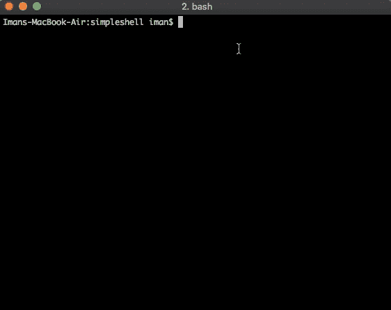

# 今天我学习了:用 Golang 制作一个简单的交互式 Shell 应用程序

> 原文：<https://medium.easyread.co/today-i-learned-making-a-simple-interactive-shell-application-in-golang-aa83adcb266a?source=collection_archive---------2----------------------->

## 我如何在 Golang 中制作一个简单的交互式外壳


“command computer keyboard key” by [Hannah Joshua](https://unsplash.com/@hannahjoshua?utm_source=medium&utm_medium=referral) on [Unsplash](https://unsplash.com?utm_source=medium&utm_medium=referral)

所以今天，我学习了一些新的东西和一些基本的东西。它正在制作一个简单的交互式外壳。这只是一个非常简单的应用程序，但它看起来有点酷。

我已经在 Golang 工作了一年多。人们已经创造了很多工具，例如:`cobra`由 [spf13](http://github.com/spf13/cobra) 开发，或者更多帮助我们开发命令行应用的工具。但是，不知何故，我很好奇如何在不依赖其他外部库的情况下创建一个简单的库。

所以出于好奇，我开始在谷歌上搜索如何制作它。但我发现的只是使用其他外部依赖的教程。每个人都在推广他们自己的库，以方便制作一个交互式外壳😌。伙计们。我只需要用纯 Golang 包做一个简单的(没有外部依赖)😌

但是，我发现了一篇关于做交互壳的文章，像这篇:[http://technosophos . com/2014/07/11/start-an-interactive-shell-from-within-go . html](http://technosophos.com/2014/07/11/start-an-interactive-shell-from-within-go.html)，但是，他做的并不是我想要的样子。所以后来只有我从 Gobyexample.com 等网站上找到的一些例子。

我自己做了一个简单的 Shell 应用程序。下面我来解释一下我是怎么做到的。

## 壳

所以在做一个简单的 shell 应用之前，我想确定我说的 Shell 和你说的意思是一样的。

对我来说，Shell 是一个应用程序，它将充当非常基本的用户界面(基于文本的界面)。有些人可能会说它是命令行界面(CLI)。

## 提出申请

为了制作这个应用程序，对于最简单的原型，我将这样制作它。

```
$ ls
go.mod  main.go
```

## 从终端读取命令

要做到这一点，首先要做的是读取输入。我需要从终端读取输入。对此，我是这样做的。

```
reader := bufio.NewReader(os.Stdin)
cmdString, err := reader.ReadString('\n')
if err != nil {
 fmt.Fprintln(os.Stderr, err)
}
```

## 执行命令

然后执行命令。从终端读取命令字符串后，现在执行命令。

```
cmdString = strings.TrimSuffix(cmdString, "\n")
cmd := exec.Command(commandString)
cmd.Stderr = os.Stderr
cmd.Stdout = os.Stdout
cmd.Run()
```

到目前为止，我可以运行我的简单 shell 应用程序，但是它只能运行一个命令。运行命令后，它将停止。

## 添加无限循环

以使它在执行一次之后接收每一个命令。我们需要将它添加到一个无限循环中。

```
for {
 fmt.Print("$ ")
 cmdString, err := reader.ReadString('\n')
 if err != nil {
  fmt.Fprintln(os.Stderr, err)
 }cmdString = strings.TrimSuffix(cmdString, "\n")cmd := exec.Command(cmdString)
 cmd.Stderr = os.Stderr
 cmd.Stdout = os.Stdout
 err = cmd.Run()
 if err != nil {
  fmt.Fprintln(os.Stderr, err)
 }}
```

如果我们运行该应用程序，它将如下所示



simple shell application

## 处理争论

直到这一行，我已经完成了我的第一个 CLI 应用程序。但它仍然不接受论点。如果我传递一个参数，那么它会抛出一个错误。

```
$ ls -lah // this command wil throw error
```

为了阅读这些论点，我把它写成下面这样。首先，我将命令分成一个字符串数组。

```
// ...
cmdString = strings.TrimSuffix(cmdString, "\n")
arrCommandStr := **strings.Fields**(cmdString)
cmd := exec.Command(arrCommandStr[0], arrCommandStr[1:]...)
// ...
```

为了分割文本，我使用了包`string`中的`Fields`函数。该函数类似于拆分字符串函数。如果`string.Split`将通过给定的特定分隔符分割字符串。但是`strings.Fields`会用空格分隔单词。

示例:

```
str := "Hello World    Beautiful World"
arrString := strings.Fields(str)
fmt.Println(arrString)
// [Hello World Beautiful World]
```

现在，我的简单 shell 已经接受并处理了给定的参数。现在，这个命令应该起作用了。

```
$ ls -lah
total 4280
drwxr-xr-x  5 iman  staff   160B Nov  6 19:48 .
drwxr-xr-x  6 iman  staff   192B Nov  6 11:41 ..
-rw-r--r--  1 iman  staff    38B Nov  6 11:43 go.mod
-rw-r--r--  1 iman  staff   606B Nov  6 20:11 main.go
-rwxr-xr-x  1 iman  staff   2.1M Nov  6 19:49 simshel
```

## 添加退出命令

但是，该应用程序仅适用于在环境中注册的任何内置应用程序。像`exit`这样的命令是不存在的，因为它被编程在每个 CLI 应用程序中。

然后，我为系统中没有内置应用程序的每个命令创建一个 switch-case 处理程序，比如`exit`命令。

## 添加自定义命令

要添加自定义命令，我可以简单地将其添加到 switch-case 处理程序中。比如我想加一个类似`plus`的命令。该命令在任何 CLI 应用程序中都不存在。我想把它做成这样:

```
$ plus 2 4 5 6
17
```

为此，我只需要添加一个 sum 函数，并在`switch-case`中添加命令案例处理程序

## 结论

最后，它只是一个非常简单的应用程序。但可以肯定的是，在制作这个的时候，我学到了一些东西。而且，在写这篇文章的时候，我发现了一篇与这篇文章相似的文章(这里:[https://sj14.gitlab.io/post/2018-07-01-go-unix-shell/](https://sj14.gitlab.io/post/2018-07-01-go-unix-shell/))。读完那篇文章后，我正考虑放弃我的草稿。但是，我已经在这里写了很多解释和例子，所以后来我决定张贴它无论如何 XD。

不管怎样，我已经把源代码放在我的 Github 里了:[https://github.com/bxcodec/simpleshell](https://github.com/bxcodec/simpleshell)，如果有机会，我以后会试着给它添加一些功能。

*印尼版:[https://medium . com/easy read/today-I-learned-Bela jar-mem UAT-aplikasi-interactive-shell-Seder HANA-di-golang-2ef 013003393](https://medium.com/easyread/today-i-learned-belajar-membuat-aplikasi-interactive-shell-sederhana-di-golang-2ef013003393)
*更新:再增加一个自定义命令的例子