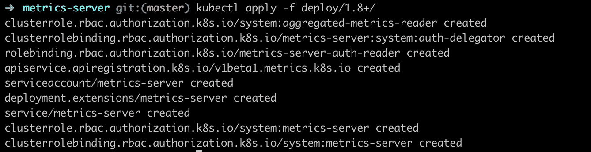

# Today I Learned: Membuat Horizontal Pod Autoscaler(HPA) pada Kubernetes

> 原文：<https://medium.easyread.co/today-i-learned-membuat-horizontal-pod-autoscaler-hpa-pada-kubernetes-86da03095071?source=collection_archive---------2----------------------->

## Solving “Unknown” Current Resource Value pada HPA Target untuk menjalankan Horizontal Autoscaling di Kubernetes.


Photo by [Paweł Czerwiński](https://unsplash.com/@pawel_czerwinski?utm_source=medium&utm_medium=referral) on [Unsplash](https://unsplash.com?utm_source=medium&utm_medium=referral)

Sudah cukup lama sejak tulisan terakhir yang saya *publish* yaitu sekitar sebulan yang lalu dan kini akhirnya saya kembali dengan sebuah artikel. Beberapa waktu belakangan ini saya sangat sibuk dan kesulitan sekali untuk menemukan waktu luang yang dapat saya gunakan untuk menulis artikel. Jadi di kesempatan langka ini, saya ingin menulis sesuatu yang saya pelajari baru-baru ini.

Sebagai pengantar, saat ini saya sedang mencoba Kubernetes pada salah satu proyek saya. Proyek ini merupakan sebuah aplikasi *mobile* yang kini baru tersedia di Android dan dapat diunduh di [Play Store](http://bit.ly/2mcWvv0) . Informasi lebih lengkap mengenai aplikasi ini boleh kamu lihat di [https://mabar.id](http://bit.ly/2kdxq2h) .

Saya mengerjakan proyek ini selama beberapa waktu terakhir bersama dengan beberapa teman saya. Dalam proyek ini saya bertanggung jawab di sisi *Backend* , API, dan Infrastruktur. *Nah* , pada bagian inilah saya memakai Kubernetes di proyek ini. Jadi baru-baru ini saya belajar sesuatu yang baru ketika mencoba menerapkan *horizontal scaling* dengan Kubernetes.

Sebelumnya, Kubernetes sendiri sebenarnya memiliki *object-type* bernama ***Horizontal Pod Autoscaller*** **(HPA)** dan penjelasan lebih detail mengenai HPA ini dapat dilihat di [dokumentasi](https://kubernetes.io/docs/tasks/run-application/horizontal-pod-autoscale/) resmi.

Awalnya, saya berpikir seharusnya cukup mudah untuk mengimplementasikan hal ini. Karena yang akan dilakukan hanya dengan menambahkan *object-type* tersebut ke dalam *script* *deployment* dan seharusnya sudah ditangani oleh kluster Kubernetes.

## Problems

Tetapi pada kenyataannya, hal tersebut tidak semudah yang saya bayangkan. Untuk mensimulasikan kasus nyatanya, saya akan menjelaskan seperti apa permasalahan yang terjadi dan bagaimana cara saya menyelesaikannya.

*Nah* , katakanlah saya ingin membangun *landing page* dari aplikasi Mabar diatas, yaitu [https://mabar.id](http://bit.ly/2kdxq2h) dengan menggunakan Kubernetes. Pada *landing page* ini juga saya ingin menambahkan HPA.

Alasan mengapa saya melakukan ini adalah

*   Saya ingin belajar bagaimana mengimplementasikan HPA di Kubernetes.
*   Meskipun *landing* *page* yang saya kerjakan saat ini masih sangat baru dan mungkin saja sebenarnya tidak akan ada yang mengunjunginya, tetapi “ *siapa tahu”* ketika terjadi *request* besar secara tiba-tiba, paling tidak servernya *scalable* *LOL 😆*

Setelah membaca banyak tulisan dari blog dan dokumentasi Kubernetes, saya akhirnya menemukan bagaimana caranya membuat HPA pada pod di Kubernetes.

```
apiVersion: autoscaling/v2beta1
kind: HorizontalPodAutoscaler
metadata:
  name: landing
  namespace: landing-page
spec:
  scaleTargetRef:
    apiVersion: apps/v1beta1
    kind: Deployment
    name: landing
  minReplicas: 1
  maxReplicas: 10
  metrics:
  - type: Resource
    resource:
      name: cpu
      targetAverageUtilization: 70
```

Menurut pemikiran saya, hanya dengan sebuah *script* sederhana ini, seharusnya semua sudah berjalan secara otomatis.

Sehingga kemudian tibalah saatnya saya mencobanya dengan melakukan *load testing* ke kluster.

```
$ hey -c 50 -z 5m [https://mabar.id](https://mabar.id)
```

Sebelumnya, saya menggunakan [hey](https://github.com/rakyll/hey) sebagai *tools* untuk melakukan *load testing* . Saya membuat 50 *concurrent call* selama 5 menit untuk mengakses *landing page* .

Yang saya harapkan terjadi seharusnya, jika HPAnya berjalan dengan baik, maka Kubernetes akan membuat replika dari pod aplikasi saya berdasarkan *request* yang datang. Tetapi hal yang saya temui justru berbeda. Pod aplikasi tersebut malah te- *restart* dengan sendirinya dan membuat *landing page* tidak dapat diakses setiap podnya di *restart* . Saya cukup bingung mengapa hal ini bisa terjadi.

Kemudian setelah saya mencari detail dari HPA tersebut, saya menemukan hal yang aneh.

```
$ kubectl get hpaNAME      REFERENCE            TARGETS         MINPODS   MAXPODS   REPLICAS   AGE
landing   Deployment/landing   <unknown>/70%   1         10        1          74d
```


Target is unknown in HPA

Atau jika ingin melihat detail yang terjadi, kamu dapat menggunakan *command* `describe` .

```
$ kubectl describe hpa landing
```

hpa describe with unknown current resources

Pada bagian *Metrics* , hasil tersebut menunjukkan `<unknown>/70%` . Saya bertanya-tanya mengapa hal ini dapat terjadi?

## Solution

Setelah mencari banyak solusi dan membaca persoalan yang sama pada *StackOverflow* , akhirnya saya menemukan jawaban yang benar-benar membantu saya mengapa HPA saya tidak bisa berfungsi.

Setelah saya belajar dari jawaban tersebut, ternyata kluster dari Kubernetes saya tidak memiliki *metrics server* untuk mengambil *resource server* yang digunakan setiap pod secara *realtime* .

Jadi solusi yang ditawarkan ialah saya harus menginstall *metrics server* di kluster Kubernetes saya. *Metrics server* yang perlu saya install dapat dilihat di repositori ini: [https://github.com/kubernetes-incubator/metrics-server](https://github.com/kubernetes-incubator/metrics-server)

Sebenarnya, jika kita melihat repositorinya, pada respositori tersebut sudah menunjukkan bagaimana mengimplementasikan *metrics server* ke kluster Kubernetes. Tetapi, saya akan mengulangi langkah-langkah tersebut pada tulisan ini.

## **Steps**

*   Clone repositori tersebut

```
$ git clone [https://github.com/kubernetes-incubator/metrics-server.git](https://github.com/kubernetes-incubator/metrics-server.git)
.....$ cd metrics-server
```

*   Deploy konfigurasinya dengan *command* `kubectl`

```
$ kubectl apply -f deploy/1.8+/
```



apply the metric-server deployment

*   Langkah selanjutnya ialah mengubah *metrics server deployment flag* .

```
$ kubectl edit deploy -n kube-system metrics-server
```

*   Lalu tambahkan argument *flag* sesuai kebutuhan. *Flag* yang dapat digunakan bisa kamu lihat pada repositori tersebut. Tetapi untuk kasus ini saya menggunakan *flag* default yang ada pada repositori tersebut.

```
args:
 - --kubelet-insecure-tls
 - --kubelet-preferred-address-types=InternalIP,ExternalIP,Hostname
```

*   Tambahkan argument diatas ke konfigurasi dan simpan

```
$ kubectl edit deployment metrics-server
```


Edit the deployment for metrics-server


Edit and add the arguments for the containers of metrics-server

**Oh iya, metrics server akan di deploy pada namespace kube-system, jadi jika kamu tidak bisa lihat nama deployment yang sedang berlangsung, mungkin kamu bisa mengganti namespacenya**

*   Dan setelah mengedit konfigurasinya, HPA akan mulai bekerja seperti seharusnya.


The HPA status

## Testing the HPA

Setelah saya mengedit konfigurasinya dengan argumen yang diperlukan, HPA seharusnya sudah berfungsi. Untuk membuktikannya apakah berhasil atau tidak, saya kembali melakukan *load testing* lagi dengan permintaan tinggi secara bersamaan. Dan saya juga melihat detail HPA dan status pod di Kubernetes.

Dan kini akhirnya HPA sudah bekerja dengan baik. Sehingga jika *request* yang diterima dari user melebihi sumber daya yang ditargetkan pada HPA script, Kubernetes akan mendeploy replika pod baru secara otomatis. Dan jika *request* turun kembali normal, HPA akan menghapus replika pod secara otomatis.

Ini adalah *screenshot* untuk status HPA jika melihat HPA dalam rinciannya.


The HPA detected the current request and add replicas if needed

Dan ini adalah *screenshot* yang terjadi jika kita melihat status pod. Ia akan mendeploy pod yang baru berdasarkan status HPA.


A new pod will deployed automatically

## Takeaways

Jadi untuk menggunakan HPA, kita juga perlu menginstall *metric server* di kluster Kubernetes kita. Tidak cukup hanya memiliki *script* HPA saja karena HPA membutuhkan data *metrics* untuk melakukan prosesnya.

Dan apa yang saya tulis kali ini hanyalah langkah-langkah sederhana, yang sebenarnya kita dapat mengubah konfigurasi *deployment* untuk *metric server* seperti yang dilakukan Prafull dalam [jawabannya](https://stackoverflow.com/a/53727101/4075313) di Stackoverflow.

Tetapi hari ini, saya belajar sesuatu yang baru bagi saya. Perlu 2 jam bagi saya untuk memahami dan memperbaikinya sendiri. Mungkin solusi yang saya lakukan ini masih bukan yang terbaik. Tetapi untuk sekarang, solusi ini memecahkan masalah saya.

## Referensi

*   [https://stackoverflow.com/a/53727101/4075313](https://stackoverflow.com/a/53727101/4075313)
*   https://github.com/kubernetes-incubator/metrics-server

*原帖*[*https://bxcodec . io/posts/today-I-learned-enabling-horizontal-pod-autoscalerhpa-in-kubernetes/*](https://bxcodec.io/posts/today-i-learned-enabling-horizontal-pod-autoscalerhpa-in-kubernetes/)