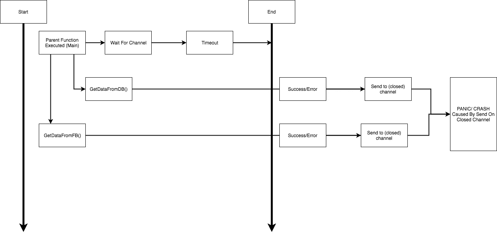
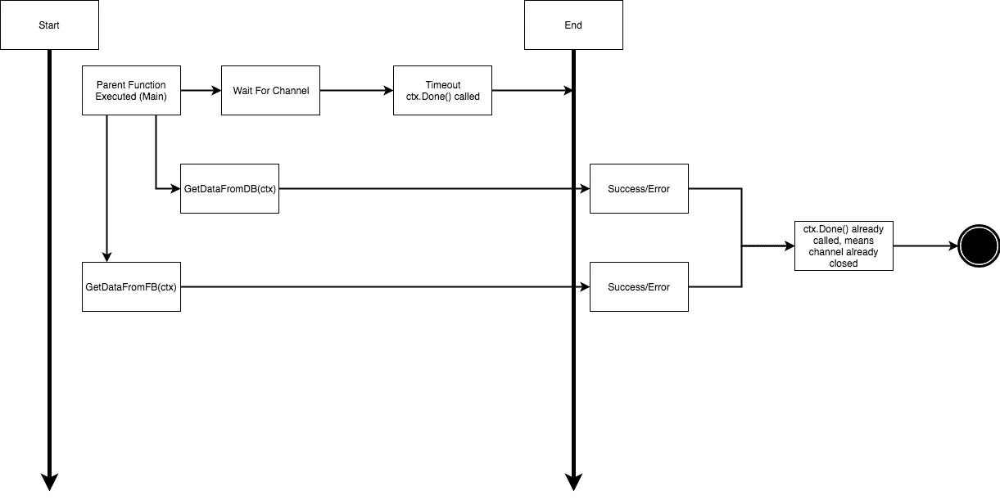
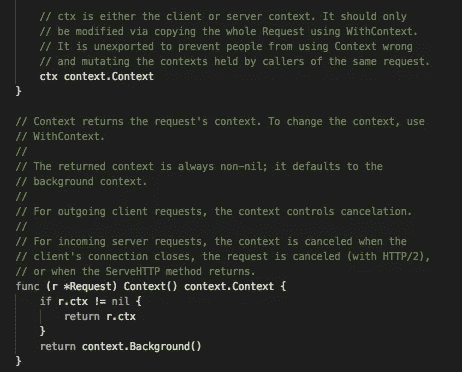

# Today I Learned: Mengenal Context pada Golang(2) — WithTimeout

> 原文：<https://medium.easyread.co/today-i-learned-mengenal-context-pada-golang-2-withtimeout-15a3b3bf009b?source=collection_archive---------5----------------------->

## Penggunaan context menurut yang sering saya gunakan

Lanjutan dari tulisan sebelumnya,

[](https://medium.com/easyread/today-i-learned-mengenal-context-pada-golang-withvalue-907618ceae3) [## Today I Learned: Mengenal Context pada Golang — WithValue

### Penggunaan context menurut yang sering saya gunakan

medium.com](https://medium.com/easyread/today-i-learned-mengenal-context-pada-golang-withvalue-907618ceae3) 

Selain sebagai *passing value* , *context* juga sering digunakan untuk mengontrol proses *cancellation* (pembatalan). Salah satu contoh misalnya ketika kita melakukan *API call* ke *service* lain atau melakukan *query* ke *database* dan *task* - *task* lainnya yang mungkin membutuhkan waktu lama.

Tujuan *context* sebagai *cancellation* adalah agar aplikasi kita lebih terkontrol dan tidak membuat user menunggu lama ketika sedang melakukan *request* . Sehingga jika suatu saat terjadi keanehan seperti proses *query* ke *database* yang membutuhkan waktu lebih dari 10 detik, kita dapat membatasinya dan membatalkan proses tersebut dengan tenggang waktu tertentu, misalnya 2 detik. Jadi, jika proses sudah berjalan 2 detik dan *query* masih belum kelar maka kita dapat langsung mengembalikan *error* ke *client* ( *return error* ) bahwa server kita sedang bermasalah.

Selain hal tersebut, *cancellation* juga bisa digunakan untuk mengontrol *goroutine* agar tidak selalu berjalan di *background* . Jadi kita juga bisa membatalkan *goroutine* yang berjalan di *background* dalam tenggat waktu tertentu. Berdasarkan pengalaman saya, konsep *cancellation* dengan *context* ini sering saya lakukan saat menggunakan *goroutine* dan saat melakukan API *call* ke *service* lain.

## Gorutine Call dengan context.WithTimeout()

Untuk mempermudah memahaminya, saya akan membuat satu contoh kasus sederhana. *Let’s say* kita memiliki satu buah *service* yang akan melakukan API *call* dan *query* ke *database* . Masing-masing proses membutuhkan waktu sekitar beberapa detik agar selesai.

Misal:
- Untuk API *call* membutuhkan waktu sekitar 1 detik agar selesai.
- Untuk *query* membutuhkan waktu sekitar 10 detik agar selesai

Di kasus nyata, biasanya kita memiliki *timeout* yang menandakan sebagai batas akhir waktu dari *request* setiap user. Jika melewati *timeout* yang kita sepakati, user akan diberikan *error* agar user tidak menunggu lama.

Contoh *code* :

Sederhananya, untuk menangani proses ini, kita akan menggunakan *timeout* dengan menggunakan `time.After`

```
func main() {
 **fbreceiver** := make(chan string)
 **dbreceiver** := make(chan string)
 go ***GetDataFromFacebook***(**fbreceiver**)
 go ***GetDataFromDatabase***(**dbreceiver**)
 for i := 0; i < 2; i++ {
  select {
  case fb := **<-fbreceiver**:
   fmt.Println(">>>>>> Data Received From: ", fb)
  case db := **<-dbreceiver**:
   fmt.Println(">>>>>> Data Received From: ", db)
  case <-**time.After**(time.Second * 2): // Membuat batas timeout 2s
   fmt.Println(">>>>> Timeout to process")
  }
 }
}
```

Kekurangan dari *pattern* ini adalah saat kita menggunakan *channel* kita tidak bisa mengatasi aliran data pada *channel* tersebut. Kita hanya dapat memberitahu kalau fungsi tersebut memiliki waktu sebatas sekian detik.



flow channel in Golang without context caused panic

Akibatnya adalah sistem kita akan boros memori atau bahkan menyebabkan *crash* ( *ini berdasarkan pengalaman pribadi hehehhe* 😅)

Solusinya adalah ketika menggunakan *pattern* ini, saya akhirnya memilih menggunakan *context* sebagai manajemen *channel* dengan menggunakan `**context.Withtimeout()**` . Penggunaanya cukup sederhana. Hal yang perlu kita lakukan adalah membuat `**contextnya**` terlebih dahulu lalu melewatkan atau `**pass context**` tersebut ke semua *goroutine* dan *handle* di dalamnya.

```
ctx, cancel := context.WithTimeout(c, time.Second * 2)// timeout 2s
defer cancel() // semua child function yang menggunakan ctx akan di cancel saat function di return.
```

Sehingga proses yang terjadi menjadi seperti bagan di bawah:



flow channel and goroutine in Go with context to avoid Panic

Nah disini, saya membuat `ctx` sebagai indikator agar tidak lagi mengirim ke *channel* yang sudah *close* . Sesaat sebelum mengirim data ke *channel* , saya akan mengecek di `ctx.Err()` apakah terdapat *error* atau tidak, jika tidak ada maka saya mengirim data tersebut ke dalam *channel* . Jika `ctx.Err()` berisi *error* , maka hal tersebut menandakan bahwa `ctx` tersebut sudah *timeout* atau akan dibatalkan oleh *function* *parent* . Sehingga kita tidak perlu lagi mengisi data ke channel.

Untuk penerapannya di kodingan dapat dilihat dibawah ini.

Dengan *pattern* seperti ini, saya bisa mengontrol *data-flow* di dalam *gorutine* dan *channel* , sehingga kita bisa secara eksplisit tidak mengirim data yang diproses di dalam *goroutine* tidak lagi di kirim ke *channel* yang sudah *close* .

## API Call dengan Context

Tentu saja selain penggunaan pada *goroutine* , kita juga dapat menggunakan *context* pada saat API *call* , hal ini *disupport* pada golang setelah versi 1.7\. Jadi ketika membuat *request* , kita dapat menambahkan *context* pada *request* kita yang nantinya akan berguna untuk proses *cancellation* .

```
req, err := http.NewRequest(http.MethodGet, "https://bxcodec.io", nil)if err != nil {
  return err
}req = req.WithContext(ctx) // request dengan ctx
```

Jadi dengan begini setiap *request* kita akan memiliki *context* dan kita memiliki akses penuh terhadap *request* yang akan kita lakukan.

# Context Lainnya

Selain sebagai *cancelation* dan *share data* , *context* juga memiliki jenis lainnya, seperti `context.TODO()` , `context.Background()` , dan `context.WithDeadline()` .

## context.TODO()

`**context.TODO()**` adalah *object* kosong dari *context* yang tidak memiliki nilai, namun tidak nil. Karena jika nil, akan berdampak *crash* jika digunakan oleh *child function* . Saya biasanya menggunakan ini untuk hal-hal bersifat *development* , khususnya saat membuat *unit test* . Atau kadang jika saya masih ragu, untuk memakai *context* atau tidak ketika menggunakan *library* orang lain yang memiliki parameter *context* . **Jangan pernah memasukkan nil pada parameter yang menerima context!!** Khususnya ketika menggunakan *library* *open source* , karena kita tidak mengetahui apakah *library* tersebut menangani *nil value* dari sebuah *context* . Jika tidak ditangani, maka sistem kita akan *crash* saat menggunakan *library* tersebut. Maka akan lebih baik menggunakan `context.TODO()` sehingga terhindar dari kesalahan kecil ( *panic* ).

## context.Background()

`**context.Background()**` juga sebuah *object* kosong *context* dan tidak akan pernah *dicancel* . Biasanya ini digunakan pada *function* paling atas. Jika di API REST, kita bisa melihat ini digunakan pada level *request* . Jika kamu melihat *struct* `http.Request` maka kamu akan melihat di dalamnya terdapat *context* . Setiap *request* yang datang akan diset otomatis menjadi `ctx.Background()` .



http.Request struct

*Source code* dapat dilihat langsung di repositorinya [Golang](https://golang.org/src/net/http/request.go?s=2888:11106#L88) .

## `context.WithDeadline()`

`**context.WithDeadline()**` cara kerjanya mirip dengan `context.WithTimeout()` , bedanya jika `context.WithDeadline()` kita mengatur *deadline context* tersebut secara eksplisit dengan *struct* `time.Time` , sedangkan `context.WithTimeout()` kita mengatur dengan hitungan satuan waktu tertentu. Dan jika kamu melihat kedalam `context.WithtTimeout()` , kamu akan melihat yang dilakukan adalah memanggil `context.WithDeadline()` juga. Jadi secara umum cara kerjanya mirip.

**Referensi** :

*   [https://golang.org/pkg/context/](https://golang.org/pkg/context/)
*   [https://blog.golang.org/context](https://blog.golang.org/context)