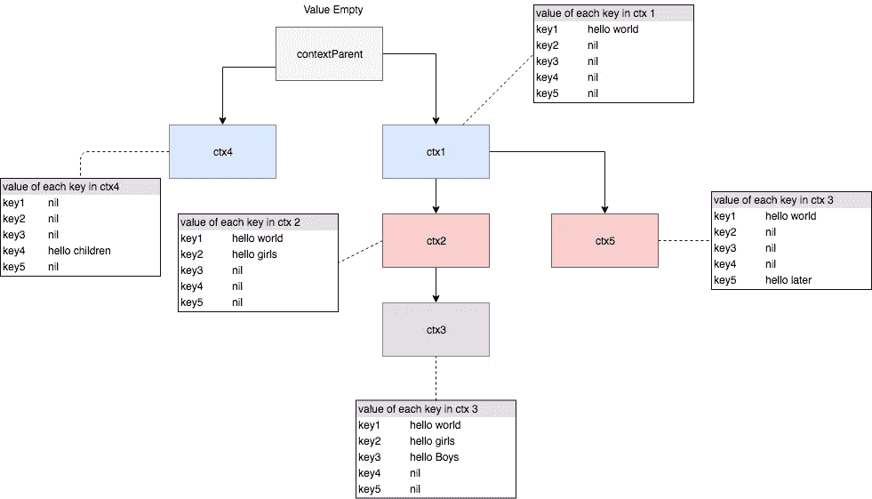

# Today I Learned: Mengenal Context pada Golang — WithValue

> 原文：<https://medium.easyread.co/today-i-learned-mengenal-context-pada-golang-withvalue-907618ceae3?source=collection_archive---------3----------------------->

## Penggunaan context menurut yang sering saya gunakan

Di Golang tepatnya setelah versi 1.7, terdapat satu fitur *package* yang kini ditambahkan menjadi salah satu *built in* yaitu ***context*** . Sejauh yang saya pahami, *context* sangat berguna untuk proses *cancellation* dan *passing value* . *Nah* , pada artikel kali ini saya akan menjelaskan penggunaan *context* yang sering saya gunakan.

# Context sebagai Passing Value

Hal paling sederhana dari *context* ialah kita dapat mengirim nilai atau data ( *object, string,* dsb) melalui *context* dan nilai tersebut akan dapat diakses di seluruh turunan *context* yang terhubung. Misalnya,

```
ctx := context.WithValue(parentContext, key, value)
```

*   **parentContext** : merupakan *parent* (induk) dari *context* tersebut,
*   **key** : merupakan *key* yang akan digunakan untuk mengambil data pada *context* , dan
*   **value** : merupakan nilai yang akan dikirim *context* dan semua turunannya.

Konsep *context* seperti pohon ( *tree* ) yang bercabang-cabang.

```
package mainimport (
 "context"
 "fmt"
)func main() {
 contextParent := context.Background()
 ctx1 := context.WithValue(**contextParent**, "key1", "hello world")
 ctx2 := context.WithValue(**ctx1**, "key2", "hello girls")
 ctx3 := context.WithValue(**ctx2**, "key3", "hello Boys")
 ctx4 := context.WithValue(**contextParent**, "key4", "hello children")
 ctx5 := context.WithValue(**ctx1**, "key5", "hello Later")fmt.Println(ctx5.Value("key5"))
 fmt.Println(ctx5.Value("key4"))
 fmt.Println(ctx5.Value("key3"))
 fmt.Println(ctx5.Value("key2"))
 fmt.Println(ctx5.Value("key1"))
 fmt.Println("========")
 fmt.Println(ctx4.Value("key5"))
 fmt.Println(ctx4.Value("key4"))
 fmt.Println(ctx4.Value("key3"))
 fmt.Println(ctx4.Value("key2"))
 fmt.Println(ctx4.Value("key1"))
 fmt.Println("========")
 fmt.Println(ctx3.Value("key5"))
 fmt.Println(ctx3.Value("key4"))
 fmt.Println(ctx3.Value("key3"))
 fmt.Println(ctx3.Value("key2"))
 fmt.Println(ctx3.Value("key1"))
 fmt.Println("========")
 fmt.Println(ctx2.Value("key5"))
 fmt.Println(ctx2.Value("key4"))
 fmt.Println(ctx2.Value("key3"))
 fmt.Println(ctx2.Value("key2"))
 fmt.Println(ctx2.Value("key1"))
 fmt.Println("========")
 fmt.Println(ctx1.Value("key5"))
 fmt.Println(ctx1.Value("key4"))
 fmt.Println(ctx1.Value("key3"))
 fmt.Println(ctx1.Value("key2"))
 fmt.Println(ctx1.Value("key1"))
}
```

Jika dilihat dari potongan kode diatas, kita dapat melihat bagaimana cara *context* itu bekerja. Setiap *value* yang *dipass* dari *parent* , maka akan dapat diakses oleh semua *childnya* . Namun *value* yang *dipass* pada *child* tidak dapat diakses oleh *parent* . Sifatnya dari atas ke bawah. Selain itu, *value* yang *dipass* sesama saudara ( *context* yang memiliki satu *parent* , namun masing-masing memiliki value tersendiri) juga tidak dapat saling mengakses.

Jika digambarkan dalam bagan, kode diatas akan terlihat seperti dibawah ini untuk distribusi nilai( *value* ) di *context* masing-masing level.



context value distribution

*   **contextParent** : terbuat dari `**context.Background()**` , dia tidak memiliki nilai, karena konsepnya hanya akan berjalan di *background* .
*   **ctx1** : merupakan turunan pertama dari `contextParent` , di `ctx1` di isi nilai `hello world`
*   **ctx4** : merupakan turunan dari `contextParent` , merupakan `sibling` dari `ctx1` . `ctx1` dan `ctx4` tidak bisa saling mengakses nilai.
*   **ctx2** dan **ctx5** : merupakan turuan dari `ctx1` . Masing masing memiliki nilai tersendiri. Dan mereka dapat mengakses nilai dari `parent` mereka yakni `ctx1`
*   **ctx3** : turunan paling kecil dari `contextParent` . Dia memiliki nilai tersendiri juga dan dia dapat mengakses nilai dari `ctx1` ,dan `ctx2` . Namun tidak bisa mengakses nilai dari `ctx5` ataupun `ctx4` .

Untuk pengalaman saya, `context.WithValue()` saya gunakan untuk mengirim *value* atau data yang bersifat sensitif. Seperti kode akses token atau malah terkadang data user. Saya biasanya mengisi `context.WithValue()` di *middleware* dan membuatnya menjadi sebuah *object* *context* . Selanjutnya *context* tersebut saya *passing* ke semua *function* yang membutuhkannya.

*Baca juga lanjutan artikel ini (sengaja di pisah, karena jika satu artikel terlalu panjang. Sehingga di pisah jadi 2 artikel agar konsepnya jelas)*

[](https://medium.com/easyread/today-i-learned-mengenal-context-pada-golang-2-withtimeout-15a3b3bf009b) [## Today I Learned: Mengenal Context pada Golang(2) — WithTimeout

### Penggunaan context menurut yang sering saya gunakan

medium.com](https://medium.com/easyread/today-i-learned-mengenal-context-pada-golang-2-withtimeout-15a3b3bf009b) 

**Referensi** :

*   [https://golang.org/pkg/context/](https://golang.org/pkg/context/)