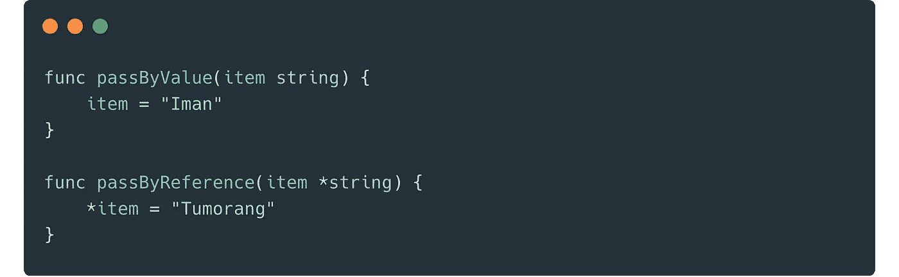

# 在 Golang 中通过引用传递接口参数

> 原文：<https://medium.easyread.co/today-i-learned-pass-by-reference-on-interface-parameter-in-golang-35ee8d8a848e?source=collection_archive---------1----------------------->

## 一篇简单的日记，关于我在 Golang 通过引用了解到的一件简单的事情



pass by reference on interface parameter in Golang

回到大学时代，我记得向函数传递参数有两种方法。一个通过值传递，另一个通过引用传递。这两种方式有不同的概念，有时会给程序员带来困惑。

简单地说，按值传递是指我们传递参数时没有指向值的源地址的指针。而按引用传递是指我们用一个指向给定参数的指针来传递参数。

在 Golang，我们可以在下面的例子中看到这两个。

```
func passByValue(item **string**){}
func passByReference(item ***string**){}
```

## Golang 中的按引用传递和按值传递

实际上，我们在互联网上已经可以找到很多关于如何在 Golang 中通过引用和通过值传递的例子。

所以在这里，我就举个简单的例子。

```
package mainimport (
 "fmt"
)func main() {
 item := ""
 passByValue(item)
 fmt.Println(item)
 passByReference(&item)
 fmt.Println(item)
}func passByValue(item string) {
 item = "hello"
}func passByReference(item *string) {
 *item = "world"
}
```

上面的例子展示了一种基于类型传递参数的典型方式(通过引用或通过值)。

## 在 Golang 中通过引用传递接口参数

但是，有一天。我遇到了一个需要解决的关于通过引用传递参数的问题。不像我以前做的任何一个普通的，这个使用了参数的接口。所以基本上，这个函数接受`interface{}`中的任何内容，并根据函数内部发生的逻辑填充值。

该函数如下所示。

```
func doSomethinWithThisParam(item interface{}){}
```

这个函数很简单，它只接受一个接口，并在里面做一些事情。它不会返回任何错误，所以它只是用一个值来水合这个项目。

所以为了解决这个奇怪的行为，我试着自己去解决。下面我将解释我解决这个问题的步骤。

## 第一次尝试:指向接口的指针[不起作用]

起初，我试着去喜欢非接口的。我在界面上放了一个指针。但是不管用。

```
package mainimport (
 "fmt"
)func main() {
 var item Student
 doSomethinWithThisParam(&item)
 fmt.Printf("%+v", item)
}type Student struct {
 ID   string
 Name string
}func doSomethinWithThisParam(item *interface{}) {
 *item = &Student{
  ID:   "124",
  Name: "Iman Tumorang",
 }
}
```

这个不能编译，它抛出错误。

```
cannot use &item (type *Student) as type *interface {} in argument to doSomethinWithThisParam:
	*interface {} is pointer to interface, not interface
```

## 第二次尝试:直接给接口赋值[不工作]

第二个，我尝试不使用指向接口的指针，而是将值直接赋给给定的参数。

```
func doSomethinWithThisParam(item interface{}) {
 item = &Student{
  ID:   "124",
  Name: "Iman Tumorang",
 }
}// Print: {ID: Name:}
```

打印数据后，它仍然没有工作。它打印空值。

## 第三次尝试:转换为原始类型并赋值。]

后来尝试了很多东西，找到了一个管用的。参数仍然是一个接口{}，但是我没有直接赋值，而是先把它转换回原来的类型。这个时候，就有点棘手了。我们必须小心使用它。请看下面的不同之处。

**未奏效一
下面这个例子是未奏效的。**

```
func doSomethinWithThisParam(item interface{}) {
 origin := item.(*Student)
 origin = &Student{
  ID:   "124",
  Name: "Iman Tumorang",
 }
 item = origin
}// Print: {ID: Name:}
```

**工作过一次** 但这次是工作过了。

```
func doSomethinWithThisParam(item interface{}) {
 origin := item.(*Student)
 origin.Name = "Iman Tumorang"
 origin.ID = "124"
}// Print: {ID:124 Name:Iman Tumorang}
```

真的吗？？？？？😱
一开始，我有点困惑。这里到底发生了什么？当我像这样做的时候，它怎么可能不工作。

```
origin := item.(*Student)
 origin = &Student{
  ID:   "124",
  Name: "Iman Tumorang",
 }
```

但这次成功了。

```
origin := item.(*Student)
origin.Name = "Iman Tumorang"
```

需要几分钟来解决这个问题。但后来我明白了为什么会这样。

**另一个工作过的人** 想通这个问题后，我意识到了一些事情。第一个失败，因为它替换了地址。因此，我尝试了一种只改变值的新方法，而不是替换地址。

```
func doSomethinWithThisParam(item interface{}) {
 origin := item.(*Student)
 ***origin** = Student{
  ID:   "124",
  Name: "Iman Tumorang",
 }
 item = origin
}// Print: {ID:124 Name:Iman Tumorang}
```

这个很好用。这使我意识到，当我们想改变指针变量中的值时，我们需要直接设置该值，而不是改变地址本身。

**最终解析器
所以在经过多次试验后，最终我选择了最后一个。因为基于我当前的任务，我正在处理的这个函数有点通用，所以我对它进行了转换，并添加了开关情况条件，这样它将基于我创建的开关情况更加通用。**

简单地说，我当前任务的所有工作都可以在下面的例子中描述。有一个通用函数将接受接口{}，并在其中做一些事情。它支持许多结构。

代码片段如下所示:

## 结论

这在戈兰真的是一件非常严肃的事情。我们在使用按引用传递和接口{}时必须非常小心。为了避免任何不必要的错误，我建议为每个使用引用传递方法的函数添加一个单元测试。

*说实话，我在这个问题上卡住了一个小时。因此，如果你认为这是一件值得知道的好事，请分享这篇文章，这样任何人都不会陷入同样的问题。*