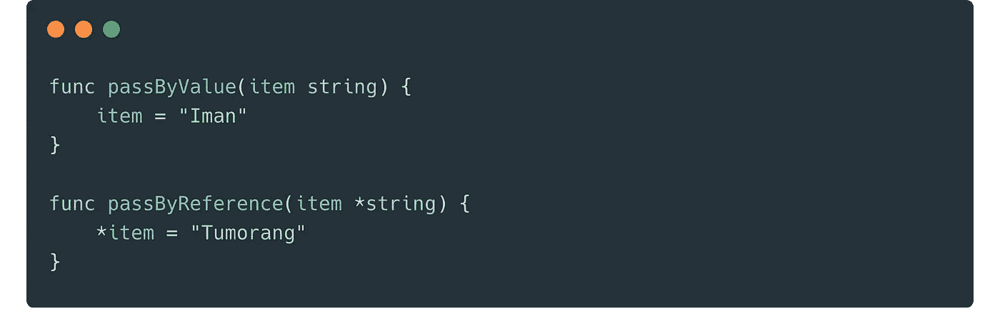

# Today I Learned: Pass By Reference pada Parameter Interface di Golang

> 原文：<https://medium.easyread.co/today-i-learned-pass-by-reference-pada-parameter-interface-parameter-di-golang-c28c00f8b544?source=collection_archive---------3----------------------->

## Hati-hati Terhadap Pass by Reference dengan Interface di Golang



pass by reference on interface parameter in Golang

Dimasa-masa kuliah, saya pernah belajar tentang 2 cara untuk membuat parameter pada sebuah fungsi, yaitu: *Pass by Value* ( **PBV** ) dan *Pass by Reference* ( **PBR** ). Kedua metode ini masing-masing memiliki kelebihan dan kekurangan serta penggunannya juga berbeda. Tidak sedikit orang yang sering terjebak dan bingung dengan kedua konsep metode ini.

Sederhananya, **PBV** ditandai dengan membuat parameter yang bukan berupa pointer (menunjuk) pada suatu alamat memori. Sedangkan **PBR** ditandai dengan membuat parameter yang menunjuk pada suatu alamat memori.

Dalam Golang, kedua metode ini dapat dilihat dalam bentuk berikut.

```
func passByValue(item **string**){}
func passByReference(item ***string**){}
```

## Pass By Reference and Pass By Value in Golang

Bicara tentang contoh dan penjelasan lengkap tentang Pass by Reference dan Pass by Value kita dapat menemukannya di internet. Khususnya tentang Golang.

Namun meskipun demikian, berikut saya sertakan contoh sederhana penggunaan **PBR** dan **PBV**

```
package mainimport (
 "fmt"
)func main() {
 item := ""
 passByValue(item)
 fmt.Println(item)
 passByReference(&item)
 fmt.Println(item)
}func passByValue(item string) {
 item = "hello"
}func passByReference(item *string) {
 *item = "world"
}
```

Di atas merupakan contoh penggunaan fungsi **PBR** dan **PBV** yang sering saya gunakan.

## Pass By Reference on Interface Param in Golang

*Nah* , beberapa hari yang lalu, saya menemukan satu *issue* sederhana, tetapi cukup memusingkan. Issue ini tentang **PBR** pada Golang yang menggunakan interface pada parameternya. Tidak seperti biasanya, fungsi ini menerima `interface{}` dan akan mengisi nilai param terebut berdasarkan *logic* di dalamnya.

Berikut adalah contohnya.

```
func doSomethingWithThisParam(item interface{}){}
```

Fungsi ini cukup sederhana, hanya menerima sebuah parameter *interface* dan di dalamnya parameter tersebut akan di *hydrate* dan di isi *value* .

Untuk mencoba memahami dan menyelesaikan masalah ini, saya pun melakukan beberapa percobaan yang akan saya jelaskan dibawah.

## Percobaan 1: Pointer to Interface *[Not Worked]*

Pada percobaan pertama, saya mencoba seperti layaknya parameter pointer lainnya. Saya langsung menambahkan pointer pada parameter fungsi tersebut. Namun langkah ini sepertinya tidak membuahkan hasil.

```
package mainimport (
 "fmt"
)func main() {
 var item Student
 doSomethinWithThisParam(&item)
 fmt.Printf("%+v", item)
}type Student struct {
 ID   string
 Name string
}func doSomethinWithThisParam(item *interface{}) {
 *item = &Student{
  ID:   "124",
  Name: "Iman Tumorang",
 }
}
```

Jika dijalankan, code tersebut akan *throw compilation error* . Artinya code tersebut tidak layak untuk dijalankan.

```
cannot use &item (type *Student) as type *interface {} in argument to doSomethinWithThisParam:
	*interface {} is pointer to interface, not interface
```

## Percobaan 2: Directly Assign Value to Interface [Not Worked]

Pada percobaan kedua, saya pun mencoba tanpa pointer pada parameter interface fungsi tersebut. Namun didalamnya, saya langsung memberikan nilai pada parameter tersebut.

```
func doSomethinWithThisParam(item interface{}) {
 item = &Student{
  ID:   "124",
  Name: "Iman Tumorang",
 }
}// Print: {ID: Name:}
```

Dan sama seperti percobaan sebelumnya, percobaan ini juga gagal. Nilainya tidak berisi.

## Percobaan 3: Casting to Original Type and Assign the Value [Worked but….]

Selanjutnya, saya pun mencari alternatif lain. Sama seperti percobaan 2, saya tetap melakukan tanpa pointer pada parameter fungsi saya. Namun bedanya, kali ini saya lakukan casting interface tersebut kembali ke wujud originalnya.

Tetapi untuk melakukan ini, saya harus benar-benar hati-hati dan teliti. Karena ada behavior yang aneh dan unik ketika melakukannya. Jelasnya perhatikan contoh berikut dibawah.

**Not worked one** Berikut contoh yang tidak bisa berjalan dengan baik. Nilainya tetap kosong.

```
func doSomethinWithThisParam(item interface{}) {
 origin := item.(*Student)
 origin = &Student{
  ID:   "124",
  Name: "Iman Tumorang",
 }
}// Print: {ID: Name:}
```

**Worked one** Lalu ini yang bisa berjalan dengan baik. Nilainya diisi oleh value yang saya isi.

```
func doSomethinWithThisParam(item interface{}) {
 origin := item.(*Student)
 origin.Name = "Iman Tumorang"
 origin.ID = "124"
}// Print: {ID:124 Name:Iman Tumorang}
```

Sedikit aneh, awalnya saya penasaran apa bedanya antara assign langsung pointer value, dari pada assign dengan langsung ke field seperti diatas.

Bagaimana mungkin jika saya lakukan seperti berikut dibawah tidak berjalan dengan baik?

```
origin := item.(*Student)
origin = &Student{
  ID:   "124",
  Name: "Iman Tumorang",
 }
```

Namun ketika saya lakukan seperti berikut dibawah malah berjalan dengan baik?

```
origin := item.(*Student)
origin.Name = "Iman Tumorang"
```

Butuh beberapa menit untuk memahami ini, meski pada akhirnya saya paham juga. Tetapi ini cukup bikin penasaran dan *kzl* !

**Another worked one** Setelah mencoba beberapa hal, akhirnya saya mengerti juga. Yang pertama tidak bisa karena saya membuat alamat baru pada interface yang saya casting. Bukan malah mengisi value, tetapi saya malah mengganti address. Dan karena parameter tersebut sudah memiliki address sebelumnya, jika kita ubah maka tidak akan memberikan effect kepada *function caller* .

Lalu, untuk membuktikan hipotesa saya, berikut saya buat, dan berhasil.

```
func doSomethinWithThisParam(item interface{}) {
 origin := item.(*Student)
 ***origin** = Student{
  ID:   "124",
  Name: "Iman Tumorang",
 }
}// Print: {ID:124 Name:Iman Tumorang}
```

**Final Resolver** Setelah cukup lama bereksperimen, akhirnya saya menetapkan pilihan solusi saya. Dan karena fungsi ini menerima interface, artinya bakal jadi generic. Maka saya pun menambahkan switch-case sesuai kebutuhan.

Jika dilihat, simplenya, berikut contoh full-code saya.

## Conclusions

Issue ini cukup serius, dan bikin pusing. Kita harus benar-benar hati-hati ketika bekerja yang berhubungan dengan Pass by Reference dan *interface{}* di Golang. Untuk menghindari bug-bug lucu, saya sangat menyarankan teman-teman untuk menambahkan unit-test pada setiap fungsi yang memiliki behavior Pass by Refference.

*Jujur saja, saya terjebak hampir satu jam lebih untuk issue ini. Jika menurut teman-teman hal ini adalah hal yang baik untuk diketahui, share article ini ke siapapun yang mungkin membutuhkannya, sehingga tidak perlu terjebak ke lubang yang sama hehe :D.*

> Di terjemahkan dengan pengubahan dari [https://bxcodec.io/posts/today-i-learned-pass-by-reference-on-interface-parameter-in-golang](https://bxcodec.io/posts/today-i-learned-pass-by-reference-on-interface-parameter-in-golang/)