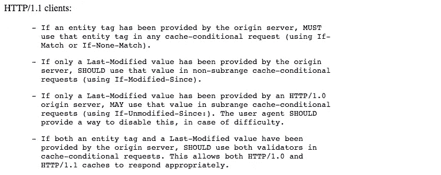
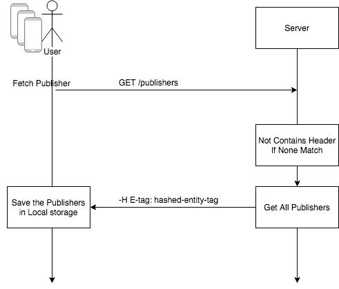
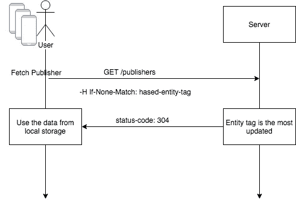
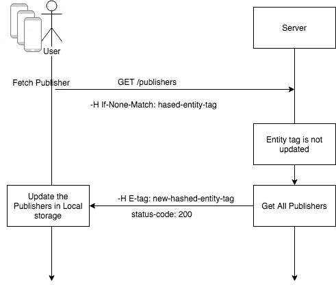

# Today I Learned: Cara Penggunaan Etag Dalam API Caching di REST API

> 原文：<https://medium.easyread.co/today-i-learned-penggunaan-e-tag-dalam-api-caching-di-rest-api-91da6f353c7a?source=collection_archive---------0----------------------->

## Bagaimana flow penggunaan Etag dalam menerapkan API Caching di REST API


Photo by [Kari Shea](https://unsplash.com/@karishea?utm_source=medium&utm_medium=referral) on [Unsplash](https://unsplash.com?utm_source=medium&utm_medium=referral)

Hari ini saya belajar hal yang sebenarnya sudah lazim di dunia per REST API-an. Yakni tentang Etag pada REST API.

Saya sudah lama tahu tentang Etag, namun saya tidak pernah menerapkannya secara langsung di kodingan saya. Hingga hari ini, ketika kami hendak mengerjakan fitur baru di **Kurio** , terdapat sebuah case yang harus memaksa kami harus menggunakan Etag di dalam REST API kami.

Jadi kasusnya adalah sebagai berikut. Misal kami terdapat sebuah endpoint untuk fetch publisher.

```
GET /publishers
[{
  "id": "kompas-com",
  "name": "Kompas",
  "url": "[https://kompas.com](https://kompas.com)",
  "logo": "[https://kompas.com/logo.png](https://kompas.com/logo.png)"
 },
 {
  "id": "kumparan-com",
  "name": "Kumparan",
  "url": "[https://kumparan.com](https://kumparan.com)",
  "logo": "[https://kumparan.com/logo.png](https://kumparan.com/logo.png)"
 }
]
```

Endpoint ini akan mendonwload semua publisher yang ada dalam database kami. Karena sifatnya ini adalah sedikit permanen. Karena penambahan publisher atau pengurangan publisher sangat cukup jarang, karena faktor eksternal terus jumlahnya juga sedikit.

Kami sepakat untuk mebuatnya 1 time download. Jadi sekali download semua publisher akan di retrieve, dan client kami (kasus kami adalah mobile apps kami) akan menggunakan localdb mereka untuk menyimpan daftar publisher kami ini.

Tujuannya adalah, mengurangi atau menghemat jumlah data yang diterima mobile apps kami — *we care to our user, so we decide to reduce any cost including packet data when they use our apps :D ✌️*

Sehingga untuk menanganinya, kami melakukan sistem caching dengan menggunakan Etag.

## **Cara kami menggunakan Etag**

Untuk kasus kami, kami menggunakan header sebagai indicator etag. Jadi akan ada 2 header yang kami wajibkan ada.

*   Etag header
*   If-None-Match header

Kedua header ini sangat penting untuk flow caching yang kami gunakan seperti tertuang dalam [RFC 2616](https://www.w3.org/Protocols/rfc2616/rfc2616-sec13.html#sec13.2)



rfc2616

Flownya simple saja:

*   Untuk pertama kali, user akan fetch list publisher yang ada diserver. Dan server akan memberikan response list publisher beserta header `Etag` yang valuenya adalah berupa checksum hash-code atau untuk kasus ini saya sebut `hashed-entity-tag` . Selanjutnya mobile akan menyimpan data publisher tersebut beserta etagnya di local storage



First attempt request

*   Nah request ini akan disimpan dilocal DB mobile, dan akan diverifikasi setiap buka aplikasi. Verifikasinya adalah, dengan melakukan request ulang ke Server. Namun disertakan dengan header `If-None-Match` yang valuenya adalah `hashed-entity-tag` yang sebelumnya pernah diterima mobile dari server pertama kali.
*   Jika `hashed-entity-tag` yang dikirim masih merupakan yang terbaru, maka server akan mengirim status-code: 304 (not-modified). Dan mobile akan menggunakan data di local storage mereka. Sehingga, tidak ada response body yang diterima mobile.



Entity-tag masih terbaru

*   Namun, jika `hashed-entity-tag` tidak terbaru, maka kami akan mengirim data publisher kami ke mobile lagi.



not updated entity-tag

## Hashing Entity Tag

Untuk hahsing entity-tagnya, kami hanya menggunakan nilai dari `max-updated-time` dari publishers kami. Sehingga, jika kami memiliki publisher baru, atau ada perubahan pada publisher kami, maka etagnya akan generate baru.

Flownya:


Cara hashing etag

Tidak ada algoritma khusus, hanya sesimple itu saja. Meski practice ini belum terlalu perfect, karena masih banyak standarisasi API caching yang tertuang dalam [RFC 2616](https://www.w3.org/Protocols/rfc2616/rfc2616-sec13.html#sec13.2)

Namun hari ini saya cukup belajar hal kecil secara praktikal.
Selamat liburan guysss :)

Referensi:

*   [RFC 2616](https://www.w3.org/Protocols/rfc2616/rfc2616-sec13.html#sec13.2)
*   [https://gist.github.com/6a68/4963424](https://gist.github.com/6a68/4963424)