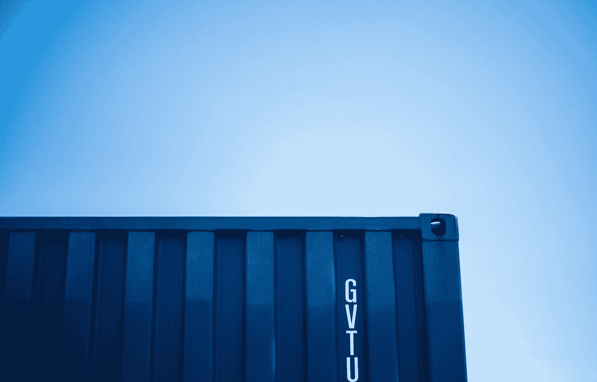
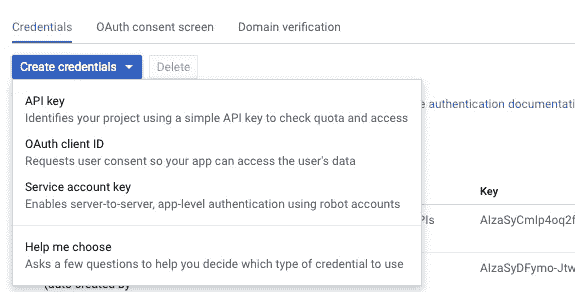

# Today I Learned: Pull Docker Image dari GCR (Google Container Registry) di Kubernetes non GCP

> 原文：<https://medium.easyread.co/today-i-learned-pull-docker-image-dari-gcr-google-container-registry-di-kubernetes-non-gcp-c142f530047e?source=collection_archive---------1----------------------->

## Issue hari ini ketika pull Docker Image dari GCR (Google Container Registry) pada cluster Kubernetes non GCP



Photo by [Victoire Joncheray](https://unsplash.com/@victoire_jonch?utm_source=medium&utm_medium=referral) on [Unsplash](https://unsplash.com?utm_source=medium&utm_medium=referral)

Semenjak DigitalOcean membuka fitur Kubernetes, saya pun mencoba memindahkan beberapa project saya dari GCP (Google Cloud Platform) ke DigitalOcean. Alasannya, ya sudah pasti, Google menawarkan harga yang sebanding dengan fitur yang diharapkan **a.k.a** *too expensive for personal projects* .

Tetapi, meskipun demikian, saya hanya memindahkan beberapa service saja. Sebut saja seperti service Kubernetes dan Database. Namun service seperti GCR (Google Container Registry) saya masih menggunakannya, alasannya, karena ini masih terbilang lebih murah jika dibandingkan dengan Docker Registry lainnya.

*Nah* , lalu terjadilah masalah tersebut. Ketika saya memindahkan semua Kubernetes cluster saya ke DO (Digital Ocean), saya pun mendapat error yang mungkin sudah kita pikirkan akan terjadi, yaitu *failed to pull image* .

```
$ kubectl get pods
NAME                    READY   STATUS         RESTARTS   AGE
august-f7fc98c5-x4chl   0/1     ErrImagePull   0          88s
```

Kira-kira seperti itulah wujud statusnya jika kita melakukan command `kubectl get pods` .

Hal ini terjadi karena, image saya di GCR bersifat *private* . Dan karena bersifat *private* , maka untuk melakukan proses pull, saya membutuhkan akses token.

Jadi, solusinya adalah saya pun menambah *google credential* yang akan saya pakai di *Kubernetes* cluster saya yang ada di Digital Ocean. Berikut langkah-langkah yang saya lakukan.

## **Steps 1: Create Credentials Untuk GCR**

*   Masuk ke Google Console, pindah ke menu **“API & Services” > “Credentials”**


*   Lalu pilih **“Create credentials” > “Services Account Key” > “Create New Services Account”.**



*   Lalu, isi saja untuk nama services account, dan untuk Role, pilih project Role **Viewer** .


*   Dan klik **Create** . Setelah di create, nanti akan langsung otomatis terdownload sebuah file JSON, dan akan berbentuk seperti berikut.

Dengan begini, kita sudah memiliki credentials yang bisa kita gunakan untuk pull Docker Images dari GCR.

## **Steps 2: Menambahkan Kubernetes Secret di Kubernetes Cluster**

*   Selanjutnya adalah menambahkan docker-secret di Kubernetes cluster saya yang ada di DO.

```
$ kubectl create secret docker-registry gcr-json-key \
  --docker-server=asia.gcr.io \
  --docker-username=_json_key \
  --docker-password="$(cat ~/json-key-file-dari-gcp.json)" \
  --docker-email=any@valid.email
```

*   Eksekusi command diatas, namun sesuaikan dengan server GCR anda. Saya memakai `asia.gcr.io` , serta untuk password sesuaikan dengan nama file yang kita dapatkan dari Google tadi.
*   Jika menemukan error seperti berikut dibawah, ketika menjalankan *command create* , maka coba delete dan ulang lagi, atau ganti nama key yang kita gunakan.

```
$ Error from server (AlreadyExists): secrets "gcr-json-key" already exists
```

*   Selanjutnya, pastikan secretnya telah terbuat. Seharusnya jika kita menjalankan command berikut, maka `gcr-json-key` seharusnya ada.

```
$ kubectl get secret
NAME         TYPE                                  DATA   AGE
gcr-json-key kubernetes.io/dockerconfigjson        1      6s
```

## Steps 3: Menggunakan Secret untuk Deployment

Untuk menggunakan secret yang telah kita buat, terdapat 2 cara.

*   Menambahkan secret tersebut ke **ImagePullSecrets** secara default. Sehingga setiap ada pod baru yang akan kita deploy, akan menggunakan secret tersebut secara default didalam satu namespace, atau
*   Menambahkan secret tersebut kemasing-masing deployment pods.

**Steps 3.a: Menambahkan secret ke “ImagePullSecrets” secara default**

*Nah* , jika kita ingin membuat secret-key yang telah kita buat tadi dapat digunakan oleh semua pods deployment, langkahnya cukup mudah. Tinggal copykan saja command berikut diterminal.

```
$ kubectl patch serviceaccount default \
-p '{"imagePullSecrets": [{"name": "gcr-json-key"}]}'
```

Setelahnya, kita tinggal lakukan deployment lagi maka pods kita seharusnya sudah bisa berjalan. Sehingga jika dilihat kedalam pods status akan menghasilkan hasil seperti berikut

```
$ kubectl describe pod pod_name
....
Normal  Pulling    16s   kubelet, default-staging-oro2  Pulling image "asia.gcr.io/personal-project/august:latest"Normal  Pulled     12s   kubelet, default-staging-oro2  Successfully pulled image "asia.gcr.io/personal-project/august:latest"
```

**Steps 3.b: Menambahkan secret ke setiap pods deployment configuration.**

Untuk langkah ini, kita hanya tinggal menambahkan secret yang telah kita buat diatas tadi ke setiap konfigurasi deployment kita.

Demikian hal baru yang saya pelajari hari ini. Dan ini mungkin akan serupa dengan provider Container Registry lainnya. Semoga berguna bagi yang membutuhkan.

## References

*   [https://container-solutions.com/using-google-container-registry-with-kubernetes/](https://container-solutions.com/using-google-container-registry-with-kubernetes/)