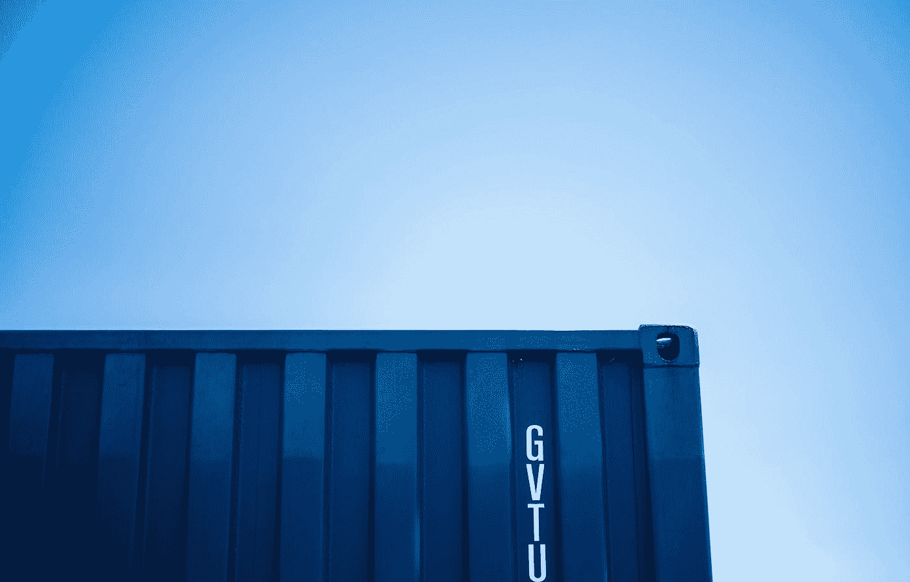
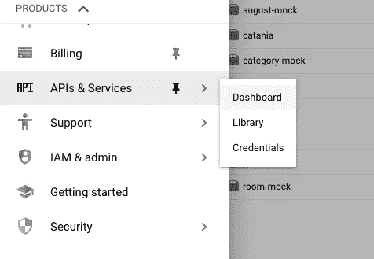
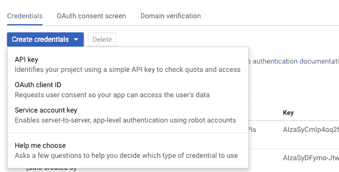
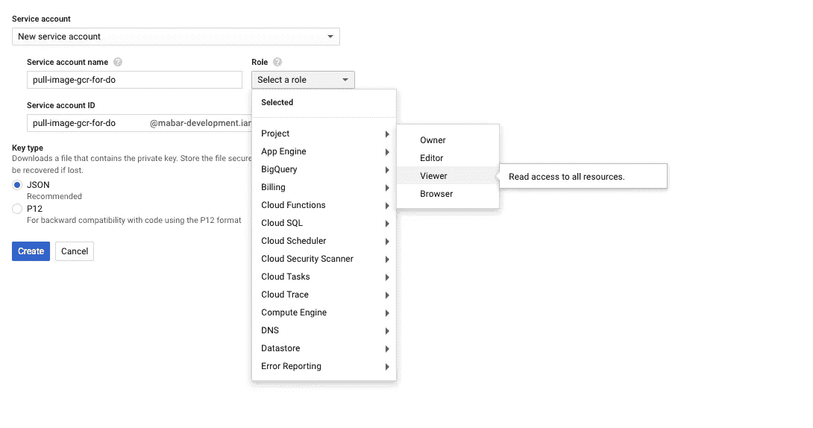

# 如何在任何非 GCP Kubernetes 集群中从 GCR 拉码头形象

> 原文：<https://medium.easyread.co/today-i-learned-pull-docker-image-from-gcr-google-container-registry-in-any-non-gcp-kubernetes-5f8298f28969?source=collection_archive---------0----------------------->

## 帮助您在任何非 GCP Kubernetes 集群中使用 GCR 作为您的容器注册中心的简单指南



Photo by [Victoire Joncheray](https://unsplash.com/@victoire_jonch?utm_source=medium&utm_medium=referral) on [Unsplash](https://unsplash.com?utm_source=medium&utm_medium=referral)

我有许多副业项目，但我把它部署在我在 GCP 的 Kubernetes 集群(谷歌云平台)。但在 DigitalOcean(DO)发布了他们的 Kubernetes 功能后，我想把我在 GCP 的所有辅助项目都转移到 DO。进行这种迁移的原因是因为 GCP 太贵了，而且对于那些没有真正生产用户的简单副业项目来说是多余的。

但是，我只是迁移了 Kubernetes 集群和数据库。我仍然使用 GCP 的一些服务，例如，像 GCR(谷歌容器注册)这样的谷歌服务作为我的容器注册，因为 GCR 相对于 DockerHub 的私有注册要便宜一些。

在迁移 Kubernetes 集群时，我发现了一个问题。该问题是关于在提取私人图像时对 GCR 的身份验证。这是我拿到豆荚时豆荚的状态。

```
$ kubectl get pods
NAME                    READY   STATUS         RESTARTS   AGE
august-f7fc98c5-x4chl   0/1     ErrImagePull   0          88s
```

在查找日志之后，问题出现了，因为我需要在提取私有映像时定义一个访问令牌。所以在这里，我将解释我解决这个问题的所有步骤。

## 步骤 1:为 GCR 创建凭据

*   转到 GCP 控制台。选择**“API&服务”>“凭证”**



*   选择**“创建凭证”>“服务帐户密钥”>“创建新服务帐户”。**



*   然后，填写服务帐户名称，对于角色，选择**查看器**



*   并点击**创建**。创建后，凭证将自动下载到一个 JSON 文件中。它将会是这个样子。

所以现在，我们已经有资格从 GCR 获取私人图像。

## 步骤 2:在 Kubernetes 集群中添加一个 Kubernetes 秘密

*   下一步是，我们将在我们的 Kubernetes 群集中创建一个 Kubernetes 秘密。

```
$ kubectl create secret docker-registry gcr-json-key \
  --docker-server=asia.gcr.io \
  --docker-username=_json_key \
  --docker-password="$(cat ~/json-key-file-from-gcp.json)" \
  --docker-email=any@valid.email
```

*   运行上面的命令，并根据您的需要进行输入。比如:`docker-server` : `asia.gcr.io`(我用的是亚洲服务器)。并且用你在 GCP 注册的邮箱填邮箱等等。
*   如果你在下面看到这个错误，那是因为你已经有了一个名为`gcr-json-key`的秘密。您可以删除密码并重新创建，或者在创建密码时输入另一个名称。

```
$ Error from server (AlreadyExists): secrets "gcr-json-key" already exists
```

*   要确保秘密已经被创建，只需获取秘密；应该以`gcr-json-key`这个名字存在。

```
$ kubectl get secret
NAME         TYPE                                  DATA   AGE
gcr-json-key kubernetes.io/dockerconfigjson        1      6s
```

## 步骤 3:使用秘密进行部署

我们有两种方法可以使用前面步骤中创建的秘密。他们是

*   将秘密添加到 Kubernetes 的名称空间中默认服务帐户的 **ImagePullSecrets** 中。通过这种方法，将被部署的每个 pod 将在提取图像时使用该秘密。
*   另一种方法是，将秘密直接添加到每个需要它的 pod 的部署配置中。

**步骤 3.a:将秘密添加到默认服务帐户中的“ImagePullSecrets”中。**

第一种方法是在默认服务帐户中添加密码。为此，我们可以直接复制下面的这个命令。

```
$ kubectl patch serviceaccount default \
-p '{"imagePullSecrets": [{"name": "gcr-json-key"}]}'
```

使用该命令，我们的 Kubernetes 集群应该已经能够从 GCR 获取图像。

```
$ kubectl describe pod pod_name
....
Normal  Pulling    16s   kubelet, default-staging-oro2  Pulling image "asia.gcr.io/personal-project/august:latest"Normal  Pulled     12s   kubelet, default-staging-oro2  Successfully pulled image "asia.gcr.io/personal-project/august:latest"
```

如果仍然出现错误，请尝试删除该单元，并等待该单元再次重新部署。

**步骤 3.b:将秘密添加到每个吊舱部署配置中**

对于这一步，我们需要更新我们的部署文件。我们需要将秘密直接添加到部署文件中。这种方法只对每个包含秘密的 pod 有效。

寻找属性:`imagePullSecrets`。我们必须将秘密直接添加到部署文件中。

对于我的情况，我选择第一种方法，原因是因为我的默认容器注册中心是 GCR。因此，如果将来我有一个不同的注册表，我只需将部署文件直接添加到每个需要它的 pod 中。

这就是我今天学到的东西。也许这只适用于 GCR，但我认为这一概念对其他集装箱注册也是一样的。

## 参考

*   [https://container-solutions . com/using-Google-container-registry-with-kubernetes/](https://container-solutions.com/using-google-container-registry-with-kubernetes/)