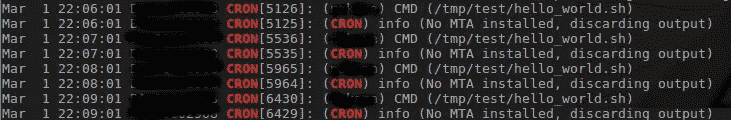
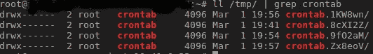

# 今天我学习了——在使用 Crontab -R 不小心删除 Crontab 后重新获得它

> 原文：<https://medium.easyread.co/today-i-learned-retrieving-crontab-after-accidentally-delete-it-using-crontab-r-1f9699ef94f5?source=collection_archive---------0----------------------->

> 今天是和往常一样平静的一天。已经是晚上 7 点了，我想合上笔记本电脑吃晚饭。突然，我的一个朋友告诉我，他不小心运行了命令 **crontab -r** 而不是 **crontab -e** 来更新我们服务器中的 cronjob。然后，我们一起慌了。


Photo by [Richard Brutyo](https://unsplash.com/@richardbrutyo?utm_source=medium&utm_medium=referral) on [Unsplash](https://unsplash.com?utm_source=medium&utm_medium=referral)

接下来——我们一起寻找出路，得出了两个解决方案。

1.  试图通过 ***syslog*** 查找 cron 日志

```
**grep CRON /var/log/syslog**
```

使用这个命令，我们可以看到系统运行的所有系统日志。 *grep* 函数将只捕捉包含单词 *cron* 的日志。



grep CRON /var/log/syslog

从这些日志中，我们可以发现命令`***/tmp/test/hello_world.sh***` 每 1 分钟运行一次。使用这些信息，我们可以获取在这里找到的所有命令，并将它们重写到现有的 crontab 中。

2.检查 `***/tmp/***`试试运气

```
**ll /tmp/ | grep crontab**
```



ll /tmp/ | grep crontab

许多程序不直接写入实际文件。相反，程序将首先写入`***/tmp/***`文件，当它们完成更新时，它们将做一些步骤来检查和验证(取决于程序)，然后最终写入实际的原始文件。

crontab 的一个例子是:如果 crontab 中有冲突的更改(您正在尝试更新文件，而另一个也在做同样的事情)，那么在`***/tmp/***`中将会有一个前缀为 ***crontab 的新目录。**** 存储您的版本更新。

如果运气在我们这边，*好歹在* ***我们这边——运气在我们这边*** ，我们可以在这里找到旧档案。使用这些旧文件，我们可以重写现有的 crontab。

有了这种情况之后，进行定期的 crontab 配置备份似乎是一个好主意——只需将它写入 crontab 配置中。然后，cron 可以在未来拯救自己。😂

> 最后，我们能够恢复我们的 crontab 配置。我终于合上笔记本，吃了晚饭。
> 
> 祝大家愉快！

# **参考**

1.  [意外移除后取回 crontab](http://intosimple.blogspot.com/2013/10/retrieving-crontab-after-accidental.html)
2.  [用 crontab -r 恢复意外删除的 cron 作业](https://unix.stackexchange.com/questions/136350/recover-cron-jobs-accidently-removed-with-crontab-r)