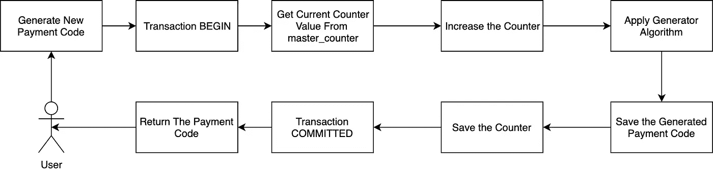

# Today I Learned: Row Locking Transaction pada PostgreSQL

> 原文：<https://medium.easyread.co/today-i-learned-row-locking-transaction-pada-postgresql-f8dee8084f90?source=collection_archive---------2----------------------->

## Bagaimana saya melakukan Row-Level Locking Transaction di PostgreSQL.


Photo by [The Framed Bear](https://unsplash.com/@theframedbear?utm_source=medium&utm_medium=referral) on [Unsplash](https://unsplash.com?utm_source=medium&utm_medium=referral)

Hari ini, setelah bergelut selama 2 hari kurang beberapa jam. Saya menemukan kasus yang cukup membuat saya pusing dan bingung. Hingga pada akhirnya, saya berhasil menemukan solusinya. Dan solusinya ternyata sangat sederhana.

Sedikit cerita, saat ini, saya lagi mengerjakan proses pengembangan *core-payment* di [Xendit](https://www.xendit.co/) , salah satu perusahaan *payment-gateway* di Indonesia, tempat saya bekerja saat ini. Saya baru bergabung sekitar 6 bulan yang lalu. Dan kebetulan saya mendapat kepercayaan untuk ikut serta dalam proyek me- *refactor* *core system* kami.

*Nah* , isu yang baru saya alami ini berkaitan dengan pengembangan sistem baru dari *core payment* kami. Isu tersebut berkaitan dengan *concurrency* dan *transaction* di database, di salah satu *service* kami, atau sebut saja *service* `**Payment Code Generator**` .

Seperti namanya, *service* ini akan menerima *request* dari user dan responsenya adalah sebuah kode pembayaran yang dapat digunakan user untuk melakukan pembayaran.

*Service* ini, secara sederhana tanpa mencakup *bisnis logic* , bisa saya sebut hanya terdiri dari 2 *table* . Sebut saja: `**master_counter**` dan `**payment_code**` . Kedua *table* ini saling berkaitan yang akan saya jelaskan nanti dibawah.

Untuk *schema* databasenya, bisa dilihat sebagai berikut:

*   Schema `**master_counter**`

```
BEGIN;
CREATE TABLE IF NOT EXISTS master_counter(
  id varchar(255) NOT NULL PRIMARY KEY, 
  user_id VARCHAR(255) NOT NULL, 
  counter bigint NOT NULL, 
  created_at timestamptz NOT NULL, 
  updated_at timestamptz NOT NULL, 
  deleted_at timestamptz, 
  CONSTRAINT master_counter_user_id_unique_idx UNIQUE (user_id)
);
COMMIT;
```

*   Dan schema `**payment_code**`

```
BEGIN;
CREATE TABLE IF NOT EXISTS payment_code(
  id varchar(255) NOT NULL PRIMARY KEY, 
  payment_code varchar(255) NOT NULL, 
  user_id varchar(255) NOT NULL, 
  created_at timestamptz NOT NULL, 
  updated_at timestamptz NOT NULL, 
  CONSTRAINT payment_code_unique_idx UNIQUE(payment_code, user_id)
);
COMMIT;
```

Jika teman-teman lihat, di `**master_counter**` , terdapat kolom `**counter**` . Kolom ini akan bertambah berdasarkan request yang dilakukan oleh user. Jadi jika nilai awalnya adalah 0, lalu user melakukan request baru, maka valuenya akan di update menjadi 1.

Secara sederhana (tanpa *bisnis logic* yang rumit), *flow* dari sistem ini ketika user melakukan *request* *payment code* yang baru dapat dilihat sebagai berikut.



Flow the Generating Payment Code

*   Pertama, ketika user *request payment code* baru, kita akan melakukan query nilai dari `**counter**` user tersebut dari database.
*   Lalu, `**counter**` yang kita query tersebut, kita tambah satu di aplikasi. Lalu kita melakukan proses hash ( *apply hashing logic* ) yang dimana hasil hashnya adalah *payment code* yang akan dipakai user.
*   Lalu, hasil hash counter tersebut, kita simpan ke table `**payment_code**` . Dan karena `**payment_code**` sifatnya pasti unik. Sehingga jika ada `**payment_code**` yang sama, maka databasenya akan berteriak *error* .
*   Setelah `**payment_code**` nya kita simpan, nilai `**counter**` yang terbaru tadi, kita simpan kembali ke table `**master_counter**`
*   Terakhir, `**payment_code**` yang sudah kita generate (nilai counter yang di hash) kita kembalikan sebagai response ke user.

Ya kurang-lebih, keseluruhan proses yang terjadi seperti itulah. Meski masih banyak “ *logic-logic* ” aneh lainnya, tetapi secara garis besar, cuma sesederhana itu saja.

## Problems Started

Jika saya buat ke dalam bentuk SQL query, keseluruhan prosesnya bisa kita tuliskan seperti berikut.

```
BEGIN;
SELECT counter FROM master_counter;// counter++ di aplikasi
// Apply Generator Logic in ApplicationINSERT INTO payment_code(payment_code) VALUES(generated_value_with_counter);UPDATE master_counter SET counter=<new_value_from_application>;COMMIT;
```

Dan karena saya pakai Golang untuk pengaplikasikannya, hal ini menjadi lebih mudah karena di Golang sendiri proses transaksi pada database sudah di abstraksi.

Berikut pseudo-code proses saya di aplikasi.

```
tx,_:=db.Begin() // Mulai Transaksicounter, err:= SelectCounter(tx) // Query Counter 
if err != nil {
 tx.Rollback() // Rollback jika terjadi Error
}counter++
generatedCode:=ApplyAlgorithm(counter) // Apply Algorithmerr:= SaveGeneratedCode(tx, generatedCode) // Simpan GeneratedCode
if err != nil {
 tx.Rollback() // Rollback jika terjadi Error
}err:=UpdateCounter(tx, counter) // Update  nilai counter yang ba
if err != nil {
 tx.Rollback() // Rollback jika terjadi Error
}tx.Commit() // Commit transaksi
```

*Nah* , ketika melihat keseluruhan proses ini, seharusnya tidak ada masalah. Dan benar saja, ketika saya coba dengan melakukan call API menggunakan Postman, semua berjalan sesuai ekspektasi.

Kemudian ketika saya mencoba dengan *concurrent request,* saya mencoba melakukan *load testing* ke aplikasi tersebut. Tidak banyak, saya hanya menggunakan 2 *concurent request* . Lalu benih-benih errornya pun muncul.

```
**pq: duplicate key value violates unique constraint \"my_unique_payment_code_index\"**
```

Dari errornya, disebutkan bahwa terjadi pelanggaran *constraint* pada *unique* *value* . Ini terjadi di table `**payment_code**` .

Asumsi saya adalah, jika terjadi error duplikat pada `**payment_code**` , maka terjadi race condition disini. Dimana terdapat 2 atau lebih request saling lomba-lomba melakukan insert data.

Dan ini terjadi karena, `**payment_code**` yang diinsert adalah hasil dari algoritma hashing melakukan hashing dengan nilai `**counter**` yang sama. Sehingga saat disimpan ke table, datanya pun melanggar constraint dari unique key.

## First Attempt! — Using Isolation Level

Mendapati kasus ini, saya pun mulai bingung. Karena setahu saya, saya sudah menggunakan transaction di query saya.

Dan setelah menghabiskan waktu seharian untuk searching dan exploring. Saya menemukan 3 artikel yang membuat saya paham kondisi saya.

*   [Transaction Isolation in PostgreSQL](https://pgdash.io/blog/postgres-transactions.html)
*   [Transaction Isolation Levels in PostgreSQL](http://shiroyasha.io/transaction-isolation-levels-in-postgresql.html)
*   [On Concurrency Control in Databases](https://blog.gojekengineering.com/on-concurrency-control-in-databases-1e34c95d396e)

Saya menemukan *buzzword* baru, yakni `**isolation**` pada database.

Dari artikel tersebut, saya pun menyimpulkan bahwa isolation level yang saya gunakan pada database saya belum cukup ketat untuk proses read-write-update secara bersamaan.

Lalu saya pun mencoba menambah isolation level pada query saya.

```
_, err := tx.ExecContext(ctx, "SET TRANSACTION ISOLATION LEVEL REPEATABLE READ")if err != nil {
   return
}
```

Dan saya coba jalanin ulang load testnya.

```
**pq: could not serialize access due to concurrent update**
```

Saya pun menemukan error baru. Disini errornya mengatakan bahwa database saya memblock request yang melakukan update secara bersamaan. Memang sih, ini sudah cukup menghindari race-condition. Tetapi, dari 2 request yang bersamaan, salah satu request akan mendapat error. Yang kita inginkan adalah, kedua request tersebut harus sukses. Jika salah satu sedang melakukan operasi transaksi, maka yang lain harus menunggu sampai selesai, lalu berjalan lagi.

Tidak puas dengan hasil yang saya dapat, saya pun mencoba bertanya kepada orang lain. Tidak hanya teman dari kantor saya, saya bahkan tanya ke orang-orang dari luar kantor saya.

Dan dari semua jawaban yang saya dapat baik dari teman kantor, atau teman di kantor lain, saya pun menyimpulkan, bahwa yang saya butuhkan sebenarnya adalah ***row-level locking pada postgres*** . Karena yang saya butuhkan adalah, read dan update pada setiap row di kolom `**counter**` , sehingga saya hanya butuh pada row level locking.

Menggunakan isolation, scopenya diaplikasikan keseluruhan table. Sehingga jika terjadi 2 read yang bersamaan, maka salah satunya akan di block dan mendapat error.

## Second Attempt! — Using SELECT FOR UPDATE

Percobaan kedua saya, adalah sebagai berikut

*   Membuat isolation level: **READ COMMITTED** (Postgres default isolation level)
*   Menggunakan row-level locking: **SELECT FOR UPDATE**

Jadi dari code original saya, perubahan yang perlu saya lakukan hanya sebatas menambah query `**FOR UDPATE**` di query read `**counter**` yang saya miliki.

Sehingga perubahannya dari query pertama saya sebelumnya adalah seperti berikut.

```
BEGIN;
SELECT counter FROM master_counter **FOR UDPATE**; **// notice this**// Do Addition to counter in application
// Apply Generator Logic in ApplicationINSERT INTO payment_code(payment_code) VALUES(generated_value_with_counter);UPDATE master_counter SET counter=<new_value_from_application>;COMMIT;
```

Yap, saya hanya menambah itu saja. Cuma 2 kata `FOR UDPATE` . Dan itu sudah menyelesaikan permasalahan saya. Meski sebenarnya, saya tidak terlalu yakin ini solusi yang tepat, tetapi untuk saat ini, itu sudah cukup memenuhi kebutuhan saya.

Dan ketika saya lakukan load test lagi. Semua berjalan lancar, tidak ada issue ataupun error baru. Tidak ada terjadi race condition. Aplikasinya berjalan seperti yang saya harapkan. Jadi dari sini saja, saya sudah asumsikan bahwa solusi ini adalah solusi yang tepat.

Namun jika teman-teman, tertarik untuk explore lebih lengkap pada query `SELECT ... FOR UPDATE` , mungkin artikel ini, [Selecting for Share and Update in PostgreSQL](http://shiroyasha.io/selecting-for-share-and-update-in-postgresql.html) bisa lebih menjelaskan lebih lengkap, sampai kasus-kasus yang dicakup setiap querynya.

Tetapi karena dengan `SELECT ... FOR UDPATE` saja sudah menyelesaikan problem saya. Saya akan eksplore lagi kebutuhannya dilain kesempatan 😉.