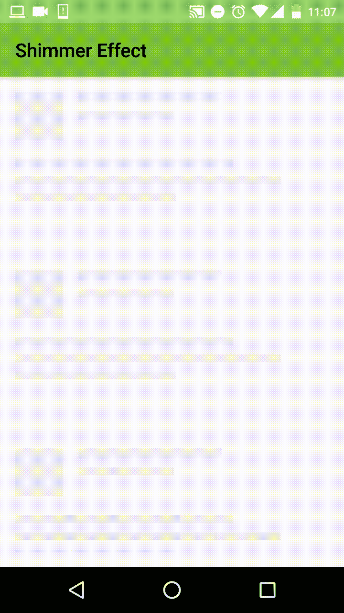
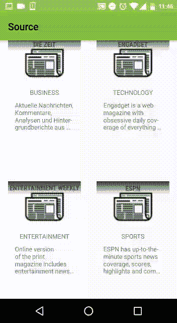

# Today I Learned Series : Android Content Placeholder Using Shimmer Effect

> 原文：<https://medium.easyread.co/today-i-learned-series-android-content-placeholder-using-shimmer-effect-f7fbd1d0af86?source=collection_archive---------2----------------------->

## Part of [Today I Learned Series](https://medium.com/easyread/today-i-learned/home) in Easyread


Today I Learned from Google Images Search

Kemarin, salah seorang teman memberikan sebuah artikel menarik mengenai bagaimana menambahkan *Shimmer* *Effect* pada aplikasi android. Biasanya kita menggunakan *spinner* sebagai tampilan saat aplikasi ingin menampilkan data dari jaringan *remote* . *Nah* , penggunaan *Shimmer Effect* ini akan memberikan kita tampilan khusus seperti yang digunakan oleh aplikasi *Facebook* saat akan menampilkan data.


Shimmer Effect from Facebook

Sebelumnya saya sudah pernah mencoba menambahkan efek tersebut pada aplikasi yang saya bangun, akan tetapi hasil yang saya harapkan tidak sesuai dengan semestinya. Dan saya pun menghentikan percobaan saya. Tetapi ketika melihat artikel tersebut, sedikit berbeda dengan yang saya lakukan sebelumnya, saya jadi kepikiran untuk mengikutinya. Lagian tidak ada yang salah saat mencoba kembali, *bukan* ? Dan *taaaraaa* , saya berhasil, lalu saya berkeinginan untuk membagikan apa yang saya pelajari pada hari ini.

# 1\. Facebook’s Shimmer Library

Seperti yang disebutkan sebelumnya, *shimmer effect* ini akan memberikan kita tampilan *loading* seperti yang ada di aplikasi *Facebook* . Untuk menambahkan efek ini, kita perlu menambahkan *shimmer library* yang dimiliki *facebook* ini kedalam aplikasi kita.

```
// Shimmer
compile 'com.facebook.shimmer:shimmer:0.1.0@aar'
```

# 2\. Menampilkan Shimmer Effect

Setelah menambahkan *library* ke file *build.gradle* aplikasi kita. Sekarang kita akan menampilkan *shimmer effect* diaplikasi kita. Pertama-tama, mari kita membuat sebuah file *xml* yang akan menjadi *placeholder shimmer* kita. Saat mendesign *placeholder* tersebut, akan lebih baik jika mirip dengan tampilan dari data yang akan kita tampilkan.

Setelah membuat *placehoder* tampilan untuk *shimmer effect* kita, sekarang kita akan menambahkan *shimmer layout* pada *activity* kita. Dan mengaktifkannya pada *activity* kita.



# 3\. Menampilkan Data

Setelah berhasil menampilkan *shimmer effect* pada aplikasi kita, sekarang kita akan mengganti *shimmer effect* tersebut dengan data yang telah kita dapat dari *remote* . Pertama kita perlu menambahkan *view* apa yang sebenarnya akan kita tampilkan dibawah *shimmer* *layout* tadi.

```
<FrameLayout
    android:layout_width="match_parent"
    android:layout_height="match_parent"
    app:layout_behavior="@string/appbar_scrolling_view_behavior">

    <com.facebook.shimmer.ShimmerFrameLayout
        android:id="@+id/shimmer_view_container"
        android:layout_width="wrap_content"
        android:layout_height="wrap_content"
        android:layout_gravity="center"
        android:orientation="vertical"
        shimmer:duration="800">

        <!-- Adding 3 rows of placeholders -->
        <LinearLayout
            android:layout_width="match_parent"
            android:layout_height="wrap_content"
            android:orientation="vertical">

            <include layout="@layout/recipe_placeholder_item" />

            <include layout="@layout/recipe_placeholder_item" />

            <include layout="@layout/recipe_placeholder_item" />

        </LinearLayout>

    </com.facebook.shimmer.ShimmerFrameLayout> <!-- Adding recycler view -->
    <android.support.v7.widget.RecyclerView
        android:id="@+id/list"
        android:layout_width="match_parent"
        android:layout_height="match_parent"/>

</FrameLayout>
```

Setelah menambahkan *view* pada *layout* , sekarang bagaimana mengganti *shimmer* *effect* tadi sesaat setelah kita mendapatkan data dari aplikasi kita. Caranya sama ketika kita ingin menampilkan data saat menggunakan *recycler view* dan *adapter* pada umumnya. Kita hanya perlu menambahkan mekanisme `**start**` dan `**stop**` *shimmer animation* pada aplikasi kita.

```
@Override
public void onResume() {
    super.onResume();
    // Start animation
    shimmerFrameLayout.startShimmerAnimation();
    // Load data
    presenter.start();
}

@Override
protected void onPause() {
    super.onPause();
    // Stop animation    
    shimmerFrameLayout.stopShimmerAnimation();
}

@Override
public void updateView(NewsResponse list) {
    // stop animating Shimmer and hide the layout
    shimmerFrameLayout.stopShimmerAnimation();
    shimmerFrameLayout.setVisibility(View.*GONE*);
    adapter.clearData();
    adapter.setItems(list.articles);
}
```

Maka setelah aplikasi kita jalankan kembali, maka akan muncul seperti ini



Setelah aplikasi telah berjalan sesuai keinginan, maka selamat, kita berhasil menambahkan *shimmer effect* pada aplikasi kita. Efek ini akan memberikan tampilan dan *experience* yang lebih baik kepada pengguna saat memakai aplikasi kita.

Untuk melihat lebih lanjut *code* pada aplikasi ini, kamu dapat melihatnya pada repository ini.

[](https://github.com/eminartiys/simple-app-android) [## eminartiys/simple-app-android

### simple-app-android - Simple Android App with MVP Pattern

github.com](https://github.com/eminartiys/simple-app-android) 

Atau kamu dapat melihat artikel asli pada [***link berikut***](https://www.androidhive.info/2018/01/android-content-placeholder-animation-like-facebook-using-shimmer/?utm_source=newsletter&utm_medium=email&utm_campaign=email_campaign) . Selamat mencoba 😃.