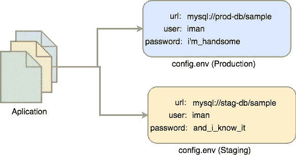

# Today I Learned Series: Twelve-Factor App

> 原文：<https://medium.easyread.co/today-i-learned-series-twelve-factor-app-af28b0d3fd45?source=collection_archive---------0----------------------->

## 12 Faktor Penting dalam Software Development — Part of [Today I Learned Series](https://medium.com/easyread/today-i-learned/home) in Easyread


Beberapa hari yang lalu, saya mengikuti sebuah *event* , yaitu **GDP Venture Tech Day.** Pada *event* tersebut, saya mengikuti salah satu topik yang merupakan bidang yang saya geluti yaitu tentang **Cloud Native Application with Spring Framework** . Presentasi ini dibawakan oleh **Nico** dan **Ivan** dari **GDPLabs** .


*Nah* , dari presentasi ini, hal paling penting yang saya pelajari adalah mengenai **The Twelve-Factor App** atau **12 Faktor Penting dalam Software Development** . Meskipun saya sudah sering melakukannya secara tidak sadar, akan tetapi saya baru mengetahui bahwa apa yang saya lakukan merupakan bagian dari hal tersebut setelah mendengar presentasi yang mereka bawakan.


Twelve Factor Application From Slide Presentation of Nico and Ivan

## Codebase

> One codebase tracked in revision control, many deploys

Saat membangun sebuah aplikasi, kita harus menggunakan satu *codebase* yang dapat di jalankan di semua *environment* . Beberapa contoh penggunaan *codebase* adalah penggunaan *git* , *svn* ataupun *version control* lainnya. Sehingga kita tidak akan bekerja seperti zaman dahulu memakai *flashdisk — copy — paste* .


Codebase bagan from Slide Presentation

## Dependencies

> Explicitly declare and isolate dependencies

*Software* yang baik adalah *software* yang jelas *dependencies management* -nya. Sehingga saat proses *deploy* ke server manapun kita tidak mengalami kewalahan. Contohnya, seperti `**package.json**` pada NPM di NodeJs atau `**Gemfile**` pada Ruby. Sehingga saat proses *deploy* , kita hanya tinggal menjalankan satu command `**npm install**` dan semua *dependencies* akan secara otomatis terinstall.

## Configuration

> Store config in the environment


Separation of config from Slide Presentation

Pada proses *Software Engineering Modern* , hal ini merupakan hal yang lumrah. Bagaimana agar aplikasi tersebut bisa *running* di *environment* yang berbeda-beda. Karena pada saat proses *development* *software* , semua aplikasi dan *source code* yang digunakan sama, yang berbeda adalah konfigurasinya seperti *Database* , *Server* , dsb.
Oleh karena itu saat proses *development* , kita tidak boleh menempatkan konfigurasi aplikasi kita secara *hardcode* di *source code* aplikasi kita, melainkan memisahkannya ke dalam file yang berbeda berdasarkan *environment* yang dibutuhkan.



Separation of config

Contohnya dapat dilihat pada gambar diatas. Dengan begini konfigurasi kita untuk setiap *environment* berbeda-beda.

## Backing Service

> Threat Backing Service as Attached Source

Maksudnya disini adalah, saat proses *development* aplikasi semua *service* yang terhubung dengan aplikasi kita harus kita perlakukan sebagai *source* yang dapat diganti dengan *service* sejenis. Jadi tidak bersifat *tighly-coupled* dan bergantung hanya pada satu *source* saja, melainkan dapat diganti dengan *source* yang berbeda.


Attached Source From Slide Presentation

Contohnya dapat dilihat dari bagan diatas. *Let’s say* , saya sudah mempunyai aplikasi komplit dan *running* di *production* . Tetapi karena suatu hal, misalnya *data store* yang saya gunakan yaitu *Mysql* , memiliki problem pada *hardware* atau server. *Nah* , dengan adanya *backing service* , saya tidak perlu melakukan *down server* tetapi saya hanya tinggal melakukan *switch* ke *data store* lainnya.

## Dev/Prod Parity

> Keep development, staging, and production as similar as possible

Saat proses *development* aplikasi, kita harus mengurangi/meminimalisir Gap, seperti *Time Gap, Personnel Gap,* dan *Tools Gap* .


Gap from Slide Presentation

*Time Gap* terjadi ketika *programmer* membangun aplikasi untuk di *release* ke *production* membutuhkan waktu berminggu-minggu atau bahkan berbulan bulan.

*Personnel Gap* terjadi ketika *programmer* membangun aplikasi tetapi yang melakukan proses *deploy* adalah DevOps yang tidak tahu-menahu tentang aplikasi. Sehingga dapat terjadi *gap* dan *misunderstanding* terkait beberapa *config* dan lain sebagainya.

*Tools Gap* terjadi ketika *programmer* mengembangkan aplikasi menggunakan *source* atau *tools* yang berbeda di *development stage* dengan yang ada di *production stage* . Misalnya ketika men *develop* di local, kita menggunakan *Mysql* sebagai *data store* . Namun ketika *release* ke production, kita menggunakan *PostgreSql* .

*Nah,* di pengembangan *modern software engineering* , problem ini sudah terselesaikan dengan adanya *Continues Deployment* . Buat mereka yang sudah mengimplementasikan *Continues Deployment* mungkin hal ini sudah biasa. Dengan *continues deployment* , gap yang terjadi dapat kita kurangi. Saat *code* dipush ke *codebase* (git), secara otomatis akan dilakukan *running test* dan *deploying on everywhere* .

## Processes

> Execute the app as one or more stateless processes

Maksudnya adalah aplikasi yang kita kembangkan harus bersifat *stateless* (tidak menyimpan *state* ). Segala data harus disimpan di *backing service* , bukan di aplikasi. Termasuk *cache* , file, dsb yang ada pada aplikasi sebaiknya di simpan di *backing service* . Kita harus memastikan saat aplikasi mengalami *restart* , maka segala proses yang sebelumnya terjadi sudah *clear* dan tidak bersisa di *disk* ataupun di memori aplikasi.

## Build, release, run

> Strictly separate build and run stages


Build, release and Run from slide presentation

Dalam proses *Software Engineering* berdasarkan 12 faktor *Software Development* , terdapat 3 tahapan saat membangun aplikasi.

*   **Build stage**
    Yaitu tahapan saat mem- *build* *source* *code* aplikasi menjadi *executable application* . Karena pembicara topik menggunakan Java, maka dari presentasi yang menjadi contoh ialah berawal dari *source* *code* java akan di *build* menjadi file jar.
*   **Release Stage**
    *Release stage* adalah tahapan dimana kita menyertakan *file* *configuration* sesuai *environment* yang kita gunakan
*   **Run Stage**
    *Run stage* adalah tahapan dimana aplikasi sudah jalan di *production* .

## Disposability

> Maximize robustness with fast startup and graceful shutdown

Faktor selanjutnya yang perlu diperhatikan saat membangun aplikasi adalah tentang *Disposability* . Yakni bagaimana agar aplikasi kita tersebut *fast start-up* ketika di *restart* . Serta cepat dan aman saat *shutdown* ( *graceful shutdown* )

## Port Binding

> Export services via port binding

Faktor berikut sudah sering kita lakukan saat *development* , khususnya saat membangun *web* yang bisa *standalone* *running* seperti NodeJS dan Golang. Kita hanya memilih beberapa *port* , maka aplikasi kita akan running di *port* tersebut sebagai *service* . Untuk PHP mungkin membutuhkan modul *Apache* *HTTPD* agar dapat *running* di *specific* *port*

## Concurrency

> Scale out via the process model


Faktor yang berikut adalah faktor yang lumayan lumrah untuk mereka yang pernah membangun aplikasi dengan *concurency* yang tinggi. Faktor berikut tentang bagaimana kita mengatur *concurency* dengan metode-metode seperti *Horizontal* *Scale* sesuai dengan *traffic* aplikasi. Seiring dengan kenaikan *trafic* , maka aplikasi kita akan melakukan *replicate* untuk kebutuhan *request* yang besar.

## Logs

> Treat logs as event streams

Faktor berikutnya yang perlu kita perhatikan adalah bagaimana memperlakukan *logs* dari aplikasi kita. Mungkin saat proses *development* dilocal, log tidak terlalu masalah jika diprint di `**stdout**` *console* saja. Namun saat sudah di *production* , kita harus menangani *logs* ini agar dapat di lihat bebas tanpa harus *ssh* ke terminal server.

## Admin processes

> Run admin/management tasks as one-off processes

Faktor yang terakhir adalah tentang bagaimana kita me- *manage* *task* - *task* yang bersifat *administratif* dan banyak. Contoh pada Golang. Untuk proses *build* kita harus melakukan beberapa *command*

```
$ dep ensure  #install dependencies
$ go test <package name>
$ go build -o service <package name> 
$ ./service
```

Nah saat melakukan step diatas pada *command* *line* tentu sangat melelahkan. Maka disarankan untuk melakukannya dengan satu proses saja. Untuk hal ini, kita bisa menggunakan `**Makefile**` , dan hanya dengan *command* `**make**` maka semua yang perlu dilakukan telah selesai.

# Conclusion

Berkat dari mengikuti acara ini, saya baru tahu apa yang saya lakukan selama ini ternyata sudah mengikuti The Twelve Factor Application. Masih banyak konsep-konsep tentang software engineering di luar sana yang masih belum penuh saya ketahui, baik sadar maupun tidak sadar. Namun dari acara ini saya belajar cukup banyak.

**Thanks to — Nico & Ivan**

**References** :
1\. GDP Labs Presentation by Nico and Ivan
2\. [https://12factor.net/](https://12factor.net/)

*If you have a different understanding, or concept, or just want to ask something, just put a response below. I will try to give my best.*