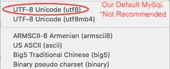
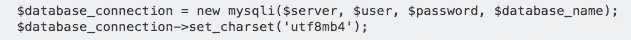

# Today I Learned: Store Emoji pada Mysql

> 原文：<https://medium.easyread.co/today-i-learned-store-emoji-pada-mysql-25b9937f5e5?source=collection_archive---------3----------------------->

## Bug sederhana yang cukup lucu tentang bagaimana menyimpan emoji di Mysql server


Hari ini saya dan team saya di [Kurio](http://kurio.co/article-feed) , baru mempelajari sebuah hal yang *sedikit lucu* berkaitan dengan proses *encoding charset* dan *collation* pada *Mysql* . Hal ini berawal saat salah satu dari *microservice* kami memiliki fungsi menyimpan data, dan data yang akan disimpan berbentuk emoji. Sekilas terlihat baik-baik saja, namun hal aneh justru terjadi.

```
// Data yang akan disimpan{
        "type": "text",
        "text": "😈🤠 Lorem Ipsum Dolor sit Amet 😱",
        "color": "#FFFFFF"
}
```

Saat menyimpan data tersebut ke dalam *database* , API kami justru mengembalikan pesan *error* yang cukup aneh, yaitu

```
"Number": 1366
"Message": "Incorrect string value: '\\xF0\\x9F\\x98\\x88 \\xF0...' for column 'text' at row 1"
```

*Nah,* sebenarnya hal di atas merupakan hal sederhana dan *sedikit lucu* , akan tetapi jika tidak diatasi dengan baik akan mengakibatkan hal yang bersifat fatal ataupun *crucial* . Secara khusus jika aplikasi kita nantinya akan memiliki banyak *encoding* khusus seperti karakter emoji lainnya.

# Antisipasi dan Solusi

Untuk mengatasi hal tersebut, saya dan tim melakukan 2 buah perubahan kecil, yakni:

*   Mengubah *encoding* *charset* dan *collation* *database* kami;
*   Mengubah *encoding charset* dan *collation* pada *connection driver* kami dari aplikasi (Golang) ke *Mysql* .

## Change Database Encoding Charset and Collation



Kami menggunakan *database* `Mysql 5.7`dengan *charset* `utf-8` sebagai *charset* default kami pada *Mysql* .

Setelah cukup lama mencari beberapa referensi di internet, kami akhirnya menemukan bahwa *issue* ini hanya terjadi pada `Mysql 5.3.3` ke atas. Hal ini disebabkan karena jika kita menggunakan *charset* `utf-8` pada *Mysql* versi tersebut, maka *charset* tersebut belum mendukung ( *support* ) semua *charset* `utf-8` secara umum. Sehingga saat melakukan proses penyimpanan karakter bersifat *unicode* seperti emoji, *Mysql* akan mengembalikan pesan *error* tersebut yang artinya *type* tidak didukung ( *not supported type* ). Sehingga untuk mengatasi hal ini, kami pun mengubah *encoding* dan *collation* *database* kami menjadi `utf8mb4` .

Berikut untuk perubahan keseluruhan database:

```
ALTER DATABASE
    database_name
    CHARACTER SET = utf8mb4
    COLLATE = utf8mb4_unicode_ci;
```

Untuk perubahan per table :

```
ALTER TABLE
    table_name
    CONVERT TO CHARACTER SET utf8mb4
    COLLATE utf8mb4_unicode_ci;
```

*Nah,* dengan begini, *database* kami seharusnya sudah mendukung format emoji secara keseluruhan. Namun saat kami melakukan *testing* , ternyata hal tersebut masih terjadi, dan tentu saja sedikit membingungkan.

## Change Connection Charset in Mysql Driver

Untuk *service* yang kami bangun, kami menggunakan Golang sebagai platform bahasanya, Golang 1.10 lebih jelasnya. Ternyata, setelah membaca beberapa *issue* di bahasa pemograman lain seperti PHP, Java, kita tidak hanya mengubah konfigurasi pada *database* saja, akan tetapi kita juga harus mengubah *charset* pada level aplikasi kita, *driver connection-* nya.



Contoh charset pada PHP

Untuk golang sendiri, karena kami menggunakan *package* `github.com/go-sql-driver/mysql` sebagai *driver* kami, maka kami harus menambahkan charset yang sesuai untuk *connection* kami.

**Before:**

```
dsn := `root:root@tcp(127.0.0.1 :3306)/DB_NAME?parseTime=1&loc=Asia%2FJakarta`dbConn, _:= sql.Open(`mysql`, dsn)
```

**After:**

```
dsn :=`root:root@tcp(127.0.0.1 :3306)/DB_NAME?parseTime=1&loc=Asia%2FJakarta**&charset=utf8mb4&collation=utf8mb4_unicode_ci`**dbConn, _:= sql.Open(`mysql`, dsn)
```

Setelah melakukan hal ini, akhirnya *bug* aneh yang *sedikit lucu* ini *solved* .

## Conclusion

*Error* dan *bug* ini sebenarnya tidak terlalu besar, namun jika tidak ditangani dengan baik maka akan bersifat fatal dan *crucial.* Terlebih jika penanganan *error* yang kita lakukan kurang tepat, contoh: Jika terjadi *error* kita secara langsung mengembalikan status `500: Internal Server Error` , ditambah jika kita membuat suatu *service* yang berhubungan dengan emoji, dan memiliki *load user* yang cukup banyak, maka akan terjadi keanehan dan *panic* yang cukup besar karena selalu mendapat *error* status `500: Internal Server Error` .

Namun, hari ini saya baru saja belajar mengenai betapa pentingnya untuk teliti memilih *encoding* dan hal-hal lainnya yang bersifat *configurable* pada *database* , terlepas dari jenis *database* yang digunakan (RDBMS or NoSQL).

**References:**

1.  Answer by Selvamani P in stackoverflow.com [https://stackoverflow.com/a/39465494](https://stackoverflow.com/a/39465494)
2.  Answer by Mathias Bynens in dba.stackexchange.com
    [https://dba.stackexchange.com/a/21684](https://dba.stackexchange.com/a/21684)