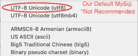

# 今天我学习了:用 Golang 将表情符号存储到 Mysql

> 原文：<https://medium.easyread.co/today-i-learned-storing-emoji-to-mysql-with-golang-204a093454b7?source=collection_archive---------0----------------------->

## 一个简单而愚蠢的故事，关于我们今天的小虫子。


monocle emoji from google image search

今天，我和我的团队在 [Kurio](http://kurio.co/article-feed) ，有一点有趣的时刻，但也有一些愚蠢的事情。当我们试图通过我们新的简单的 CRUD API 服务将表情符号存储到 Mysql 中时，就会发生这种情况。

我们正在制作一个供我们的内容团队使用的内部服务，只是一个简单的 CRUD。栈只是:Angular + Golang + Mysql。

这些服务已经部署到产品中，并且已经被我们的内容团队使用。一切正常，因为从 staging 到发布都已经测试过了。直到，当我们的一个内容团队开始存储一个项目到这个服务，有效载荷有一些表情符号。这时我们意识到这个愚蠢的错误。

有效载荷看起来更像这样:

```
{
        "type": "text",
        "text": "😈🤠 Lorem Ipsum Dolor sit Amet 😱",
        "color": "#FFFFFF"
}
```

并返回关于要存储的值不正确的错误。

```
"Number": 1366
"Message": "Incorrect string value: '\\xF0\\x9F\\x98\\x88 \\xF0...' for column 'text' at row 1"
```

幸运的是，这个服务是供我们的内容团队内部使用的，用户负载不是很大，所以还是可以忍受的😈。我无法想象如果我们把这个发布给真正的用户会发生什么。

# 解决问题

为了解决这个问题，我们做了几件与这个问题相关的事情。

*   更改数据库的字符集编码和排序规则
*   将连接驱动程序的字符集编码和排序从我们的应用程序(Golang)更改为 Mysql 服务器

## 更改数据库编码字符集和排序规则



our default charset before changed

我们使用 Mysql 5.7 并使用`utf-8`作为我们的字符集。在我们修复此问题后，不推荐使用此选项。

所以解决方案是，我们将我们的字符集和排序规则改为`utf8mb4`，因为 Mysql 中的`utf-8`通常不完全支持所有的`utf-8`编码。如果我们想要一个完全支持所有`utf-8`的通用，我们必须使用`utf8mb4`。

要更改整个数据库的字符集和排序规则:

```
ALTER DATABASE
    database_name
    CHARACTER SET = utf8mb4
    COLLATE = utf8mb4_unicode_ci;
```

要更改整个特定表的字符集和排序规则

```
ALTER TABLE
    table_name
    CONVERT TO CHARACTER SET utf8mb4
    COLLATE utf8mb4_unicode_ci;
```

所以在做了这个之后，我们认为我们已经解决了我们的问题。但是，在我们再次测试之后，我们仍然没有修复它。它仍然返回同样的错误。

## 更改 Mysql 驱动程序中的连接字符集

看了更多的文章和 stackoverflow 等论坛的一些问答。不仅仅是数据库，我们还需要改变连接的驱动字符集和排序规则。因为我们开发的这个服务是基于 Golang (1.10)构建的，并且我们使用包`github.com/go-sql-driver/mysql`作为我们的驱动程序，所以我们只需要对我们的 dsn 做一些修改。

**之前:**

```
dsn := `root:root@tcp(127.0.0.1 :3306)/DB_NAME?parseTime=1&loc=Asia%2FJakarta`dbConn, _:= sql.Open(`mysql`, dsn)
```

**之后:**

```
dsn :=`root:root@tcp(127.0.0.1 :3306)/DB_NAME?parseTime=1&loc=Asia%2FJakarta**&charset=utf8mb4&collation=utf8mb4_unicode_ci`**dbConn, _:= sql.Open(`mysql`, dsn)
```

嗯，这样做了之后，现在我们的服务运行良好，可以接受任何表情符号字符。

## 结论

这个 bug 不算太大，说实话，是个傻傻的搞笑 bug。但是看起来每个人都掉进过这个陷阱😥。但是今天我学到了一些东西，我们在创建数据库时应该小心，不管它是什么类型(RDBMS，NoSQL)

**参考文献:**

1.  stackoverflow.com 塞尔瓦曼尼 P 的回答【https://stackoverflow.com/a/39465494 
2.  dba.stackexchange.com 的 Mathias Bynens 的回答
    https://dba.stackexchange.com/a/21684 的 T5

如果你觉得这篇文章有用，或者读起来有趣，请分享到你的网络圈子，或者你可以鼓掌帮助其他人达到这个目的。如果你有任何问题，请在下面回复。