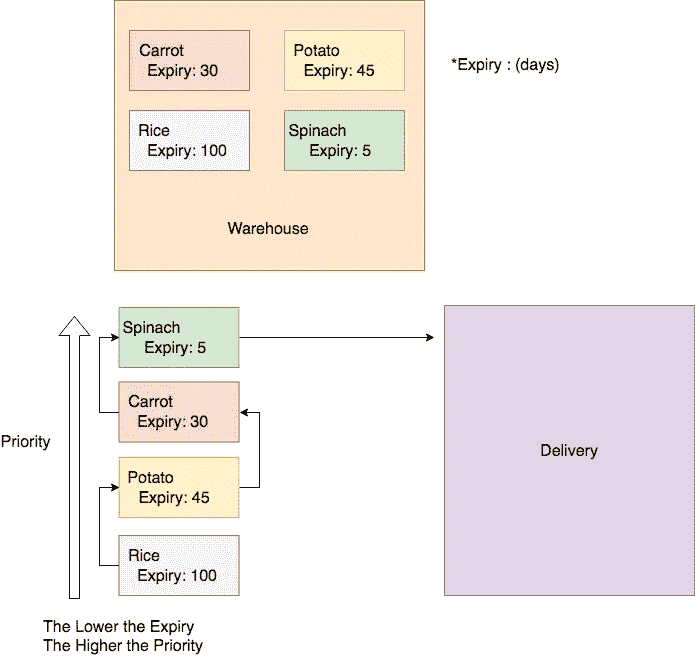

# 今天我学习了:在 Golang 中使用优先级队列

> 原文：<https://medium.easyread.co/today-i-learned-using-priority-queue-in-golang-6f71868902b7?source=collection_archive---------2----------------------->

## 非常简单，我们可以直接使用它，而不用考虑如何制作/创造它。

优先级队列是我们管理数据流的方式之一。就编程而言，我们知道两种控制数据流方法。

*   后进先出法:一种组织数据或处理数据的方法，其中最后或最新的数据将首先被处理。在编程和数据结构中，我们也称之为堆栈。
*   先进先出
    一种组织数据的方法，其中第一个数据或最老的数据将首先被处理。在编程和数据结构中，我们称之为队列。现实生活中的例子:当你在餐馆点餐时，第一个点餐的人会先被招待。

优先级队列是队列的一种，但有优先级或加权。这个我就不细说了，你可以从网上了解一下。

那么如何在 Golang 中实现这一点呢？

因此，从我的实际情况出发，在我当前的项目中，我必须使用优先级队列编程模式。例如，假设这个项目是关于对容易过期的商品进行库存管理。

假设我们有一个仓库，里面有:30 天后过期的胡萝卜，45 天的土豆，100 天的大米，以及只能用 5 天的菠菜。因此，要交付这些项目，我们必须注意它们的到期时间，为了避免到期，显然我们将从最短的到期时间到最长的到期时间交付货物。

因此订单将:

*   菠菜
*   胡萝卜
*   马铃薯
*   米

Example How Priority Queue In Real Case

再来一次，如何把这个落实到 Golang？我们知道，对于一些人来说，包括我在内，有时需要花很多时间思考，如何以编程方式设计 Linkedlist 和 queue。因为这可能很难，所以需要更多地了解如何以编程方式构造数据。

## 在 Golang 中实现优先级队列

幸运是，Golang 提供了一个包来帮助我们实现实际项目案例的优先级队列，不管是什么情况。我们只是用自己的`struct`实现提供的`interface`。

这个包叫做:`container/heap`，这个包已经有内置的逻辑，我们只需要实现我们的 struct 的接口函数。

例如，对于上述情况，在库存管理中。我们可以根据这里的到期时间进行优先级排队。

感谢 Golang maintainer，因为创建优先级队列只需要一点点工作。所以我们不需要再想太多，如何手动创建优先级队列。

嗯，就这些。对于一些人来说，可能已经认识到这个包，但对我来说，我只是知道它。这真的很有帮助。当然，今天我学到了一些新东西。

如果你觉得这篇文章有用，或者读起来有趣，请分享到你的网络圈子，或者你可以鼓掌帮助其他人达到这个目的。如果你有任何问题，请在下面回复。