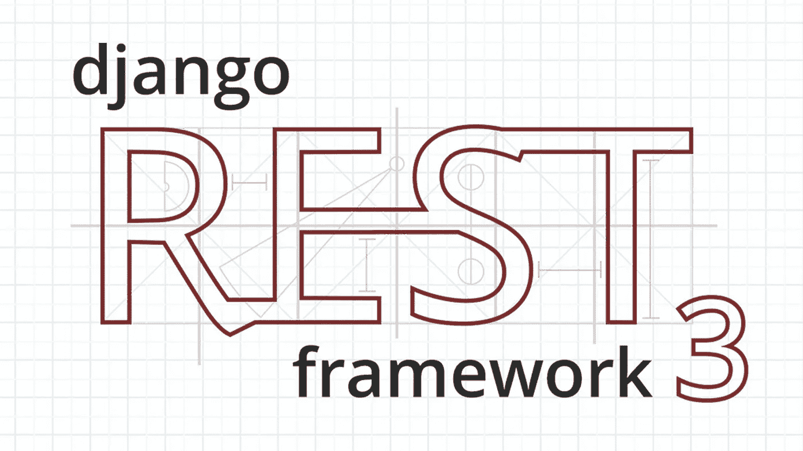
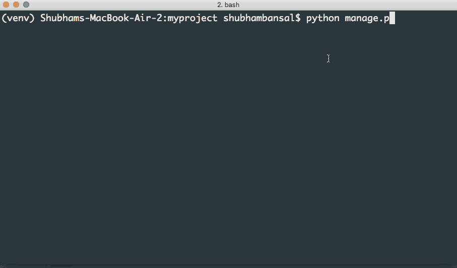
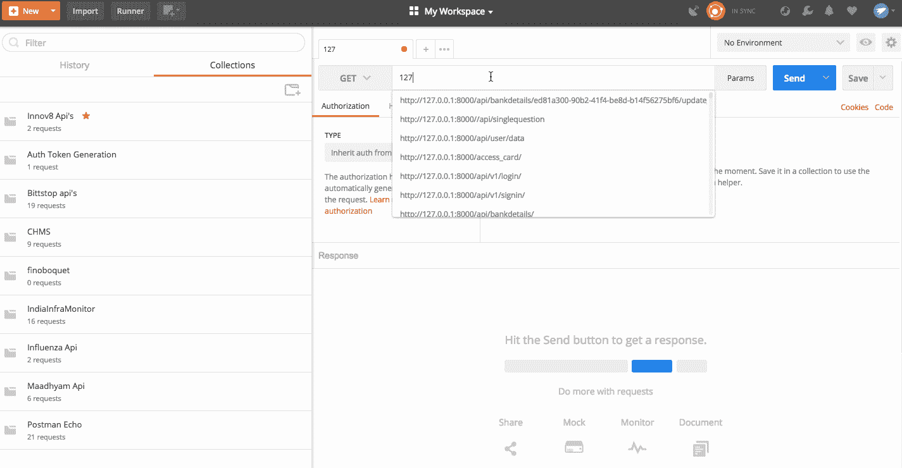
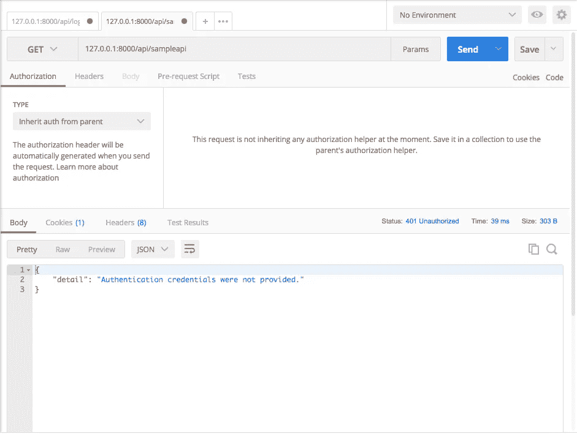
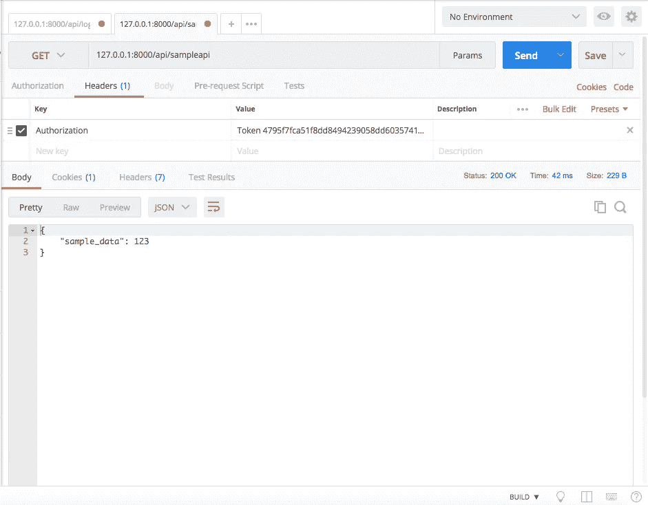

# Django Rest 框架基于令牌的认证

> 原文：<https://medium.com/quick-code/token-based-authentication-for-django-rest-framework-44586a9a56fb?source=collection_archive---------0----------------------->

Django 是基于 python 的流行的 web 开发框架，有一个很大的社区，目前被很多顶级网站使用。Django Rest Framework 是 Django 用来开发 rest api 的最流行的 python 包之一，它使得从身份验证到响应等一切事情变得非常简单。目前使用的一些认证是:-

1.  基本认证
2.  令牌身份验证
3.  会话身份验证
4.  远程用户认证

这些都是由 drf(django rest framework)提供的，除了 oauth 之外，基于 oauth2 的认证是由社区在其他 python 包的帮助下提供的。并且它们可以很容易地在生产环境中使用。所以，让我们从 Django 中基于主要目标令牌的认证开始。

我们要遵循这些步骤

1.  安装 Django
2.  制作 Django 项目
3.  安装 Django Rest 框架
4.  设置登录功能和 api 路径
5.  测试登录 api 路由
6.  使用令牌访问经过身份验证的 Api

# 安装 Django

确保你的 pc 上安装了 python 3，pip，virtualenv(Django 2.0 版本已经去掉了对 python 2.x 版本的支持)。如果您已经在系统上安装了 django，那么您可以跳过这些步骤，直到创建项目。

创建一个项目文件夹，并从文件夹内的终端运行命令

> Virtualenv 为 python 包提供了虚拟环境，因此它不会损害你的全局包版本

然后激活虚拟

如果它被激活，您将看到(venv)写在命令的开头。现在安装 Django

# 制作姜戈项目

现在我们已经在我们的 virtualenv 中安装了 django 的最新版本，现在在同一个文件夹中创建一个项目

将创建一个 myproject 文件夹，其中包含一个 manage.py 文件和一个包含 settings.py 的 myproject 文件夹，settings . py 包含项目的所有设置。

# 安装 Django-rest-framework

现在我们将安装 django rest 框架。Django rest framework 是一个构建在 Django 之上的库，用于制作 rest api。你可以使用 django 的自定义函数来创建 api，但是你会错过一些安全异常或者一些状态或者基础问题。Django rest 框架已经考虑了这些问题。所以使用前不用担心。此外，它还包含我们将要实现的基于令牌的身份验证。学习 Django 很容易，它可以帮助你快速构建 web 应用程序。

> 在 http://www.django-rest-framework.org/的[获取更多关于 django-rest-framework 的信息](http://www.django-rest-framework.org/)

安装 django rest 框架

为 rest 框架和基于令牌的身份验证更新 settings.py 文件

我们在已安装的应用程序中添加了两个东西 rest_framework 和 rest_framework.authtoken

也请在 settings.py 文件中为 rest_framework 做如下配置

该配置旨在更改 rest 框架的默认身份验证和权限类。我们已经非常接近我们的最终目标了。

# 设置登录功能和 api 路径

现在我们编写登录函数，它返回与用户相关联的令牌，并使用。

在 myproject 文件夹中创建一个 views.py

在这里，我们创建了一个登录函数，它处理 POST 请求并获取用户名和密码作为参数，然后验证它们是否正确，如果正确则返回令牌，否则返回 not found 响应。

现在在 urls.py 中创建相同的 api 路由

用我们的函数映射/API/登录路径。

现在，是测试登录 api 的时候了。但在此之前运行迁移

# **测试登录 api 路径**

在测试登录 api 路径之前，我们必须创建一个用户，您可以使用管理面板或命令行来创建用户，我更喜欢使用命令行。

现在使用 runserver 运行 python 应用程序，让我们使用 postman 测试 api。Postman 是测试 rest api 的非常好的工具。你可以在这里下载[。](https://chrome.google.com/webstore/detail/postman/fhbjgbiflinjbdggehcddcbncdddomop?hl=en)

让我们看看如何在 postman 中测试 api

我们在响应中获取 auth 令牌，这个令牌在头中用于调用经过身份验证的 api。让我们制作一个经过身份验证的示例 api，然后尝试使用令牌访问该 api。在 views.py 文件中添加以下内容

在 urls.py 中添加相同的路由

# 使用令牌访问经过身份验证的 Api

现在，我们尝试在没有或有令牌的情况下访问示例 api，并首先在没有令牌的情况下查看响应

我们被阻止了，现在让我们使用授权令牌

耶，它的工作，我们能够访问认证的 api。

因此，您最终学会了如何在 Django 中实现基于令牌的认证。

请参考[**https://github . com/shubhambansal 1997/token-authentic ation-django**](https://github.com/ShubhamBansal1997/token-authentication-django)查看代码。如果你发现任何错误，请在评论中提出。

❤制造

**小费不胜感激！💰 😉**

**我的比特币地址**:BC 1 qysxlz 0 p 9 nlcyndeysqltdhelwpdhurglgxz 96 x

**我的以太坊地址**:0x 42 c98 e 296 b 27228d 9 ee 84 e 519 be c8 E0 d 09 CAD 30