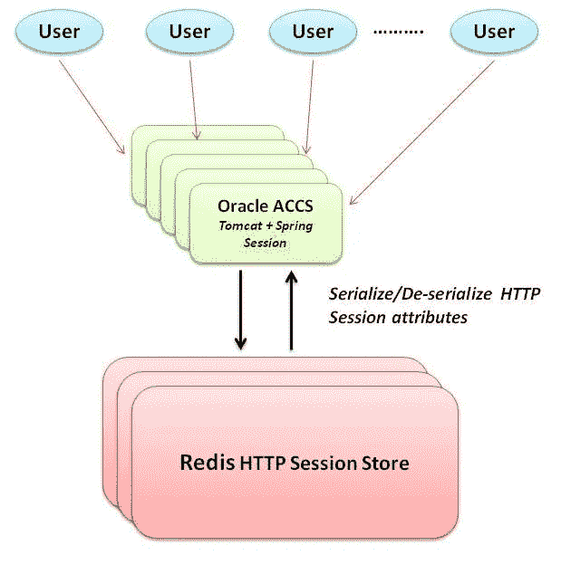

# 在 Oracle Cloud 上运行具有 Redis 会话持久性的 Tomcat 集群

> 原文：<https://medium.com/oracledevs/tomcat-cluster-on-oracle-cloud-with-http-session-persistence-89a97b38d13b?source=collection_archive---------0----------------------->

这篇博客展示了在 [**Oracle 应用程序容器云**](https://cloud.oracle.com/en_US/application-container-cloud) 上的一个集群 Tomcat 应用程序

*   [**Redis**](http://redis.io) 用作(HTTP)会话存储(与 **Spring Session**
*   使用[**Oracle Developer Cloud**](https://cloud.oracle.com/en_US/developer-service)中的 CI/CD 特性将其部署在 **Oracle 应用容器云**上

我们将关注 HTTP 会话管理(Tomcat 集群上的应用程序)及其实现方面

*   **持久化** —使用 Redis 支持的存储，该存储可配置为刷新(持久化)到磁盘
*   **无状态** —非粘性会话管理
*   **高可用性**——只要我们至少有一个活动节点，一个(应用程序)节点的故障就不会影响会话数据(因此也不会影响用户)
*   **可扩展性** —应用程序可以在不影响用户/会话数据的情况下进行扩展(水平或垂直)

# HTTP 会话持久性

## 雄猫

它支持(开箱即用的实现)内存和持久 HTTP 会话存储

*   **内存中**:配置 Tomcat 使用`org.apache.catalina.ha.tcp.SimpleTcpCluster`实现
*   **持久化**:使用文件或 JDBC 存储来持久化 HTTP 会话信息

## Oracle 应用程序容器云中的 Tomcat HTTP 会话存储支持

Tomcat 的内存模式和持久模式都受支持

*   **内存中**:这是由于 Oracle 应用容器云中的[多播支持](https://docs.oracle.com/en/cloud/paas/app-container-cloud/dvcjv/preparing-clustered-application-deployment.html)而成为可能。详情请查看本教程
*   **持久存储**:您可以使用 [Oracle 数据库云](https://cloud.oracle.com/en_US/database)(或者任何其他可以使用 JDBC 访问的 RDBMS)作为持久 HTTP 会话存储。这个也有[教程](http://www.oracle.com/webfolder/technetwork/tutorials/obe/cloud/apaas/java/tomcat-mysql-cluster/tomcat-mysql-cluster.html#overview)！

# 解决方案详细信息

为了实现集群化 Tomcat 应用程序的持久 HTTP 会话存储，我们有几个选择

1.  扩展 Tomcat 特定的接口/类(例如`org.apache.catalina.session.ManagerBase`)或者使用现有的插件，例如 [Redisson 对 Tomcat 的支持](https://github.com/redisson/redisson/wiki/14.-Integration-with-frameworks#145-tomcat-redis-session-manager)

2.构建/使用更通用的解决方案——理想情况下与运行时无关

## Oracle 应用容器云上的 Spring 会话和 Redis 组合

这篇博客展示了第二种选择。它使用了基于 Redis 的 [Spring Session](http://docs.spring.io/spring-session/docs/1.3.1.RELEASE/reference/html5/) 的实现

*   基于`Servlet` 规范——因此是容器中立的，也就是说，它可以适用于任何符合`Servlet` 规范的容器(除了 Tomcat)
*   一个定制的`Servlet Filter` 实现，负责强制使用 Spring Session `HTTPSession` 实现



High level overview

项目在这里[可用](https://github.com/abhirockzz/accs-tomcat-redis-springsession)——就业务逻辑而言，它只包含

*   一个简单的 HTTP `Servlet`
*   启用 Redis 的(Spring)配置类
*   另一个实用程序类，确保 Servlet 过滤器为每个 HTTP 请求服务

# 应用程序打包

我们遵循`bring-your-own-runtime`咒语。代码库具有以下结构

*   源代码(`src` 目录)
*   Tomcat 8.x ( `tom-accs`目录)
*   引导脚本(`start.sh`)

```
#!/bin/bash
if [ -z “$PORT” ];
then
 PORT=”8080"
fi
echo “PORT set to $PORT”
# Update server.xml with env vars
sed “s/__PORT__/${PORT}/g” server.template.xml > tom-accs/conf/server.xml
sh tom-accs/bin/catalina.sh run
```

> 除了 Tomcat 启动脚本调用之外，start.sh 脚本确保在应用程序启动期间生成具有正确环境变量的`server.xml`(在我们的例子中是 PORT)

*   (Tomcat) `server.xml` ( `server.xml.template`)的模板版本
*   `manifest.json` —强制部署描述符

```
{
 “runtime”:{“majorVersion”:”8"},
 “command”:”sh ./start.sh”,
 “notes”:”Tomcat on ACCCS with Redis Session Sharing”
}
```

# 设置

## Oracle 开发人员云

让我们为*持续构建*以及*部署*流程配置 Oracle 开发人员云。您可以参考以前的博客(这里将重点介绍这个例子的一些细节)

**参考文献**

*   在 Oracle 开发人员云中引导应用程序— [项目&代码库创建](https://community.oracle.com/community/cloud_computing/oracle-cloud-developer-solutions/blog/2017/05/25/getting-started-with-kafka-based-microservices-using-oracle-event-hub-cloud-application-container-cloud-developer-cloud#jive_content_id_Project__code_repository_creation)
*   持续集成设置— [配置构建作业](https://community.oracle.com/community/cloud_computing/oracle-cloud-developer-solutions/blog/2017/05/25/getting-started-with-kafka-based-microservices-using-oracle-event-hub-cloud-application-container-cloud-developer-cloud#jive_content_id_Configure_build_job)
*   部署设置— [持续部署(CD)到应用容器云](https://community.oracle.com/community/cloud_computing/oracle-cloud-developer-solutions/blog/2017/05/25/getting-started-with-kafka-based-microservices-using-oracle-event-hub-cloud-application-container-cloud-developer-cloud#jive_content_id_Continuous_Deployment_CD_to_Application_Container_Cloud)

## 构建作业配置

该应用程序的构建工作本质上是通用的，但是它有一些应用程序特定的细微差别(**构建步骤**)，这将在本节中重点介绍

**构建步骤#1** —调用 Maven 构建来生成所需的工件，即本例中的 WAR 文件


**构建步骤# 2**——将 WAR 文件复制到 Tomcat `webapps` 目录中，并将所有内容压缩(为最终的云就绪工件)


> *最终结果是一个****zip****文件，它由二进制文件(WAR 文件)以及运行时文件(Tomcat 安装)组成，它将在运行时执行*

## 提供 Oracle 应用程序容器云(配置)描述符

我们提供应用程序(规模)详细信息以及 Redis 坐标(主机和端口)


## Oracle 开发人员云中的部署确认


## **应用容器云中的部署后状态**


# 测试应用程序

让我们使用`[cURL](https://curl.haxx.se/)` 和`[redis-cli](https://redis.io/topics/rediscli)`工具来测试应用程序

## 第一次访问

我们将在我们的应用程序 URL 上调用一个`HTTP GET`

```
curl https://accs-tomcat-redis-<mydomain>.apaas.em2.oraclecloud.com/accs-tomcat-redis-spring/
```

*   这将创建一个新的 HTTP 会话—以绿色突出显示
*   注意处理请求的 ACCS 实例(绿色)


## 添加会话数据并访问应用程序

我们现在将使用上面接收到的会话 ID，将它与一个添加一些会话数据的请求一起传递——这是一个带有参数`name` 和`val` 的`HTTP POST`,它们存储在 HTTP 会话中

```
curl -X POST -H “Cookie: SESSION=09217ecb-6b90–41bf-952f-b41b65070fa2” “https://accs-tomcat-redis-<mydomain>.apaas.em2.oraclecloud.com/accs-tomcat-redis-spring/?name=k1&val=v1"
```

为了访问应用程序，我们执行`HTTP GET`操作，如步骤#1 中的 execute(以及头中的会话 ID*)*


> *注意，我们取回了在上一步*中添加的会话数据(以红色突出显示)

让我们使用`redis-cli`在 Redis 中查看我们的会话状态。对存储会话的 Redis `Hash` (数据结构)执行一个`HGETALL` 命令(散列名称是基于会话 ID 的预定格式)

```
<redis-host>:6379> hgetall spring:session:sessions:09217ecb-6b90–41bf-952f-b41b65070fa2
```


> *注意我们在上一步中添加的会话数据(键值对* ***k1*** *，* **， *v1*** *)，它以绿色突出显示*

## 添加更多数据，访问应用程序并检查 Redis

让我们冲洗并重复…

```
curl -X POST -H “Cookie: SESSION=09217ecb-6b90–41bf-952f-b41b65070fa2” “https://accs-tomcat-redis-<my-domain>.apaas.em2.oraclecloud.com/accs-tomcat-redis-spring/?name=abhishek&val=gupta"
```

在 **Redis、**中，您将看到新添加的会话数据(以红色突出显示)


您(显然)会看到应用程序中也反映了相同的会话数据—请注意以红色突出显示的 Oracle 应用程序容器云实例名称

*   随后的请求由不同的实例来满足，但是
*   会话数据是一致的，因为它是从持久性存储(Redis)中检索的


## 放大并再次访问应用程序

让*将*的实例数减少到 1 —详情请参考[文档](http://docs.oracle.com/en/cloud/paas/app-container-cloud/csjse/exploring-application-overview-page.html)


*   会话数据将保持一致
*   请求将由*相同的*应用程序容器云实例提供服务(我们现在只有一个)

## 添加会话数据(再次)

```
curl -X POST -H “Cookie: SESSION=09217ecb-6b90–41bf-952f-b41b65070fa2” “https://accs-tomcat-redis-<my-domain>.apaas.em2.oraclecloud.com/accs-tomcat-redis-spring/?name=accs&val=rocks"
```

**检查 Redis**——您将看到数据被持久化在那里

## 横向扩展、访问应用程序并检查 Redis

让我们回到我们的*双实例*拓扑——参考[文档](http://docs.oracle.com/en/cloud/paas/app-container-cloud/csjse/exploring-application-overview-page.html)了解如何向外扩展。你会看到的

*   在重复访问时，不同的应用程序容器云实例将服务于该请求
*   返回的应用程序会话数据将与上面相同
*   Redis 也将保持相同的状态

# 测试 CI/CD 流

做一些代码修改，推送给开发者云服务 Git repo。这应该

*   自动触发**构建**，一旦成功将
*   自动触发**部署**流程，以及
*   **将新的应用程序版本重新部署**到应用程序容器云

# 概述

结局好就一切都好！我们能够使用 Redis 和 Spring Session 为 Oracle 应用程序容器云上的 Tomcat web app 配置和实施无状态、可扩展、高度可用和持久的 HTTP 会话管理策略

# 不要忘记…

*   查看 Oracle 应用容器云的教程[——每个运行时都有一些内容！](https://docs.oracle.com/en/cloud/paas/app-container-cloud/create-first-applications.html)
*   [其他关于应用容器云的博客](http://bit.ly/2gR3nrV)

> 本文表达的观点是我个人的观点，不一定代表甲骨文的观点。