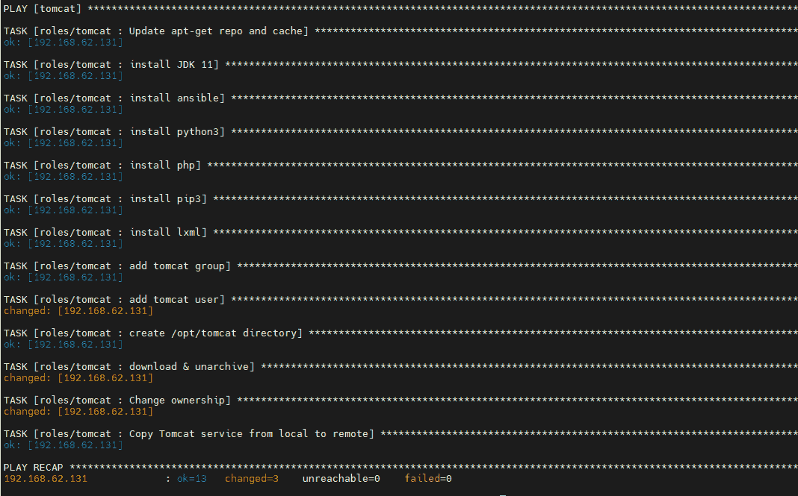

# Tomcat、Nexus 和 SonarQube 部署，采用基于角色的可行行动手册

> 原文：<https://medium.com/globant/tomcat-nexus-and-sonarqube-deployment-with-role-based-ansible-playbook-a0648a3232e4?source=collection_archive---------0----------------------->

# **简介**

在 IT 环境中，设置服务器并在服务器上安装应用程序是一项常规任务。开发人员需要 Tomcat 服务器来测试应用程序，或者 SonarQube 来扫描您的源代码，寻找潜在的错误、漏洞和可维护性问题，然后在报告中呈现结果，这将允许您识别应用程序中的潜在问题。此外，他们需要 Nexus 服务器将工件或代码存储在一个集中的存储库中。如果您尝试手动设置，整个过程需要时间。如果我们有一个简单的剧本来设置所有这些应用程序，那就太好了。

在本文中，我们将在各自的主机服务器上部署 Nexus、SonarQube 和 Tomcat 等应用程序。本文将帮助我们使用基于角色的可行行动手册在各自的服务器上安装端到端应用程序。你可以参考来自 [GithubLink](https://github.com/prakash189/Tomcat-Nexus-Sonarqube-Deployment-with-Role-Based-Ansible-Playbook.git) 的 Ansible 剧本代码。

# **章节**

本文将涵盖以下部分:

*   先决条件
*   可行的行动手册和角色
*   使用 Ansible 剧本创建 Nexus 服务器
*   使用 Ansible 剧本创建 SonarQube 服务器
*   使用 Ansible 剧本创建 Tomcat 服务器
*   测试
*   输出
*   参考

# **先决条件**

1.  客户端应该是 debian(Ubuntu 18.04)环境。
2.  虚拟机/客户端要求。

**a . sonar cube 服务器**
强烈建议 sonar cube 服务器使用 2 GB 内存，否则将无法启动 sonar cube 服务。

*   最低 CPUs 个
*   主机上的 RAM:2GB
*   操作系统:Ubuntu 18.04

**b. Nexus 服务器**

*   最低 CPUs 个
*   主机上的 RAM:2GB
*   操作系统:Ubuntu 18.04

**c. Tomcat 服务器**

*   最低 CPUs 个
*   操作系统:Ubuntu 18.04

3.对于此示例，将使用以下网络配置。请随意决定您的网络配置，并为您环境中的网络更换 IP。

*   雄猫:192.168.62.130
*   sonar cube:192 . 168 . 62 . 131
*   联系:192.168.62.132

4.主服务器:Jenkins 服务器/Ansible 服务器(192.168.62.129)，即 Jenkins/Ansible 服务器，您将从该服务器运行 Ansible 行动手册。

请参考[链接](https://www.digitalocean.com/community/tutorials/how-to-install-jenkins-on-ubuntu-18-04)在主服务器上安装 jenkins。

使用下面的命令在 jenkins 主服务器上安装下面的包。

```
$ sudo apt-get install python3$ sudo apt-get install python3-pip$ sudo apt-get install ansible
```

5.jenkins 服务器和客户端服务器之间的无密码认证。要配置密码验证，请执行以下步骤:

步骤 1:在 jenkins 服务器上为 Jenkins 用户创建认证 SSH-keygen 密钥。

```
$ sudo su - jenkins
```

步骤 2:使用下面的命令生成 ssh 密钥

```
$ ssh-keygen -t rsa
```


步骤 3:将 SSH 密钥上传到客户端服务器:

从 Jenkins 服务器使用 SSH，并在客户机服务器上的 ubuntu user /home/ubuntu/下上传新生成的公钥(id_rsa.pub)。ssh 目录作为一个名为 **authorized_keys** 的文件。用原来的 pem 密钥替换 aws.pem。

```
$ cat /var/lib/jenkins/.ssh/id_rsa.pub | ssh -i aws.pem ubuntu@192.168.62.130 “cat >> ~/.ssh/authorized_keys”
```

这里的 user="ubuntu "和 host="IP address "用于 SSH 远程登录。现在一切都准备好了，可以运行 Ansible-Playbook 了。

步骤 4:使用 jenkins 用户从 jenkins 服务器测试 SSH 无密码登录。

```
$ ssh ubuntu@192.168.62.130
```

# **可行剧本和角色**

角色为完全独立或相互依赖的变量、任务、文件、模板和模块集合提供了一个框架。在 Ansible 中，角色是将剧本分成多个文件的主要机制。

Ansible Playbook 是一个脚本文件，它包含需要执行的所有任务以及执行这些任务所需的所有要素。

**注意**:该活动应使用主服务器上的 jenkins 用户来执行。

**第一步:创建可负责的角色:**

一个角色有一个定义好的目录结构，有八个主要的标准目录。您必须在每个角色中至少包括其中一个目录。您可以省略角色不使用的任何目录。现在让我们为每个应用程序创建角色，比如 Nexus、SonarQube 和 Tomcat server。

使用 ansible 附带的 **ansible-galaxy** 命令行工具，您可以使用 **init** 命令创建一个角色。将目录名创建为角色，并在文件夹中运行下面提到的命令。

```
$ ansible-galaxy init nexus-server$ ansible-galaxy init sonarqube$ ansible-galaxy init tomcat
```

使用上面的命令创建角色后，让我们来看看最终确定的目录结构:

```
└── roles
├── nexus-server
│   ├── defaults
│   │   └── main.yml
│   ├── handlers
│   │   └── main.yml
│   ├── meta
│   │   └── main.yml
│   ├── tasks
│   │   ├── main.yml
│   ├── tests
│   │   ├── inventory
│   │   └── test.yml
│   └── vars
│       └── main.yml
├── sonarqube
│   ├── defaults
│   │   └── main.yml
│   ├── handlers
│   │   └── main.yml
│   ├── meta
│   │   └── main.yml
│   ├── tasks
│   │   ├── main.yml
│   │   ├── README.md
│   ├── tests
│   │   ├── inventory
│   │   └── test.yml
│   └── vars
│       └── main.yml
└──tomcat
├── defaults
│   └── main.yml
├── handlers
│   └── main.yml
├── meta
│   └── main.yml
├── tasks
│   ├── main.yml
├── tests
│   ├── inventory
│   └── test.yml
└── vars
└── main.yml
```

**第二步:创建 main.yml 和 hosts 文件**

让我们在根目录位置创建 main.yml 和 hosts 文件，其中包含与用户、变量文件、处理程序和主机相关的信息，以及要执行的各个角色的详细信息。

```
├── hosts
├── main.yml
```

您可以参考[**GithubLink**](https://github.com/prakash189/Tomcat-Nexus-Sonarqube-Deployment-with-Role-Based-Ansible-Playbook.git)**中的 Ansible 剧本代码。**

首先将用户更改为 jenkins 用户，然后可以在 jenkins 服务器上使用以下命令克隆 github 存储库。

```
$ sudo su jenkins$ git clone [https://github.com/prakash189/Tomcat-Nexus-Sonarqube-Deployment-with-Role-Based-Ansible-Playbook.git](https://github.com/prakash189/Tomcat-Nexus-Sonarqube-Deployment-with-Role-Based-Ansible-Playbook.git)
```

**main.yml:** 这个 yml 文件包含了与运行**脚本的主机和角色相关的信息。您可以使用 ansible galaxy 命令更改已创建的角色名称。**

```
---- hosts: nexus
  gather_facts: false
  become: yes
  become_method: sudo
  remote_user: ubuntu
  vars_files:
  - roles/nexus-server/vars/main.yml
  handlers:
  - include: roles/nexus-server/handlers/main.yml
  roles:
  - role: roles/nexus-server- hosts: sonarqube
  gather_facts: false
  become: yes
  become_method: sudo
  remote_user: ubuntu
  vars_files:
  - roles/sonarqube/vars/main.yml
  handlers:
  - include: roles/sonarqube/handlers/main.yml
  roles:
  - role: roles/sonarqube- hosts: tomcat
  gather_facts: false
  become: yes
  become_method: sudo
  remote_user: ubuntu
  vars_files:
  - roles/tomcat/vars/main.yml
  handlers:
  - include: roles/tomcat/handlers/main.yml
  roles:
  - role: roles/tomcat
```

**主机:**该主机文件将包含要部署应用程序的服务器的信息。让我们为所有服务器创建清单文件。用您的应用服务器详细信息替换服务器 IP 地址。

**注意:**远程主机服务器应该是 ubuntu 18.04。

```
[tomcat]192.168.62.130 ansible_connection=ssh ansible_user=ubuntu ansible_private_key_file=/var/lib/jenkins/.ssh/id_rsa ansible_python_interpreter=/usr/bin/python3[sonarqube]192.168.62.131 ansible_connection=ssh ansible_user=ubuntu ansible_private_key_file=/var/lib/jenkins/.ssh/id_rsa ansible_python_interpreter=/usr/bin/python3[nexus]192.168.62.132 ansible_connection=ssh ansible_user=ubuntu ansible_private_key_file=/var/lib/jenkins/.ssh/id_rsa ansible_python_interpreter=/usr/bin/python3
```

# **使用 Ansible 剧本创建 Nexus 服务器(**服务器 1)

**实施步骤:**

您需要遵循使用 Ansible galaxy 命令创建的目录结构来在 Nexus 服务器上部署应用程序。

```
├── hosts
├── main.yml
├── README.md
└── roles
├── nexus-server
│   ├── defaults
│   │   └── main.yml
│   ├── handlers
│   │   └── main.yml
│   ├── meta
│   │   └── main.yml
│   ├── tasks
│   │   ├── main.yml
│   ├── tests
│   │   ├── inventory
│   │   └── test.yml
│   └── vars
│       └── main.yml
```

**第一步:编辑 tasks/main.yml**

让我们编辑剧本文件并在 **tasks/main.yml** 文件中添加所需的包和安装配置，以便在 ubuntu server 18.04 上部署 Nexus server。这个 tasks/main.yml 文件将安装 java 1.8 版本，并创建 Nexus 用户，下载 Nexus 的包，并在服务器上启动应用程序。您可以参考来自 [GithubLink](https://github.com/prakash189/Tomcat-Nexus-Sonarqube-Deployment-with-Role-Based-Ansible-Playbook/tree/main/roles/nexus-server) 的 Ansible 剧本代码。

**第二步:编辑 vars/main.yml**

让我们将变量添加到变量文件中，该文件将包含 tasks/main.yml 文件中引用的变量参数。

**vars/main.yml**

```
---nexus_url: [https://download.sonatype.com/nexus/3/latest-unix.tar.gz](https://download.sonatype.com/nexus/3/latest-unix.tar.gz)nexus_user: nexusnexus_group: nexusnexus_dir: /opt/nexussonar_type_dir: /opt/sonatype-worknexus_rc_file: /opt/nexus/bin/nexus.rcservice_file_location: /etc/systemd/system/nexus_service_loc: /opt/nexus/bin/nexus
```

**第三步:编辑 handlers/main.yml**

处理程序是特殊的任务，只有通过 main.yml 调用的 notify 指令触发时才会执行。参考 tasks/main.yml 文件中的 notify 模块。因此，让我们创建包含服务相关信息的处理程序文件。这个处理程序文件负责与服务相关的任务。

**处理程序/main.ym** l

```
---- name: start nexus service
  service:
    name: nexus
    state: started
    enabled: true
    daemon_reload: true
```

# **使用 Ansible 剧本创建 SonarQube 服务器(**服务器 2)

**实施步骤:**

要在 SonarQube 服务器上部署应用程序，您需要遵循使用 Ansible galaxy 命令创建的目录结构。

```
├── hosts
├── main.yml
├── README.md
└── roles
├── sonarqube
│   ├── defaults
│   │   └── main.yml
│   ├── handlers
│   │   └── main.yml
│   ├── meta
│   │   └── main.yml
│   ├── tasks
│   │   ├── main.yml
│   │   ├── README.md
│   ├── tests
│   │   ├── inventory
│   │   └── test.yml
│   └── vars
│       └── main.yml
```

**第一步:编辑 tasks/main.yml**

让我们编辑 **tasks/main.yml** 文件，该文件将用于下载 sonar cube 包并安装在 sonar cube 服务器上，它还将安装 postgresql 数据库并创建 postgres 数据库，用户还将添加启动 sonar cube 服务所需的虚拟最大内存。你可以参考来自 [GithubLink](https://github.com/prakash189/Tomcat-Nexus-Sonarqube-Deployment-with-Role-Based-Ansible-Playbook/tree/main/roles/sonarqube) 的 Ansible 剧本代码。

tasks/main.yml 文件准备就绪后，在 tasks 文件夹中创建 sonar cube 服务和 sonar cube 属性文件，这两个文件将分别包含与服务启动/停止和 postgresql 用户、数据库和 URL 详细信息相关的信息。

**tasks/sonar.properties:** 添加 PostgreSQL 用户、密码和 URL 详情**。**

```
sonar.jdbc.username=sonarqubesonar.jdbc.password=admin@123sonar.jdbc.url=jdbc:postgresql://localhost/sonarqube
```

**tasks/sonar.service:** 更新环境段中的 java_home 路径位置，SonarQube 服务开始和停止路径分别在 Execstart，Execstop 位置。

```
[Unit]Description=SonarQube serviceAfter=syslog.target network.target[Service]Type=forkingEnvironment=JAVA_HOME=/usr/lib/jvm/java-1.11.0-openjdk-amd64ExecStart=/home/ubuntu/sonarqube-9.1.0.47736/bin/linux-x86–64/sonar.sh startExecStop=/home/ubuntu/sonarqube-9.1.0.47736/bin/linux-x86–64/sonar.sh stopUser=ubuntuGroup=ubuntuRestart=alwaysLimitNOFILE=131072LimitNPROC=8192[Install]WantedBy=multi-user.target
```

**第二步:编辑 vars/main.yml**

让我们编辑变量文件，该文件将包含 main.yml 文件中引用的变量参数。如下所述，添加数据库用户、数据库名称、数据库用户密码和其他详细信息。

**vars/main.yml**

```
---db_user: sonarqubedb_name: sonarqubedb_password: admin@123sonarquebe_url: https://binaries.sonarsource.com/Distribution/sonarqube/sonarqube-9.1.0.47736.zipsonarquebe_dir: /home/ubuntu/sonarquebe_pro_location: /home/ubuntu/sonarqube-9.1.0.47736/confsonarquebe_user: ubuntusonarquebe_group: ubuntudir_location: /home/ubuntu/sonarqube-9.1.0.47736
```

**第三步:编辑 handlers/main.yml**

处理程序是特殊的任务，只有通过 main.yml **调用的 notify 指令触发时才会执行。**参考 tasks/main.yml 文件中的 notify 模块。因此，让我们创建包含服务相关信息的处理程序文件。这个处理程序文件负责与服务相关的任务。

**handlers/main.yml**

```
---- name: Start and enable sonar service
  systemd:
    name: sonar.service
    state: restarted
    enabled: true
    daemon_reload: true- name: Start PostgreSQL service
  service:
    name: postgresql
    state: started
    enabled: yes
```

# **使用 Ansible 剧本创建 Tomcat 服务器(**服务器 3)

**实施步骤:**

您需要遵循使用 Ansible galaxy 命令创建的目录结构来在 Tomcat 服务器上部署应用程序。

```
├── hosts
├── main.yml
├── README.md
└── roles
└── tomcat
├── defaults
│   └── main.yml
├── handlers
│   └── main.yml
├── meta
│   └── main.yml
├── tasks
│   ├── main.yml
├── tests
│   ├── inventory
│   └── test.yml
└── vars
└── main.yml
```

**第一步:编辑 tasks/main.yml**

让我们编辑 **tasks/main.yml** 剧本，它将包含在 Tomcat 主机上安装 Tomcat 的所有任务。第一项任务是使用 apt 命令更新您的系统包，进一步创建 Tomcat 用户和组。下一个任务是安装 java，安装 Tomcat，并为 Tomcat 目录创建必要的文件夹和权限。你可以参考来自 [GithubLink](https://github.com/prakash189/Tomcat-Nexus-Sonarqube-Deployment-with-Role-Based-Ansible-Playbook/tree/main/roles/tomcat) 的 Ansible 剧本代码。

让我们在 tasks 文件夹中创建 Tomcat 服务文件，这将有助于使用 Ansible Playbook 启动和停止服务。

**tasks/Tomcat.service:**

```
[Unit]Description=Apache Tomcat Web Application ContainerAfter=network.target[Service]Type=forkingEnvironment=JAVA_HOME=/usr/lib/jvm/java-1.11.0-openjdk-amd64Environment=CATALINA_PID=/opt/tomcat/temp/tomcat.pidEnvironment=CATALINA_HOME=/opt/tomcatEnvironment=CATALINA_BASE=/opt/tomcatEnvironment=’CATALINA_OPTS=-Xms512M -Xmx1024M -server -XX:+UseParallelGC’Environment=’JAVA_OPTS=-Djava.awt.headless=true -Djava.security.egd=file:/dev/./urandom’ExecStart=/opt/tomcat/bin/startup.shExecStop=/opt/tomcat/bin/shutdown.shUser=tomcatGroup=tomcatUMask=0007RestartSec=10Restart=always[Install]WantedBy=multi-user.target
```

**第二步:编辑 vars/main.yml**

让我们编辑变量文件，该文件将包含 main.yml 文件中引用的变量参数。

**注意:**检查工作中的 **Tomcat 最新 URL** 并添加 Tomcat_url 位置，否则将无法在服务器上安装 Tomcat。

**vars/main.yml** :

```
---tomcat_user: tomcattomcat_group: tomcattomcat_dir: /opt/tomcattomcat_url: [http://apache.cs.utah.edu/tomcat/tomcat-9/v9.0.59/bin/apache-tomcat-9.0.59.tar.gz](http://apache.cs.utah.edu/tomcat/tomcat-9/v9.0.59/bin/apache-tomcat-9.0.59.tar.gz)tomcat_service_location: /etc/systemd/system/tomcat_home_dir: /usr/share/tomcat
```

**第三步:编辑 handlers/main.yml**

处理程序是特殊的任务，只有通过 main.yml 调用的 notify 指令触发时才会执行。参考 tasks/main.yml 文件中的 notify 模块。所以让我们创建包含服务相关信息的处理程序文件。这个处理程序文件负责与服务相关的任务。

**handlers/main.yml**

```
---- name: Start and enable Tomcat service
  systemd:
    name: tomcat
    state: started
    enabled: true
    daemon_reload: true- name: Start and enable Tomcat service
  systemd:
    name: tomcat
    state: restarted
    enabled: true
    daemon_reload: true
```

# **测试**

一旦所有的 Ansible 剧本都准备好了，使用下面的 Ansible 命令从根目录运行剧本，所有其他的工作文件夹都存在使用 jenkins 用户。

```
$ sudo su jenkins$ git clone [https://github.com/prakash189/Tomcat-Nexus-Sonarqube-Deployment-with-Role-Based-Ansible-Playbook.git](https://github.com/prakash189/Tomcat-Nexus-Sonarqube-Deployment-with-Role-Based-Ansible-Playbook.git)$ ansible-playbook -i hosts main.yml
```

本文将帮助您使用基于角色的可行行动手册在服务器上安装 Tomcat、SonarQube 和 Nexus 应用程序。

# **输出**

您可以参考运行 ansible 行动手册后应该得到的输出。



# **参考文献**

[https://docs.SonarQube.org/latest/setup/install-server/](https://docs.sonarqube.org/latest/setup/install-server/)

[https://www . geeks forgeeks . org/how-to-install-Apache-Tomcat-8-on-Linux/](https://www.geeksforgeeks.org/how-to-install-apache-tomcat-8-on-linux/)

[https://www . how to forge . com/how-to-install-sonar qube-on-Ubuntu-1804/](https://www.howtoforge.com/how-to-install-sonarqube-on-ubuntu-1804/)

[https://docs.SonarQube.org/latest/setup/install-server/](https://docs.sonarqube.org/latest/setup/install-server/)

[https://www . how to forge . com/how-to-install-and-configure-Nexus-repository-manager-on-Ubuntu-20-04/](https://www.howtoforge.com/how-to-install-and-configure-nexus-repository-manager-on-ubuntu-20-04/)