# 2021 年十大数据科学认证——成为数据科学家的必经之路！

> 原文：<https://medium.com/edureka/top-10-data-science-certifications-in-2021-scientist-fb643f186dc6?source=collection_archive---------0----------------------->

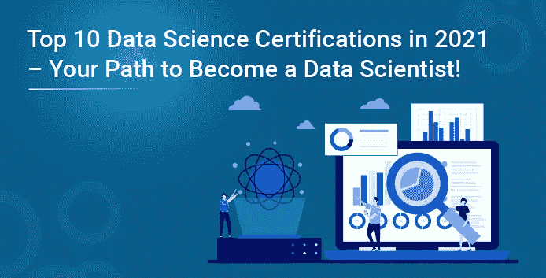

财富 500 强企业越来越依赖于数据，并渴望聘用能够理解企业收集的信息的数据专业人士。数据科学认证是获得优势的一个很好的方式，因为它们允许你验证你的技能，所以招聘人员知道如果他们雇用你，他们会得到什么。以下博客旨在让您快速了解 2021 年十大数据科学认证！

在本博客课程中，我们将讨论以下数据科学认证:

# 2021 年十大数据科学认证

*   认证分析专家
*   戴尔 EMC 数据科学认证方向(EMCDS)
*   SAS 认证数据科学家
*   微软认证:Azure 数据科学家助理
*   Cloudera 认证助理(CCA)数据分析师
*   Cloudera 认证专家(CCP)数据工程师
*   亚马逊 AWS 数据分析认证
*   谷歌专业数据工程师认证
*   美国数据科学委员会(DASCA)高级数据科学家(SDS)
*   开放认证数据科学家(开放 CDS)

如果你是视觉学习者，你也可以参考我们关于 2021 年十大数据科学认证的视频演示！

这个 edu reka 2021 年十大数据科学认证视频将首先给出一些关于如何选择证书课程的提示。然后，我们将讨论 2021 年十大数据科学认证

所以，事不宜迟，让我们开始列出 2021 年十大数据科学认证。

# 1.认证分析专家(CAP)

首先是认证分析专家认证考试。 [CAP](https://www.certifiedanalytics.org/) 是面向分析从业者的顶级全球专业认证。如果你达到了 CAP 的高标准，并通过了严格的考试，你将会享受到一种待遇，因为你将会打开有利可图的职业机会之门。该认证专为处于职业生涯早期到中期的分析专业人士设计。

## 要求

作为申请人，您需要满足一些要求:

*   具有 5 年专业分析经验的学士学位或具有 3 年经验的硕士学位
*   签署道德准则

## 技能

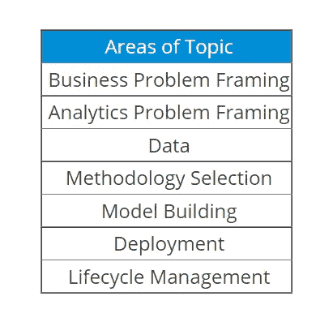

## 利益

获得该认证有几个好处，即:

*   展示可信度
*   增强技能组合
*   向新机遇敞开大门

# 2.戴尔 EMC 认证专家认证计划

戴尔 EMC 数据科学家助理(EMCDSA)是一项基础认证，让您了解大数据和数据分析的基础知识。一旦你通过了这项数据科学家认证，你就被认为是“认证专家”。现在，经理和招聘人员很清楚，作为一名数据科学家，你拥有他们想要的必要技能。

## 要求

该认证考试的一些要求如下:

*   计算机科学、信息技术、电信、电子电气或其他相关领域的学士学位
*   通过以下助理级别考试:DEA-7TT2 助理-数据科学和大数据分析 v2 考试

## 技能

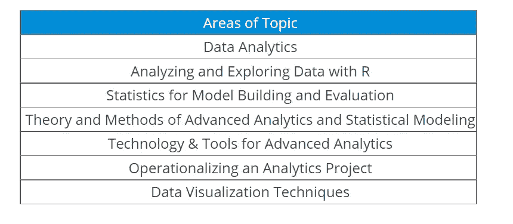

## 利益

戴尔 EMC 数据科学助理认证考试具有很高的市场价值，因为它提供了以下优势:

*   专注于可应用于所有 IT 环境的技术
*   基于角色的培训
*   学习关注新兴运营的新 IT 技术

让我们继续 2021 年十大数据科学认证中的下一个认证。

# 3.SAS 认证数据科学家

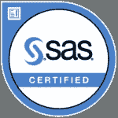

SAS 认证数据科学家认证专为能够处理大数据并从中获得洞察力的个人而设计。现在，通过各种 SAS 和开源工具，您可以使用复杂的机器学习模型提出业务建议，然后使用灵活的 SAS 环境部署模型。

## 要求

以下给出的要求不是强制性的，但从考试的角度来看非常重要:

*   具有 SAS 编程基础和数据操作技术的经验
*   SQL 处理经验
*   至少 6 个月的数学和统计学经验

## 技能

因此，该认证与其他认证非常不同，因为 SAS 数据科学学院包括三个项目，即:

*   数据监管
*   高级分析和
*   AI 和 ML

## **话题领域**

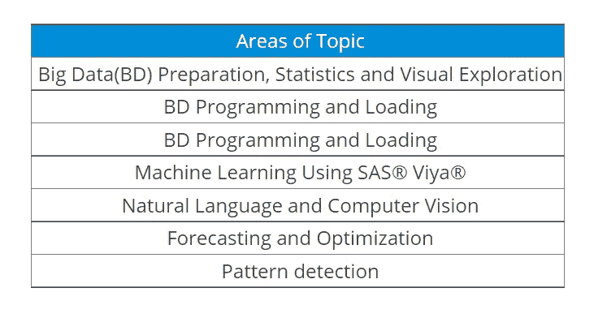

## **好处**

人们可以从该认证中获得一些好处，其中包括:

*   学习使用 SAS、R、Python、Pig、Hive 和 Hadoop
*   实践学习
*   全球公认的证书
*   综合训练
*   真实案例研究

# 4.微软认证:Azure 数据科学家助理

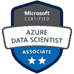

名单上的下一个是 Azure 数据科学家助理微软认证。在这里，Azure 数据科学家应用他们的数据科学和机器学习知识，在 Azure 云平台上实现和运行机器学习工作负载。这里，你特别使用 Azure 机器学习服务栈。

## 要求

除了通过 DP-100:在 Azure 考试上设计和实施数据科学解决方案之外，没有特定的先决条件来获得该认证。

## 技能

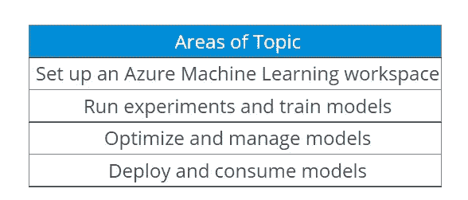

## 利益

作为助理级认证，获得 Azure 数据科学家助理证书虽然具有挑战性，但会为您赢得认可，证明您是该领域的主题专家。

现在让我们来看看 2021 年十大数据科学认证名单中的下 5 个认证，

# 5.Cloudera 认证助理(CCA)数据分析师

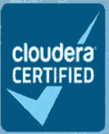

数据分析师认证表明您可以在 Cloudera 的 CDH 环境中准备、构建和分析数据。您将能够从 MySQL 向 Hadoop 导入数据，创建和修改表，并使用 select 和 join 查询生成报告。

## 要求

CCA 数据分析师的候选人可以是 SQL 开发人员、数据分析师、商业智能专家、开发人员、系统架构师和数据库管理员。没有先决条件。

## 技能

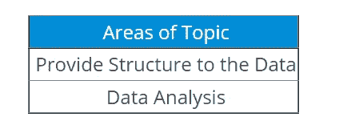

## 利益

对精通数据分析领域的专业人员的需求不断增加，这使得这一认证更加可取。这项考试有以下好处-

*   提高就业能力
*   承诺职业发展
*   更高的薪水

我们在这个名单上还有另一个 Cloudera 认证！请继续阅读本博客的下一部分，了解详情。

# 6.Cloudera 认证专家(CCP)数据工程师

CCP 数据工程师证明您可以“开发可靠、自主、可扩展的数据管道，为各种工作负载优化数据集。”换句话说，你可以这么说:CCP 数据工程师展示了你可以将数据整理成一个清晰、有用的形状，供不同的人用于不同的目的。

## 要求

CCP 数据工程师的候选人应具有开发数据工程解决方案的丰富经验，并高度掌握上述技能。没有其他先决条件。

## 技能

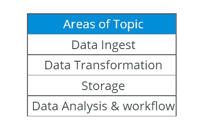

## 利益

CCP 项目让你在一个严格的现场实践环境中展示你的技能。为了帮助您提升技能，每位 CCP:数据工程师都会收到:

*   certification.cloudera.com 上的一个独特的个人资料 URL，用于向你的雇主或潜在雇主宣传你的技能和成就，并集成到 LinkedIn 中
*   名片、简历和在线简介的 CCP 标志

# 7.亚马逊 AWS 数据分析认证

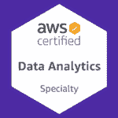

AWS 认证数据分析专业(DAS-C01)考试面向以数据分析为重点的人员。该考试旨在验证考生对使用 AWS 服务来设计、构建、保护和维护分析解决方案的全面理解，这些解决方案可提供来自数据的洞察力。

## 要求

该认证考试的一些要求如下:

*   至少 5 年常用数据分析技术的经验
*   至少 2 年 AWS 实际操作经验
*   与 AWS 服务合作设计、构建、保护和维护分析解决方案的经验和专业知识

## 技能

在这里，您将在 5 个不同的领域接受测试，每个领域占您总得分的百分比。

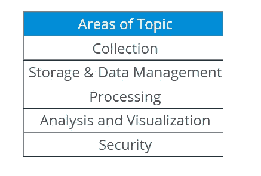

## 利益

人们可以从该认证中获得一些好处，其中包括:

*   技能验证
*   AWS 高薪
*   数字徽章
*   在全球范围内获得聘用
*   特别活动

# 8.谷歌专业数据工程师认证

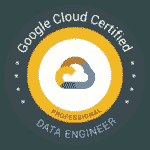

通过谷歌云数据工程认证，你可以向世界展示你是使用谷歌云构建数据驱动解决方案的专家。随着公司收集大量数据，对能够在云中构建数据解决方案的熟练专业人员的需求也在增加。而且没有比手里拿着证书更好的证明自己有技能的方法了。

## 要求

为了充分利用本课程，学员应具备以下基本能力:

*   结构化查询语言
*   计算机编程语言
*   数据建模
*   机器学习/统计

虽然不是强制性的，但要求您对这些概念有一些基本的了解。

## 技能

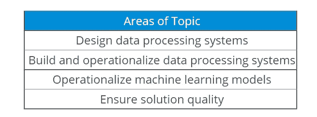

接下来，让我们来看看这项认证的一些好处。

# 利益

获得谷歌数据工程师认证并不是一个困难的过程，但对你在 IT 行业的职业生涯和工作有意义的影响。这是一个有益于雇员和雇主的良好记录，包括:

*   增强知识
*   你不断学习的证明
*   全球认可
*   更好的机会

就这样，让我们来看看博客中的下一个认证。

**9。美国数据科学委员会(DASCA)高级数据科学家(SDS)**

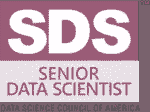

美国数据科学委员会(DASCA)推出的 SDS 加速了您成为数据科学家的旅程。SDS 是世界上最强大的第三方、供应商中立的认证，面向现在正在寻找更具挑战性、影响更大的数据科学家和数据架构师角色的数据科学和分析专业人士。

继续本博客的下一部分，我们将看到你获得该认证的各种标准。

# 要求

如果你是一名经验丰富的活动家，在领先的大数据分析或科学职能部门工作了 5 年以上，你就适合获得数据科学家证书。您需要至少拥有信息技术/计算机科学的本科/学士学位，或商业/管理/统计/经济/数学的本科/学士学位，或计算机编程/软件工程的文凭，或认证机构的商业/管理文凭。

现在，我们将了解您通过此次认证考试所需的技能。

# 技能

话题领域

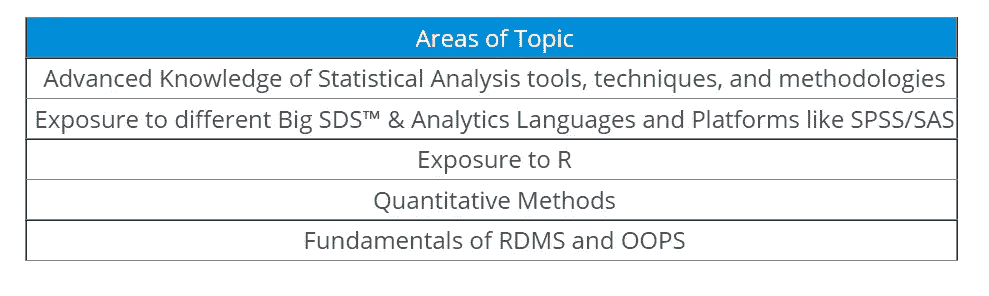

**好处**

这是该计划的各种好处，其中一些是:

*   涵盖了官方的 DASCA 预备包，广泛的课程，注册，更新和升级的简单过程
*   它将帮助你思考高级咨询或产品管理需要什么
*   你可以巩固数据立方体、多维数据库和大数据框架的知识能力

# 10.开放认证数据科学家(开放 CDS)

开放集团认证数据科学家(Open CDS)认证是根据 IT 部门的要求开发的，旨在验证数据科学家专业人员是否具备有效分析数据以全面改善业务所需的素质和能力。

现在，让我们检查一下需求。

# 要求

认证是由相应领域公认的行业专家通过基于经验的概况评估授予的，因此不需要考试。

# 技能

开放 CDS 认证要求申请人通过书面申请和同行面试，根据一套合规要求展示技能和经验。不需要参加培训课程，也不需要完成笔试。

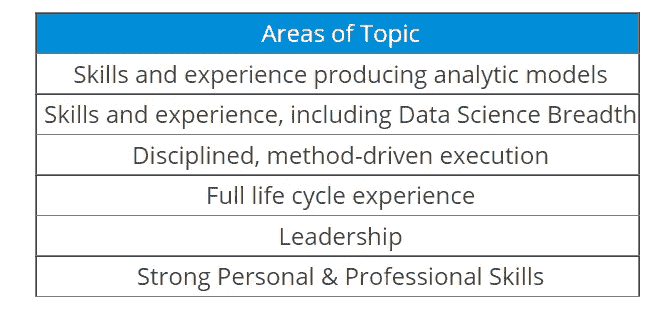

这项认证对个人和整个组织都有好处！

# 利益

对个人而言，福利如下:

*   提高和证明专业技能
*   改善奖励任务的前景
*   加快薪资和职业发展
*   导致更高的同行认可度

对组织而言，它有助于:

*   优化员工招聘和保留流程
*   激励员工获得这一广泛认可的开放行业标准，以证明他们的技能和经验

这就是 2021 年十大数据科学认证的全部内容。希望这篇文章对你有用。请继续关注本系列即将发布的文章！您还可以了解更多关于 2021 年 IT 行业十大认证的信息，以明确您想要从事的职业。

有问题吗？请在这篇文章的评论部分提到它，我们会尽快回复你。

要深入了解任何 DevOps、大数据、网络安全和其他趋势技术，您可以注册我们的实时在线认证培训计划，该计划提供全天候支持和终身访问课程材料。

如果你对这个话题有任何疑问，请在下面留下评论，我们会尽快回复你。如果你想查看更多关于 Python、DevOps、Ethical Hacking 等市场最热门技术的文章，你可以参考 Edureka 的官方网站。

请留意本系列中解释数据科学各个方面的其他文章。

> *1。* [*数据科学教程*](/edureka/data-science-tutorial-484da1ff952b)
> 
> *2。* [*数据科学的数学与统计*](/edureka/math-and-statistics-for-data-science-1152e30cee73)
> 
> *3。*[*R 中的线性回归*](/edureka/linear-regression-in-r-da3e42f16dd3)
> 
> *4。* [*数据科学教程*](/edureka/data-science-tutorial-484da1ff952b)
> 
> *5。*[*R 中的逻辑回归*](/edureka/logistic-regression-in-r-2d08ac51cd4f)
> 
> *6。* [*分类算法*](/edureka/classification-algorithms-ba27044f28f1)
> 
> *7。* [*随机森林中的 R*](/edureka/random-forest-classifier-92123fd2b5f9)
> 
> *8。* [*决策树中的 R*](/edureka/a-complete-guide-on-decision-tree-algorithm-3245e269ece)
> 
> *9。* [*机器学习简介*](/edureka/introduction-to-machine-learning-97973c43e776)
> 
> *10。*[*R 中的朴素贝叶斯*](/edureka/naive-bayes-in-r-37ca73f3e85c)
> 
> 11。 [*统计与概率*](/edureka/statistics-and-probability-cf736d703703)
> 
> *12。* [*如何创建一个完美的决策树？*](/edureka/decision-trees-b00348e0ac89)
> 
> *13。* [*关于数据科学家角色的十大神话*](/edureka/data-scientists-myths-14acade1f6f7)
> 
> *14。*[*5 大机器学习算法*](/edureka/machine-learning-algorithms-29eea8b69a54)
> 
> *15。* [*数据分析师 vs 数据工程师 vs 数据科学家*](/edureka/data-analyst-vs-data-engineer-vs-data-scientist-27aacdcaffa5)
> 
> *16。* [*人工智能的种类*](/edureka/types-of-artificial-intelligence-4c40a35f784)
> 
> *17。*[*R vs Python*](/edureka/r-vs-python-48eb86b7b40f)
> 
> *18。* [*人工智能 vs 机器学习 vs 深度学习*](/edureka/ai-vs-machine-learning-vs-deep-learning-1725e8b30b2e)
> 
> *19。* [*机器学习项目*](/edureka/machine-learning-projects-cb0130d0606f)
> 
> *20。* [*数据分析师面试问答*](/edureka/data-analyst-interview-questions-867756f37e3d)
> 
> *21。* [*面向非程序员的数据科学和机器学习工具*](/edureka/data-science-and-machine-learning-for-non-programmers-c9366f4ac3fb)
> 
> *22。* [*十大机器学习框架*](/edureka/top-10-machine-learning-frameworks-72459e902ebb)
> 
> *23。* [*统计机器学习*](/edureka/statistics-for-machine-learning-c8bc158bb3c8)
> 
> *24。* [*随机森林中的 R*](/edureka/random-forest-classifier-92123fd2b5f9)
> 
> 25。 [*广度优先搜索算法*](/edureka/breadth-first-search-algorithm-17d2c72f0eaa)
> 
> *26。*[*R 中的线性判别分析*](/edureka/linear-discriminant-analysis-88fa8ad59d0f)
> 
> *27。* [*机器学习的先决条件*](/edureka/prerequisites-for-machine-learning-68430f467427)
> 
> 28。 [*互动 WebApps 使用 R 闪亮*](/edureka/r-shiny-tutorial-47b050927bd2)
> 
> *29。* [*机器学习十大书籍*](/edureka/top-10-machine-learning-books-541f011d824e)
> 
> 三十。 [*无监督学习*](/edureka/unsupervised-learning-40a82b0bac64)
> 
> *31.1* [*0 本数据科学最佳书籍*](/edureka/10-best-books-data-science-9161f8e82aca)
> 
> *32。* [*监督学习*](/edureka/supervised-learning-5a72987484d0)

*原载于 2019 年 8 月 7 日*[*https://www.edureka.co*](https://www.edureka.co/blog/regularization-in-machine-learning/)*。*