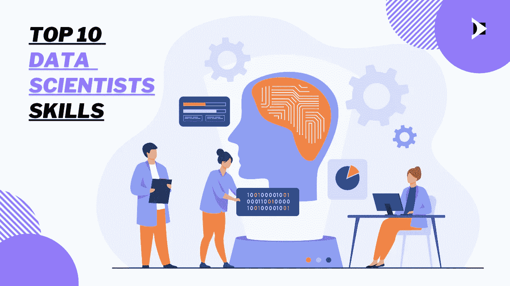

# 你应该知道的 10 大数据科学家技能

> 原文：<https://medium.easyread.co/top-10-data-scientist-skills-you-should-know-f22a90c3e4f2?source=collection_archive---------1----------------------->

## 成为数据科学家所需的技能

## 数据科学是为了谁？

数据科学是一种跨学科的方法，可以从当今组织庞大且不断增长的数据中获得有用的见解。为分析和处理准备数据，进行高级数据分析，展示结果以揭示趋势，以及允许利益相关者做出明智的决策，这些都是数据科学的一部分。数据科学是一门学科，它结合了领域知识、编程能力以及数学和统计知识，以从数据中提取有用的见解。

## 数据科学是当今最迷人的学科之一。但是，为什么它如此重要呢？

因为企业坐拥大量数据。随着当代技术促进了不断增长的数据量的创建和存储，数据量已经扩大。据估计，世界上 90%的数据是在过去两年中创建的。例如，脸书用户每小时发布 1000 万张图片。

这些技术收集和保存的大量数据有可能彻底改变世界各地的企业和社区——但前提是我们能够理解这些数据。这就是数据科学的用武之地。

数据科学识别模式并生成洞察，企业可以利用这些模式和洞察做出更明智的决策并开发更具创新性的产品和服务。或许最重要的是，它允许机器学习(ML)模型从提供给它们的海量数据中学习，而不是仅仅依靠业务分析师来从数据中找出他们可以做的事情。

[数据科学](https://www.oracle.com/in/data-science/what-is-data-science/)对于合格的个人来说，仍然是最有前途和最受欢迎的职业道路之一。因此，这是二十一世纪最赚钱的职业。

## 数据科学家是做什么的？

Data Scientist Skills

在过去十年中，数据科学家已经成为几乎每个公司不可或缺的资产。这些专业人士是全面发展的数据驱动型个人，拥有先进的技术能力，能够构建复杂的定量算法来组织和综合大量数据，以回答问题并推动公司的战略。这与向整个公司或组织的众多利益相关者提供切实成果所需的沟通和领导技能相结合。

数据科学家与业务利益相关者密切合作，了解他们的目标以及数据如何帮助他们实现这些目标。他们构建算法和预测模型来提取业务所需的数据，以及帮助、评估数据并与同行共享发现。虽然每个项目都是独特的，但数据科学家会执行以下步骤:
为了更好地理解问题，他们会提出适当的问题。
从各种来源收集业务需求和相关数据。
处理、清洗、整合、存储数据。
探索性数据分析(EDA)旨在找出如何处理缺失数据，并寻求趋势和/或可能性。
在探索阶段之后，清理后的数据将根据需求接受各种算法的处理，比如预测分析、回归、文本挖掘、模式识别等等。
使用出色的数据可视化和报告向管理层和 IT 团队传达预测和发现。
建议对现有程序和技术进行符合成本效益的变更。

# 成为数据科学家所需的技能

当今高效的数据专业人员认识到，他们必须超越传统的大规模数据分析、数据挖掘和编程能力。高效的数据科学家能够开发相关问题，从各种来源获取数据，组织数据，将结果转化为解决方案，并以有利于影响业务决策的方式展示他们的发现。因为几乎每个行业都需要这些人才，所以熟练的数据科学家对企业越来越有价值。

因此，在这篇文章中，我提到了你必须知道的 10 大[数据科学家技能](https://www.interviewbit.com/data-science-interview-questions/#what-is-data-science)。

## 1.数据科学基础

从整体上理解数据科学、机器学习和人工智能的原理是你需要的第一个也是最重要的人才。了解深度学习和机器学习之间的差异、术语和最常用的术语、监督学习和非监督学习之间的差异等问题。作为一名数据科学家，你需要了解流行的数据科学技术，如 Microsoft Excel、Python 或 R、Hadoop、Spark、Tableau 等。

## 2.机器学习

机器学习是任何一个数据科学家必备的能力。使用机器学习创建预测模型。例如，如果你想根据上个月的数据预测下个月你会有多少客户，你就需要使用机器学习技术。

大量数据科学家缺乏机器学习技术和主题方面的专业知识。神经网络、强化学习、对抗学习、时间序列、自然语言处理、离群点检测、计算机视觉、推荐引擎和其他技术都是这方面的例子。如果你想让自己从其他数据科学家中脱颖而出，你需要熟悉机器学习技术，包括监督机器学习、决策树和逻辑回归等。这些能力将帮助您根据重要的组织成果预测解决各种数据科学挑战。

## 3.概率与统计

数据科学是使用各种方法、算法或系统从数据中提取知识、见解并做出明智决策的过程。在这种情况下，得出结论、估计和预测都是数据科学的重要方面。

在创建高质量的模型之前，您需要理解统计学。机器学习从统计开始，不断进步。即使是线性回归的概念，也是一个由来已久的统计分析概念。

有必要理解描述统计学的概念，如均值、中位数、众数、概率分布、样本和总体、CLT、偏度和峰度，以及推断统计学，如假设检验和置信区间。

## 4.编程知识

这是数据科学家职位的必备技能之一。编写计算机程序和分析大量数据集以找到复杂问题的解决方案是编程的全部内容。数据科学家必须能够用各种语言编写代码，包括 Java、R、Python 和 SQL。

Python、R、Julia 各有各的一套优缺点。r 是一种统计分析和可视化语言，而 Python 是一种具有各种数据科学包和快速原型的通用编程语言。朱莉娅结合了两个世界的优点，同时速度也更快。

将原始数据转化为有用见解所需的所有核心技能都集中在《数据科学编程技能》中。

## 5.数据可视化

数据分析最重要的方面之一是数据可视化。以一种既易懂又赏心悦目的方式传达信息一直是至关重要的。为了更有效地与最终用户联系，数据科学家必须掌握的技能之一是数据可视化。

首先，在学习更高级的图表之前，您必须熟悉直方图、条形图和饼图等基本图表。在探索性数据分析阶段，这些图表非常有用。彩色图表使单变量和双变量研究更容易理解。

作为一名数据科学家，你需要能够使用 ggplot、d3.js、Matplotlib 和 Tableau 等工具可视化数据。这些工具将帮助您将复杂的项目成果转换成易于理解的格式。

它有助于确定影响客户行为的因素、季度销售计划、客户报告、人员表现，以及创建针对特定用户群的营销计划等。

## 6.大数据工具

人们应该具备 Apache Spark、Hadoop、Talend 和 Tableau 等大数据工具的工作知识，这些工具用于处理典型数据处理应用程序无法处理的大量复杂数据。

组织已经被如此大的数据量所淹没，他们试图通过快速采用大数据技术来处理数据，以便在需要时可以正确存储和使用数据，从而使他们比竞争对手更具优势。

## 7.深度学习

它是一种更高级的机器学习。深度学习模型现在正被每个公司使用，因为它们有能力克服标准机器学习方法的限制。神经网络的基础知识，用于创建深度学习模型(如 Tensorflow 或 Keras)的库，以及卷积神经网络、递归神经网络、RBM 和自动编码器的工作原理是数据科学家职位所需的其他能力。

深度学习让这一切变得可行。由于数据存储能力和计算能力的进步，它是人工智能领域的一个高增长领域。

要在这个领域取得成功，你必须对编程(最好是 Python)以及线性代数和数学有深刻的理解。您可以从开发基本模型开始，然后发展到更复杂的模型，如 CNN、RNN 等。

## 8.数据操作

数据操作是数据科学家最重要的能力之一。它需要改变和组织材料的过程，以使其更具可读性。

数据操作，通常被称为争论，是清理数据并将其转换为可以在后续阶段正确评估的格式的过程。

另一方面，数据处理和争论可能需要很长时间，但最终可以帮助您做出更好的数据驱动的判断。缺失值插补、异常值处理、校正数据类型、缩放和转换是一些常用的数据操作和争论技术。

## 9.软技能

寻找有能力的数据科学家的公司希望有人能够以清晰流畅的方式将他们的技术发现传达给非技术团队，如营销或销售部门。为了有效地管理数据，数据科学家必须通过为公司提供量化的见解以及了解非技术同事的需求来帮助公司做出决策。

数据科学家最重要的后天才能是讲故事。这是一种围绕数字构建连贯故事的技巧，能够传递逻辑，引起利益相关者的共鸣，并以足够的论据说服他们做出选择。

数据科学仍然在发展，让我告诉你一些重要的事情:在这个职业中，学习永无止境。前一天你掌握了工具，第二天就被更复杂的工具践踏了。数据科学家必须有好奇心和求知欲。

## 10.商业头脑

虽然 Python 编程、SQL 查询和数据可视化是数据科学家必备的基本技术能力，但对卓越商业头脑的需求怎么强调都不为过。为了彻底掌握业务挑战并构建解决方案，有必要具备特定于行业的知识。如果您在金融领域工作，有关规则的基本业务知识，如信用卡的最低年龄标准、监管机构定义的抵押贷款额度、合规性和法规、会计标准和风险管理知识等，都是特定于行业的知识。

你必须完全理解公司的主要目的和目标，以及它们如何影响你的工作。您还必须能够开发能够以经济高效、易于实施和广泛采用的方式实现这些目标的解决方案。

## 招聘人员在招聘时会寻找什么

招聘人员在寻找将长期为组织工作的数据科学家时，会寻找一组特定的能力。任何招聘流程的目标，无论是包括独特的轮次、现场项目还是标准化面试，都是为了找到一位能够展示非凡技能的数据科学家。这些数据科学家的才华将决定他未来能够应对的挑战性任务的范围。作为数据科学的候选人，你必须以最有效而微妙的方式展示你的知识和技能。

数据科学家是指在多个领域工作过的人。他们使用人工智能和机器学习来寻找模式和趋势，并生成数据驱动的预测。他们必须在人工智能、机器学习、统计学和数据工程等领域有良好的基础。

数据科学家必须求知欲强，以结果为导向，具备出色的行业专业知识和沟通能力，能够向非技术同事传达高度技术性的成果。为了创建和分析算法，他们在统计学和线性代数方面有坚实的定量背景，以及侧重于数据仓库、挖掘和建模的编程经验。

## 如何成为一名数据科学家

要成为数据科学家，请遵循以下三个步骤:

*   获得信息技术、计算机科学、数学、物理或相关学科的学士学位；
*   获得数据科学或密切相关学科的硕士学位；
*   在你希望工作的领域获得经验(例如:医疗保健、物理、商业)。

如果你想从事高级领导工作，你需要获得硕士或博士学位。

几所学校都有数据科学学位，这是一个显而易见的选择。这个学位将教你如何处理和分析大量的数据，包括大量的统计学、计算机和分析方法等方面的技术资料。大多数数据科学项目也将有一个创造性和分析性的组成部分，这将有助于你根据你的结果做出决定。

虽然数据科学学位是最明显的方法，但技术和基于计算机的学位也可以帮助您开始学习数据科学。可以帮助你学习数据科学的学位例子有计算机科学、统计学、物理学、数学、经济学等等。

# 结论

*数据科学的范围和在 it 领域的职业生涯*

世界正在随着当前的趋势而变化，数据科学家就是现代世界中的一种趋势。这是当今年轻人最受欢迎的职业选择之一。从大公司到小型创业公司，每个企业都需要一名数据科学家来合理利用其生成和保存的大量数据。数据科学在当前和未来的环境中都有广泛的应用。以下是数据科学家最流行的几个职位:商业智能分析师、数据挖掘工程师、数据架构师、数据科学家和高级数据科学家。

人工智能、机器学习和机器人以及其他创新技术可能会在未来十年统治世界。冠状病毒疫情加速了企业的数字化，改变了劳动力动态，为远程工作创造了空间，这已成为各行各业的新常态。

各种规模和行业的公司都在寻求专业知识来帮助他们屈服于大数据，从谷歌、Linked In 和亚马逊到基本的零售商店。在一些公司中，“新面貌”数据科学家可能负责财务规划、投资回报评估、预算和各种其他管理相关的职责。

自 2012 年以来，数据科学行业快速增长。随着越来越多的公司转向机器学习、大数据和人工智能，对数据科学家的需求也在增长。通过监控家庭或工作场所周围的物品，提高在线购物的质量，实现安全的在线金融交易和许多其他事情，数据科学让日常生活变得更加轻松。

数据科学是一条广阔的职业道路，总是在不断发展，未来有太多的选择。数据科学的工作职责预计将变得更加专业化，从而导致该学科的专业化。对这个领域感兴趣的人可以利用他们的机会，通过使用这些标准和专业来追求最适合自己的东西。

商业和企业每天为交易和在线交互收集数据。许多企业都有同样的问题:对他们收集和存储的数据进行分析和分类。在这种情况下，数据科学家就成了救世主。对企业如何通过数据驱动的想法和实施而蓬勃发展有着深刻见解的专业人士有着特殊的定位和需求。几乎每个行业都需要并重视数据科学专家。许多组织甚至政府都使用大数据来为其客户提供高效服务。数据科学热潮不会很快消失。

作为一名数据科学家，如果你喜欢处理复杂的现实世界的问题，你永远不会感到无聊。你的主要任务是分析和处理大量的原始数据，以便找到答案和见解。

作为一名数据科学家，如果你具备必要的资格，你会有一个光明的职业前景。具有这些才能的个人将继续受到高度需求，那些现在在数据科学领域工作的人将会看到他们的收入在未来上升。随着对合格人员填补这些职位需求的增长，所提供的收入也将增长——即使是最低收入的数据科学家就业也仍将提供舒适的生活。