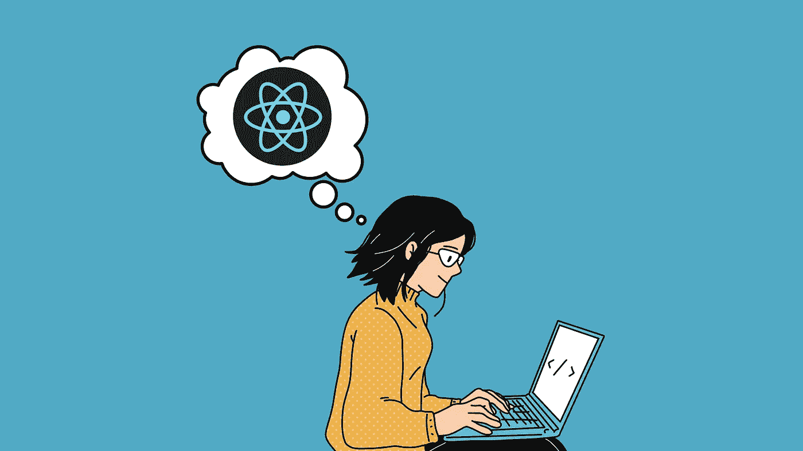
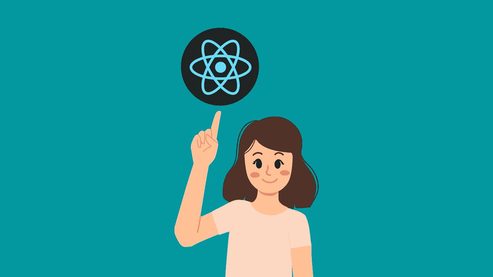
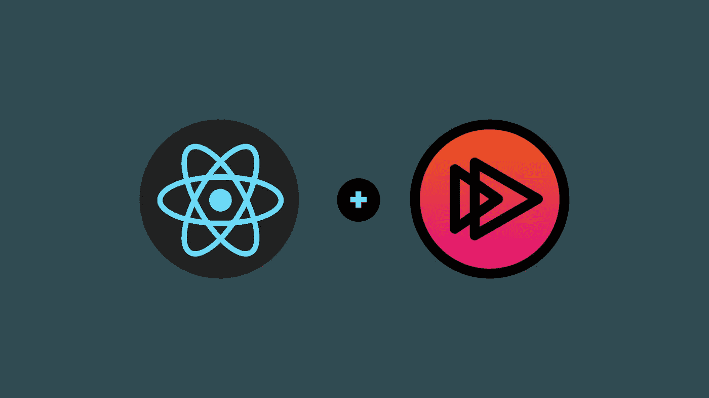

# 学习 React.js 的十大免费课程

> 原文：<https://medium.com/quick-code/top-10-free-courses-to-learn-react-cc6a40b9835?source=collection_archive---------0----------------------->

## 下面列出了 Udemy、Coursera、edX 等领先提供商提供的顶级免费 React 课程！

Free React Courses

我们已经知道，React 是编程行业中最知名的 Javascript 库之一。它是一个开源的前端库，可以让您为 web 和移动应用程序创建快速的交互式 ui。React 中最终优化的设计界面和代码语言是 web 开发人员使用 React.js 进行 web 开发的主要原因之一。很容易获得、实现、创建和维护专业外观的 web(和移动)应用程序，因为它是一种基于组件的方法，具有明确定义的生命周期，并且只使用普通的 JavaScript。与 Angular.js 相比，React 提供了几个优点。

因此，我整理了一些免费的 React.js 课程，初学者可以用来了解这个令人难以置信的 [Javascript](https://coursesity.com/blog/free-javascript-courses/) 库。或者，如果你想投资付费课程，我也为初学者整理了一份 [best React.js 教程](https://coursesity.com/blog/best-react-js-tutorials/)列表。因此，React 新手和那些希望了解更多 React 基础知识的人会发现这篇文章内容丰富。那么，事不宜迟，让我们开始吧。

## 1. [React JS 前端 Web 开发初学者](https://click.linksynergy.com/deeplink?id=0F1O0otUXQc&mid=47901&u1=csMedium&murl=https%3A%2F%2Fwww.udemy.com%2Fcourse%2Freact-tutorial%2F)——【Udemy】

任何对学习 React 感兴趣的人都应该把这门 Udemy 课程当作一个很好的起点。在本课程中，您将从头开始学习 React JS 和现代 JavaScript。此外，本课程需要一些 Javascript 或其他编程语言的知识。

在本 React 课程中，您将学习:

*   现代 JavaScript
*   反应 JS
*   反应钩
*   使用外部 API。
*   发出 AJAX 请求。
*   构建新闻应用程序

本课程将教你 React JS，这是近年来最热门的技术之一。此外，您将学习如何发出 AJAX 请求从远程 API 获取数据，并在您的 web 应用程序中显示这些数据。

这是 Udemy 上的顶级免费课程，5 门课程中有 4.5 门，时长 2 小时 49 分钟。此外，请记住，由于这是一门免费的 Udemy 课程，所以完成后您不会获得证书。

## 2.使用 React 进行前端 Web 开发—【Coursera】

Photo by [Lautaro Andreani](https://unsplash.com/@lautaroandreani?utm_source=medium&utm_medium=referral) on [Unsplash](https://unsplash.com?utm_source=medium&utm_medium=referral)

本课程将探讨基于 JavaScript 的前端应用开发，重点是 React(16.3 版)。我们将使用 [JavaScript ES6](https://coursesity.com/blog/best-ecmascript-courses/) 创建 React 应用程序。此外，您将通过使用 Reactstrap 学习如何使用 Bootstrap 4 构建响应式 ui。

React 课程的主题包括:

*   React 简介
*   React 路由器和单页应用程序
*   React 表单、流架构和 Redux 简介
*   更多冗余和客户端-服务器通信

在本课程中，您将了解 React 组件的各个方面。了解 React 路由器以及在构建单页应用程序时如何使用它们。此外，您将学习如何设计受控表单，并了解 Flux 架构和 Redux。使用 React-Redux，您将开发基于 Redux 的应用程序。

接下来，您将学习使用 Fetch 和服务器端 REST APIs 进行客户端-服务器通信。本课程以演示 React 动画如何工作以及如何测试它们结束。对于这门课程，学生必须对 [Bootstrap 4](https://coursesity.com/blog/best-bootstrap-tutorials/) 和 JavaScript，尤其是 ES5 有扎实的工作知识。

这是 Coursera 上排名第一的免费 React 课程，在 5 门课程中获得 4.7 分，持续时间为 36 小时。由于这是一门免费的 Coursera 课程，完成后您将获得一份证书。

## 3.[用 Node.js 和 React 开发云应用](https://www.awin1.com/cread.php?awinmid=6798&awinaffid=466009&clickref=csMedium&ued=https%3A%2F%2Fwww.edx.org%2Fcourse%2Fdeveloping-cloud-applications-with-nodejs-and-react)—【edX】

那些希望开始云开发职业生涯的人和那些希望了解当前云编程实践和技术的人将从本课程中受益。最初，学生需要对 HTML5、JavaScript、DevOps 和 [Git](https://coursesity.com/blog/best-git-tutorials/) 有一个基本的了解，同时对云计算有一个基本的了解。

在本 React 课程中，您将:

*   使用 Node.js 框架创建服务器端应用程序。
*   将 Git 用于持续交付管道和 DevOps 实践。
*   将您的 web 应用程序部署到 IBM 云平台。
*   将第三方包集成到 Node.js 应用程序中。
*   使用 Express 框架构建 web 应用程序。
*   通过在云上集成 Watson APIs，让您的应用为人工智能做好准备。
*   使用 ES6 和 React 构建丰富的应用程序用户界面。
*   创建回调函数并解析 HTTP 消息中的 JSON 数据。

本课程涵盖了几个 JavaScript 框架，使您能够开发和部署全栈 web 应用程序。通过使用 Node.js 和 [Express](https://coursesity.com/blog/best-express-js-tutorials/) ，您将创建后端服务器端应用程序。一旦开发了前端用户界面(UI)，就可以使用 ES6 和 React JavaScript 将应用程序部署到 IBM 云平台。完成本课程后，您将学习如何基于云原生原则开发现代应用程序。

这是 edX 上的顶级免费课程，持续时间为 3 周(每周 4-6 小时)。此外，请记住，由于这是一门免费的 edX 课程，所以完成后您不会获得证书。

## 4.[为初学者反应](https://click.linksynergy.com/deeplink?id=0F1O0otUXQc&mid=47901&u1=csMedium&murl=https%3A%2F%2Fwww.udemy.com%2Fcourse%2Freact-for-beginners-2022%2F)——【Udemy】

如果您想成为一名前端开发人员，如果您打算为现代应用程序构建用户界面，学习 React 是至关重要的。作为一个绝对的初学者，本课程将帮助你开始使用 React，所以如果你试图理解 React 是什么，这是一个完美的起点。

在本 React 课程中，您将学习:

*   什么是 React &为什么使用它
*   什么是 JSX
*   React 中基于功能和类的组件。
*   什么是道具
*   反应中的状态
*   如何在 React 中处理事件？

除了学习什么是组件之外，您还将学习不同的组件类型，比如功能组件和基于类的组件。此外，您将了解如何在 React 代码中使用状态来存储数据。

这是 Udemy 上的顶级免费课程，5 门课程中有 4.5 门，时长 1 小时 57 分钟。此外，请记住，由于这是一门免费的 Udemy 课程，所以完成后您不会获得证书。

## 5.[使用功能性 React 组件构建用户界面](https://coursera.pxf.io/c/1137078/1213622/14726?u=https%3A%2F%2Fwww.coursera.org%2Flearn%2Fbuilding-user-interfaces-using-functional-react-components&subId1=csMedium)—【Coursera】

React 组件通常使用类来实现。尽管它们性能优异，但也有一些局限性。重用类组件提供的有状态逻辑是不可能的。代码开发人员需要开发可重用的代码来提高生产率。

本课程将帮助您学习如何使用 JavaScript 函数和 React 挂钩来创建可重用的有状态 React 组件。此外，您将测试不同 React 挂钩的有状态逻辑。

React 课程的主题包括:

*   使用函数和 React 挂钩构建 React 组件
*   使用 React 钩子测试库测试定制钩子

这是 Coursera 上的顶级免费课程，时长 6 小时。由于这是一门免费的 Coursera 课程，完成后您将获得一份证书。

## 6.[学习反应](https://www.pjatr.com/t/TUJGR0lLR0JHR0pMSUtCR0ZISk1N?sid=csMedium&url=https%3A%2F%2Fwww.codecademy.com%2Flearn%2Freact-101)——【代码学院】

Learn React

本课程提供了对 React 关键概念的深入理解:JSX、类和函数组件、道具、状态、生命周期方法和钩子。React 的模块化编程风格将允许您结合这些想法。对于本课程，JavaScript 和 [HTML](https://coursesity.com/free-tutorials-learn/html) 是先决条件。

React 课程的主题包括:

*   JSX
*   反应组分
*   组件交互
*   生命周期方法
*   钩住
*   有状态组件中的无状态组件
*   其他 React 基础知识

这是 Codecademy 上的顶级免费反应课程，持续时间为 20 小时。此外，请记住，除非您拥有 Codecademy 的专业会员资格，否则您不会获得结业证书。

## 7. [React Redux 工具包完整指南](https://click.linksynergy.com/deeplink?id=0F1O0otUXQc&mid=47901&u1=csMedium&murl=https%3A%2F%2Fwww.udemy.com%2Fcourse%2Freact-redux-toolkit-complete-guide%2F)——【Udemy】

Redux 提供了比传统 redux 更好的方式来管理 React 中的状态。本课程旨在教你如何使用 Redux 工具包管理 React 应用程序中的状态。在整个 React 课程中，包含了许多讨论主题，以帮助您准确理解何时何地使用每个 React 特性。

在本 React 课程中，您将学习:

*   Redux 工具包来构建两个应用程序。
*   如何使用 Redux toolkit 管理状态？
*   如何使用 createStore？
*   如何使用 createAction？
*   如何使用 createReducer？
*   如何使用 createSlice？
*   如何使用 createAsycnThunk？

此外，本课程要求对 JavaScript、React.js 或任何其他编程语言有基本的了解。了解 React Redux 更佳。(可选)

这是 Udemy 上的顶级免费课程，5 门课程中有 4.5 门，时长 1 小时 20 分钟。此外，请记住，由于这是一门免费的 Udemy 课程，所以完成后您不会获得证书。

## 8.[反应 17:入门](https://pluralsight.pxf.io/c/1137078/424552/7490?u=https%3A%2F%2Fwww.pluralsight.com%2Fcourses%2Freact-js-getting-started&subId1=csMedium)——【复数视线】

这是一门初级的 React 课程，教你如何处理函数和类组件，管理应用程序状态，从头开始构建 React 应用程序。

React Crash Course

在学习本课程的过程中，您将学习 React 的基本概念，以及如何将它们应用于构建实际的 web 应用程序。最初，您将学习如何设计类和有状态功能组件、组件树中的单向流数据和行为，以及如何读取和更新状态数据。

最后一步是在您的计算机上建立一个本地 JavaScript 开发环境并使用它。完成本课程后，您将能够理解 React 项目，从头开始创建简单的 React 应用程序，并开始新的 React 项目。

React 课程的主题包括:

*   基础知识
*   现代 JavaScript 速成班
*   GitHub Cards 应用
*   明星赛游戏
*   设置开发环境

这是 Pluralsight 上的顶级免费课程，在 5 门课程中获得 4.5 分，时长 4 小时。此外，完成后您将获得证书。

## 9.[学习反应测试](https://www.pjatr.com/t/TUJGR0lLR0JHR0pMSUtCR0ZISk1N?sid=csMedium&url=https%3A%2F%2Fwww.codecademy.com%2Flearn%2Flearn-react-testing)——【代码学院】

因此，如果到目前为止您已经学习了 React 基础知识，那么现在是时候继续学习一些高级主题了。在本课程中，您将学习高级反应技能以及如何使用 Jest 快速测试。对于那些不知道的人来说，Jest 是一个 JavaScript 测试框架，它简单易用地提供了编写单元测试所需的所有工具。

此外，您将学习使用 React 测试库来简化组件测试。有了这个流行的工具，您可以简化 React 组件的测试，并专注于从用户的角度编写测试。该课程非常适合具有 React 经验、希望了解更多关于构建生产级应用程序的学习者。

在本 React 课程中，您将只涉及两个主题:

*   玩笑
*   反应测试库

这是 Codecademy 上的顶级免费反应课程，持续时间为 3 小时。此外，请记住，除非您拥有 Codecademy 的专业会员资格，否则您不会获得结业证书。

## 10. [React 课程 React JavaScript 库入门教程](https://www.youtube.com/watch?v=bMknfKXIFA8)——【freeCodeCamp——YouTube】

React Tutorial for Beginners

YouTube 上的 freeCodeCamp 课程将通过构建 8 个真实世界的项目和解决 140 多个编码挑战来教你如何应对。它将帮助您使用功能组件和挂钩等模式创建现代 React web 应用程序。您将创建的一些项目包括:

*   打造 AirBnb 体验克隆版
*   建立一个迷因生成器
*   构建一个 Notes 应用程序和 Tenzies 游戏

感谢您阅读这篇关于免费 React 课程的文章！如果你觉得这篇文章有帮助，请在评论中告诉我。还有，说说你刚开始学 React 时的体验如何？

 [## 面向初学者的 10 门免费 Java 课程[2022 年 8 月]——在线学习 Java

### 这里有一些免费的 java 课程，可以帮助你开始成为 Java 开发人员的旅程。

medium.com](/quick-code/10-free-java-courses-for-beginners-2022-aug-learn-java-online-e8bd09f923eb)  [## 10 门免费 Django 课程，学习 Python 中的 Django

### 众所周知，Python 是当今最流行的编程语言之一，Django 使 web 开发…

medium.com](/quick-code/10-free-django-courses-for-beginners-to-learn-django-ce2d598957a)  [## 面向 Java 程序员的 6 门免费 Spring Boot 课程

### 这些免费课程将教你所有你需要知道的关于流行的 Java 框架 Spring Boot 的知识。

medium.com](/quick-code/5-free-spring-boot-courses-for-java-programmers-369981c93c4a)