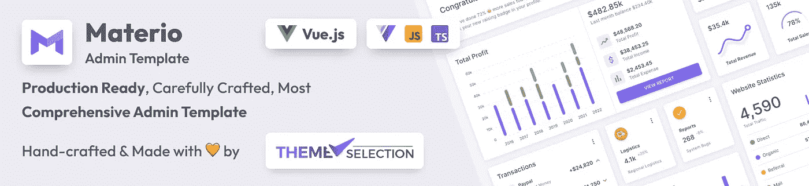

# 面向开发者的十大 Git GUI 客户端👨‍💻

> 原文：<https://medium.com/quick-code/top-10-git-gui-clients-for-developers-b56d702579a6?source=collection_archive---------0----------------------->

你好。！！🙋‍♂️:你在寻找顶级的 git GUI 客户端来简化项目管理吗？那你来对地方了..！！

首先， **Git** 是一个流行的版本控制系统，它可以帮助开发人员、作者或任何需要保存文件版本的人来管理和跟踪变更。它主要由许多程序员或命令提示符在终端上使用。

## 现在，什么是 Git GUI 客户端？

嗯**，Git 图形用户界面** ( **GUI** ) **客户端**是为 Git 提供替代可视化的工具。

正如我们所知，在管理协作开发项目时，Git 是必要的。虽然，它也有很高的学习曲线。因此，为了让新来者更容易，开发人员已经为各种平台创建了 **Git 图形用户界面客户端**。

在这里，我们为开发者准备了一份顶级 GIT GUI 客户端列表。以下 GUI 客户端基于跨平台兼容性，即 Mac、Windows 和 Linux。所涉及的成本，即它们是免费、付费还是订阅模式，以及各种功能，如不同的第三方远程存储库许可、管理克隆存储库的 UI 功能、推拉命令、合并冲突等。

所以，看看吧..！！👇

## 1.用于 Windows 和 Mac 的免费 GIT 客户端

Sourcetree 是一个免费的 Git 桌面客户端。它简化了与 Git 存储库的交互，因此您可以专注于编码。此外，您可以通过 Sourcetree 的简单 Git GUI 管理和可视化您的存储库。此外，其简单而美丽的界面使它很容易通过工作。除此之外，它是由吉拉和比特水桶。它还得到 Bitbucket 和 GitHub 托管的存储库的大力支持。

这种企业级工具可以作为更大团队的一部分使用。您可以查看使用 Sourcetree 制作的 [**变色龙免费引导管理模板**](https://themeselection.com/products/chameleon-admin-free-bootstrap-dashboard-template/) 。

Chameleon Admin Template

这是一个开源且易于使用的[引导仪表板模板](https://themeselection.com/item/category/bootstrap-admin-templates/)，具有优雅的设计&独特的布局。

**功能:**

*   审查您的传出和传入的变更集，在分支之间挑选，补丁处理，重定基础，隐藏，搁置，等等。
*   轻松使用 Git-flow 和 Hg-flow。保持您的存储库更干净，您的开发更高效。
*   创建、克隆、提交、推送、拉入、合并等操作都只需点击一下鼠标。
*   全动力 DVCS

**工具成本/计划明细:**自由

**操作系统支持:** Windows & Mac

**许可:**专有

[**下载**](https://downloads.atlassian.com/software/sourcetree/windows/ga/SourceTreeSetup-1.10.15.4.exe)

## 2. [Github 桌面](https://desktop.github.com/):从你的桌面进行简单的协作

**GitHub** **桌面**是一款基于开源[电子](https://electron.atom.io/)的 GitHub app。它是用[打字稿](http://www.typescriptlang.org/)写的，使用[反应](https://facebook.github.io/react/)。它还允许开发人员同步分支、克隆存储库等等。此外，拉请求、合并按钮、分叉队列、问题、页面和 wiki:都是使共享变得更容易的很棒的特性。但是这些东西只有在你把你的代码推送到 GitHub 之后才是伟大的。

**功能:**

*   社区支持的
*   广泛的编辑器和外壳集成
*   语法突出显示
*   扩展的图像差异支持

**工具成本/计划详情:**免费(麻省理工学院许可)

**操作系统支持:** Windows & Mac

麻省理工学院

## 3.[光环](https://aurees.com/):轻松-快速-自由

Aurees 是一个免费的(仅用于非商业用途)Git 客户端。它提供了更改和提交的可视化表示，因此您可以立即了解是谁进行了哪些提交。此外，客户端在并排的窗口中显示提交更改，您可以在其中批准更改并单击返回。

**功能:**

*   清晰的用户体验
*   洞察力突出
*   强大的可编辑差异
*   与预览合并

**工具成本/计划明细:**自由

**操作系统支持:** Windows，Mac & Linux

**许可:**专有

[**下载**](https://aurees.com/download)

## 4.Git-Cola:Git 的强大图形用户界面

Git Cola 是一个为 [Git](https://git-scm.com/) 设计的时尚而强大的图形用户界面。它是[免费软件](https://git-cola.github.io/license.html)，用 [Python](https://www.python.org/) (v2 + v3)编写。此外，这被认为是软件开发人员容易获得的最好和最快的版本控制工具之一。此外，它还具有广泛的特性，比如合并、拉、推、克隆和其他各种特性。

这个开源的 Git GUI 客户端很容易为 Git 客户端定制。

**工具成本/计划明细:**自由

**操作系统支持:** Windows，Mac，Ubuntu & Linux

许可证: GNU GPL

[**下载**](https://git-cola.github.io/downloads.html)

Check out the Best [**Vue Js Admin Template**](https://themeselection.com/item/category/vuejs-admin-templates/)

## 5.[乌龟 Git](https://tortoisegit.org/):Windows Shell 中 Git 的威力

TortoiseGit 是一个 Git 版本控制客户端，作为一个 Windows 外壳扩展实现，基于 TortoiseSVN。它是在 GNU 通用公共许可证下发布的自由软件。

TortoiseGit 支持常规任务，比如提交、显示日志、区分两个版本、创建分支和标签、创建补丁等等。

**功能:**

*   外壳集成
*   对非线性发展的有力支持
*   图标覆盖
*   高效的分支和标记
*   分布式版本控制
*   轻松访问 Git 命令
*   高效处理大型项目
*   外壳集成
*   历史的加密认证

**工具成本/计划明细:**自由

操作系统支持: Windows

[**下载**](https://tortoisegit.org/download/)

## 6.Fork:一个适用于 Mac 和 Windows 的快速友好的 GIT 客户端

Fork 是一个快速简单的 git 客户端，适用于 Mac 和 Windows。它有一个基于选项卡的界面，允许您快速导航存储库并高效地组织工作流。

此外，Fork 还提供了一个完整的清单，包括起源、提交、标记、分支和存储。此外，与存储库相关的网站或应用程序可以直接从 Fork 打开。它还提供了回购的详细文件树结构和高级差异查看器。

**功能:**

*   交互式 Rebase
*   合并冲突
*   仓库管理员
*   责备
*   取、拉、推
*   图像差异
*   创建和删除远程回购
*   创建和删除分支和标签
*   签出分支或版本
*   樱桃采摘
*   归还
*   合并
*   贮藏
*   子模块
*   Git 流
*   吉特 LFS

**工具成本/计划明细:**基本免费/已付额外费用

**操作系统支持:** Windows & Mac

**许可:**专有

[**下载**](https://git-fork.com/update/files/Fork.dmg)

## 7. [Gitkraken](https://www.gitkraken.com/) :传奇的 GIT GUI 客户端，用于 Windows、Mac & Linux

GitKraken 是另一个最好的 GUI Git 客户端。它被认为是 Git 客户机中最有吸引力的之一。此外，它有很好的用户界面、特性和主题。此外，与任何其他 GUI Git 客户端相比，它看起来令人兴奋，并且具有许多特性。此外，它有一个直观的用户界面/UX。它还有一个合并冲突编辑器。

此外，它支持 VCS，如 Gitlab、GitHub、Bitbucket 和 Enterprise。此外，它还具有大量的协作功能。

**功能:**

*   存储库托管集成
*   问题跟踪集成
*   差异拆分视图
*   此外，还有一个内置的代码编辑器，具有拖放功能
*   提交图功能
*   语法突出显示
*   提交图功能
*   吉特 LFS
*   Git 挂钩支持
*   Gitflow 支持
*   明暗主题

**工具成本/计划明细:**基本免费/已付额外费用

**操作系统支持:** Windows，Mac & Linux

许可证:专有

[**下载**](https://www.gitkraken.com/download)

## 8.完成你的提交

智能 Git 是一个强大的多平台 Git 客户端。它在 Windows、macOS 和 Linux 上具有相同的直观用户界面:

**功能:**

*   命令行 Git 客户端(Windows、macOS)
*   SSH-客户端
*   文件比较
*   图形合并和提交历史
*   Git 流
*   文件合并(“冲突解决器”)

**工具成本/计划明细:**基本免费/已付额外费用

**操作系统支持:** Windows，Mac & Linux

**许可:**专有

[**下载**](http://www.syntevo.com/smartgit/download)

## 9.Magit:Emacs 内部的 git 瓷器

Magic 是版本控制系统 Git 的一个接口，以 Emacs 包的形式实现。Magit 立志做一个完整的 git 瓷。虽然它没有声称 Magit 包装并改进了每一个 git 命令，但它已经足够完整，甚至允许有经验的 Git 用户直接从 Emacs 中执行几乎所有的日常版本控制任务。

**工具成本/计划明细:**自由

**操作系统支持:** Linux，Mac，Windows

**许可证** : GPL-3.0 许可证

## 10.[Git tower](https://www.git-tower.com/):Mac 和 Windows 最强大的 Git 客户端。

Git Tower 对于 Mac 和 Windows 用户来说是一个强大的 Git 客户端。这是一个非常易于使用的直观图形界面。没有必要担心犯错误:支持撤销，可以通过拖放&创建新的分支，并且您可以随时回滚到以前的修订。

**功能:**

*   高级功能
*   单线分段运输
*   子模块支持
*   文件历史

**工具成本/计划详情:**$ 79/用户(30 天免费试用)

**操作系统支持:** Mac、Windows

**许可**:专有

除此之外，看看最友好的开发者和高度可定制的 [**反应管理仪表板**](https://themeselection.com/item/category/react-admin-templates/)

获取 TypeScript 和 JavaScript 版本的[Materio Free MUI React Next js Admin 模板](https://themeselection.com/item/materio-mui-react-nextjs-admin-template/)。

## 11. [Gitg](https://wiki.gnome.org/Apps/Gitg)

Gitg 是 git 的一个图形用户界面。它的目标是成为一个小型、快速、方便的工具来可视化 git 库的历史。除了可视化之外，它还提供了几个工具来管理您的存储库和提交您的工作。

**功能:**

*   文件视图
*   提交阶段性更改
*   集结你的承诺。
*   应用菜单(GNOME Shell 集成)
*   最近使用的存储库概述。
*   克隆存储库
*   全面的存储库历史
*   开放存储库

**工具成本/计划明细:**自由

**操作系统支持:** Linux

**许可证** : GNU GPL

[**下载**](https://wiki.gnome.org/Apps/Gitg#Download)

## 12. [Qgit](http://digilander.libero.it/mcostalba/)

QGit 是一个建立在 Qt/C++上的 Git GUI 查看器。它对不同的开发分支有一个很好的图形化表示。此外，用户可以访问详细的修订历史，并可以查看补丁内容和更改的文件。

**特色:**

*   应用和/或格式化-从所选提交中修补系列
*   最常见的 StGIT 命令的 GUI
*   查看修订、差异、文件历史、文件注释和归档树。
*   在 qgit 的两个实例之间拖放提交。
*   提交更改并直观地挑选修改过的文件。
*   将命令序列、脚本和其他可执行文件与自定义操作相关联。

**工具成本/计划明细:**自由

**操作系统支持:** Linux

许可 : GNU GPL

[**下载**](https://sites.google.com/site/gitforcetool/download)

## 13. [Git Force](https://sites.google.com/site/gitforcetool/home)

GitForce 是一个非常流行的 Git 命令行工具的可视化前端。它旨在为处理 Git 流程提供流畅和最直观的体验。

**功能:**

*   无需安装的单一可执行文件
*   轻松扫描本地回购
*   多个工作区(多组仓库)
*   创建和管理多个 Git Repos 和分支机构
*   支持多个远程回购
*   带有拖放功能的直观 GUI
*   轻松管理 SSH 密钥和遥控器
*   集成 Git 命令行界面
*   列出修订历史、隐藏、取消隐藏等。

**工具成本/计划明细:**免费

操作系统支持: Linux

**许可证** : GNU GPL

[**下载**](https://sites.google.com/site/gitforcetool/download)

查看基于 Vue 3 的最新 [**管理面板**](https://themeselection.com/item/category/admin-templates/) ！

Materio — Vuetify Vuejs 3 Admin Template

最强大和最全面的 Vue 验证 [**Vue 管理**](https://themeselection.com/item/category/vuejs-admin-templates/) 模板

## 14.快速、安全地工作，没有头痛。

**GitUp** 是专门针对 Mac 用户的 Git GUI 客户端。它是开源的，带有 **GitUpKit，**一个让你构建 Git 应用的工具包。它易于使用，让你看到你的合并和分支。

**功能:**

*   实时地图
*   快速查看
*   即时搜索

**工具成本/计划明细:**自由

操作系统支持: Mac

**许可证** : GNU GPL

[**下载**](https://s3-us-west-2.amazonaws.com/gitup-builds/stable/GitUp.zip)

## 15.GitBox :像邮件一样简单的版本控制

**Gitbox** GIt GUI 客户端允许您一键拉取、提交和推送代码变更。

使用 GitBox，您可以从服务器自动检索新的提交，避免合并提交和冲突。此外，您可以通过作者或描述在存储库历史中搜索提交。

**功能:**

*   全自动子模块
*   强大的命令和键盘快捷键

**工具成本/计划明细:**免费/付费

**操作系统支持:** Mac

**许可证** : GNU GPL

## 16.GitX-dev :

GitX-dev 是一个免费的 Mac Git 客户端。它是为活跃的开发人员创建和设计的一流的、易于维护的工具。这个工具是专门为软件开发人员开发的，对于大多数 Git 工作流来说也是全功能的。

您可以浏览您存储库历史，并查看任何修订的良好排列的差异。此外，您还可以看到一个完整的修订树。

**功能:**

*   查看任何修订的良好格式差异
*   查看任何修订的完整树
*   支持 git rev-list 拥有的所有参数
*   将文件拖放到树视图之外，以将其复制到您的系统中
*   基于作者或修订主题的搜索
*   在文本视图中或使用快速查看预览树中的任何文件
*   大型(200 MB 以上)存储库的良好性能
*   存储库的历史浏览

**工具成本/计划明细:**自由

操作系统支持: Mac

**许可证** : GNU GPL

## 结论:

因此，这些是一些顶级的 Git Gui 客户端，可以帮助您轻松地管理您的项目。

基于 GUI 的 Git 客户端对于管理各种复杂的基于 Git 的操作是必不可少的。不管用户的技能水平如何，这些客户机都确保有一种简单快捷的方式来执行常见的 Git 命令。

以下是基于成本和操作系统兼容性对 Git GUI 客户端的一些建议。

1.最佳免费软件: [Sourcetree](https://www.sourcetreeapp.com/) ， [Git Desktop](https://desktop.github.com/) (针对 GitHub 用户)

*   都是免费的。
*   两者都提供了跨平台兼容性

2.最佳免费和高级:[叉子](https://git-fork.com/)， [Gitkraken](https://www.gitkraken.com/)

*   提供惊人的功能
*   跨平台兼容性
*   最推荐的 Git GUI 客户端

我们试图在本文中涵盖所有顶级的 Git GUI 客户端。如果我们错过了您最喜欢的客户，或者您想参与讨论，请在下面留下您的评论！

## 关于我们:

在 ThemeSelection，我们提供精选的高质量、现代设计、专业且易于使用的高级、免费主题和[管理模板](https://themeselection.com/item/category/admin-templates/)，以及 [UI 设计套件](https://themeselection.com/item/category/ui-kits/)。

您还可以查看 [VueJS 管理模板](https://themeselection.com/products/category/vuejs-admin-templates/)。

*原载于 2020 年 11 月 9 日*[*https://dev . to*](https://dev.to/theme_selection/best-git-gui-clients-for-developers-5023)*。*