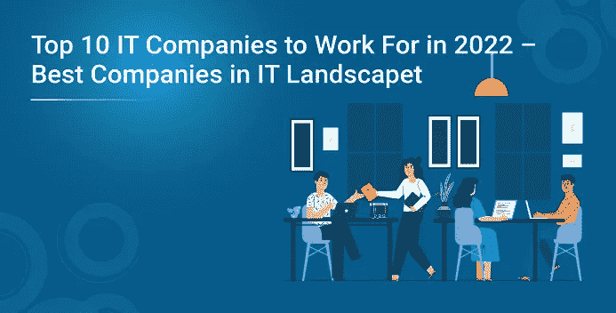
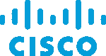
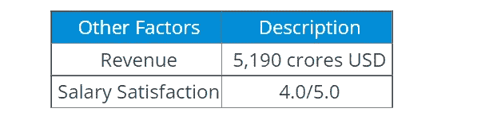
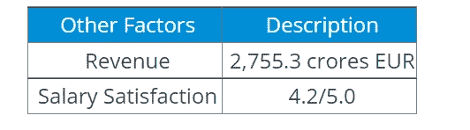
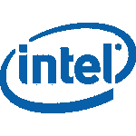
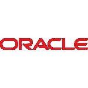
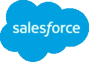
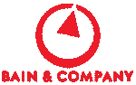
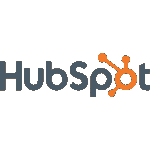

# 2022 年最值得工作的 10 大 IT 公司——IT 领域的最佳公司

> 原文：<https://medium.com/edureka/top-10-it-companies-to-work-for-in-2022-4df627442cf7?source=collection_archive---------1----------------------->

无论你是决定接受新雇主的工作邀请，还是离开疫情后刚刚开始一份新工作，你职业生涯中最重要的一个方面将是这家公司及其工作文化。这就是为什么我们策划了 2022 年十大 IT 公司的名单！

在这篇博客中，我们将讨论以下 IT 公司:

# 2022 年最值得工作的十大 IT 公司

*   **思科系统有限公司**
*   **SAP**
*   **土坯**
*   **谷歌**
*   **英特尔**
*   **甲骨文**
*   **销售队伍**
*   **贝恩&公司**
*   **微软**
*   **轮毂点**

在这个竞争激烈的 IT 行业，每个人都想在一家好公司工作，并获得丰厚的薪水。这个 Edureka 视频为你带来了期待已久的 2022 年前 10 大 IT 公司名单，这将帮助你为你的职业生涯做出正确的选择。

现在，事不宜迟，让我们开始列出 2022 年十大 IT 公司。

# 1.思科系统有限公司

总部:美国加利福尼亚州圣何塞

思科使人们能够在商业、教育、慈善或创意领域建立联系。思科硬件、软件和服务产品用于创建互联网解决方案，使网络成为可能。如今，他们拥有 75，900 多名员工，在公司的核心开发领域(路由、交换、家庭网络、IP 电话、光纤网络、安全、存储区域网络和无线技术)开发各种产品。

现在让我们来看看思科员工的福利。

# 职工福利

*   自助餐厅
*   远程办公
*   体育馆
*   健康保险
*   团队出游
*   软技能训练
*   儿童保育
*   工作培训
*   教育援助
*   免费运输
*   免费食物
*   国际搬迁

继续下一家公司，我们有 SAP。

# 2.精力

总部:德国沃尔多夫 16 号迪特马尔-霍普-阿利

数据处理系统、应用和产品(SAP)是企业应用软件的市场领导者，帮助各种规模的公司以最佳状态运行。他们拥有超过 100，300 名员工，致力于机器学习、物联网(IoT)和高级分析技术，帮助客户的企业转变为智能企业。凭借遍布全球的客户、合作伙伴、员工和思想领袖网络，SAP 帮助世界更好地运转，改善人们的生活。

SAP 的员工有很多福利，下面给出一些。

# 职工福利

*   免费运输
*   免费食物
*   自助餐厅
*   团队出游
*   远程办公
*   健康保险
*   软技能训练
*   体育馆
*   儿童保育
*   教育援助
*   工作培训
*   国际搬迁

在 2021 年十大最值得工作的 It 公司名单中，下一个是 Adobe。

# 3.砖坯黏土

**总部:**美国加利福尼亚州圣何塞

我相信您一定知道 Adobe 是数字媒体和数字营销解决方案的全球领导者。他们拥有 21，000 多名员工，参与创意、营销和文档解决方案，将数字创作带入生活。他们通常为客户提供身临其境的体验，以获得最佳效果。Adobe 的一些服务有 Adobe Photoshop、Adobe Illustrator、Adobe Lightroom 等。

下面列出了员工的一些福利。

# 职工福利

*   假期和带薪假期
*   学习基金
*   教育福利
*   搬迁资源
*   医疗计划覆盖范围
*   牙科和视力计划
*   团队出游
*   免费运输
*   远程办公
*   体育馆
*   员工股票购买计划(ESPP)
*   下一个 2021 年十大最值得工作的 IT 公司不是别人，正是谷歌。

# 4.谷歌

**总部:**美国加州山景城

谷歌拥有超过 10 万名员工，专门从事与互联网相关的服务和产品。这些包括在线广告技术、搜索引擎、云计算、软件和硬件。它被认为是美国信息技术行业的五大技术公司之一，与亚马逊、脸书、苹果和微软并列。

谷歌的员工福利被认为是无懈可击的。

# 职工福利

*   旅行保险
*   健康储蓄账户
*   酒店内健身房
*   现场健身课
*   人寿保险
*   校园自行车
*   交通补贴
*   收养援助
*   员工折扣
*   学费报销
*   宠物友好型工作场所

接下来，我们名单上的下一家公司是英特尔。

# 5.美国英特尔公司(财富 500 强公司之一ˌ以生产 CPU 芯片著称)

**总部:**美国加州圣克拉拉

英特尔公司是一家美国跨国公司和技术公司。它是世界上最大和价值最高的半导体芯片制造商。英特尔拥有 1，108，000 多名员工，为联想、惠普和戴尔等计算机系统制造商提供微处理器。英特尔还制造主板芯片组、网络接口控制器和集成电路、闪存、图形芯片、嵌入式处理器和其他与通信和计算相关的设备。

下面列出了一些员工福利。

# 职工福利

*   自助餐厅
*   免费运输
*   教育援助
*   工作培训
*   团队出游
*   国际搬迁
*   牙科保险
*   健康保险
*   视力保险
*   人寿保险
*   远程办公
*   育婴假
*   带薪休假
*   高校休假期
*   酒店内健身房
*   健身班
*   按摩
*   员工折扣
*   季度奖金
*   购股选择权
*   年度奖金
*   退休金计划

现在让我们来看看名单中剩下的 5 家公司。

# 6.神谕

**总部::**美国加利福尼亚州雷德伍德城

甲骨文公司是一家美国跨国计算机技术公司。该公司销售数据库软件和技术、云工程系统和企业软件产品。该公司拥有约 1，350，000 名员工，开发和构建数据库开发工具以及中间层软件、企业资源规划(ERP)软件、人力资本管理(HCM)软件、客户关系管理(CRM)软件和供应链管理(SCM)软件系统。

甲骨文员工福利如下所列。

# 职工福利

*   自助餐厅
*   体育馆
*   健康保险
*   免费运输
*   远程办公
*   团队出游
*   软技能训练
*   工作培训
*   教育援助
*   免费食物
*   儿童保育
*   国际搬迁
*   在 2021 年十大 IT 公司的下一部分中，我们有 Salesforce。

# 7.销售力量

**总部:**美国加州旧金山

Salesforce.com 公司是一家美国基于云的软件公司，在全球拥有 49，000 多名员工。它主要提供客户关系管理(CRM)服务。他们还销售一套侧重于客户服务、营销自动化、分析和应用程序开发的企业应用程序。

Salesforce 员工享有以下福利。

# 职工福利

*   团体医疗保险
*   健康检查
*   健康报销计划
*   视力/牙科报销
*   员工援助计划(EAP)
*   国际旅行保险
*   Salesforce 移动了 400 万英里
*   退休基金
*   关怀力量
*   年假:
*   病假/事假
*   育婴假
*   志愿者休息时间
*   弹性工作
*   员工股票购买计划(ESPP)
*   教育报销
*   全球收养援助计划
*   员工推荐奖金
*   名单上的下一个是贝恩公司。

# 8.贝恩公司

**总部:**美国马萨诸塞州波斯顿

贝恩公司是一家全球管理咨询公司，总部位于马萨诸塞州波士顿。作为“三大”管理咨询公司之一(MBB)，它被视为业内最有声望的雇主之一，拥有超过 10，500 名员工。该公司就私募股权投资、并购、公司战略、财务、运营和市场分析等问题提供咨询。

贝恩公司的员工福利如下。

# 职工福利

*   健康保险
*   401k 和退休计划
*   股票购买计划，
*   假期和带薪休假
*   产假和陪产假
*   弹性支出账户
*   免费午餐和小吃
*   带薪志愿者假
*   学费资助
*   多元化和工作培训计划
*   高校休假期
*   远程办公

# 9.微软

**总部:**美国华盛顿州雷德蒙

微软公司是一家美国跨国技术公司，拥有超过 1，66475 名员工。他们主要开发、制造、许可、支持个人电脑和软件。他们最著名的软件产品是微软视窗系列操作系统、微软办公套件、Internet Explorer 和 Edge 网络浏览器。

下面列出了一些员工福利。

# 职工福利

*   学费资助计划
*   医疗保健计划
*   员工援助计划
*   健身计划
*   公司租赁住宿
*   全球紧急援助计划
*   员工股票购买计划
*   儿童保育福利
*   车辆租赁
*   夜间津贴
*   401k 计划
*   社交俱乐部和社交网络
*   现场图书馆

**收入:**1430 亿美元

**薪资满意度** : 4.0/5.0

名单上最后一家公司是 HubSpot。

# 10.轮毂点

**总部:**美国马萨诸塞州剑桥

HubSpot 是一家美国开发商和营销商，从事集客营销、销售和客户服务的软件产品。他们的产品和服务拥有超过 3，387 名员工，旨在为客户关系管理、社交媒体营销、内容管理、销售线索挖掘、网络分析、搜索引擎优化、实时聊天和客户支持提供工具。

HubSpot 员工有几项福利，其中一些如下。

# 职工福利

*   健康保险
*   牙科保险
*   人寿保险
*   退休计划
*   带薪休假和病假
*   灵活的时间表
*   学费报销
*   带薪育儿假
*   现场健身房或健身折扣

其他因素描述收入 67.49 亿美元薪资满意度 4.0/5.0

以上是关于 2022 年前 10 大 IT 公司的信息。希望这篇文章对你有用。如果你希望查看更多关于人工智能、DevOps、道德黑客等市场最热门技术的文章，那么你可以参考 [Edureka 的官方网站。](https://www.edureka.co/blog?utm_source=medium&utm_medium=content-link&utm_campaign=top-10-it-companies-to-work-for-in-2022/)

*原载于 2022 年 4 月 5 日 https://www.edureka.co***。**