# 你应该知道的十大最流行的 JavaScript 框架

> 原文：<https://medium.com/edureka/top-10-javascript-frameworks-3179f1b5bd41?source=collection_archive---------2----------------------->

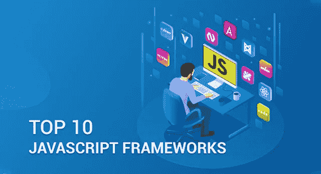

Top 10 JavaScript Frameworks — Edureka

多年来，已经发布了许多 JavaScript 框架，从中选择一个可能是一个挑战。如果你很困惑，不知道选择哪一个或者哪一个适合你，我会帮你解决。在本文中，我将列出构建 web 应用程序时应该使用的 10 大 JavaScript 框架。

以下是我将在本文中涉及的框架列表:

1.  安古拉吉斯
2.  反应堆
3.  VueJS
4.  jQuery
5.  脊椎 j
6.  NodeJS
7.  EmberJS
8.  流星报
9.  聚合物 j
10.  蛹

# 10.JavaScript 框架:Aurelia

Aurelia 是所有开源现代 JavaScript 模块的工具箱，有助于 web 和移动应用程序的发展。它也被称为“下一代框架”。这个框架自推出以来已经获得了很多认可。Fileee、Freska、Ordami 和 BTEK Software 等公司以及 800 多个网站都在使用 Aurelia。

别忘了，Aurelia 是唯一允许开发人员用普通的类型脚本或 JavaScript 构建组件的框架。

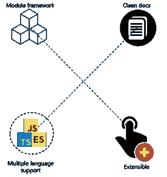

***下面我列举了奥雷利亚的几个关键特征:***

*   **多语言支持** :
    Aurelia 的 API 经过精心设计，可以从当今和未来最有用的 web 编程语言中自然使用。Aurelia 支持 ES5、ES2015、ES2016 和 Typescript，这非常有用，并为您提供了高度的灵活性
*   **模块框架**:Aurelia 由更小、更集中的模块组成，而不是采用单一的框架方法。将它们作为一个全功能的框架一起使用，或者选择构建一个定制的解决方案。
*   **可扩展 HTML** : Aurelia 的可扩展 HTML 编译器可以让你创建自定义 HTML 元素，为现有元素添加自定义属性，控制模板生成，所有这些都完全支持动态加载、数据绑定和高性能批量渲染。

# 9.JavaScript 框架:聚合物

Polymer 是一个由 Google 维护的开源 JavaScript 库，用于使用 web 组件构建 web 应用程序。目前，有超过 3000 个网站在使用 polymer，比如 virustotal.com、rogers.com、zeplin.io 等等。

与其他 JavaScript 框架不同，Polymer 是为了利用 web 中存在的特性来让开发人员构建组件而构建的。它是第一个通过使用 web 组件来允许交互式建筑应用的图书馆。

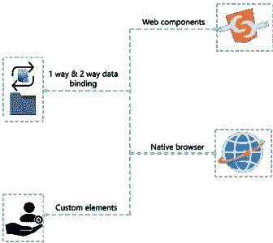

***下面我列举了聚合物的几个关键特性:***

*   聚合物是建立在 **Web 组件**:
    Web 组件的思想之上的。Web 组件是一组 w3c 标准，由几种不同的 web 技术组成，包括定制元素。这些组件是浏览器的一部分，所以你不需要任何第三方工具和库，比如 jQuery。
*   **单向和双向数据绑定**:提供单向和双向数据绑定。Polymer 旨在支持单向和双向的数据流动。
*   **原生浏览器** : Polymer 利用原生浏览器技术，而不是依赖定制的 JavaScript 库。聚合物 DOM 层最接近原生 JavaScript 层。

# 8.JavaScript 框架:Meteor

Meteor 是一个使用 NodeJS 编写的免费开源 JavaScript 框架。它允许快速原型化并产生跨平台的代码。它在市场上越来越受欢迎，有超过 13，000 个网站使用 Meteor。像 mtv.com，meteofrance.com 等网站利用流星来建立他们的用户界面。

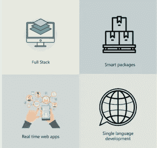

***下面我列举了流星的几个关键特征:***

*   全栈**:Meteor 为开发和部署 web 应用程序提供了全栈解决方案。Meteor 附带了几个内置特性，如反应式模板、自动 CSS 等。**
*   ****智能包**:为你的应用程序构建一个登录系统可能会很麻烦。但不是用流星。Meteor 包使得添加用户账号、React 等 JavaScript 库等特性变得很容易。最棒的是，添加这些智能包很容易，只需在终端上敲几下键盘，就可以了。**
*   ****实时网络应用**:对于那些希望构建实时应用的人来说，Meteor 是一个完美的解决方案。从数据库到模板的所有应用程序层都会自动更新。这意味着不需要刷新页面来查看更新。对文档的任何更改都会立即保存。这使得 Meteor 成为实时协作的完美用例。**
*   ****单一语言开发**:对于移动和网络应用，Meteor 允许在前端和后端使用相同的代码。它防止开发人员要求安装和配置不同的库、模块管理器、API、驱动程序等等。这节省了开发人员的大量生产时间，因为他们不需要在服务器语言和 JavaScript 之间执行上下文切换。**

# **7.JavaScript 框架:Ember**

**Ember 是一个开源的 JavaScript web 框架，它允许开发人员通过将最佳实践整合到框架中来构建可伸缩的单网页应用程序。Ember 被评为最佳客户端 JavaScript 框架，将其主要竞争对手 React 和 AngularJS 甩在身后。目前，超过 6000 个网站正在使用 ember。仅举几个例子，nasa.gov、tutorialspoint.com 等。**

**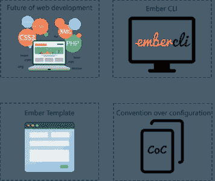**

*****下面我列出了 Ember 的几个关键特性:*****

*   ****web 开发的未来**:在 Babel JavaScript transpiler 的帮助下，Ember 允许开发人员使用未来的 JavaScript 标准，并将它们转换成可在今天的浏览器中使用的文件。不知道巴别塔是什么？Babel 是一个 JavaScript transpiler，它让开发人员现在可以在他们的代码中使用下一代 JavaScript。此外，Babel 受益于众多插件，并与 Ember、Rails、Sails 和 Meteor 等框架兼容。**
*   **灰烬使者:灰烬和灰烬使者完全是两个不同的东西，但是没有对方，任何一个都不会是完整的。Ember-CLI 是一个命令行工具，它与 Ember 框架的软件堆栈一起提供。Ember-CLI 是一艘生产力火箭船，支持 CoffeeScript、Handlebars、LESS 和 Sass 等工具。**
*   ****Ember 模板**:Ember 的 UI 内置了 Ember 的模板，是用手柄模板语言编写的。Handlebars 因使用双花括号而得名，它允许开发人员使用更少的代码。模板使得 Ember 中的许多功能成为可能，比如组件、出口和表达式。**
*   **会议的唯一目的是速度和“把事情做完”的哲学，这对那些总是努力超越竞争对手的创业公司来说是一个巨大的推动。Ember 对于如何构建它有明确的最佳实践。这意味着开发人员可以更多地关注他们应用的功能和独特的特性，而不是用繁琐的代码重新发明轮子。建筑越来越多，蓝图越来越少。**

# **6.JavaScript 框架:节点**

**Node.js 是一个开源的服务器端平台，建立在 Google Chrome 的 JavaScript 引擎之上。使用 NodeJS 的网站数量已经超过 84，000 个。它是下载量最大的跨平台运行时环境之一，用于执行 JavaScript 代码。**

**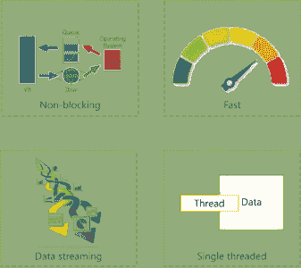**

*****下面我列举了 Node.js 的几个关键特性:*****

*   ****非阻塞**:node . js 库的所有 API 都是异步的，即非阻塞的。这实际上意味着基于 Node.js 的服务器永远不会等待 API 返回数据。在调用下一个 API 之后，服务器移动到下一个 API，事件的通知机制帮助服务器从上一个 API 调用中获得响应。**
*   ****单线程** : Node.js 利用了带有事件循环的单线程模型。事件机制有助于服务器以非阻塞的方式做出响应，从而使服务器具有高度的可伸缩性，而传统服务器创建有限的线程来处理请求。与 Apache HTTP Server 等传统服务器相比，Node.js 使用的单线程程序可以为大量请求提供服务。**
*   ****快** : NodeJS 是基于谷歌 Chrome 的 JavaScript 引擎 V8 engine 打造的。谷歌的 V8 JavaScript 引擎确保 Node.js 库以闪电般的速度执行其代码。**
*   ****数据流** : NodeJS 应用从不缓冲任何数据，它们只是以数据块的形式输出数据。这样 NodeJS 提供更快的服务。**

# **5.JavaScript 框架:BackboneJS**

**BackboneJS 是一个轻量级的 JavaScript 库，允许开发和构建在 web 浏览器中运行的客户端应用程序。与其他框架不同，Backbone 让开发人员负责选择最适合给定项目的工具。目前，超过 50 万的网站正在使用主干网，这包括 tumblr.com，espn.com，soundcloud.com 和更多。**

**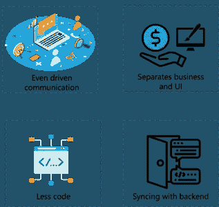**

**下面我列出了 Backbone 的几个关键特性:**

*   ****分离的业务和 UI 逻辑**:Backbone 能帮你做的最重要的一件事就是保持业务逻辑和用户界面的分离。当两者纠缠在一起时，改变是很难的。但是当逻辑不依赖于 UI 时，你的界面就变得更容易使用。**
*   ****事件驱动的通信**:当项目增长时，jQuery 声明和回调变得更加复杂。代码变得更加混乱。Backbone.js 通过在视图和模型之间提供事件驱动的通信克服了这个问题。**
*   **更少的代码:约定是引入通用编码风格的好方法，而不需要提出一套广泛的编码标准。你越坚持主干约定，你需要编码的就越少，反过来，代码变得更加标准化和可读。**
*   ****与后端同步**:由于对 RESTful APIs 的出色支持，BackboneJS 中的模型可以很容易地绑定到后端。如果 API 设计正确，那么 backbone 已经配置为直接访问这些 API 进行读、写和删除操作。**

# **4.JavaScript 框架:jQuery**

**最古老的 JS 框架之一是 Jquery。这个框架已经存在超过 12 年了，并且仍然很强大。那么，jQuery 是什么呢？**

**jQuery 是一个快速而简洁的 JavaScript 库，由 John Resig 在 2006 年创建，有一个很好的座右铭:少写，多做。它是一个跨平台的 JavaScript 库，旨在简化 HTML 的客户端脚本。目前，超过 1900 万的网站正在使用 jQuery！像 WordPress、脸书、谷歌、IBM 和许多其他公司都依赖 jQuery 来提供独一无二的网络浏览体验。**

**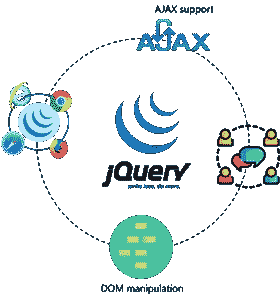**

**下面我列出了 jQuery 的几个关键特性:**

*   ****DOM 操纵**:它使得操纵 DOM 变得极其容易，使开发人员能够做令人惊奇的事情，并通过简单易学的 API 充分发挥他们的创造力，该 API 构建在 JavaScript 之上。**
*   **大型社区:其贡献者的社区比其他任何 JavaScript 库都更加多样化，规模也更大。它有广泛和全面的文件。不要忘记，它一直保持着，并且变得越来越好，越来越强。**
*   ****AJAX 支持**:简而言之，AJAX(Asynchronous JavaScript and XML)就是在后台加载数据并显示在网页上，不需要重新加载整个页面。jQuery 为 AJAX 功能提供了几种方法。使用 jQuery AJAX 方法，您可以使用 HTTP Get 和 HTTP Post 从远程服务器请求文本、HTML、XML 或 JSON。**
*   ****跨浏览器支持**:jQuery 具有跨浏览器支持，在 IE 6.0+，FF 2.0+，Safari 3.0+，Chrome，Opera 9.0+等都能很好的工作。**

# **3.JavaScript 框架:Vue**

**Vue 是一个用于构建创造性 UI 的开源 JavaScript 框架。Vue 简化了与使用其他 JavaScript 库的项目的集成，因为它被设计成具有适应性。目前，超过 36，000 个网站正在使用 Vue。像 stackoverflow，playstation 等公司。他们的网站 UI 都依赖 Vue。**

**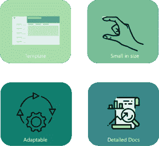**

*****下面我列出了 VueJS 的几个关键特性:*****

*   ****模板** : Vue.js 提供了基于 HTML 的模板，将 DOM 与 Vue.js 实例数据绑定在一起。Vue.js 将模板编译成虚拟 DOM 渲染函数。web 开发人员可以使用渲染函数的模板，并且可以用渲染函数替换模板。**
*   ****体积小**:JavaScript 框架的成功取决于它的体积。尺寸越小，用的就越多。Vue.js 最大的优势之一就是体积小。这个框架的大小是 18-21KB。**
*   ****自适应** : Vue 允许用户使用虚拟节点在 HTML 文件、JavaScript 文件和纯 JavaScript 文件中编写自己的模板。这种灵活性也使 React.js、Angular.js 和任何其他新的 JavaScript 框架的开发人员易于理解。它基于 JavaScript 框架，可以集成到其他基于 JavaScript 构建的应用程序中。**
*   ****详细文档**:开发人员总是喜欢使用带有详细文档的框架，因为编写他们的第一个应用程序总是很容易。Vue.js 的文档非常全面，任何了解 JavaScript 和 HTML 的用户都可以开发自己的应用程序或网页。**

# **2.JavaScript 框架:ReactJS**

**React 是另一个由脸书维护的 JavaScript 库，用于构建交互式复杂用户界面。它是最流行的框架之一，有超过 30 万个网站在其 UI 中实现了 React。举几个网站来说，我们有 Microsoft.com、yahoo.com 等等。**

**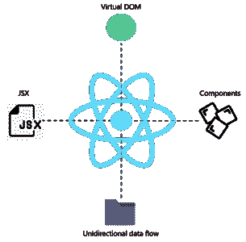**

*****下面我列举了 ReactJS 的几个关键特性:*****

*   ****虚拟 DOM** :在 React 中，对于每个 DOM 对象，都有一个对应的“虚拟 DOM 对象”。虚拟 DOM 对象是一个 DOM 对象的表示，它创建了一个原始 DOM 的虚拟副本。这是一个单向的数据绑定，因此操纵虚拟 DOM 比更新原始 DOM 要快，因为屏幕上什么也没有画出来。**
*   ****JSX**:React 使用了 JSX，一种使用 HTML 引用的简单 JavaScript，而不是通常用于模板的 JavaScript。您还可以使用 HTML 语法来呈现子组件，或者用老式的 JavaScript 编写，这意味着您可以灵活地编写代码。**
*   ****单向数据流** : React.js 被设计成只支持在一个流中向下游流动的数据。如果数据必须向另一个方向流动，您将需要额外的功能。**
*   **组件:在 React 中，一切都被视为组件，因此你可以很容易地导入 React 支持的组件，而不是编码或构建一个完整的特性，你可以导入并使用它。**

# **1.JavaScript 框架:AngularJS**

**Angular 是最强大、最高效、最开源的 JavaScript 框架之一。在我的十大 JavaScript 框架列表中，不可能不提到 Angular。该框架由 Google 运营，用于开发单页面应用程序(SPA)。这个开发框架之所以为人所知，主要是因为它为开发人员提供了将 JavaScript 与 HTML 和 CSS 相结合的最佳条件。超过 50 万个网站，如 google.com、youtube.com 等。正在使用角形。**

**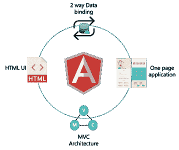**

*****下面我列举了几个棱角分明的关键特征:*****

*   ****MVC 架构**:AngularJS 最重要的特性之一是 MVC，即模型-视图-控制器架构。MVC 架构分为三个元素，即模型、视图和控制器。**

1.  ***模型*:它是 MVC 架构中存储数据的最底层。**
2.  ***视图*:这个元素负责向用户展示你的所有数据。**
3.  ***控制器*:它基本上是一个控制模型和视图之间整个交互的软件代码。**

*   **2way binding :这是一个惊人的特性，让 AngularJS 从其他 JavaScript 框架中脱颖而出。角度数据绑定在模型和视图之间建立了一个链接。在双向数据绑定过程中，视图显示模型中所做的更改，而模型反映视图中所做的更改。**
*   ****单页应用**:使用 AngularJS 框架，你可以构建完全响应的单页应用，可以轻松完美地适应不同的屏幕尺寸。此外，与其他网络应用相比，这些应用还能够提供更好的用户体验。由于基于 AngularJS 的单页应用程序是在客户端呈现的，它们通过降低 web 服务器的负载来减少网络流量**
*   ****HTML UI**:angular js 的另一个伟大特性是它使用 HTML 语言来构建用户界面。HTML 语言是一种常见的声明性语言，具有非常短的易于理解的标记。这导致了一个更加有组织和简单的用户界面。JavaScript 界面的开发和组织通常更加复杂。如果您正在寻找一种快速、简单、易于使用的解决方案，那么这就是您想要的。**

**我希望你觉得这篇博客内容丰富，知识渊博。请在评论部分告诉我们，你认为还有哪个框架可以进入这个列表。**

**如果你想查看更多关于人工智能、Python、道德黑客等市场最热门技术的文章，你可以参考 [Edureka 的官方网站。](https://www.edureka.co/blog/?utm_source=medium&utm_medium=content-link&utm_campaign=top-10-javascript-frameworks)**

**请留意本系列中的其他文章，它们将解释 JavaScript 的各个方面。**

> **1.[JQuery 简介](/edureka/jquery-tutorial-for-beginners-679021d74ab4)**
> 
> **2. [JavaScript 项目](/edureka/javascript-projects-f718db7dd7d5)**
> 
> **3. [JSP 面试问答](/edureka/jsp-interview-questions-41b240f9414c)**
> 
> **4.[如何搭建一个 JavaScript 计算器？](/edureka/javascript-calculator-47778c7596f3)**

***原载于 2018 年 9 月 28 日*[*https://www.edureka.co*](https://www.edureka.co/blog/top-10-javascript-frameworks/)*。***