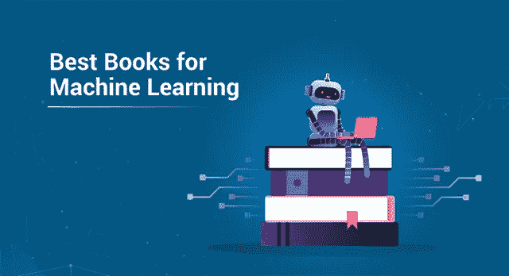
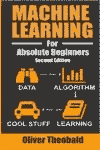
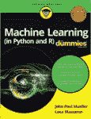
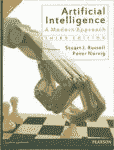
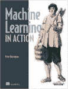
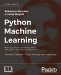
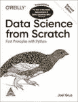
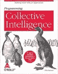
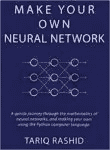
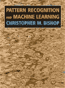

# 你应该读的十本机器学习书籍

> 原文：<https://medium.com/edureka/top-10-machine-learning-books-541f011d824e?source=collection_archive---------0----------------------->

Best Books for Machine Learning — Edureka

书籍是美丽的，文字是他们的武器库。每一个字都促使你去想象更多，这样，你就能学到更多。你自己的步调和你自己的方便，按需学习。想知道什么是机器学习的最佳书籍是哪一本？没有一本书能满足所有的需求。这就是为什么我们挖掘并找到了从完全初学者到高级开发人员的最好的机器学习书籍。

这篇文章分为以下几个部分:

*   什么是机器学习？
*   机器学习入门书籍

1.  绝对初学者的机器学习
2.  假人的机器学习
3.  人工智能:现代方法
4.  机器学习在行动
5.  黑客的机器学习

*   机器学习的高级书籍

1.  Python 机器学习
2.  从零开始的数据科学
3.  编程集体智慧
4.  制作你自己的神经网络
5.  模式识别和机器学习

# 什么是机器学习？

> 机器学习是创建模型的过程，这些模型可以执行特定的任务，而不需要人类对它进行显式编程来做一些事情。

简单来说，机器学习就是教你的计算机一些东西。它可能是区分狗和猫，或者区分水果，诊断病人的癌症，创建一个聊天机器人来帮助抑郁症患者。这可能是教你的计算机阅读，所有这一切都可能通过机器学习。这样一来，让我们找出所有学习机器学习的最佳书籍！

# 机器学习入门书籍

让我们首先浏览一些初学者的书籍，因为这是最有意义的。因此，请仔细阅读我们对所有机器学习新手的建议。

## 奥利佛·西奥博尔德的《绝对初学者的机器学习》

书名说明了一切。面向绝对初学者的机器学习适用于任何对它完全陌生的人。你可能没有任何编程知识或数学知识，你仍然可以使用这本书开始机器学习。就是这么好。作者的语言以及他是如何解释一切的——牢记一个对这一切都不熟悉的人的视角——是当今市场上最好的语言之一。

它有漂亮的视觉效果和图表，对每个算法都有很好的解释，并且用 Python 编写了一些代码，将机器学习付诸实践。所以，所有新来的人，这是一本入门书。

## 约翰·保罗·穆勒和卢卡·马萨隆的《假人的机器学习》

再往上一点，我们有《傻瓜机器学习》,它着眼于机器学习的理论和基本概念，让读者习惯它的所有术语。它教你如何在实践中应用机器学习，并介绍有效应用它们所需的编程语言和工具。

它介绍了使用 Python 和 R 编程语言进行编码，以及如何使用它们来教会您的计算机某些模式和分析结果。您可以了解机器学习的应用程序在现实世界中是如何使用的，这是进入机器学习世界的一个很好的开端。

## 人工智能:斯图尔特·拉塞尔和彼得·诺维格的现代方法

对于那些想知道人工智能与机器学习有什么关系的人来说？机器学习是人工智能的一个子领域，它们有很多共同点。这本书是前两本书的完美升级，因为它详细地涵盖了两个主题，并且语言非常简单易懂。

它谈到了它们之间的差异，以及你需要如何完美地理解问题，并相应地找到解决方案。一本真正的好书，帮助你区分问题的方法，并找到所需的路径。

## 彼得·哈灵顿的《机器学习在行动》

进入编程领域，我们有这本由 Peter 写的漂亮的书，他设计得非常高效，并且使它对用户友好。他介绍了开始构建机器学习算法所需的所有技术，以及如何从这些算法中获取数据进行数据分析。

如果你熟悉编码，最好是用 Python，这会很有帮助，这样你就不会理解不了任何东西。这可能是初学者入门机器学习编码的最佳教程。

## 德鲁·康威和约翰·迈尔斯·怀特的《黑客机器学习》

现在，对于那些真正擅长编码但数学背景不好的人来说，这是一本适合你们的书。不要认为黑客是与网络安全有关的人，但这里的黑客指的是那些已经擅长编码的人。这本书深入强调了机器学习所需的数学，并使用了真实世界的场景和用例，可以帮助你掌握它。R 编程语言中典型的机器学习问题是开始，然后进入高级主题，在那里你将学到如何建立一个推荐系统和那些种类的应用程序。如果你对高级编码已经很熟悉了，这本书是值得学习的。

现在，我们已经介绍了初级水平的书籍，让我们提升水平，看看高级概念的书籍等等。机器学习的高级书籍

# 机器学习的高级书籍

## Sebastian Raschka 和 Vahid Mirjalili 的 Python 机器学习

这本书可能是唯一一本专注于一种编程语言的书，这种语言就是 Python，它可以帮助您理解和开发各种机器学习、深度学习和数据分析算法。它介绍了各种强大的库，如 Scikit-Learn，用于实现各种机器学习算法。接下来，它还会教你使用张量流模块进行深度学习。它还教你各种方法，这些方法可以用来提高你制作的模型的效率，最后向你展示你可以使用机器和深度学习实现的各种数据分析机会。

## Joel Grus 用 Python 从头开始研究数据科学

一旦你完成了 Python 机器学习，就从这本书开始吧，因为它教你到底什么是数据科学以及它的所有术语。由于机器学习的基础知识已经涵盖，这将有助于你进一步了解你到底可以用你获得的数据做什么，以及更多。是的，你不需要事先知道机器学习，但理解它会带来更好的深度和对主题的理解。

## 托比·塞格兰的《集体智慧编程》

你用机器学习做什么？实际应用在哪里？这本书有所有问题的答案。这是一本非常有趣的书，教你如何应用机器学习来开发更智能的应用程序。它教你如何为网站、应用程序等应用机器学习。这本书采用基于项目的方法，教你一个项目，它是如何制作的等等，然后加入机器学习的味道，显著提高项目的效率。这可能是最好的方法，因为它告诉你机器学习的重要性。

## 塔里克·拉希德制作自己的神经网络

当数据增长时，机器学习就会失败。因此，深度学习开始发挥作用。对于每个想研究深度学习以及它们如何优于典型的机器学习的人来说，这本书很美。它用实际的例子和问题教你如何用 Python 构建你的神经网络。文笔优美，有助于你理解这个相当难的主题。

## **模式识别和机器学习**作者 Christopher M. Bishop

对于每个想成为数据科学家的人来说，这是你需要的书。它涵盖了统计和概率的各种不断发展的主题，并通过寻找什么模式使数据更好或更坏，以及如何利用它们进行机器学习。从一般的例子到真实世界的数据收集和模式研究，它都教给你。这绝对是一本只有高级程序员才应该读的书。这肯定会帮助你提升自己，并可能让你在机器学习领域找到一份好工作。

这基本上总结了我们给你的建议，从初学者一直到最先进的领域。我们希望您喜欢我们的推荐。

如果你想查看更多关于 Python、DevOps、Ethical Hacking 等市场最热门技术的文章，你可以参考 Edureka 的官方网站。

请留意本系列中的其他文章，它们将解释数据科学的各个方面。

> *1。* [*数据科学教程*](/edureka/data-science-tutorial-484da1ff952b)
> 
> *2。* [*数据科学的数学与统计*](/edureka/math-and-statistics-for-data-science-1152e30cee73)
> 
> *3。*[*R 中的线性回归*](/edureka/linear-regression-in-r-da3e42f16dd3)
> 
> *4。* [*机器学习算法*](/edureka/machine-learning-algorithms-29eea8b69a54)
> 
> *5。*[*R 中的逻辑回归*](/edureka/logistic-regression-in-r-2d08ac51cd4f)
> 
> *6。* [*分类算法*](/edureka/classification-algorithms-ba27044f28f1)
> 
> *7。* [*随机森林中的 R*](/edureka/random-forest-classifier-92123fd2b5f9)
> 
> *8。* [*决策树中的 R*](/edureka/a-complete-guide-on-decision-tree-algorithm-3245e269ece)
> 
> *9。* [*机器学习入门*](/edureka/introduction-to-machine-learning-97973c43e776)
> 
> *10。* [*朴素贝叶斯在 R*](/edureka/naive-bayes-in-r-37ca73f3e85c)
> 
> *11。* [*统计与概率*](/edureka/statistics-and-probability-cf736d703703)
> 
> *12。* [*如何创建一个完美的决策树？*](/edureka/decision-trees-b00348e0ac89)
> 
> *13。* [*关于数据科学家角色的 10 大误区*](/edureka/data-scientists-myths-14acade1f6f7)
> 
> *14。* [*顶级数据科学项目*](/edureka/data-science-projects-b32f1328eed8)
> 
> 15。 [*数据分析师 vs 数据工程师 vs 数据科学家*](/edureka/data-analyst-vs-data-engineer-vs-data-scientist-27aacdcaffa5)
> 
> 16。 [*人工智能的种类*](/edureka/types-of-artificial-intelligence-4c40a35f784)
> 
> *17。*[*R vs Python*](/edureka/r-vs-python-48eb86b7b40f)
> 
> *18。* [*人工智能 vs 机器学习 vs 深度学习*](/edureka/ai-vs-machine-learning-vs-deep-learning-1725e8b30b2e)
> 
> 19。 [*机器学习项目*](/edureka/machine-learning-projects-cb0130d0606f)
> 
> 20。 [*数据分析师面试问答*](/edureka/data-analyst-interview-questions-867756f37e3d)
> 
> *21。* [*面向非程序员的数据科学和机器学习工具*](/edureka/data-science-and-machine-learning-for-non-programmers-c9366f4ac3fb)
> 
> *22。* [*十大机器学习框架*](/edureka/top-10-machine-learning-frameworks-72459e902ebb)
> 
> *23。* [*用于机器学习的统计*](/edureka/statistics-for-machine-learning-c8bc158bb3c8)
> 
> *24。* [*随机森林中的 R*](/edureka/random-forest-classifier-92123fd2b5f9)
> 
> *25。* [*广度优先搜索算法*](/edureka/breadth-first-search-algorithm-17d2c72f0eaa)
> 
> *26。*[*R 中的线性判别分析*](/edureka/linear-discriminant-analysis-88fa8ad59d0f)
> 
> *27。* [*机器学习的先决条件*](/edureka/prerequisites-for-machine-learning-68430f467427)
> 
> *28。* [*互动 WebApps 使用 R 闪亮*](/edureka/r-shiny-tutorial-47b050927bd2)
> 
> *29。* [*监督学习*](/edureka/supervised-learning-5a72987484d0)
> 
> *三十。* [*无监督学习*](/edureka/unsupervised-learning-40a82b0bac64)
> 
> *31。* [*10 本最好的数据科学书籍*](/edureka/10-best-books-data-science-9161f8e82aca)
> 
> 32。 [*机器学习使用 R*](/edureka/machine-learning-with-r-c7d3edf1f7b)

*原载于 2019 年 11 月 5 日*[*https://www.edureka.co*](https://www.edureka.co/blog/top-10-machine-learning-books/)*。*