# 2020 年医疗保健十大机器学习公司

> 原文：<https://medium.com/quick-code/top-10-machine-learning-companies-of-healthcare-in-2020-388bd58d6218?source=collection_archive---------0----------------------->

AI & ML 现在几乎进入了所有的行业。机器学习和深度学习将是 2020 年最新兴的技术。机器学习(ML)将会有无限的范围和大量的发明机会。

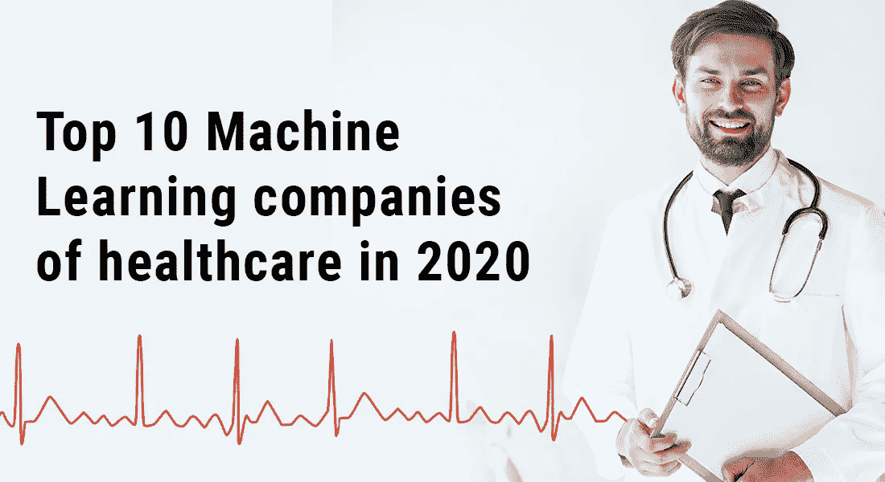

写这篇博客的目的是机器学习如何为医疗保健行业做出重要贡献，并且读者可以了解关于定制医疗保健软件开发公司的知识。

这些信息将有助于所有那些想在人工智能和人工智能基础上创业和做生意的人。并且有奉献精神和能力为医疗行业工作，为社会带来创新的想法和产品。

带着这种想法，让我们向有史以来最好的 ML 公司前进。

**1。**[苹果](https://www.apple.com/)

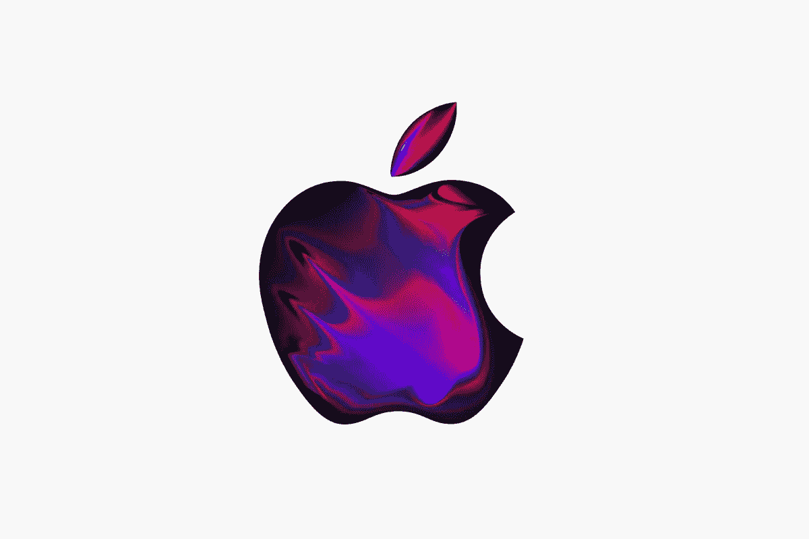

所有人都知道苹果。这家美国公司是世界上最好的技术和电子设备公司之一。苹果是那些相信创新的公司之一。几乎所有的手机都配备了最新的技术。对医疗保健的贡献可以估计，因为苹果是 NeurIPS 研讨会的钻石赞助商。

**2。** [**基础技术**](https://www.bacancytechnology.com/)

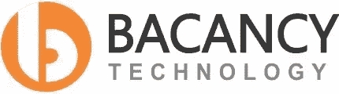

Bacancy Technology 是一家总部位于美国的公司，为医疗保健领域的人工智能和人工智能提供解决方案。该公司在过去 8 年多的时间里一直致力于医疗保健服务。该公司的愿景是发明和创造新的设施，为我们的后代造福。
[https://www . bacancytechnology . com/health care-application-software-development](https://www.bacancytechnology.com/healthcare-application-software-development)

**3。** [**葛医疗**](https://www.gehealthcare.com/)

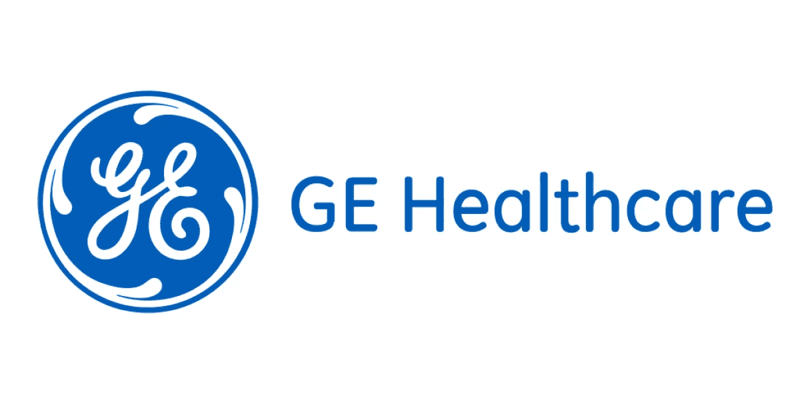

通用电气公司是一家美国跨国企业集团，它拥有通用医疗保健公司的子公司。该公司是医疗成像过程中使用的放射性药物的生产商和经销商。该公司还为 CT 扫描制作共振图像。

**4。** [**谷歌 Deepmind 健康**](https://deepmind.com/)

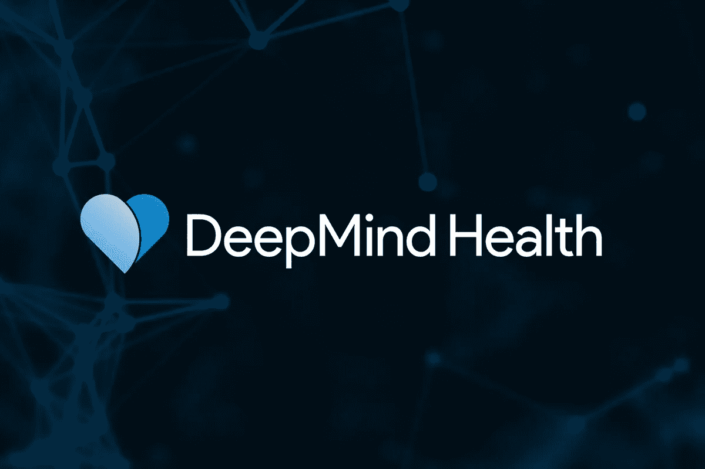

谷歌是搜索巨头。医疗保健是人工智能和人工智能的新兴领域之一。那么，谷歌如何才能置身于行业变革之外呢？它获得了深度思维。Deepmind 是一家总部位于英国的人工智能初创公司，成立于 2010 年，于 2014 年被谷歌收购。该公司开发了一种像人类一样玩视频游戏的神经网络。

**5。** [**AiCure**](https://aicure.com/)

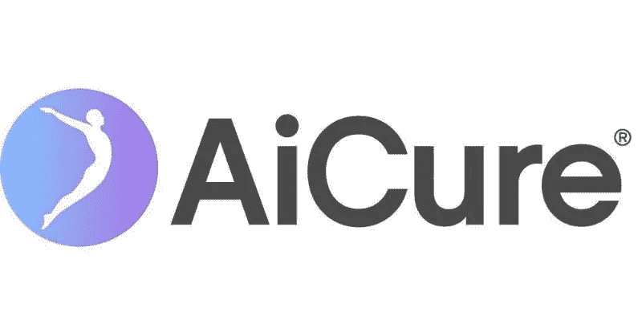

AiCure 是一家为医疗保健行业工作的人工智能和高级数据分析公司。他们提供音频、视频和行为数据，以获得患者和治疗的支持。很容易生成报告和患者的病史。许多临床软件可以让医生简化这个过程。公司总部设在美国

**6。** [**Apixio**](https://www.apixio.com/)

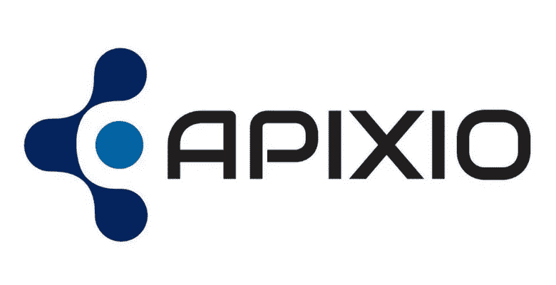

Apixio 是一家医疗保健数据分析公司，从事数据存储和分析。他们相信更好的数据和更好的医疗保健。他们提供符合标准的医疗软件服务。这家公司总部设在美国。
**7。**[**clin think**](https://www.clinithink.com/)

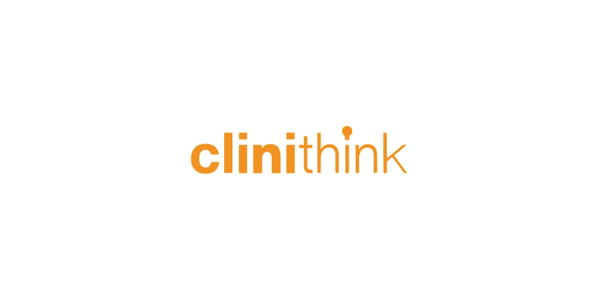

Clinithink 是一家总部位于美国的技术公司，使用人工智能和人工智能来提供快速准确的医疗保健数据。他们认为，如果诊断更加精确，治疗就会更加有效。

**8。**[**cloud medx**](https://www.cloudmedxhealth.com/)

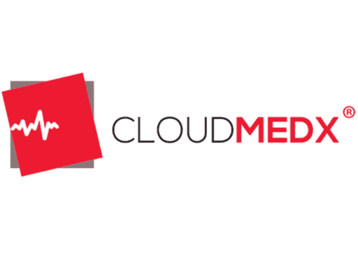

Cloudmedx 是美国的 AI 和 ML 医疗保健开发公司，提供患者的详细临床记录。该公司有一个维护病历、临床病史、人口统计和其他医疗程序的系统。
**9。** [**启蒙**](https://www.enlitic.com/)

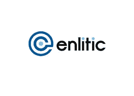

Enlitic 是一家总部位于美国的医疗保健软件开发公司，在人工智能的帮助下。在临床数据、开发的软件和医生的帮助下，公司进行提前诊断。他们的目标是建立拥有最先进的诊断设备类型的放射科医生，用于病人护理。
10**。** [**熨斗健康**](https://flatiron.com/)

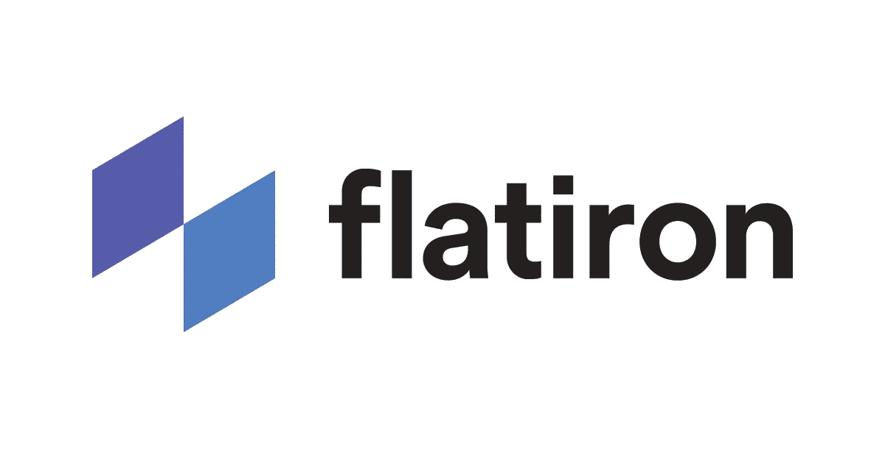

Flatrion Health 是一家在 Ai 和 ML 的帮助下对抗癌症的公司。该公司为生命科学、学术界和医院工作。该公司还致力于医学的另一个分支，肿瘤学，这是一种治疗癌症的方法。学习将是最值得信赖的技术之一，它将借助数据和最少的人力投入来完成任务。

希望这里提供的信息对所有读者有所帮助。任何有任何创新和改进想法的人都可以在这里发表评论。如果任何其他公司正在为机器学习工作，也可以讨论，以便所有人都能意识到这一点。