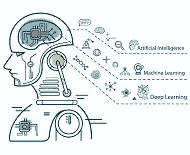
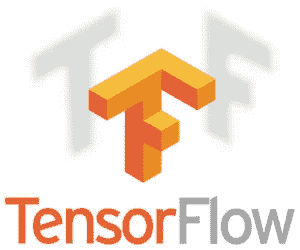
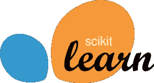
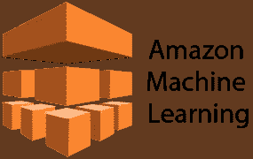
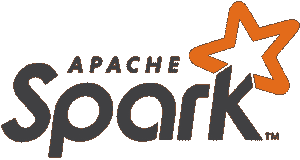

# 2021 年你需要知道的 10 大机器学习框架

> 原文：<https://medium.com/edureka/top-10-machine-learning-frameworks-72459e902ebb?source=collection_archive---------0----------------------->

机器学习的时代已经到来，它在技术领域取得了很多进展，根据 Gartner 的报告，到 2020 年，机器学习和人工智能将创造 230 万个工作岗位，这种巨大的增长导致了各种机器学习框架的发展。在本文中，我们将讨论以下主题:

*   什么是机器学习？
*   十大机器学习框架

1.  张量流
2.  Theano
3.  sci kit-学习
4.  咖啡
5.  H20
6.  亚马逊机器学习
7.  火炬
8.  谷歌云 ML 引擎
9.  Azure ML 工作室
10.  火花 ML 库

# 什么是机器学习？

机器学习是一种人工智能，允许软件应用程序从数据中学习，并在没有人类干预的情况下更加准确地预测结果。

这是一个允许机器从例子和经验中学习的概念，并且不需要显式编程。为了实现这一点，我们现在有很多机器学习框架。机器学习算法是普通算法的进化。它们允许你的程序从你提供的数据中自动学习，从而使你的程序更加智能。

# 十大机器学习框架

机器学习框架是一个接口、库或工具，它允许开发人员轻松构建机器学习模型，而无需深入底层算法。让我们详细讨论 10 大机器学习框架:

## 张量流

Google 的 Tensorflow 是当今最流行的框架之一。这是一个使用数据流图进行数值计算的开源软件库。TensorFlow 实现了数据流图，其中批量数据或张量可以通过一系列由图描述的算法来处理。

## Theano

Theano 非常好地折叠在 Keras 之上，Keras 是一个异常状态神经系统库，它几乎与 Theano 库并行运行。Keras 的基本优势在于，它是一个用于深度发现的适度的 Python 库，可以持续运行在 ano 或 TensorFlow 之上。

它的创建是为了使深入学习模型的实现对创新工作来说既快速又简单可行。在宽容的 MIT 许可下，它继续在 Python 2.7 或 3.5 上运行，并且可以在给定基本结构的 GPU 和 CPU 上一致地执行。

## Sci-Kit 学习

Scikit-learn 是最著名的 ML 库之一。对于管理的和无监督的学习计算，它是优选的。先例实现直接和计算的复发、选择树、群聚、k-隐含等。

这个框架涉及常规人工智能和数据挖掘任务的大量计算，包括群聚、复发和排序。

## 咖啡

Caffe 是另一种受欢迎的学习结构，以清晰度、速度和测量质量为首要目标。它是由伯克利视觉和学习中心(BVLC)和网络捐助者创建的。

Google 的 DeepDream 依赖于 Caffe 框架。这个结构是 BSD 授权的 C++库，带有 Python 接口。

## H20

H20 是一个开源的机器学习平台。它是一种面向业务的人工智能工具，有助于根据数据做出决策，并使用户能够获得洞察力。它主要用于预测建模、风险和欺诈分析、保险分析、广告技术、医疗保健和客户智能。

## 亚马逊机器学习

Amazon Machine Learning 提供可视化工具，帮助您完成创建机器学习(ML)模型的过程，而不必学习复杂的 ML 算法和技术。

这是一项让所有技能水平的开发人员都可以轻松使用机器学习技术的服务。它连接到存储在亚马逊 S3、红移或 RDS 中的数据，并可以对数据运行二元分类、多类分类或回归来构建模型。

## 火炬

这个框架首先向 GPU 提供了对机器学习算法的广泛支持。由于简单快速的脚本语言、 **LuaJIT** 和底层的 **C/CUDA** 实现，它易于使用且高效。

Torch 的目标是以极其简单的过程最大限度地提高构建科学算法的灵活性和速度。

## 谷歌云 ML 引擎

云机器学习引擎是一项托管服务，可帮助开发人员和数据科学家在生产中构建和运行卓越的机器学习模型。

它提供训练和预测服务，可以一起使用或单独使用。企业使用它来解决问题，如确保食品安全、卫星图像中的云、以四倍的速度回复客户电子邮件等。

## Azure ML 工作室

这个框架允许微软 Azure 用户创建和训练模型，然后将它们转换成可供其他服务使用的 API。此外，对于更大的模型，您可以将自己的 Azure 存储连接到服务。

要使用 Azure ML Studio，你甚至不需要一个帐户来试用这项服务。您可以匿名登录并使用 Azure ML Studio 长达八小时。

## 火花 ML 库

这是 Apache Spark 的机器学习库。这个框架的目标是让实用的机器学习变得可扩展和简单。

它由常见的学习算法和实用程序组成，包括分类、回归、聚类、协同过滤、降维，以及较低级别的优化原语和较高级别的管道 API。

至此，我们已经到了十大机器学习框架列表的末尾。

如果你想查看更多关于 Python、DevOps、Ethical Hacking 等市场最热门技术的文章，你可以参考 Edureka 的官方网站。

请留意本系列中的其他文章，它们将解释数据科学的各个方面。

> *1。* [*数据科学教程*](/edureka/data-science-tutorial-484da1ff952b)
> 
> *2。* [*数据科学的数学与统计*](/edureka/math-and-statistics-for-data-science-1152e30cee73)
> 
> *3。*[*R 中的线性回归*](/edureka/linear-regression-in-r-da3e42f16dd3)
> 
> *4。* [*数据科学教程*](/edureka/data-science-tutorial-484da1ff952b)
> 
> *5。*[*R 中的逻辑回归*](/edureka/logistic-regression-in-r-2d08ac51cd4f)
> 
> *6。* [*分类算法*](/edureka/classification-algorithms-ba27044f28f1)
> 
> *7。* [*随机森林中的 R*](/edureka/random-forest-classifier-92123fd2b5f9)
> 
> *8。* [*决策树中的 R*](/edureka/a-complete-guide-on-decision-tree-algorithm-3245e269ece)
> 
> *9。* [*机器学习入门*](/edureka/introduction-to-machine-learning-97973c43e776)
> 
> *10。* [*朴素贝叶斯在 R*](/edureka/naive-bayes-in-r-37ca73f3e85c)
> 
> *11。* [*统计与概率*](/edureka/statistics-and-probability-cf736d703703)
> 
> *12。* [*如何创建一个完美的决策树？*](/edureka/decision-trees-b00348e0ac89)
> 
> *13。* [*关于数据科学家角色的 10 大误区*](/edureka/data-scientists-myths-14acade1f6f7)
> 
> *14。* [*顶级数据科学项目*](/edureka/data-science-projects-b32f1328eed8)
> 
> *15。* [*数据分析师 vs 数据工程师 vs 数据科学家*](/edureka/data-analyst-vs-data-engineer-vs-data-scientist-27aacdcaffa5)
> 
> 16。 [*人工智能类型*](/edureka/types-of-artificial-intelligence-4c40a35f784)
> 
> 17。 [*R vs Python*](/edureka/r-vs-python-48eb86b7b40f)
> 
> 18。 [*人工智能 vs 机器学习 vs 深度学习*](/edureka/ai-vs-machine-learning-vs-deep-learning-1725e8b30b2e)
> 
> *19。* [*机器学习项目*](/edureka/machine-learning-projects-cb0130d0606f)
> 
> 20。 [*数据分析师面试问答*](/edureka/data-analyst-interview-questions-867756f37e3d)
> 
> *21。* [*面向非程序员的数据科学和机器学习工具*](/edureka/data-science-and-machine-learning-for-non-programmers-c9366f4ac3fb)
> 
> *二十二。*[*5 大机器学习算法*](/edureka/machine-learning-algorithms-29eea8b69a54)
> 
> *23。* [*用于机器学习的统计*](/edureka/statistics-for-machine-learning-c8bc158bb3c8)
> 
> *24。* [*随机森林中的 R*](/edureka/random-forest-classifier-92123fd2b5f9)
> 
> *25。* [*广度优先搜索算法*](/edureka/breadth-first-search-algorithm-17d2c72f0eaa)
> 
> *26。*[*R 中的线性判别分析*](/edureka/linear-discriminant-analysis-88fa8ad59d0f)
> 
> *27。* [*机器学习的先决条件*](/edureka/prerequisites-for-machine-learning-68430f467427)
> 
> *28。* [*互动 WebApps 使用 R 闪亮*](/edureka/r-shiny-tutorial-47b050927bd2)
> 
> *29。* [*机器学习十大书籍*](/edureka/top-10-machine-learning-books-541f011d824e)
> 
> 三十。 [*无监督学习*](/edureka/unsupervised-learning-40a82b0bac64)
> 
> *31.1* [*0 最佳数据科学书籍*](/edureka/10-best-books-data-science-9161f8e82aca)
> 
> *32。* [*监督学习*](/edureka/supervised-learning-5a72987484d0)

*原载于 2019 年 8 月 8 日*[*【https://www.edureka.co】*](https://www.edureka.co/blog/top-10-machine-learning-frameworks/)*。*