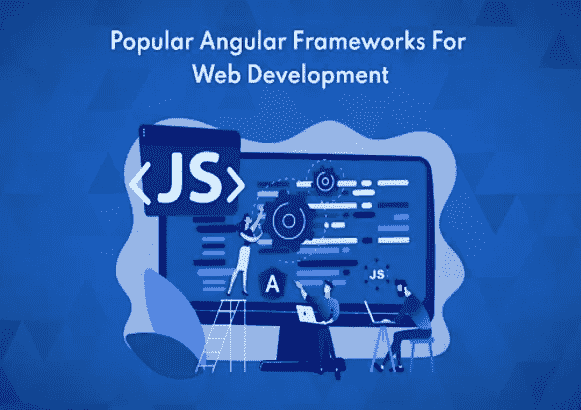

# 2022 年十大最受欢迎的 Angular JS 框架

> 原文：<https://medium.com/quick-code/top-10-most-popular-angular-js-frameworks-for-the-year-2022-5b57c4414123?source=collection_archive---------1----------------------->

## 这篇文章是关于开发 Angular.js 应用程序的最佳 Angular 框架。我们还考虑了使用 Angular JS 框架的优势。

## 十大最受欢迎的棱角。2022 年 JS 框架

一个专业的应用程序开发人员会尽一切可能让他或她的应用程序变得吸引人和漂亮。他或她总是钻研最新的工具和技术，推出一款让客户满意的应用。一个好的 web 或移动应用程序能够吸引更多的客户，变得受欢迎，并最终增加商业收入。

这一直是任何开发者的主要目标。App 开发框架在这种高级专属开发中扮演着非常重要的角色。这些框架是帮助开发人员轻松高效地开发 web 应用程序和 API 的库。

由于行业革命，信息技术世界充斥着如此多的框架。我们可以不时地看到定制 web 开发的新版本。Angular.js 也有几个框架，都有其意义和好处。因此，对于专业开发人员来说，挑选一个最适合他们的定制 web 开发需求的变得非常忙乱。

## 为什么框架很受欢迎？

广大的 [**定制 web 应用开发**](https://www.groovyweb.co/service/web-development) ，react native app 开发公司，angular.js 开发公司利用流行的 web 框架，做出了一款令人惊艳的 app，在业界走红。但是问题来了，为什么这些专家更喜欢用 web 开发框架进行开发呢？

这是因为我们可以从 AngularJS 的框架和高级特性中获得很多好处！框架使得令人兴奋的开发变得简单而高效。通过对代码进行细微的修改，您可以迅速增强它们的性能。此外，您可以将几个新功能集成到当前的功能中。为此，您需要很好地理解这些框架。

下面是这个框架带给你的更多好处。这些就是专业人士更喜欢使用 web 框架进行开发的原因。

*   双向数据绑定
*   应用程序的实时测试
*   支持并行开发
*   更快装载
*   简化的 MVC 模式
*   性能和速度
*   一页纸的大量应用

现在，让我们探索一下 Angular Js 最流行的 web 框架，您可以从中选择最适合您的开发需求的框架。

## 角度框架列表如下:

## **Ionic.js**

Ionic 是一个非常有角度的. js 框架，可以提高代码的可伸缩性。它是一个跨平台的开源框架，用于开发混合移动应用。ionic app 开发框架就像一个前端 SDK &与 AngularJS 完美配合，开发混合应用程序。

为了有一个完美的 Ionic 应用程序开发，HTML、CSS 和 JavaScript 代码的混合被世界各地的程序员所应用。如果专家们熟悉 AngularJS 框架，并且理解 HTML 和 CSS，那么他们可以利用他们的知识，用这个惊人的框架来构建一个健壮的移动应用程序。

## 爱奥尼亚的一些特点:

*   一次编写，随处运行
*   拥有吸引人的、可重用的组件
*   使用核心本机设备功能
*   包括开发者友好的工具

这个框架包含一个非常棒的命令行界面，用于管理您的应用程序。因为它是一个开源框架，你不需要支付任何订阅费来下载和使用你的项目平台。

## **移动角度 UI**

Mobile Angular UI 是一个流行的开源框架，用于构建混合移动应用程序。它使用 Twitter Bootstrap 和 Angular JS 来制作 HTML 5 混合桌面和移动应用程序。它的组件 Navbars 用于显示页脚部分、页眉部分和菜单栏。

Scrollable-footer 和 scrollable-header 是通过添加处理页眉和页脚的高度和位置的 CSS 类构建的。

## 移动 Angular UI 的一些特性:

*   到处都是棱角分明的 JS
*   具有有效的移动部件
*   根据您的需求定制的引导程序
*   从台式机到智能手机，再到台式机，尽可能轻松。

## **前端反应开发者**

React.js 是 Angular.js 开发公司(例如脸书)首选的流行 web 框架。它是一个流行的用于前端开发的 Java 脚本库，而不是一个框架，因为它是基于组件的。该库将 HTML 代码保存在 JavaScript 下，以允许它应用虚拟 DOM。

## React 的一些功能:

*   它有最好的用户界面
*   你可以很容易地学会它
*   您可以更快地构建它
*   这是目前的趋势
*   知名行业信任它
*   它拥有强大的社区支持

## vue . j

第四个流行的 web 框架，我们在这里讨论的是 Vue.js，它是一个开源模型 JavaScript 框架。它创建了单页应用程序和用户界面(UI)。它包含声明性呈现和组件组合的兼容架构。它的一些高级特性包括路由、状态管理和构建工具。

它允许称为指令的 HTML 属性。它们为 HTML 应用程序提供功能。

## 角度 UI 引导

这也是一个基于 JavaScript 的开源 CSS 框架。Angular UI Bootstrap 是一个移动友好前端的 web 开发者。你可以聘请最好的 angular.js 开发公司，为你的业务需求制作一个令人惊叹的 app。该设计包含了导航、排版、表单、按钮和辅助界面组件的模板。2021 年 8 月，它在 Git Hub 上被评为第十大明星企业。之后又推出了其他很棒的版本。

## 角状材料

Angular 是一个 web 开发框架， [**使用 HTML 或 TypeScript 构建单页面应用程序**](https://www.groovyweb.co/blog/learn-to-develop-your-own-mobile-app-with-app-development-process/) 。它可以通过您的 web 应用程序导入。谷歌在 2014 年推出了一种设计语言。在淘汰了 JavaScript 之后，谷歌在 2016 年发布了 Angular。他们从一开始就编写了代码。

然后谷歌给材质设计打上了棱角。最终，它被称为有角材料，并利用打字稿作为它的语言。UX 组件被标记为有角的材料。

## 它的一些主要特点如下:

*   足迹最小的 CSS
*   内置响应式设计
*   跨浏览器
*   按钮和文本栏的新版本
*   改进的功能，如工具栏、侧边导航、快速拨号和卡片。

## 弧度

Radian 是一个开源的 JavaScript 库，可以在 HTML 文档中直接嵌入图形。Radian 是由开放大脑的 Bayes Hive 创建的。专业人员可以利用 HTML 元素来表示情节，而不是编写 JavaScript。它绑定了 HTML 元素和 JavaScript 变量的属性。它在贝叶斯统计平台中被广泛使用。

## 它的一些吸引人的特点是:

*   易于用于功能图和基于数据的图
*   不需要写任何 JavaScript
*   拥有自由许可的开源软件
*   与 Angular.js 混合用于更复杂的交互式应用

## 平均 IO

意思是表达，蒙哥，角节点。意味着木卫一于 2013 年通过瓦列里·卡尔波夫发射升空。看起来传统框架有缩写灯。总部设在以色列的专业软件开发人员 Amos Haviv 首先发明了均值 io 的知识。平均 js 是从平均 io 推断出来的。前面的是后端开发框架，后面的是前端开发框架。

## 温泉 UI

Onsen UI 是基于 HTML 的混合 app 开发框架的最佳选择。在使用这个框架的时候，你将需要零设置时间，并且只需要 CSS、HTML 和 JavaScript。

Onsen UI 为您的 web 应用程序提供了丰富的布局和美学外观。通过 Onsen UI，你可以获得菜单、标签、表格、列表和许多其他宝贵的功能，使你的布局充满活力，引人入胜。

此外，该框架支持 iOS 和 Android 的每一项功能，因此一旦平台发生变化，该开发框架将自动识别操作系统，并应用适当的布局设置来实现同步的用户体验。

如果你正在使用低端设备或旗舰智能手机，这个框架将确保你的应用程序的即时速度和快速响应时间，没有任何错误。为了帮助用户，Onsen UI 优化了智能手机应用程序的性能。

任何第一次了解这个平台并且不知道如何编写代码的人都不必担心。基于该平台的大量资源，如文档、博客和教程，将快速提升您的学习曲线。

熟悉这个框架并在 AngularJS 代码中使用它对用户来说非常友好。一个没有多少技术专长的人也可以毫不费力地了解这个框架。

## 量角器

web 应用程序执行的最关键的阶段之一是测试部分。与头脑风暴类似，编程和开发测试对于确保应用程序在所有可能的情况下都能正常工作也至关重要。

为了执行完美的执行和测试，您应该选择量角器。这是一个完美的端到端 AngularJS 测试框架，通过动态测试优雅地验证代码的可工作性和效率。

它提供了定位器策略和新时代的功能，可以实际上自动化 Angular.js 应用程序的测试过程。

在测试 Angular.js 应用程序的时候，这个惊人的应用程序使用了 selenium 网格。selenium 网格将确保应用程序同时在许多浏览器上运行。

量角器以 WebDriber.js 为基础，支持各种框架，如 Mocha、Cucumber、Jasmine 等。量角器也有一个完美的和用户友好的等待时间。一旦你完成了你的编码部分，量角器将开始测试代码。

## 结论

因此，到目前为止，我们已经探索了 10 个流行的 web 框架，它们是最好的定制 web 开发公司所偏爱的。我们讨论的每一个角度框架都有它自己的意义，从而改进你的项目。但是专业开发人员必须找到最适合他们项目需求的框架。Groovy Web 有一个经验丰富的专家团队，可以为您提供最合适的解决方案。

如果你正在寻找最好的 angular.js 开发公司，来满足你所有的业务需求，那么你可以选择 Groovy Web 进行更好的开发。