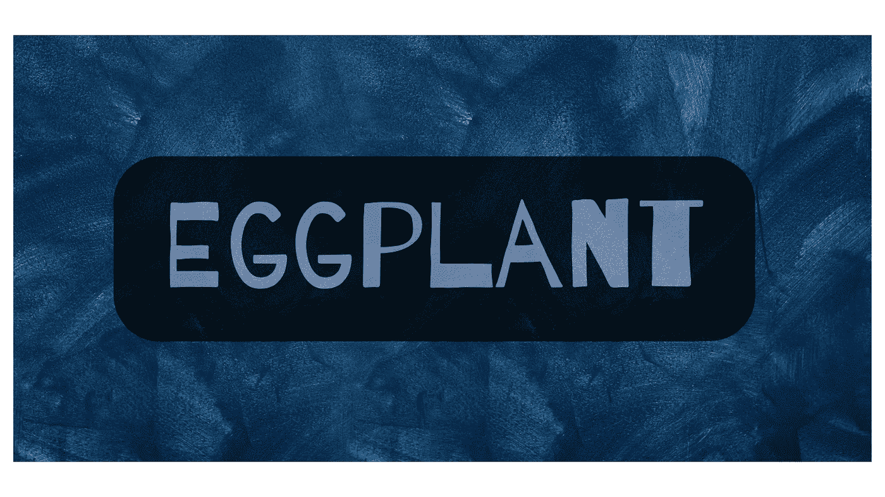
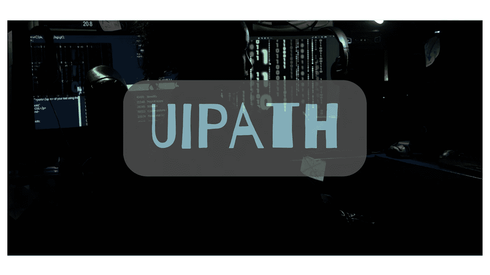
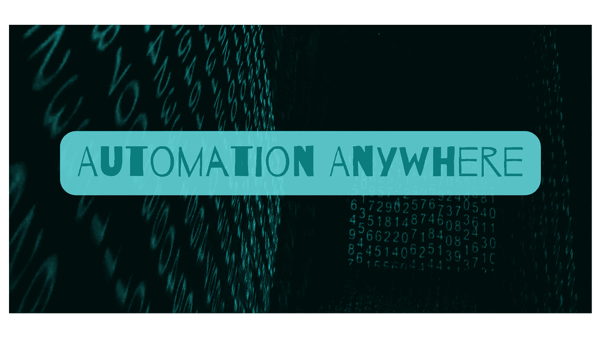
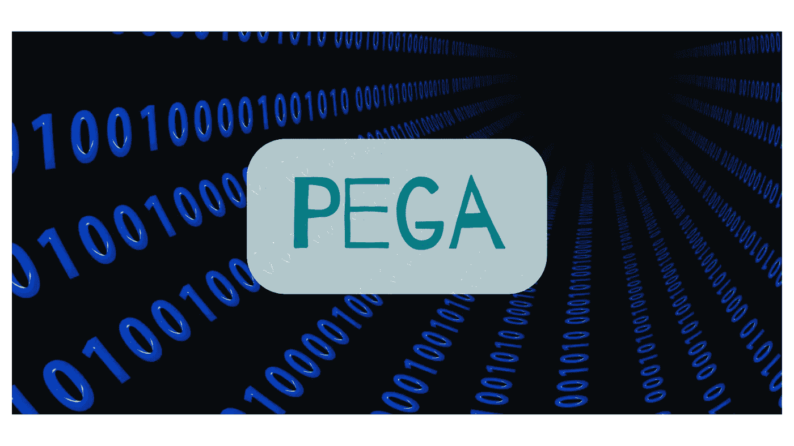
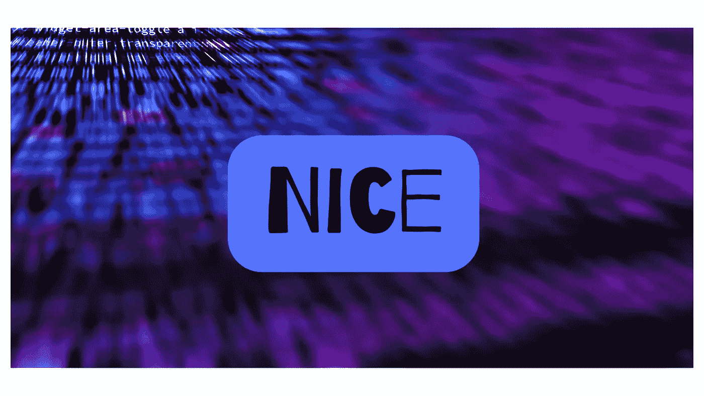
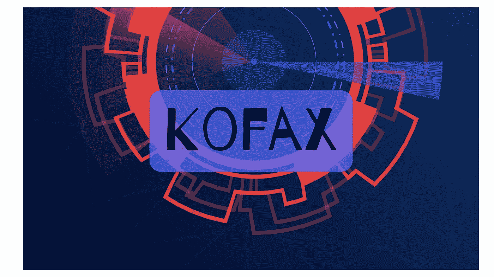
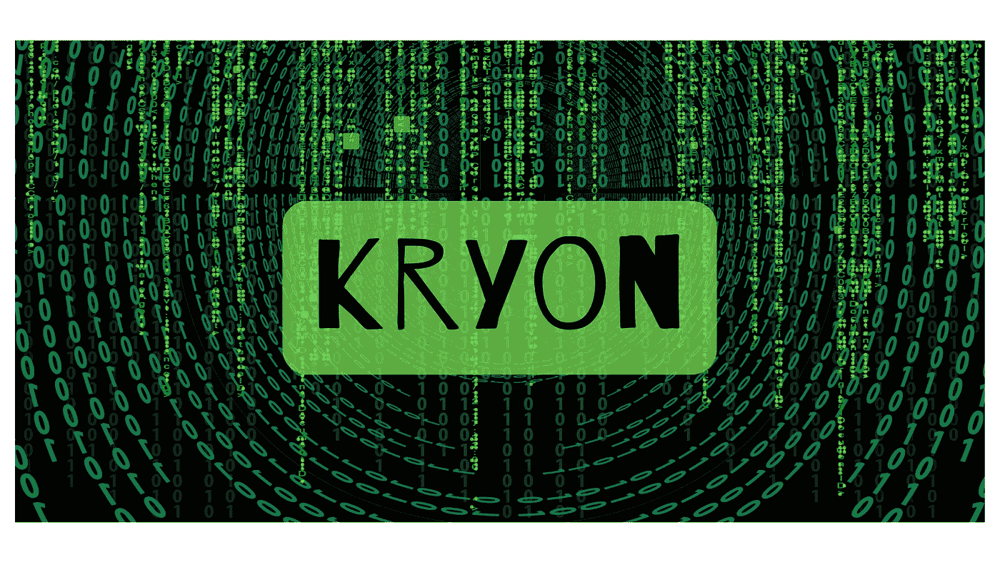

# 十大最受欢迎的机器人过程自动化工具

> 原文：<https://medium.com/quick-code/top-10-most-popular-robotics-process-automation-tools-cfd2325162f4?source=collection_archive---------1----------------------->

提到机器人，大多数人会想到先进的人工智能算法或者拟人化的机器。但是机器人也是一个过程，因此，它非常适合自动化。事实上，支持机器人相关流程自动化的软件工具的实现通常被称为 [**机器人流程自动化**](https://www.interviewbit.com/rpa-interview-questions/) (RPA)。

这些工具旨在处理所有可以记录在程序和协议中的常规任务。它们可能没有人工智能那么性感，但它们对于机器人技术的采用和制造流程的数字化转型同样至关重要。在这篇博文中，您将了解当今市场上的 10 大 RPA 工具。

# 什么是机器人过程自动化？

机器人学是制造能够感知环境并根据指令移动的机器的科学和工程。流程是一系列相互关联的活动，其中一项活动的输出和输入成为另一项活动的输入。流程自动化工具是一种软件或系统，旨在管理和改进操作流程。

机器人流程自动化工具是软件应用程序，可复制和自动化当前手动和基于纸张的流程。这些工具不仅减少了对劳动力的需求，还消除了人为错误的风险，提高了流程的速度。这是通过使用算法来模拟人类在执行这些任务时会遵循的步骤来实现的。通过利用这种数字自动化，机器人流程自动化工具允许组织更快地处理更多数据并进行分析。这样，他们可以更早地发现低效和风险，并更有效地应对它们。

# 机器人过程自动化工具

机器人流程自动化(RPA)工具是一种软件应用程序，它复制一个流程或一系列步骤，然后将其自动化。在 RPA 中，您记录用户在屏幕上执行的所有活动，然后使用 AI 模仿相同的步骤。记录流程并训练工具完成流程后，RPA 工具将在每次将相同的信息输入系统时复制该流程。不需要人为干预。RPA 更多的是一种计算机编程技术，而不是传统的软件应用程序。RPA 与传统软件的主要区别在于，RPA 是事件驱动的，而不是人驱动的。 [**RPA 工具**](https://www.gartner.com/reviews/market/robotic-process-automation-software) 广泛用于面向客户的应用，比如那些用于销售、服务和营销的应用。它们还用于后台职能，如财务和人力资源。RPA 工具旨在处理可以在程序和协议中记录的所有日常任务。

# 十大工具

1.  **是德科技的茄子**

**特点**:

*   是德科技的茄子软件为执行重复性的杂务提供机器人过程自动化服务。它提高了生产率，减少了错误。
*   该系统可以测试任何类型的系统，从移动系统到大型机系统。
*   它可以安装在任何 Windows、Mac 或 Linux 操作系统上。
*   提供端到端的自动化，它可以与众多系统互操作来完成任务。它提供分析和见解，以改善业务。
*   茄子软件可以用来自动化业务流程、电子邮件、表格、调查和网站。
*   一个专家团队与客户一起确定适合自动化的任务。一旦确定了合适的流程，团队就会与客户一起设计工作流程。从那里，团队开始实施解决方案。在实施过程中，团队将与客户密切合作，以确保解决方案满足客户的要求。

**2。快速内折**

**特点**:

*   Inflectra 的测试自动化解决方案 Rapise 用于测试大型复杂的程序，如 MS Dynamics、Salesforce 和 SAP。
*   Rapise 现在已经是第七个版本了，它支持混合业务模型。网络、桌面和移动应用都可以通过它实现自动化。测试人员和开发人员可以链接到应用程序的用户界面来测试它并使它工作。
*   虽然 Rapise 可以作为内部解决方案使用，但非开发人员和程序员都可以使用它。它有一个图形用户界面(GUI ),也是用 Python 编程的。它提供了一个易于使用的向导来设置测试。您可以链接到应用程序界面，记录用户的操作，然后重新播放它们。这对于 web 应用和桌面应用都是可以的。
*   它支持多种测试方法。您可以记录用户的操作，或者手动创建一个测试脚本。
*   它灵活且易于扩展。您可以向脚本中添加新的字段和函数。它为你提供了使用 [**JavaScript**](https://www.scaler.com/topics/javascript/) 或者 Python 的选择。

**3。蓝色棱镜**

**特点**:

*   所有核心功能都由蓝棱镜 RPA 提供。它可以在任何平台上使用任何应用程序，开发人员可以使用它，前提是他们具有编程技能。
*   该工具适用于大中型组织。它是可扩展的，能够自动执行任何流程，无论其规模、复杂性或数量如何。
*   团队可以根据项目的需求进行扩展或收缩。它提供了多租户架构，你不必担心数据安全。它与 Salesforce、SAP 和 Oracle 等所有关键业务应用程序兼容。
*   它有灵活的价格，你可以根据自己的需要选择一个方案。
*   它提供全天候支持，实时解决问题。

4. **UiPath**

**特点**:

*   UiPath 支持 Citrix，对于非开发人员也是用户友好的。它可以处理复杂的流程，这个工具适用于任何规模的企业。
*   UiPath 提供了一个可视化编辑器，这使得创建可视化流程自动化变得很容易。您可以使用拖放操作创建流程，设置参数，添加条件逻辑，并在创建流程时对其进行测试。
*   这个软件有一个内置的程序库，你可以立即使用。
*   UiPath 有一个可视化的仪表板，允许您查看您的流程，并在发生时看到进度。
*   您还可以设置在流程完成时收到提醒的通知。
*   UiPath 提供了一个开源脚本库，因此如果您正在寻找特定的东西，可以在这里找到。您还可以将该工具与其他软件连接，以自动化您的业务流程。

**5。自动化无处不在**

**特点**:

*   Automation Anywhere 提供内部和云中的所有核心功能。
*   这个用户友好的工具适用于大中型企业。它具有多种功能，包括数据可视化、远程监控和基于规则的自动化。
*   该软件与各种操作系统和浏览器兼容。
*   Automation Anywhere 可让您简化业务流程、提高效率并削减成本。
*   它还为远程工作人员提供了实时协作功能。

6. **Pega**

**特点**:

*   Pega 是一个业务流程管理工具。它可以在桌面服务器上运行。只有基于云的解决方案和服务可用。
*   该工具适用于小型和大型企业。它支持 Windows、Linux 和 Mac OSs。
*   它有一个直观的仪表板、一个拖放编辑器和工作流规则。
*   您可以向流程中添加规则，以自动化业务任务。
*   您可以使用 KPI 来跟踪团队的绩效。
*   它具有协作和团队管理功能。您可以创建模板来标准化工作流，以提高效率和一致性。
*   该工具有一个移动应用程序，用于增强团队协作和移动工作效率。
*   您可以将 Pega 与其他业务应用程序集成，实现无缝工作流程。

7.**语境**

**特色**:

*   Contextor 适用于任何规模的前端办公室，无论是现场还是云中。Contextor 也支持 Citrix。
*   它适用于任何工作站应用程序。
*   很直观，也很好学。没有长时间入职或培训课程。用户只需几分钟即可启动并运行。
*   直观的用户界面包含可视化指导、有用的提示和拖放功能。
*   Contextor 的构建考虑了可伸缩性。系统会随着您的业务增长而扩展。使用 Contextor，您可以容纳任何数量的数据，从几千到几百万。
*   它具有企业级安全性来保护敏感数据。

8.**尼斯系统**

**特点**:

*   NEVA-Nice 员工虚拟服务员是一个智能 RPA 工具，帮助员工完成重复性任务。它使他们能够专注于工作中复杂和创造性的部分，从而产生更好的业务成果。
*   在 NEVA 的帮助下，员工平均可以节省高达 40%的工作时间，这意味着他们有更多的空闲时间。
*   NEVA 是一个易于使用的虚拟助手，可以解决员工日常面临的那些烦人的问题。这是第一个为公司提供的人工智能解决方案，使员工能够远程工作，同时保持联系。
*   从预订会议室到订购办公用品，NEVA 无所不能。它是一个虚拟助手，帮助员工在工作场所完成重复性任务，提高他们的效率，并让他们专注于工作中重要和创造性的方面。

9. **Kofax**

**特点**:

*   没有编码技能，Kofax 几乎可以与任何应用程序接口。它可以从任何网站、桌面应用程序或门户网站收集信息。只需点击一个按钮，Kofax 就能将数据转化为有价值的信息。
*   它可以通过光学字符识别(OCR)、数据提取和关键字标记来丰富任何数据源。它甚至可以从文档、电子表格和电子邮件中提取数据。借助 Kofax，企业用户可以轻松地通过拖放操作创建强大的工作流程。
*   凭借其直观的界面，Kofax 易于学习。系统的新用户可以很快上手并运行。
*   Kofax 对于任何企业来说都是灵活和可扩展的。它可以部署在现场或云中。凭借其广泛的集成选项，
*   Kofax 适用于任何业务架构。它可以与大多数数据源集成。

10。克里昂

**特色**:

*   Kryon RPA 以三种形式提供自动化:
*   无人值守、有人值守和混合模式。
*   无人值守自动化解决方案是智能的和自我操作的。
*   有人值守的自动化解决方案在工作中快速、准确且高效。
*   混合解决方案结合了有人值守和无人值守自动化。你可以在这里看到有人值守和无人值守自动化[的区别。](https://www.interviewbit.com/rpa-interview-questions/#attended-vs-unattended-automation)
*   Kryon RPA 最大的优点是它完全可扩展。您可以从几个特定的任务开始，然后随着业务的增长逐步扩展到所有的业务流程。这是一个非常灵活的解决方案，可以根据您的业务需求进行定制。
*   这个 RPA 工具的另一个很大的特点是它的适应性。它可以用来自动化任何业务流程，包括那些需要人工输入的流程。它还可以用来同时自动化多个业务流程。
*   该解决方案也是安全、可靠和健壮的。它不需要任何额外的硬件。所有需要的是一个互联网连接，您可以开始自动化您的业务流程。
*   这是一个非常精确的解决方案，这要归功于它与人工智能的集成。
*   借助 Kryon RPA，企业可以确保简化的工作流，减少错误并提高效率。

# 结论

在本文中，我们介绍了十大最流行的机器人过程自动化工具。当您计划选择 10 大 RPA 工具之一时，没有一刀切的做法，它因情况而异。

例如，蓝棱镜是最好的工具之一，但你应该在使用它之前接受培训。除此之外，培训也很昂贵。UiPath 操作简单，即使对于非程序员也是如此。除了为小型企业服务之外，它还提供了与其他工具相同的功能。Contextor 是工作站应用程序的最佳选择，因为它在这方面很专业。

通过这篇文章，您可以权衡选择适合您的用例的 RPA 工具