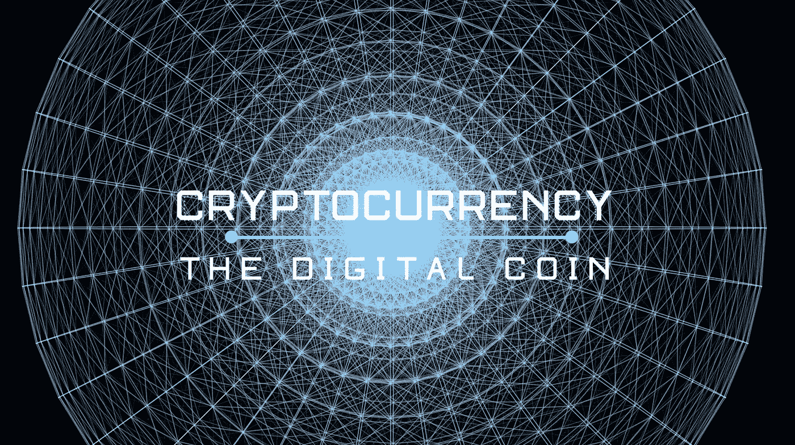
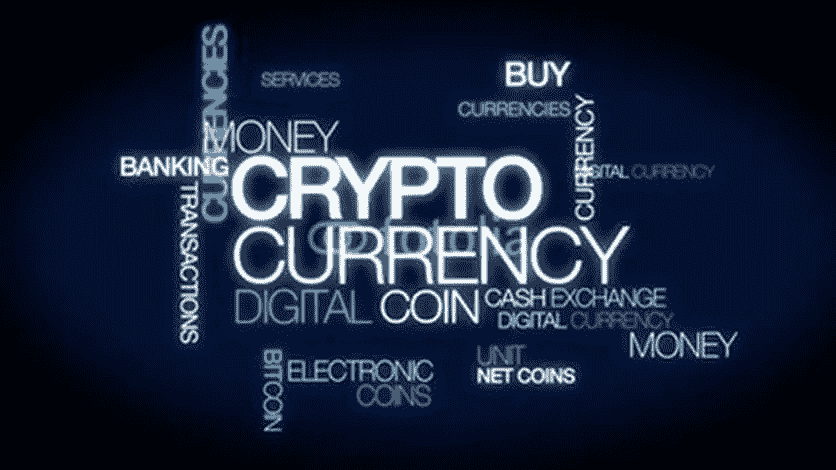
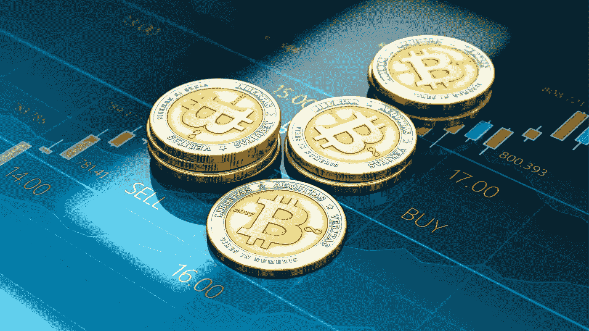

# 面向初学者的 10+最佳加密货币课程[2023 年 3 月]—在线学习加密货币

> 原文：<https://medium.com/quick-code/top-10-online-courses-to-learn-about-cryptocurrency-in-2018-1486628655b5?source=collection_archive---------0----------------------->

## 学习加密货币课程，用 2023 年最好的新手加密货币教程增加你的利润。

# 1. [Steemit 2.0 —完整的 Steemit 加密货币课程](https://www.udemy.com/steemitcryptocurrency/?couponCode=STEEMITFREE&siteID=Fh5UMknfYAU-7TVx._zWkKYrmi3AD6LsQg&LSNPUBID=Fh5UMknfYAU)

在这个完整的课程中，学生将学习如何使用 steem、买卖 steem、加密货币等等。

在本课程中，您将从头开始开立您的 Steemit 帐户。之后，我们一步一步地教你如何开始写博客，建立一个关注，并开始一个职业博客生涯！您还将学习买卖加密货币、STEEM、比特币等的所有基本知识。

您将学习以下主题的有用技能:

*   如何专业地写博客
*   Steemit 基础
*   设置您的 Steemit 帐户
*   什么是加密货币
*   什么是比特币
*   如何买卖加密货币
*   如何通过写博客获得报酬
*   如何吸引狂热的博客粉丝
*   如何创造引人入胜的内容
*   社交媒体和网络

## 2.[比特币和加密货币技术](https://coursera.pxf.io/c/1137078/1213622/14726?u=https%3A%2F%2Fwww.coursera.org%2Flearn%2Fcryptocurrency&subId1=BotTutorials)

比特币是如何运作的？比特币的与众不同之处在哪里？你的比特币有多安全？比特币用户匿名程度如何？比特币的价格是由什么决定的？加密货币可以监管吗？未来会怎样？

在本课程中，您将学习如何:

*   理解设计与比特币网络交互的安全软件所需的概念基础。
*   在自己的项目中融入来自比特币的想法。

您将了解加密构建块(“原语”)以及它们的安全性。研究如何使用这些原语来构建简单的加密货币。

了解比特币的共识机制，并对其安全性进行推理。欣赏安全如何来自技术方法和聪明的激励工程的结合。

了解比特币协议的各个组成部分如何让整个系统运转起来:交易、脚本、区块和对等网络。

探索在实践中如何使用比特币:存储比特币密钥的不同方式、安全措施以及允许您使用比特币进行交易的各种类型的服务。

您将了解提高比特币匿名性和隐私性的各种方法，并了解比特币在丝绸之路和其他隐蔽市场中的作用。

你将讨论社区、比特币内部的政治以及比特币与政治互动的方式，以及执法和监管问题。

您将看到如何在替代加密货币中重新设计采矿。你将研究其中的几个，并研究使这成为可能的比特币的属性。

最后，你会看到这些提议的技术基础和对社会的潜在影响。

# 3.[保护加密货币](https://linkedin-learning.pxf.io/c/1137078/646189/8005?u=https%3A%2F%2Fwww.linkedin.com%2Flearning%2Fsecuring-cryptocurrencies&subId1=quickcode)

这个简短的介绍性课程探讨了加密货币的一些基本安全要求，并就如何降低安全风险提供了指导。

在本课程中，您将了解:

*   加密货币的一些基本安全要求。
*   如何降低安全风险？
*   一些工具来降低你自己在这个市场的风险敞口。

完成本课程后，您将对加密货币的安全性有更深入的了解，并了解一些降低您自身风险的工具。

# 4.[加密货币|钱包，投资&交易大师级](https://www.eduonix.com/cryptocurrency-wallets-investing-and-trading-masterclass/UHJvZHVjdC0zMjMyMDA=)

了解如何购买加密货币，设置加密货币钱包，加密货币投资技巧和交易策略！

该课程包括:

*   加密货币简介
*   如何购买任何加密货币
*   如何设置加密货币并将其添加到钱包中
*   加密货币的投资策略和技巧
*   技术分析，蜡烛图和策略
*   Steemit 入门

这是您导航加密货币世界的分步指南！你将学到入门比特币和其他加密货币所需的一切。

了解加密货币投资策略和技巧，您可以实施这些策略和技巧来长期积累和投资加密货币。

您还将学习如何投资 ico(初始硬币发行)，以及加密货币投资者和交易商使用的一些术语。

学习基本的技术分析和如何阅读蜡烛图！然后你将使用蜡烛图学习多种交易策略，以及如何为技术交易添加各种指标和覆盖图。

# 5.[比特币和加密货币](https://www.awin1.com/cread.php?awinmid=6798&awinaffid=466009&clickref=quickcode&ued=https%3A%2F%2Fwww.edx.org%2Fcourse%2Fbitcoin-and-cryptocurrencies)

了解比特币和加密货币空间的基础知识，包括智能合约的基础知识、以太坊平台以及如何构建去中心化的应用程序。

在本课程中，您将学习:

*   集中/分散货币的基本属性和意图，以及对比特币的深入理解，包括身份、交易、记录保存和共识。
*   比特币在赛博朋克运动和自由主义理想中的根源，以及比特币相对于其早期前辈的革命性意义。
*   比特币背后的机制，如比特币网络、加密和加密哈希函数、比特币脚本、隐私和哈希承诺方案。
*   比特币的现实世界，如钱包、钱包机制、采矿、交易和比特币治理，以及人们与比特币网络互动的各种方式。
*   如何摧毁比特币，包括各种网络攻击。
*   第二大区块链平台以太坊背后的属性，包括以太坊虚拟机和图灵完全性的思想，比特币和以太坊的关键协议差异，以太坊的用例。

该课程涵盖比特币的基本属性、其背后的机制(例如，包括加密哈希函数、比特币脚本、隐私和哈希承诺方案)及其在赛博朋克运动和自由主义理想中的根源。

您将了解比特币的实际应用，如钱包和采矿，以及如何销毁比特币，包括网络攻击和恶意挖掘策略。

您还将简要了解以太坊以及如何在加密货币之外使用区块链。

# 6.[如何购买 200 种加密货币！30 分钟解决方案](https://www.udemy.com/buycryptocurrency/?couponCode=CRYPTOFREE&siteID=Fh5UMknfYAU-NBKvlA6nU45_XvHEdgt6vA&LSNPUBID=Fh5UMknfYAU)

在这个 30 分钟的解决方案中，学生将学习如何购买、出售和交易 200 多种加密货币。

本课程旨在帮助你了解加密货币、比特币、Altcoins(替代加密货币币)以及如何购买。目前，购买不同类型的加密货币的唯一方式是通过加密货币交易所。

您将了解购买加密货币的所有初级方面，包括:

*   比特币如何入门
*   如何打开你的加密货币钱包
*   如何购买你的第一种加密货币
*   如何投资和兑现加密货币
*   如何提取您的加密货币
*   还有更多。

# 7.[比特币和加密货币交易简介](https://www.udemy.com/introduction-to-bitcoin-and-cryptocurrency-trading/?siteID=Fh5UMknfYAU-K.qZZ0SzDE2P0RF8fCdHKQ&LSNPUBID=Fh5UMknfYAU)

了解如何开始投资比特币、替代币和 ico。

加密货币交易空间正被不知道这项技术是什么的投资者堵塞。最重要的投资格言之一是永远不要投资你不了解的东西。这个课程会在猜测和谣言中传播正确的知识。本课程是一门入门课程，将教你立即开始买卖加密货币。

与其他课程不同，在本课程中，您将获得实际的购买/销售示例。令人失望的是，我们发现有些课程只是一套幻灯片演示。本课程有所不同，因为有些讲座包括比特币交易的真实屏幕记录。

注意:加密货币投资会受到市场风险的影响。本课程不是带有投资建议或策略的课程。这门课会教你技巧，让你可以随心所欲的选择买卖货币。你将对你的交易决定的后果负责。

# 8.[加密交易 101:如何交易加密货币获利](https://www.udemy.com/crypto-trading-101-how-trade-cryptocurrencies-for-profit/?couponCode=LEARNTOTRADECRYPTOS&siteID=Fh5UMknfYAU-TtmuNKs0whnx.vTGAXzCtA&LSNPUBID=Fh5UMknfYAU)

学会使用烛台模式、技术分析和交易量来有效地交易比特币和加密货币。

加密货币交易课程。了解如何:

*   正确阅读图表
*   成功交易加密货币
*   有效地从比特币和其他加密货币的日交易和摇摆交易中获利

本课程将教你如何使用专业交易员每天在市场上使用的日内交易和摆动交易技术的独特组合来交易比特币、以太坊、ripple、莱特币和其他加密货币。

你将学习如何使用蜡烛图分析、技术分析和交易量分析来正确地阅读图表，从而精确地确定你的进场和出场策略。

本课程包含的信息适用于加密货币，但它也可用于任何类型的股票的日交易和波动交易:股票、期权、商品、电子资金转账、外汇、货币…

使用华尔街专业人士使用的独特交易方法，提高您的加密货币交易成功率。

无论你是交易加密货币，外汇，股票，商品，期权，ETFs 本课程将让你一窥日本烛台，技术分析和成交量活跃给予的竞争优势。

本课程是您在加密货币交易领域取得成功的门户。

新手交易者经常在没有必要的知识和实践的情况下进入市场。结果，他们为了更高的回报而承担过多、昂贵和不必要的风险。这个课程将教你一个非常有效的方法，让你在市场上成功而自信地交易。

本课程面向所有水平:初学者、中级和高级交易者！你所需要的只是一个开放的心态和对成功的热情。

# 9.[完整的加密货币交易&投资课程+电子书](https://www.udemy.com/cryptomeister-introductory-course-in-cryptocurrency-trading-investing/?siteID=Fh5UMknfYAU-Ka7CLbag0LKNB0mwhGxMyw&LSNPUBID=Fh5UMknfYAU)

在交易所买卖比特币和替代币、加密挖掘、市场研究和分析、ICO 投资等等。

了解如何让您的加密货币交易和投资更上一层楼。

CryptoMeister 是一家领先的加密货币交易和投资教育提供商。我们的课程是由有真实交易经验的专家为新交易者和有经验的交易者设计的。通过我们的加密货币交易课程，您也可以学习加密货币交易的基础知识，并可以自信地独自开始交易。

我们的加密货币交易视频课程分为八个关键章节。每个容易理解的章节被进一步分解成几个学习部分。为什么要创建几十个视频呢？较小的教学视频剪辑使学习更快，稍后复习主题更容易。我们想尽一切可能，所以你成功了。

为了加深您对加密货币交易的理解，CryptoMeister 仅向我们的会员提供专属奖励。我们的加密货币交易电子书遵循与我们的视频系列相同的八章，但在更深的层面上。我们更彻底地探索每个主题领域，让你成为更强的交易者。

无论您处于学习道路的哪个阶段，CryptoMeister 都会努力不断开发最全面的加密货币交易课程。我们与行业专家合作，有专家指导，并不断进行市场研究，以确保我们的信息始终是最新的。我们希望为加密货币交易提供一个权威的声音，这将有助于提高您交易生涯的成功率。

# 10.[加密货币交易课程 2018:每日盈利！](https://click.linksynergy.com/deeplink?id=Fh5UMknfYAU&mid=39197&u1=quickcode&murl=https%3A%2F%2Fwww.udemy.com%2Fcryptocurrencytrading%2F)

加密货币交易和为退休积累利润的完整指南。

本课程将教你短期交易加密货币并获利。

2017 年，加密货币市场蓬勃发展。数百万人正在享受交易加密货币的快感，并从价格波动中获利！现在是 2018 年，加密货币将迎来有史以来最好的一年！

我是一个经验丰富的加密货币交易者，当我进入加密货币时，我没有金融或交易背景。我犯过错误，也经历过重大损失，我觉得这让我有机会教你如何避免重蹈覆辙。

在本课程中，您将从加密货币的初学者进入高级阶段。您将看到识别价格上涨的加密货币并从中获利的确切方法。你还将学习如何在驾驶座上直接影响它的价格！

# 11.加密货币钱包课程:安全保护您的加密货币！

使用纸质、桌面、移动和硬件钱包保护您的加密货币安全，免受黑客攻击。

加密货币钱包对于保护您的加密货币和代币的安全至关重要！如果你正在寻找最安全的地方存放你的密码，那么你会喜欢这个课程。

随着加密货币越来越受欢迎，从 2017 年开始，它受到黑客的威胁越来越大。每天都有针对个人资产的攻击，你必须知道你的选择，以防止类似的事情发生在你身上。加密货币是钱的所在，但基础设施还不够强大，不足以让你和你的钱 100%安全，免受威胁和攻击。

在本课程中，我将对四种主要的加密货币钱包——纸质、桌面、移动和硬件钱包——提供全面彻底的指导。

您将了解到:

*   你需要知道的关于钱包及其工作原理的一切
*   每种钱包类型的好处和风险是什么
*   如何创建每个钱包
*   如何收发钱包里的钱

# 12.[加密货币基本面:买入、卖出交易加密货币](https://click.linksynergy.com/deeplink?id=Fh5UMknfYAU&mid=39197&u1=quickcode&murl=https%3A%2F%2Fwww.udemy.com%2Fcryptocurrency-fundamentals%2F)

在这个收视率最高的视频课程和随附的 PDF 指南中，快速学习如何使用、购买、销售和交易加密货币。

您将了解加密货币的关键概念，包括:

*   什么是加密货币？
*   加密货币是如何工作的？
*   有哪些类型的加密货币，包括比特币，以太坊，莱特币，Dash，Monero 和其他。
*   最有价值的加密货币有哪些？
*   以太币是什么？
*   硬币和代币有什么区别？
*   为了开始购买、出售和交易加密货币，我需要做些什么？
*   如何安全存放自己的加密货币，保护自己？

免费奖励:随着您的课程注册，您将收到一份专业制作、简单易读的“加密货币交易所入门指南”的 PDF 下载

这份有价值的文件包括如何选择和开始一些领先的加密货币交易所的信息，是视频课程的完美补充。如果你对加密货币感兴趣，这个可下载的 PDF 可以帮助你更快地开始交易加密货币。

这个视频课程和附带的指南是根据我目前在 Udemy 上教的数千名学生的反馈和要求设计的。它专为帮助您快速了解如何安全有效地开始使用、购买、出售甚至交易加密货币而设计。

# 13.[加密货币投资基础|买入、卖出&店铺](https://click.linksynergy.com/deeplink?id=Fh5UMknfYAU&mid=39197&u1=quickcode&murl=https%3A%2F%2Fwww.udemy.com%2Fbuying-and-investing-in-cryptocurrencies-for-australians%2F)

本课程讲授购买和投资加密货币的关键基础知识，重点关注澳大利亚市场。

本课程面向任何想要了解加密货币以及如何投资加密货币的人。加密货币是一种新的全球现象，始于 2009 年的比特币。在本课程中，学生将学习加密货币的所有基础知识，这在采用加密货币的早期是绝对必要的。本课程投入了数百个小时的研究和努力，旨在为学生提供加密货币、基础区块链技术、如何购买加密货币以及澳大利亚市场特定法律法规的最佳描述。

> 感谢您阅读本文。我们策划了更多主题的顶级教程，您可能想看看:

 [## 初学者的 7 门最佳加密货币课程—在线学习加密货币

### 了解加密货币，如比特币，以太坊，Altcoin，Dashcoin，区块链，ICO 与最好的加密货币…

medium.com](/quick-code/top-free-online-courses-to-learn-about-cryptocurrency-for-beginners-de83842c601b)  [## 以太坊的 10+最佳坚固性教程——在线学习坚固性

### 用 2021 年最佳新手坚实度教程学习撰写智能合同的坚实度

medium.com](/quick-code/top-tutorials-to-learn-ethereum-solidity-at-different-level-23700a04ae80)  [## 面向初学者的 6 门最佳加密货币交易课程—在线学习加密货币交易

### 学习加密货币交易，了解如何用最好的加密货币课程进行加密货币交易

medium.com](/quick-code/the-best-online-guide-to-learn-about-cryptocurrency-ec2560cd570e) 

披露:我们与本文中提到的一些资源有关联。如果你通过本页的链接购买课程，我们可能会得到一小笔佣金。谢谢你。