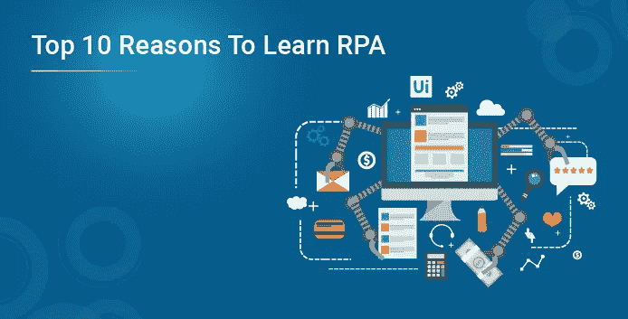
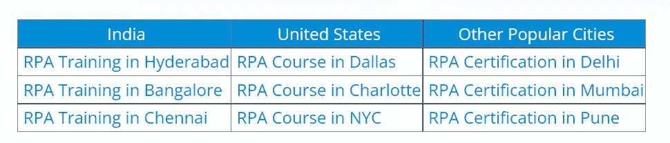
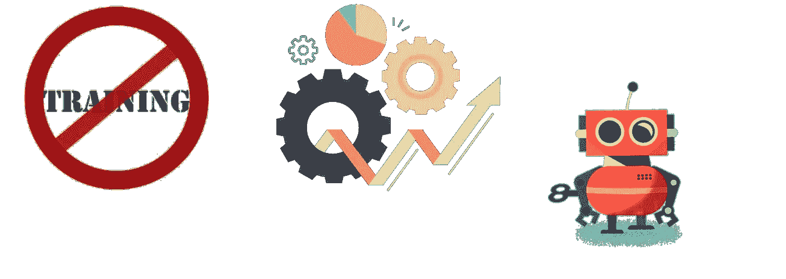

# 学习 RPA 的十大理由

> 原文：<https://medium.com/edureka/top-10-reasons-to-learn-rpa-2846369fe6be?source=collection_archive---------9----------------------->

机器人过程自动化是当今市场上的顶级技术之一，从小型到超高速增长的公司都在日常工作中使用自动化。在这篇关于学习 RPA 的 10 大理由的文章中，我将谈论为什么你应该 ***学习机器人流程自动化*** 的各种理由。这是一种模拟人类执行任务的软件。它能比人更快、更准确、更不知疲倦地做重复性的事情。

# 学习 RPA 的十大理由

我经常遇到这个问题，为什么我应该选择一个**在线 RPA 课程**。这篇关于学习 RPA 的 10 大理由的文章，基本上是告诉您理解 RPA 的概念在今天是多么重要。

以下是学习 RPA 的 10 个理由:

1.  RPA 不是“淘汰并替换”
2.  软件迁移
3.  与 AI 和 ML 的合作
4.  易于扩展和实施
5.  提供安全性
6.  没有停机时间
7.  复杂的问题得以解决
8.  投资回报是可见的
9.  节省时间和金钱
10.  人气和高薪

# 我们现在从列表开始。

## 10.人气和高薪

据 Indeed.com 称，RPA 开发人员的平均年薪约为 100，275 美元。不仅在个人层面，而且许多高速增长的公司，如**戴尔或埃森哲、IBM、Cognizant、凯捷**都在公司中使用机器人流程自动化来促进电子秤行业的增长。

## 9.节省时间和金钱

一个既省时又省钱的流程是任何企业获得成功的最基本标准。在时间和收入之间找到恰当的平衡以确保业务盈利是非常重要的。目前市场上的顶级 RPA 工具是**，提供免费版本**，让客户学习如何自动化任务。

## 8.投资回报是可见的

大规模应用程序或 IT 计划经常被定位为成本节约者。虽然 RPA 可以带来一些直接的固定成本，但它有更清晰的部分来展示其回报。RPA 确保以**最小的花费**获得**最大的利润**，同时自动化任务。DHL 是最大的例子之一，DHL 部署了 RPA 来改善其财务和物流流程，并且**仅用 1 个月就实现了全部投资回报**。

## 7.复杂的问题得以解决

随着我们的数据源和分析能力的增长，构建各种报告所需的时间也在增加。机器人过程自动化系统是解决这类问题的理想解决方案。系统**存储信息，它也可以很容易地记住和转换这些信息**，这意味着这使你可以审计和纳税。因此，您可以设计一个自动化工作流，通过在每天的预定时间从各种来源检索数据来创建报告。

## 6.没有停机时间

软件机器人可以一直工作——全年每天 24 小时**，在 **100%的能力下**。如果您的流程发生变化，机器人需要学习新的东西，您可以用新的机器人替换它们，或者改变它们的编程。设计出来的机器人是**不容易出错**并且能以相当快的方式完成指定的工作。**

## 5.提供安全性

数据安全漏洞是一个不幸的例子，因为数据存储在一个中央存储库中，业务几乎被毁掉，如果您使用 RPA，它可以确保可访问性的设置由员工完成。这意味着**只有** **合适的人才能访问与其工作流程直接相关的数据**。任何他们不应该看到的东西都将被加密，不会被窥探。

## 4.易于扩展和实施

RPA 系统非常易于使用和实施，因为它侧重于为终端用户提供导航帮助。这也让员工意识到哪些工作要做得更方便、更快捷。

假设一个工作流没有正常工作，你可以立即做出改变，看看这些改变如何有效地影响你的最终结果。

## 3.与 AI 和 ML 的合作

人工智能是最近与 RPA 合作确定最佳自动化机会的热门概念之一。目前市场上的 RPA 工具在其功能中包括 AI 和 [ML](https://www.edureka.co/blog/introduction-to-machine-learning/) 功能，以增加 RPA 在各种行业(如银行、金融、制造等)中产生的影响。在人工智能功能的帮助下，这些机器人使用认知能力从半结构化和非结构化数据中提取信息。这些机器人还学习检测模式，以便下次遇到该模式时，机器人确切地知道必须做什么。

## 2.软件迁移

事实上，软件迁移既耗时又昂贵。迁移到新的 ERP 或任何 AMA 可能需要数年时间，花费数千万或数亿美元。更令人沮丧的是，有时在以前的软件版本中可能以特定方式运行的某些特性和功能在更新的版本中可能甚至不存在。

**例如**:假设一个员工**锁定等待时间**的业务流程合计**人力资源软件 A** 。现在如果软件更新到 **HR 软件 B.** 这种高级的综合软件可能无法跟踪带薪时间。

然后，在这种情况下，公司必须维护一小部分**软件 A** 并手动将数据传递到**软件 b。**在这种基于组织的问题中，机器人流程自动化有助于其准确性、速度和软件的持续更新。

## 1.RPA 不是“淘汰并替换”

这些天有很多关于就业前景黯淡的谈论，因为有人声称机器人将偷走所有的工作，但实际上，自动化将刺激许多新工作的增长，包括一些全新的工作类别。

使用**虚拟劳动力或 RPA 机器人的最大优势之一是，它不需要您更换现有系统**，这意味着它们都位于您现有基础架构的顶部和旁边。因此，为了完成您的工作，您将需要一些额外的软件和虚拟机来部署完全独立的数字工作人员或正常的体育活动，但您不需要淘汰和更换现有的基础架构。因此，RPA 不会关闭您的现有系统，而是利用它们。

如果你想查看更多关于人工智能、DevOps、道德黑客等市场最热门技术的文章，你可以参考 Edureka 的官方网站。

*原载于 2022 年 1 月 6 日*https://www.edureka.co

**。**