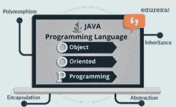
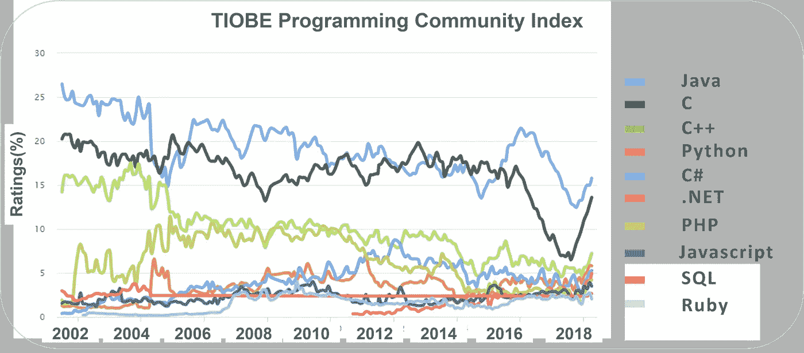

# 你应该学习 Java 的 10 大理由

> 原文：<https://medium.com/edureka/top-10-reasons-why-you-should-learn-java-99618ab18726?source=collection_archive---------1----------------------->

Java 是任何人都能掌握的最基础的编程语言之一。它是如此简单，同时，使用 Java 开发的可能性是无限的！这使得 Java 成为当今业界使用最广泛的语言，Java 认证是雇主们不断寻找的一项关键技能。通过这个博客，我将列出学习 Java 的 10 大理由。

1.  Java 的流行和高薪
2.  Java 是可移植的和通用的
3.  Java 是一种面向对象的编程语言
4.  需求:Java 无处不在
5.  Java 开发工具
6.  Java 应用程序
7.  大量资源和社区支持
8.  Java EE 及其丰富的 API
9.  Java 新特性
10.  Java 很简单&是开源的

让我们从逆序理解以上几点开始。

# 10.Java 很简单&是开源的

排在第 10 位的是 Java，它非常简单并且是开源的。它支持 FLOSS 理念，在这种理念下，你不用花一分钱用 Java 写代码。那么有助于其简单性的原因是什么呢？Java 是:

*   **并发**:轻松并行处理您的数据
*   **平台独立(WORA)** :一次编写，随处运行
*   开源:完全免费创建 Java 应用程序
*   **强大的**:强大的内存管理
*   **解读**
*   **高**高**性能**
*   **担保**
*   **动态**

此外，Java 消除了所有的复杂性，如 C++或任何其他编程语言中的指针、运算符重载，从而使我们的生活变得更加轻松。

# 9.Java 新特性

Java 9、10 及其特性的发布是 Java 生态系统中的一个里程碑。我获得了一些 Java9 的新特性，我觉得值得了解一下。
首先是**项目拼图**。这个项目的主要目的是介绍模块化的概念，支持创建模块，然后应用同样的 JDK。

此外，还引入了 **REPL** 工具，这使得尝试不同的功能变得非常容易。除此之外，你还可以使用 Jshell 脚本，在这里你可以一步到位地编写代码，这样就很容易了。

所以 Java 的这些新增功能可以帮助你编写简单的代码并测试它们。

# 8.Java EE 及其丰富的 API

现在，API 非常流行的原因是，对于程序员来说，构建一个应用程序以及使用不同的技术变得非常容易，而不需要实际了解它们的内部实现是如何工作的。

*   至于 Java API，它在兼容性方面没有问题，并且可以处理大量的过程和函数。
*   此外，您将会印象深刻的是，有超过 4，500 个 API 可供开发人员使用。
*   它为 I/O、网络、实用程序、XML 解析、数据库连接和几乎所有东西提供了 API！

您可以在这里浏览作为 Java 10 一部分的 Java API 的完整列表。

# 7.大量资源和社区支持

Java 作为一种编程语言是无所不在的，这意味着它无处不在，从你的手机到你的机顶盒，再到卫星。

所以，一旦你完全掌握了 Java，就会有一个巨大的工作机会。

然后 Java 有一个很棒的支持社区。所以学习对于 Java 来说根本不是问题。

你有大量的在线资源可以作为你的完美伴侣，还有一个支持社区。你有多个论坛，所有关于 Java 的疑惑或错误都在这里得到解答。

# 6.Java 应用程序

正如我上面提到的，Java 无处不在，它有无限的机会！

现在，让我带你了解一些利用 Java 的技术。这里我选择了一些使用 Java 的受影响的领域。

*   开发 web 应用及其流行的**框架** (Spring，hibernate 等)。)
*   Java 用于**安卓应用**开发
*   Java 用于使用各种自动化测试工具来测试您的 web 应用程序。例如:Selenium，QTP，用于自动化 web 应用程序和使用 Java 执行测试。
*   **大数据技术** : Hadoop MapReduce 框架用 Java 编写
*   用于科学研究团体处理大量数据

# 5.Java 开发工具

现在，您有了许多强大的开发工具，可以在其中进行 Java 编程。

一些流行的 Java 开发工具有:

1.Netbeans

2.IntelliJ

3.黯然失色

4.安卓工作室

所有上述工具不仅在代码编写过程中帮助你，而且还为程序员提供高级调试。

# 4.Java 无处不在

Java 无处不在，桌面上有，移动上有，无处不在！这里我列出了几个明确使用 Java 的部门:

*   **银行**:处理交易管理
*   **信息技术**:解决实现依赖，这是雇佣大多数 Java 开发人员的领域。
*   股票市场:编写他们应该投资哪家公司的算法
*   **金融服务** : Java 用于服务器端应用

所以，它不仅限于一个领域！此外，谷歌、飞利浦、CapitalOne、埃森哲、优步等许多大公司都在使用它。

所以，你可以完全放心，Java 不会很快消失！

# 3.Java 是一种 OOPS 语言

大多数流行的编程语言，如 Java、C++、C#、Ruby 等。遵循面向对象的编程范式。

**面向对象编程**是一种编程风格，它与诸如
1。班级
2。对象
3。传承
4。封装
5。多态性

Java 中基于对象的应用程序是基于声明类、从类中创建对象以及这些对象之间的交互。因此，Java 是一种面向对象的编程语言，Java 的概念是高度相关的。

# 2.便携式和多功能

Java 是一种非常可移植的通用语言。我所说的可移植性是指 Java 可以跨各种平台使用。作为一种开源编程语言，它是跨操作系统平台独立的。就像它著名的标语所说的“ ***编写一次，在任何地方运行*** ”，你可以在任何有兼容 JVM 的硬件上运行 Java 字节码。例如，你可以简单地在 Windows 环境下编写代码或创建 Java 应用程序，并在任何其他环境下运行，比如说 Linux 等。

接下来，Java 被认为是最通用的语言之一。这背后有很多原因。首先，它有动态编码，所有的代码都以面向对象的格式组织和存储，这种格式称为类。那么它是高度安全的。其次，它可以轻松地与网络上的不同资源协同工作。这使得 Java network-concentric 成为一种不会很快过时的语言。

接下来是 Java 的受欢迎程度和高薪！

# 1.Java 的流行和高薪

Java 开发人员是在行业中获得高薪工作的人。在美国，Java 开发人员的平均年薪约为 11 万美元。

除此之外，你可以参考这个 TIOBE 编程索引，了解所有目前流行的编程语言。

所以，在这里你可以看到从 2000 年初到现在的 2021 年，Java 是如何统治这个领域的。这本身就应该让您了解 Java 有多受欢迎，以及它在业界的应用有多广泛。如果你想查看更多关于人工智能、DevOps、道德黑客等市场最热门技术的文章，那么你可以参考 [Edureka 的官方网站。](https://www.edureka.co/blog/?utm_source=medium&utm_medium=content-link&utm_campaign=top-10-reasons-to-learn-java/)

请留意本系列中解释 Java 其他各方面的其他文章。

> *1。* [*面向对象编程*](/edureka/object-oriented-programming-b29cfd50eca0)
> 
> *2。* [*继承 Java 中的*](/edureka/inheritance-in-java-f638d3ed559e)
> 
> *3。*[*Java 中的多态性*](/edureka/polymorphism-in-java-9559e3641b9b)
> 
> *4。*[*Java 中的抽象*](/edureka/java-abstraction-d2d790c09037)
> 
> *5。* [*Java 字符串*](/edureka/java-string-68e5d0ca331f)
> 
> *6。* [*Java 数组*](/edureka/java-array-tutorial-50299ef85e5)
> 
> 7。 [*Java 收藏*](/edureka/java-collections-6d50b013aef8)
> 
> *8。* [*Java 线程*](/edureka/java-thread-bfb08e4eb691)
> 
> *9。*[*Java servlet 简介*](/edureka/java-servlets-62f583d69c7e)
> 
> *10。* [*Servlet 和 JSP 教程*](/edureka/servlet-and-jsp-tutorial-ef2e2ab9ee2a)
> 
> *11。*[*Java 中的异常处理*](/edureka/java-exception-handling-7bd07435508c)
> 
> *12。* [*高级 Java 教程*](/edureka/advanced-java-tutorial-f6ebac5175ec)
> 
> *13。* [*Java 面试题*](/edureka/java-interview-questions-1d59b9c53973)
> 
> *14。* [*Java 程序*](/edureka/java-programs-1e3220df2e76)
> 
> *15。*[*kot Lin vs Java*](/edureka/kotlin-vs-java-4f8653f38c04)
> 
> *16。* [*依赖注入使用 Spring Boot*](/edureka/what-is-dependency-injection-5006b53af782)
> 
> *17。* [*堪比 Java 中的*](/edureka/comparable-in-java-e9cfa7be7ff7)
> 
> *18。* [*十大 Java 框架*](/edureka/java-frameworks-5d52f3211f39)
> 
> *19。* [*Java 反射 API*](/edureka/java-reflection-api-d38f3f5513fc)
> 
> *20。*[*Java 中的 30 大模式*](/edureka/pattern-programs-in-java-f33186c711c8)
> 
> *21。* [*核心 Java 备忘单*](/edureka/java-cheat-sheet-3ad4d174012c)
> 
> *22。*[*Java 中的套接字编程*](/edureka/socket-programming-in-java-f09b82facd0)
> 
> *23。* [*Java OOP 备忘单*](/edureka/java-oop-cheat-sheet-9c6ebb5e1175)
> 
> 24。[*Java 中的注释*](/edureka/annotations-in-java-9847d531d2bb)
> 
> *25。*[*Java 中的库管理系统项目*](/edureka/library-management-system-project-in-java-b003acba7f17)
> 
> *26。* [*爪哇树木*](/edureka/java-binary-tree-caede8dfada5)
> 
> 27。[*Java 中的机器学习*](/edureka/machine-learning-in-java-db872998f368)
> 
> *二十八。* [*顶级数据结构&Java 中的算法*](/edureka/data-structures-algorithms-in-java-d27e915db1c5)
> 
> *29。* [*Java 开发者技能*](/edureka/java-developer-skills-83983e3d3b92)
> 
> *30。* [*前 55 名 Servlet 面试问题*](/edureka/servlet-interview-questions-266b8fbb4b2d)
> 
> *31。**[*顶级 Java 项目*](/edureka/java-projects-db51097281e3)*
> 
> **32。* [*Java 字符串备忘单*](/edureka/java-string-cheat-sheet-9a91a6b46540)*
> 
> **33。*[*Java 中的嵌套类*](/edureka/nested-classes-java-f1987805e7e3)*
> 
> **34。* [*Java 集合面试问答*](/edureka/java-collections-interview-questions-162c5d7ef078)*
> 
> **35。*[*Java 中如何处理死锁？*](/edureka/deadlock-in-java-5d1e4f0338d5)*
> 
> **36。* [*你需要知道的 50 个 Java 合集面试问题*](/edureka/java-collections-interview-questions-6d20f552773e)*
> 
> **37。*[*Java 中的字符串池是什么概念？*](/edureka/java-string-pool-5b5b3b327bdf)*
> 
> **38。*[*C、C++和 Java 有什么区别？*](/edureka/difference-between-c-cpp-and-java-625c4e91fb95)*
> 
> **39。*[*Java 中的回文——如何检查一个数字或字符串？*](/edureka/palindrome-in-java-5d116eb8755a)*
> 
> *40。 [*你需要知道的顶级 MVC 面试问答*](/edureka/mvc-interview-questions-cd568f6d7c2e)*
> 
> *41。[*Java 编程语言十大应用*](/edureka/applications-of-java-11e64f9588b0)*
> 
> **42。*[*Java 中的死锁*](/edureka/deadlock-in-java-5d1e4f0338d5)*
> 
> **43。* [*平方和平方根*](/edureka/java-sqrt-method-59354a700571)*
> 
> *44。[*Java 中的类型转换*](/edureka/type-casting-in-java-ac4cd7e0bbe1)*
> 
> **四十五。*[*Java 中的运算符及其类型*](/edureka/operators-in-java-fd05a7445c0a)*
> 
> *46。[*Java 中的析构函数*](/edureka/destructor-in-java-21cc46ed48fc)*
> 
> **47。*[*Java 中的二分搜索法*](/edureka/binary-search-in-java-cf40e927a8d3)*
> 
> **48。*[*Java 中的 MVC 架构*](/edureka/mvc-architecture-in-java-a85952ae2684)*
> 
> *49。 [*冬眠面试问答*](/edureka/hibernate-interview-questions-78b45ec5cce8)*

**原载于 2019 年 10 月 23 日*[*https://www.edureka.co*](https://www.edureka.co/blog/top-10-reasons-to-learn-java/)*。**