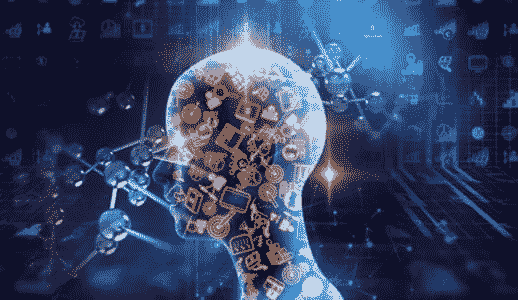

# 2021 年需要掌握的十大趋势技术

> 原文：<https://medium.com/edureka/top-10-technologies-in-2021-f1450c86774c?source=collection_archive---------0----------------------->

# 十大趋势技术

变化是唯一不变的。这也适用于你的职业生活。如今，提高自己的技能是一种需要，原因很简单，技术发展非常快。我们需要确定 10 大趋势技术并投入时间，这些技术将在 2021 年吸引巨大的市场。

脑机接口、智能机器人和 DNA 计算听起来可能像是最新好莱坞大片中的情节，但我们预计这些新兴技术可能会对我们的日常生活产生变革性影响。因此，我们编制了 2021 年 十大趋势科技 ***清单。***

下面是我们将在本文中讨论的工作大纲:

# 2021 年十大趋势技术

*   **5G 技术**
*   **行为互联网(IoB)**
*   **DevSecOps**
*   **智能过程自动化(IPA)**
*   **触觉虚拟现实**
*   **大数据分析**
*   **人体增强**
*   **一切即服务(XaaS)**
*   **网络安全**
*   **人工智能**

如果你是视觉学习者，你也可以参考我们关于 2021 年 ***十大趋势技术的视频演示！***

所以，继续单子上的事，好吗？

# 5G 技术

***5G 技术*** 是下一代蜂窝网络和服务。预计至少提供 **20GBPS 下行**和 **10GBPS 上行**，这将使 5G 网络比目前的 4G LTE 至少快 40 倍。这将为电信运营商的新服务、网络运营和客户体验打开大门。目前，该市场由瑞士引领，韩国和美国紧随其后。

**投资 5G 的公司:**三星、华为、英特尔、德勤、诺基亚、爱立信、高通

# 行为互联网(IoB)

收集和使用数据来驱动行为被称为***【IoB】***行为互联网。一个例子是，工业场所采用计算机视觉来确定员工是否遵守口罩协议，然后收集这些行为数据供组织分析，以影响人们在工作中遵守政府协议。

IoB 可以收集、合并和处理来自许多来源的数据，包括:

*   公共部门处理的公民数据
*   商业客户数据
*   政府机构
*   社会化媒体
*   公有土地
*   位置追踪。

处理这些数据的技术越来越复杂，使得这种趋势得以发展。

在 IoB 投资的公司: AWS、思科、SAP、微软、惠普、IBM、戴尔、Cloudera

# DevSecOps

***DevSecOps*** 是开发、安全、运营的简称。其目标是以与开发和运营相同的规模和速度实现安全性，而不仅仅是为了实现安全性。随着微服务的广泛采用，DevSecOps 似乎更深入地进入了我们的 DevOps 市场。

这还不是全部。在当前的经济形势下，任何地方的运营模式对于企业成功脱颖而出都至关重要。其核心是，这种运营模式允许在任何地方访问、交付和启用业务。这种格式现在正在探索各种其他方面的技术，如 GitOps、DataOps & NoOps。

**投资开发公司的公司:**亚马逊、美国宇航局、凯捷、戴尔、甲骨文

# 智能过程自动化

机器人流程自动化的基本理念是*‘任何可以自动化的东西都应该自动化*。今年，我们发现了更令人着迷的东西— ***智能流程自动化*** 。简而言之，IPA 允许机器人受益于人工智能、大数据、机器学习的能力，这意味着它们可以随着时间的推移而学习和改进。这有助于这些智能机器人从*‘如果-这个-那么-那个’*规则进化而来。随着自动化的采用有望增长，预计到 2025 年，IPA 投资将达到 2320 亿美元。

**投资 IPA 的公司:**毕马威、AWS、微软

# 触觉虚拟现实

创新技术提供了更多像 AR 和 VR 这样的沉浸式体验。虚拟现实使用户沉浸在模拟环境中，增强现实是现实世界中的技术叠加。思科预测，到 2022 年，全球所有娱乐领域的 AR-VR 流量将增长 12 倍。

触觉让我们对视觉或听觉无法完全体验的事物有了更深刻的理解。这就是 ***触觉虚拟现实*** 发挥作用的地方。它结合了多种技术的使用，包括传感器、先进光学等。捆绑到单个设备中，能够将增强的数字内容覆盖到您的实时空间中。随着触觉/触觉技术的进步，触摸屏障现在可以被缩放。

**投资触觉 VR 的公司:** Oculus，Virtuix，思科

# 大数据分析

大数据分析已经在市场上存在了一段时间。越来越多的企业采用它来超越传统的数据存储和处理方式。

X-Analytics 等新趋势正被用于寻找应对挑战的解决方案，包括气候变化、疾病预防和野生动物保护。

大数据还为我们提供了有趣的趋势，如 ***决策智能*** ，它提供了一个框架来帮助数据工程师在业务成果和行为的背景下设计、建模、执行和监控决策模型和流程。事实上，到 2023 年，超过 33%的大型组织将拥有实践决策智能的分析师。

**投资大数据分析的公司:**亚马逊、网飞、星巴克、Spotify、谷歌、Adobe

# 人类扩增

正如他们所知，人类一直在不断地试验科技来改善生活。这种好奇心现在进入了另一个领域——***人类增强*** ，这基本上意味着借助人工智能和物联网等技术，不仅改善我们的日常生活，而且将人类的智能提升到一个新的水平。

目前，这些研究正在竞相帮助残疾人进行仿生学和假体隆胸，并通过基因实验治愈疾病。但承诺是结束现有的身体残疾或根本防止伤害发生。

它还可以为其他创造性功能提供机会。例如，像 Neuralink 这样的公司旨在建立一个极其强大的脑机接口，具有处理海量数据的能力。

**投资人类增强技术的公司:** Neuralink、谷歌、三星、Ekso

# 一切即服务(XaaS)

**一切即服务(XaaS)** 是一个云计算术语，指用户通过互联网按需访问的各种各样的服务和应用，而不是通过内部方式使用。它为您提供了定制计算环境的灵活性，让您能够按需打造所需的体验。XaaS 已经扩展到包括许多服务，例如:

*   功能即服务
*   IT 即服务
*   基础设施即服务
*   安全即服务
*   数据库 aa 服务

随着这些应用程序变得更加可移植，计算周期更容易实时获得，数据集成平台简化连接，以及供应商形成跨平台联盟，在不久的将来，多云趋势可能会变得更像全云趋势。

**在 XaaS 投资的公司:** HPC、RedHat、VMWare、AWS、Google Cloud、Microsoft Azure

# 网络安全

随着如此多的组织正在经历巨大的数字化转型，对持续存在的网络攻击的认识持续增长-不仅是大型组织，小型企业也是如此。现在， ***网络安全*** 已经不是什么新鲜事了，但它的趋势绝对是！

*   ***【VDN】***虚拟分散网络是一种独特的网络安全方法，其中信号以短脉冲或量子包的形式传输，在不破坏其内容的情况下无法秘密读取。基本上，没有人能够在不引入一些噪声的情况下截取发送给你的数据。
*   ***区块链网络安全*** 是一种更加模块化、响应更快的安全方法，通过集中编排和分布式执行。

公司开始意识到，拥有有效的网络安全战略不仅是一种奢侈，而且是绝对必要的。

**投资网络安全的公司:**思科、RedHat、IBM

# 人工智能

一个健壮的 ***人工智能*** 实现将提高性能、可扩展性和可靠性，同时提供完整的投资回报。但是人工智能项目经常面临某些问题，这使得它们对大多数组织来说都是一个挑战。但是有新的解决方法来面对这些问题。

*   人工智能工程提出让人工智能成为主流 DevOps 过程的一部分，而不是一系列专门和孤立的项目。这解决了可维护性、可伸缩性和治理方面的问题。
*   Tiny AI 旨在创建算法，在不丧失现有深度学习模型能力的情况下缩小现有深度学习模型，将更多计算能力装入更紧密的物理空间，并且消耗更少的能量。

这项革命性的技术必将带来另一场革命，因此，它在我们的趋势技术列表中。

**投资人工智能的公司:**谷歌、苹果、亚马逊、IBM

如果你想查看更多关于人工智能、DevOps、道德黑客等市场最热门技术的文章，那么你可以参考 [Edureka 的官方网站。](https://www.edureka.co/blog/?utm_source=medium&utm_medium=content-link&utm_campaign=top-10-trending-technologies/)

*原载于 2017 年 12 月 22 日 https://www.edureka.co**的* [*。*](https://www.edureka.co/blog/top-10-trending-technologies/)