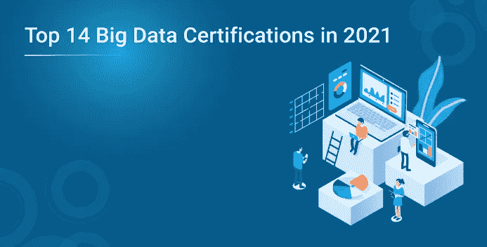

# 2021 年 14 大数据认证

> 原文：<https://medium.com/edureka/top-14-big-data-certifications-in-2021-34c1dcb5ec53?source=collection_archive---------1----------------------->

大数据现在作为一个机会而不是一个问题在增长，较早发现这一点的组织现在是成功的组织。因此，这种变化也反映在对大数据技能和大数据认证需求的增加上。

组织正在寻找具备分析大数据所需技术专业知识的数据分析师和科学家。这些技能需求量很大，而且相对稀少。选择正确的认证可以帮助和促进你的职业生涯。

如果你正在寻找在职业生涯中获得优势的方法，我建议你*驾驭大数据浪潮*。拥有一个证书总是能让你比队列中的其他人更有优势。认证是在雇主面前根据行业和供应商特定的基准证明你的知识和技能。

随着大数据的增长，大数据认证的数量也在迅速扩大。在选择大数据认证时，有很多困惑。因此，为了方便您，下面列出了最著名的大数据认证:

# [Cloudera 认证助理(CCA)](https://www.cloudera.com/more/training/certification.html)

*组织:* [Cloudera](https://www.cloudera.com/)

价格:295 美元

CCA 考试测试你的基础技能，并为申请人获得 CCP 项目认证奠定基础。Cloudera 有 3 门 CCA 级别的认证考试(Cloudera 认证助理)。

1.  [***CCA Spark 和 Hadoop 开发人员***](https://www.cloudera.com/more/training/certification/cca-spark.html) :通过 CCA Spark 和 Hadoop 开发人员认证的人员已经证明了其使用 Apache Spark 和 core Cloudera Enterprise 工具获取、转换和处理数据的核心技能。
2.  [***CCA 数据分析师***](https://www.cloudera.com/more/training/certification/cca-data-analyst.html):CCA 数据分析师认证人员已经证明了他在加载、转换和建模 Hadoop 数据方面的核心分析师技能，以便定义关系并从原始输入中提取有意义的结果。
3.  [***CCA 管理员***](https://www.cloudera.com/more/training/certification/cca-admin.html) :获得 CCA 管理员认证的个人已经展示了在企业中部署 Cloudera 的公司和组织所寻求的核心系统和集群管理员技能。

[**Cloudera 认证专家(CCP)数据工程师**](https://www.cloudera.com/more/training/certification/ccp-data-engineer.html)

*组织:* [Cloudera](https://www.cloudera.com/)

价格: $400

CCP 数据工程师拥有开发可靠、自主、可扩展数据管道的技能，可为各种工作负载优化数据集。它证明了在 Cloudera 的分发环境中获取、转换、存储和分析数据所需的核心能力。

通过该认证考试所需的技能包括:

*   在外部系统和集群之间传输数据。
*   将存储在 HDFS 的一组给定格式的数据值转换成新的数据值和新的数据格式，并写入 HDFS 或 Hive。
*   以存储在 HDFS 的给定格式过滤、排序、连接、聚合和转换一个或多个数据集。这些任务可能包括读取不同的格式(Parquet、Avro、JSON、分隔文本)。
*   创建和执行各种作业和操作的能力，这些作业和操作将数据推向更高的价值并在系统中使用。

# [爱德华卡](https://www.edureka.co/)

## [Edureka 大数据 Hadoop 认证培训](https://www.edureka.co/big-data-and-hadoop)

本次 Hadoop 培训旨在通过为您提供丰富的 Hadoop 生态系统实践培训以及关于 HDFS、MapReduce、HBase、Hive、Pig、Oozie、Sqoop 的最佳实践，让您成为认证大数据从业者。本课程是您大数据之旅的敲门砖，您将有机会使用不同的数据集(如社交媒体、客户投诉、航空公司、电影、贷款数据集等)参与多个大数据分析项目。

## [Edureka Hadoop 管理认证培训](https://www.edureka.co/hadoop-admin)

Edureka 的 Hadoop 管理培训为参与者提供操作和维护 Hadoop 集群所需的所有步骤的专业知识，即从规划、安装和配置到负载平衡、安全性和调优。Edureka 的培训将为 Hadoop 管理员面临的现实挑战提供实际准备。课程设置遵循 Apache Hadoop 发行版。

## [Edureka Apache Spark 认证培训](https://www.edureka.co/apache-spark-scala-training)

本次 Edureka Apache Spark 认证培训将使学员了解 Spark 如何执行内存数据处理，并且运行速度远快于 Hadoop MapReduce。学员将掌握 Scala 编程，并将接受 Spark 提供的不同 API 的培训，如 Spark Streaming、Spark SQL、Spark RDD、Spark MLlib 和 Spark GraphX。

# [hontonworks](https://hortonworks.com/)

Hortonworks 提供了五个与 Hadoop 相关的 Hadoop 认证:

*   [**【HDP 认证开发者(HDPCD)**](https://hortonworks.com/services/training/certification/hdpcd-certification/) :针对使用 Pig、Hive、Sqoop、Flume 等框架的 Hadoop 开发者。
*   [**HDP 认证 APACHE SPARK 开发者(HDPCD-Spark)**](https://hortonworks.com/services/training/certification/hdp-certified-spark-developer/) :面向负责用 Scala 或 Python 开发 SPARK 核心和 Spark SQL 应用的开发者。
*   [**【HDP 认证 Java 开发人员(HDPCD-JAVA)】**](https://hortonworks.com/services/training/certification/hdpcdjava-certification/):面向设计、开发和架构用 JAVA 编程语言编写的基于 Hadoop 的解决方案的开发人员。
*   [**HDP 认证管理员(HDPCA)** :](https://hortonworks.com/services/training/certification/hdpca-certification/) 针对部署和管理 Hadoop 集群的管理员。
*   **HORTONWORKS CERTIFIED ASSOCIATE(HCA)】:获得进入 Horton works 认证项目更高级别所需的入门点和基本技能。**

**考试费用为每次 250 美元，持续时间为 2 小时。Hortonworks 有一个基于您尝试的问题和您采取的方法的动态标记方案。因此，现在我们将重点关注通过不同 Hortonworks 认证所需的技能。**

****

**[**分析:优化大数据证书**](https://reg.pcs.udel.edu/search/publicCourseSearchDetails.do?method=load&courseId=23309)**

*   ***组织:* [特拉华大学](http://www.udel.edu/)**
*   ***价格:*2895 美元**

**这是一个本科层次的项目。这个项目向学生介绍分析大型数据集所需的工具，以便做出更明智的商业决策。学生学习收集和组织数据以进行更有效的分析，以及如何以清晰简洁的方式交流他们的分析。主题包括:**

*   **将数据导入分析软件包**
*   **执行探索性图形和数据分析**
*   **使用多元回归和决策树等工具构建分析模型**
*   **寻找解释变量间相关性的最佳模型**
*   **学习如何控制和评估数据可变性，以更好地满足客户需求**

**为了成功完成此认证和收入证书，您需要以“C”或以上的成绩完成以下模块。**

*   **分析基础**
*   **大数据工具**
*   **过程控制和能力**
*   **单项工程**

****

**[**数据科学专业成果认证:**](http://datascience.columbia.edu/certification)**

***组织:* [哥伦比亚大学](http://www.columbia.edu/)**

***价格:*每信用点 1936 美元**

**该认证是一项非学位计划，旨在帮助学生为拓展职业前景做好准备，并通过培养基础数据科学技能为他们提供改变职业道路的机会。它包括 4 门主要课程:**

*   **数据科学算法**
*   **概率与统计**
*   **数据科学的机器学习**
*   **探索性数据分析和可视化(统计)**

****

# **[认证分析专家](http://datascience.columbia.edu/certification)**

***组织* : [通知](https://www.informs.org/)**

***价格:* $695(通知会员$495)**

**CAP 是面向分析从业者的首要全球专业认证。它使用户能够从获取数据的分析问题、方法采用、模型构建、部署和模型生命周期管理开始，对分析过程有一个端到端的了解。**

****

# **[EMC 认证专家数据科学家助理(EMCDSA)](https://education.emc.com/guest/campaign/data_science.aspx)**

***组织:* [戴尔 EMC 教育服务](https://education.emc.com/content/emc/en-us/home.html)**

***价格:*600 美元(视频-ILT 流媒体)，5000 美元(讲师指导)**

**该认证证明了参与大数据和其他分析项目所需的技能。该课程提供基本和高级分析方法的基础知识，并介绍大数据分析技术和工具，包括 MapReduce 和 Hadoop。**

**通过本课程，您还将学习如何部署数据分析生命周期、重新构建业务挑战、应用分析技术。它还涵盖了分析大数据、创建统计模型和选择适当的数据可视化工具。**

****

# **[IBM 认证](http://www-03.ibm.com/certify/)**

***组织:* [IBM 专业认证项目](http://www-03.ibm.com/certify/index.shtml)**

***价格:* $200**

## **[IBM 认证数据架构师—大数据](http://www-03.ibm.com/certify/cert.html?id=50001701)**

**大数据架构师与客户和解决方案架构师密切合作，将客户的业务需求转化为大数据解决方案。大数据架构师对相关技术有深入的了解，了解这些技术之间的关系，以及如何集成和组合它们来有效解决任何给定的大数据业务问题。**

## **[IBM 认证数据工程师—大数据](http://www-03.ibm.com/certify/cert.html?id=50001501)**

**该认证面向 IBM 大数据工程师。大数据工程师直接与数据架构师和动手开发人员合作，将架构师的大数据愿景和蓝图转化为大数据现实。数据工程师拥有广泛的产品和技术方面的深厚的技术知识和经验。数据工程师了解如何应用技术解决大数据问题，并有能力为企业构建大规模数据处理系统。数据工程师在组织内开发、维护、测试和评估大数据解决方案。他们向架构师提供所需硬件和软件的输入。**

****

# ****微软认证解决方案专家(MCSE):数据管理和分析****

**组织:[微软](https://www.microsoft.com/en-us/learning/default.aspx)**

**价格:每次考试 165 美元**

**该认证展示了 SQL 管理、构建企业级数据解决方案以及在内部和云环境中利用商业智能(BI)数据方面的广泛技能。要获得认证，候选人必须通过 12 门考试中的一门。**

****

# **[挖掘海量数据集毕业证书](https://scpd.stanford.edu/public/category/courseCategoryCertificateProfile.do?method=load&certificateId=10555807)**

***组织:* [斯坦福专业发展中心](http://scpd.stanford.edu/search/publicCourseAdvancedSearch.do?method=load)**

**价格: $18900 学费**

**该认证专为统计人员、软件工程师、市场研究人员、分析专家、预测建模人员和数据挖掘人员设计。该认证证明掌握了非常重要的技能，如从大型数据集中提取信息的高效、强大的技术和算法。**

****

# **MongoDB 认证数据库管理员助理、开发人员助理**

***组织:* [MongoDB 大学](https://university.mongodb.com/)**

***价格:* $150**

# **[MongoDB 认证 DBA 助理](https://university.mongodb.com/certification/dba/about)**

**MongoDB 认证 DBA 助理级别考试面向具备 MongoDB 概念和机制知识的管理员。该认证推荐给了解基础知识并有一些管理 MongoDB 的专业经验的操作专业人员。**

# **[MongoDB 认证开发人员助理](https://university.mongodb.com/certification/developer/about)**

**MongoDB 认证开发人员助理级别考试面向具备使用 MongoDB 设计和构建应用程序的基础知识的个人。该认证推荐给对 MongoDB 基础知识有扎实理解并有一些使用 MongoDB 开发应用程序的专业经验的软件工程师。**

****

# **Oracle 商业智能基础套件 11 认证实施专家**

***组织:* [甲骨文大学](https://education.oracle.com/)**

**价格:245 美元**

**该认证旨在确定能够熟练实施基于 Oracle 商务智能套件的解决方案的专业人员。该认证涵盖安装 OBIEE、构建 BI 服务器元数据存储库、构建 BI 仪表板、构建特殊查询、定义安全设置以及配置和管理缓存文件等技能。考试针对中级实施团队成员。**

****

# **[斯坦福数据挖掘与应用研究生证书](https://scpd.stanford.edu/public/category/courseCategoryCertificateProfile.do?method=load&certificateId=1209602)**

***组织:* [斯坦福专业发展中心](http://scpd.stanford.edu/home)**

***价格:*11340 美元至 12600 美元(9 至 10 件)**

**数据挖掘和预测模型是成功的信息和产品搜索、自动化销售、智能个性化、动态定价、社交网络分析、遗传学、蛋白质组学和许多其他基于技术的商业重要问题解决方案的核心。**

**数据挖掘和应用研究生证书介绍了数据挖掘和机器学习中的许多重要的新思想，在统计框架中解释了它们，并描述了它们在商业，科学和技术中的一些应用。**

**我希望这篇博客内容丰富，有助于了解各种大数据认证及其培训。现在开始吧，选择大数据认证并获得认证，这将促进您的职业生涯。万事如意！如果你想查看更多关于人工智能、Python、道德黑客等市场最热门技术的文章，你可以参考 Edureka 的官方网站。**

**请留意本系列中解释大数据其他各方面的其他文章。**

> ***1。* [*Hadoop 教程*](/edureka/hadoop-tutorial-24c48fbf62f6)**
> 
> ***2。* [*蜂巢教程*](/edureka/hive-tutorial-b980dfaae765)**
> 
> ***3。* [*养猪教程*](/edureka/pig-tutorial-2baab2f0a5b0)**
> 
> ***4。* [*地图缩小教程*](/edureka/mapreduce-tutorial-3d9535ddbe7c)**
> 
> ***5。*[*h 基础教程*](/edureka/hbase-tutorial-bdc36ab32dc0)**
> 
> ***6。* [*HDFS 教程*](/edureka/hdfs-tutorial-f8c4af1c8fde)**
> 
> ***7。* [*Hadoop 3*](/edureka/hadoop-3-35e7fec607a)**
> 
> ***8。* [*Sqoop 教程*](/edureka/apache-sqoop-tutorial-431ed0af69ee)**
> 
> ***9。* [*水槽教程*](/edureka/apache-flume-tutorial-6f7150210c76)**
> 
> ***10。* [*Oozie 教程*](/edureka/apache-oozie-tutorial-d8f7bbbe1591)**
> 
> ***11。* [*Hadoop 生态系统*](/edureka/hadoop-ecosystem-2a5fb6740177)**
> 
> **12。[*HQL 顶级配置单元命令与示例*](/edureka/hive-commands-b70045a5693a)**
> 
> ***13。* [*Hadoop 集群搭配亚马逊 EMR？*](/edureka/create-hadoop-cluster-with-amazon-emr-f4ce8de30fd)**
> 
> ***14。* [*大数据工程师简历*](/edureka/big-data-engineer-resume-7bc165fc8d9d)**
> 
> **15。 [*Hadoop 开发者-工作趋势与薪资*](/edureka/hadoop-developer-cc3afc54962c)**
> 
> **16。 [*大数据教程*](/edureka/big-data-tutorial-b664da0bb0c8)**

***原载于 2017 年 12 月 14 日*[*https://www.edureka.co*](https://www.edureka.co/blog/top-big-data-certifications/)*。***