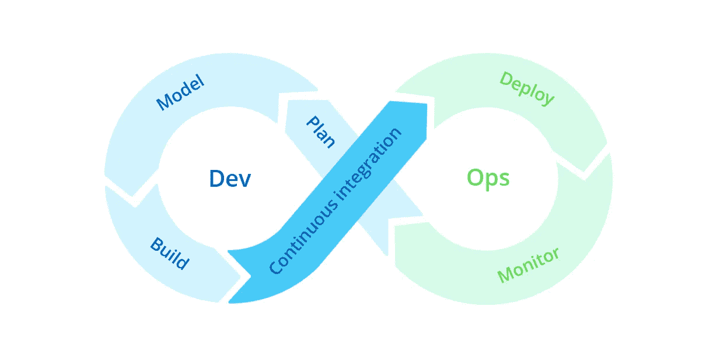

# 采用 DevOps 的三大挑战以及克服这些挑战的最佳方法

> 原文：<https://medium.com/quick-code/top-3-devops-adoption-challenges-best-ways-to-overcome-them-1ffbc464803f?source=collection_archive---------1----------------------->

德沃普夫妇去年 10 岁了。

但是，尽管已经在市场上存在了十多年，大多数组织似乎并不知道如何实现它。

就像俗话说的*“进步伴随着挑战”* & DevOps 也不例外。