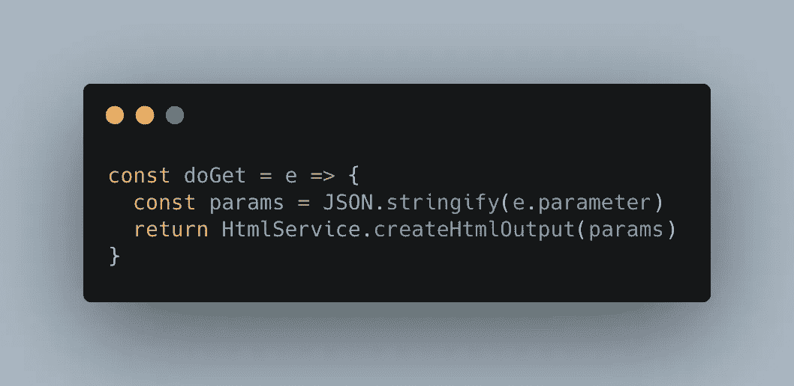

# 前 30 个有用的 Google Apps 脚本片段

> 原文：<https://medium.com/google-developer-experts/top-30-useful-google-apps-script-snippets-8ad13077530f?source=collection_archive---------1----------------------->



以下是我最喜欢的 30 个 Google Apps 脚本片段。这些片段会节省你的时间。

# SpreadsheetApp

## 访问电子表格(独立脚本)

```
const spreadsheet = SpreadsheetApp.openById("Spreadsheet ID")
```

*电子表格 ID* 可以从电子表格 URL 获得

https://docs . Google . com/spreadsheets/d/[*电子表格 ID* ]/edit

## 对电子表格的访问(容器绑定脚本)

```
const spreadsheet = SpreadsheetApp.getActive()
```

## 获取值

```
const values = spreadsheet
  .getSheetByName('sheet name')
  .getDataRange()
  .getValues()
```

## 设置值

```
spreadsheet
  .getRange(range)
  .setValues(values)
```

## 添加自定义菜单

```
const onOpen = () => {
  SpreadsheetApp
    .getActiveSpreadsheet()
    .addMenu('Menu name', [
      {name: 'sub menu name 1', functionName: 'functionName1'},
      {name: 'sub menu name 2', functionName: 'functionName2'},
    ])
}
```

## onEdit 触发器

```
const onEdit = e => {
  const { range, oldValue, value } = e
}
```

## onSelectionChange 触发器

```
const onSelectionChange = e => {
  const { range, user } = e
}
```

# 谷歌日历

## 创建事件

```
CalendarApp.getDefaultCalendar().createEvent(title, start, end)
```

## 获取事件

```
const events = CalendarApp
  .getDefaultCalendar()
  .getEvents(start, end)
  .map(event => ({
    title: event.getTitle(),
    description: event.getDescription(),
    start: event.getStartTime(),
    end: event.getEndTime()
  }))
```

您可以从 [CalendarEvent](https://developers.google.com/apps-script/reference/calendar/calendar-event) 类中获取其他属性

## 访问非默认日历

```
const calendar = CalendarApp.getCalendarById('Calendar ID')
```

# 谷歌邮箱

## 发送电子邮件

```
GmailApp.sendEmail('tanabee@example.com', 'subject', 'body')
```

## 搜索线索

如果你想得到 10 个最新的线程，

```
const threads = GmailApp.search('', 0, 10)
```

您可以将[搜索操作符](https://support.google.com/mail/answer/7190?hl=en)设置为第一个参数。

## 获取消息

```
const messages = GmailApp.search('', 0, 10).flatMap(thread => 
  thread.getMessages().map(message => ({
    subject: message.getSubject(),
    body: message.getBody(),
    date: message.getDate(),
    from: message.getFrom(),
    to: message.getTo(),
  }))
)
```

您可以从 [GmailMessage](https://developers.google.com/apps-script/reference/gmail/gmail-message) 类中获取其他属性

# Google Drive

## 获取特定文件夹中的文件夹和文件

```
const folder = DriveApp.getFolderById('Folder ID')const files = folder.getFiles()
while (files.hasNext()) {
  let file = files.next()
  console.log('file: ', file.getName())
}const folders = folder.getFolders()
while (folders.hasNext()) {
  let folder = folders.next()
  console.log('folder: ', folder.getName())
}
```

# 谷歌表单

# 获取输入值

```
const onSubmit = event => {
  const answer = event.response
    .getItemResponses()
    .map(itemResponse => ({
      item: itemResponse.getItem().getTitle(),
      response: itemResponse.getResponse()
    }))
}
```

您需要添加表单提交触发器。

# 谷歌文档

## 访问 Google 文档(独立脚本)

```
const doc = DocumentApp.openById('Document ID')
```

*文档 ID* 可从电子表格 URL 获得

https://docs . Google . com/Document/d/[*文档 ID* ]/edit

## 访问 Google 文档(容器绑定脚本)

```
const doc = DocumentApp.getActiveDocument()
```

## 添加自定义菜单

```
const onOpen = () => {
  DocumentApp
    .getUi()
    .createMenu('menu name')
    .addItem('item name', 'functionName')
    .addToUi()
}
```

# 公用事业

## 格式化日期

```
const date = Utilities.formatDate(new Date(), 'Asia/Tokyo', 'YYYY-MM-dd HH:mm:ss')
```

## 睡眠

如果您希望脚本休眠 1 秒钟

```
Utilities.sleep(1000)
```

## 生成 UUID

```
const uuid = Utilities.getUuid()
```

# 引发

## 1 分钟后执行功能

Google Apps 脚本对脚本运行时间有一个[限制](https://developers.google.com/apps-script/guides/services/quotas#current_limitations)。如果希望脚本的工作超过限制，可以提前安排下一次执行。

```
const date = new Date()
date.setMinutes(date.getMinutes() + 1);// after 1 min
ScriptApp.newTrigger('functionName').timeBased().at(date).create();
```

# 属性服务

## 获取属性

```
const value = PropertiesService.getScriptProperties().getProperty(key)
```

## 设置属性

```
PropertiesService.getScriptProperties().setProperty(key, value)
```

# 语言应用程序

## 翻译

```
const text = LanguageApp.translate('Hello World', 'en', 'ja')
```

# 网络应用

## 网站(无 HTML 模板)

```
const doGet = e => {
  const params = JSON.stringify(e.parameter)
  return HtmlService.createHtmlOutput(params)
}
```

## 网站(带 HTML 模板)

```
const doGet = e => {
  return HtmlService.createHtmlOutputFromFile('index')
}
```

您需要创建 index.html 文件。

## 获取 API

通过访问 e.parameter 可以得到查询字符串。

```
const doGet = e => {
  const params = JSON.stringify(e.parameter)
  return ContentService
    .createTextOutput(params)
    .setMimeType(MimeType.JSON)
}
```

## 发布 API

您可以通过访问 e.postData.contents 来获取请求正文。

```
const doPost = e =>  {
  const body = e.postData.contents
  return ContentService
    .createTextOutput(body)
    .setMimeType(ContentService.MimeType.JSON)
}
```

# UrlFetchApp

使用 UrlFetchApp 类时，可以访问其他资源。

## 获取 API 请求

```
const content = UrlFetchApp.fetch(url).getContentText()
```

## 发布 API 请求

```
const res = UrlFetchApp.fetch(url, {
  method: 'POST',
  headers: { "Content-Type": 'application/json' },
  payload: JSON.stringify(data)
})
```

感谢您阅读本文！