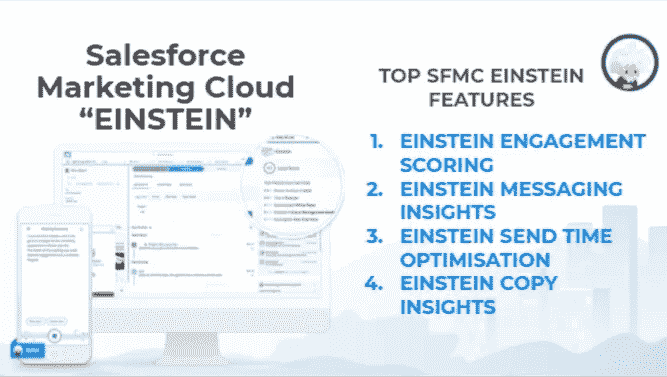

# 四大必用 SFMC·爱因斯坦特性来完善你的营销活动

> 原文：<https://medium.com/globant/top-4-must-use-sfmc-einstein-features-to-refine-your-marketing-campaign-365f38be1ec?source=collection_archive---------0----------------------->

Top 4 Must-Use SFMC Einstein Features

如何使用 Salesforce 营销云 Einstein 在营销自动化领域进行互动和转化。我们将通过业务使用和示例来学习考虑爱因斯坦能力的潜在特性

有很多关于 Salesforce 营销云爱因斯坦的讨论，但它到底是什么呢？

> 爱因斯坦是 Salesforce 营销云的 AI 智能 CRM 助手。开发它的目的是利用人工智能(AI)在 B2C 或 B2B 功能中的真正潜力来提高客户参与度

SFMC·爱因斯坦是利用人工智能和数据驱动策略的第一选择

Einstein 允许所有 Salesforce 用户:

*   **发现**他们数据中隐藏的见解和模式
*   **预测**业务成果
*   **推荐**最好的行动、提议或约定
*   自动化业务流程和工作流程

***事实&数字:*** 在 AI 的帮助下，基于过去 90 天的历史数据生成自动化的洞察。Salesforce Einstein 现在每天提供超过 800 亿次人工智能预测。人工智能现在势在必行。

在**数字** **营销领域，**爱因斯坦帮助营销人员在正确的时间、通过正确的渠道向正确的客户发送正确的内容，从而提高客户参与度。

您可以使用 Einstein AI 为您的销售和营销团队安排工作优先级，并通过[数据驱动战略](/globant/how-to-win-the-marketing-automation-game-with-a-data-driven-strategy-de14240ef972)赢得营销自动化游戏。SFMC·爱因斯坦的主要作用是为您最积极的潜在客户和有效的营销活动提供可操作的数据。

**对于数字营销人员来说，使用 SFMC·爱因斯坦最普遍的案例是:**

*   **改善客户细分**
*   **个性化渠道体验和客户旅程**
*   **发送实时的下一个最佳报价**
*   **制作动态登陆页面和网站**
*   **借助洞察力优化客户体验**

****

**Digital Marketing Use Cases for SFMC EINSTEIN**

**为了解决上述使用案例和挑战，SFMC 引入了 EINSTEIN，以避免猜测并获得基于营销活动的可行见解。Einstein 的核心增量功能简化了从细分到参与的营销任务。**

**让我们来探索 SFMC·爱因斯坦的 4 大功能，以提高您的营销投资回报率，并利用人工智能实现营销云。**

## **爱因斯坦敬业度评分**

****功能:****

*   **为订户保持*订阅的可能性分配分数，打开，在网站上点击&转换*。**
*   **了解影响用户对电子邮件采取行动的预测因素的类别**
*   **根据他们参与您的活动的预测可能性对数据扩展进行细分**
*   **访问受众生成器-根据爱因斯坦预测得分创建细分列表。**
*   **通过电子邮件工作室、旅程构建器、广告工作室或受众构建器锁定订户**

**除了每个用户分数，Einstein 还将客户分为更容易识别的角色:**

1.  ****忠诚者**:经常交战**
2.  ****选择性订户**:不常打开，但可能会点击**
3.  **橱窗购物者:定期开放，但很少点击**
4.  **休眠/Winbacks :不太可能参与**

****用法:**您可以使用具有 [SFMC 旅程构建器](/globant/leverage-automation-technology-guide-to-salesforce-marketing-cloud-d02d38c6f50e)功能的爱因斯坦评分拆分活动，根据爱因斯坦人物角色将客户细分为多个类别**

****爱因斯坦敬业度评分示例:****

**最强大的功能是基于未来 14 天指标的人工智能预测:**

1.  **平均值。打开的可能性，点击**
2.  **平均值。订阅可能性**
3.  **平均值。转化的可能性**

****

**Einstein Engagement Scoring Capabilities**

**您将能够监控您的参与订户列表的健康状况，并能够创建类似于最佳表现订户的受众**

## ****爱因斯坦的信息洞察****

****功能:****

*   **通过电子邮件或旅程发送信息洞察警报，提升绩效**
*   **监控电子邮件发送指标(打开、点击、取消订阅等)**
*   **基于与历史绩效相比的高或低结果的见解**

****用法-** 您将能够获得隐藏的洞察力，而无需以传统方式将指标与之前的活动进行比较。AI 的力量来了。**

****爱因斯坦信息洞察的例子**:**

**营销人员还可以在登录 SFMC 仪表板后，立即点击带有通知的快速徽章。请看上面的截图，以供参考**

****

****Einstein Messaging Insights Example****

**当我们单击任何通知时，让我们看看详细的消息:**

*   ***旅程“每周交易邮件”的打开率***

**2021 年 7 月 12 日，这一旅程的邮件打开率为 35.71%，高于预期**

*   ***活动“日常女装电子邮件”的点击率***

**2021 年 7 月 16 日，这一旅程的邮件点击率为 1.23%，高于预期**

**(维奥拉！成功活动的印象分)**

**现在，数字营销人员意识到电子邮件表现过度或表现不佳，营销人员可以调整他们的旅程或发送电子邮件，以确保他们的表现处于最佳状态。**

## ****爱因斯坦发送时间优化****

****能力**:**

*   ****在用户最有可能打开的时候发送电子邮件****
*   ****显示预测未来信息互动的分析****
*   ****可视化**按天或小时计算的最佳预测发送时间**

****

**Einstein Send Time Optimization Capabilities**

****用法:****

**爱因斯坦发送时间优化(STO)使用机器学习和 90 天的电子邮件参与数据来确定未来 24 小时内向每个联系人发送消息的最佳时间。**

****

**Einstein Send Time Optimization Usage**

****征途构建器中爱因斯坦发送时间优化示例:****

**我们可以得到每天和每小时的最佳发送时间。**

**我们可以直接在旅程构建器中实现 STO。当打开的机会很高时，电子邮件将被发送给订户**

## ****爱因斯坦复制见解****

****功能**:**

*   **根据平均打开率评估最佳主题行**
*   **发现能引起积极回应的单词和短语**
*   **对电子邮件主题行中使用的语言因素的见解**

**当我们点击 Einstein Copy Insights 的选项卡时，我们可以根据主题行分析快速获得见解。请看截图供参考。**

****

**Einstein Copy Insights Capabilities**

****用法:****

**这个功能允许任何企业“写出更好的主题行”。你会对过去使用的主题行的不同元素有很多见解。基于人工智能，主题线的优化非常容易，因为它检查了主题线中使用的语言因素和情感基调的组成。**

****爱因斯坦复制洞见的例子:****

**知道适合你的主题行:你将能够识别是 CTA(了解更多)、品牌名称(亚马逊)还是感叹号(！？)推动主题行的点击量增加。**

**such 爱因斯坦还拥有先进的功能，如电子邮件、网页推荐和行为触发器，可以根据用户先前的行为提供相关的内容和消息。需要某些配置、自定义属性、代码实现来启用 AI 构建的个性化电子邮件和 web 推荐。**

# **结束语:**

**数字营销人员的工作在活动开始和活动结束后并没有结束。衡量绩效并利用洞察力实时微调战略非常重要。一个专业的营销人员必然会使用人工智能和自动化来做出数据支持的决策。**

**SFMC·爱因斯坦公司的功能有助于企业将其客户数据转化为可操作的商业见解，从而提高客户参与度。**

**Salesforce 营销云 Einstein 的最终目标是建立一个细分的客户列表，有效地优化 journey builder 并完善整体营销活动，以提高打开率、点击率和转化率。**

**敬请关注更多此类文章。**