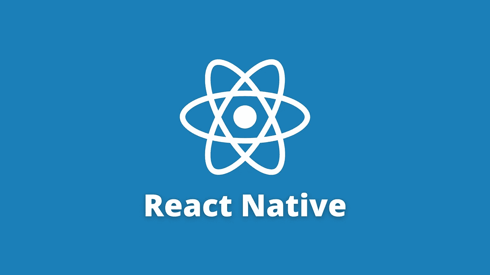
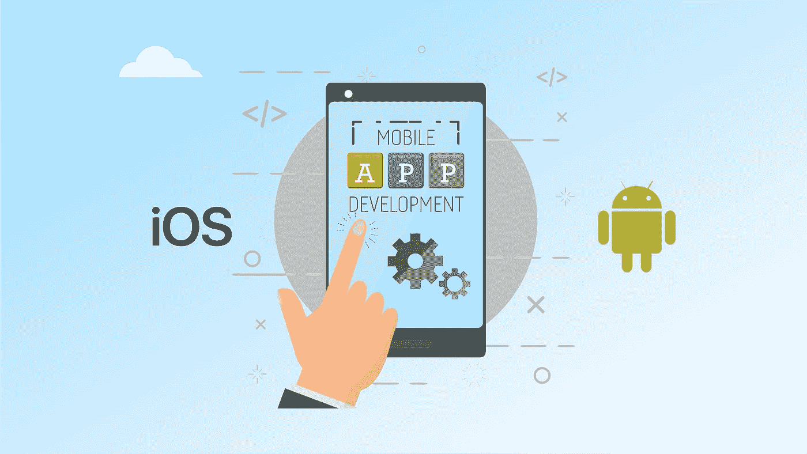

# 学习 React Native 的五大免费在线课程

> 原文：<https://medium.com/quick-code/top-5-free-online-courses-to-learn-react-native-7a643df06dd7?source=collection_archive---------0----------------------->

## 下面列出了 Udemy、Coursera、edX 等领先提供商提供的顶级免费 React 本地课程！

Learn React Native

各位开发者好！毫无疑问，应用程序开发是一项越来越重要的技能。你对 Android 开发了解得越多，你实现职业目标的机会就越大。通过 Android 开发，你将获得晋升，得到你梦想中的工作，或者立刻创建你自己成功的企业。好吧，React Native 是实现这一切的一种方法。

React Native 是一个强大的 JavaScript 库，将跨平台构建的混合空间提升到了新的高度——它提供了与原生移动应用程序相同的结果，但跨 iOS 和 Android 的开发速度要快得多。除了灵活的平台支持，React Native 还允许开发人员构建在不同平台上运行的移动应用，而不会影响最终用户体验。因此，我编制了这份免费 React native 课程列表，以帮助您入门。

或者，如果你想投资付费课程，我也为初学者整理了一份[最佳反应本土课程](https://coursesity.com/best-tutorials-learn/react-native)的清单。现在，让我们从 React Native 开始。

## 1. [React 原生 IOS 和 Android 应用开发](https://click.linksynergy.com/deeplink?id=0F1O0otUXQc&mid=47901&u1=csMedium&murl=https%3A%2F%2Fwww.udemy.com%2Fcourse%2Freact-native-tutorial%2F)——【Udemy】

React Native iOS and Android App Development

本课程由 Ryan Dhungel 教授，将帮助您掌握 React Native。它将帮助您学习如何在 React native 中创建 UI 组件。此外，您将获得构建多个屏幕和实现导航的经验。

此外，您还将了解如何实现 WebView，允许您将现有网站包装在应用中并提供给用户，而无需在 react native 中重新创建整个应用。

在 React Native 课程中，您将学习:

*   使用 React Native 设置和运行
*   如何构建 UI 组件
*   实施导航
*   如何构建多个屏幕
*   实施 WebView
*   反应状态
*   可重用组件
*   闪屏
*   Flex CSS 布局

这是 Udemy 上排名第一的免费 React 本地课程，在 5 门课程中获得 4.2 分，时长 1 小时 55 分钟。此外，请记住，由于这是一门免费的 Udemy 课程，所以完成后您不会获得证书。

## 2. [CS50 的 React Native 手机应用开发](https://www.awin1.com/cread.php?awinmid=6798&awinaffid=466009&clickref=csMedium&ued=https%3A%2F%2Fwww.edx.org%2Fcourse%2Fcs50s-mobile-app-development-with-react-native)——【edX】

本课程将向你介绍现代 JavaScript(包括 ES6 和 ES7)和 JSX。此外，您将通过动手项目获得 React 范例、应用程序架构和用户界面方面的经验。本课程将以一个期末项目结束，在这个项目中，你将从头开始创建并编写一个应用程序。

在 React Native 课程中，您将学习:

*   Java Script 语言
*   ES6
*   反应过来，JSX
*   组件、道具、状态、风格
*   组件、视图、用户输入
*   排除故障
*   数据
*   航行
*   世博组件
*   Redux
*   表演
*   运输、测试

通过本课程，您可以了解如何在没有 Java 或 Swift 的情况下，使用脸书维护的流行框架 React Native 开发跨平台的原生应用。

这是 edX 上的顶级免费 React 本地课程，持续时间为 13 周(每周 6-9 小时)。此外，请记住，由于这是一门免费的 edX 课程，所以完成后您不会获得证书。旁听这个课程是免费的，但是付费会给你更多的好处。

## 3.[学习 React Native](https://www.pjatr.com/t/TUJGR0lLR0JHR0pMSUtCR0ZISk1N?sid=csMedium&url=https%3A%2F%2Fwww.codecademy.com%2Flearn%2Flearn-react-native)——【代码学院】

React Native Fundamentals

本课程面向有 web 开发经验并想学习如何创建移动应用程序的中级用户。熟悉 JavaScript 和 React 开发并希望扩展其移动开发能力的学员将从本课程中受益。

在 React Native 课程中，您将学习:

*   Expo 和 React Native 以及如何编写 app。
*   如何在你的应用中使用核心组件？
*   向组件添加自定义样式。
*   如何使用 React 导航制作多屏 app？

本课程将向您介绍世博会，并做出本土反应。您可以使用 Expo 和 React Native 构建一个移动应用程序。使用 Android、iOS 或 web，您可以一次开发您的应用程序，并在多个平台上运行。有了以前的 web 开发经验，您可以创建具有本机 UI 和设备功能的移动应用程序。

这是 Codecademy 上的顶级免费 React 本地课程，持续时间为 7 小时。此外，请记住，除非您拥有 Codecademy 的专业会员资格，否则您不会获得结业证书。

## 4.[用 React Native](https://click.linksynergy.com/deeplink?id=0F1O0otUXQc&mid=47901&u1=csMedium&murl=https%3A%2F%2Fwww.udemy.com%2Fcourse%2Fcreate-a-tiny-app-with-react-native%2F)——【Udemy】创建一个微型应用

既然你已经有了一个基本的了解，现在是时候把你的反应本土知识运用到工作中了。你可以通过这门远程课程很好地运用这些知识。本课程将教你如何制作一个小小的 React 原生应用程序，这样你就可以开始体验创建应用程序是多么简单。

本课程不要求之前有编码经验。但是，需要 React Native 的基本知识，并且 React Native 已安装在您的设备上。

这是 Udemy 上的顶级免费 React 本地课程，5 门课程中有 4.4 门，时长 1 小时 40 分钟。此外，请记住，由于这是一门免费的 Udemy 课程，所以完成后您不会获得证书。

## 5. [React Native 新手教程——打造 React Native App](https://www.youtube.com/watch?v=0-S5a0eXPoc?ref=csMedium)

React Native Tutorial for Beginners

如果你有 React 和 JavaScript 的经验，React Native 是从 web 开发过渡到移动开发最简单快捷的方法。这篇来自《用 Mosh 编程》的 React Native 教程将帮助您开始使用 React Native。从 Expo 开始，您将学习创建您的第一个 React 本机应用程序，并继续学习运行 iOS 和 Android 模拟器、在 VSCode 中调试等主题。

感谢您阅读这篇关于免费 React Native 课程的文章！如果你觉得这篇文章有帮助，请在评论中告诉我。此外，这里还有一些帖子，你可能会觉得有用:

 [## 学习 React.js 的十大免费课程

### 下面列出了 Udemy、Coursera、edX 等领先提供商提供的顶级免费 React 课程！

medium.com](/quick-code/top-10-free-courses-to-learn-react-cc6a40b9835)  [## 面向 Java 程序员的 6 门免费 Spring Boot 课程

### 这些免费课程将教你所有你需要知道的关于流行的 Java 框架 Spring Boot 的知识。

medium.com](/quick-code/5-free-spring-boot-courses-for-java-programmers-369981c93c4a)  [## 学习围棋编程的 5 门免费 Golang 课程

### 各位程序员和开发者好！您对免费 Golang 课程的搜索到此结束。在这篇文章中，我将分享…

medium.com](/quick-code/5-free-golang-courses-to-learn-go-programming-5dd95c4baddb)