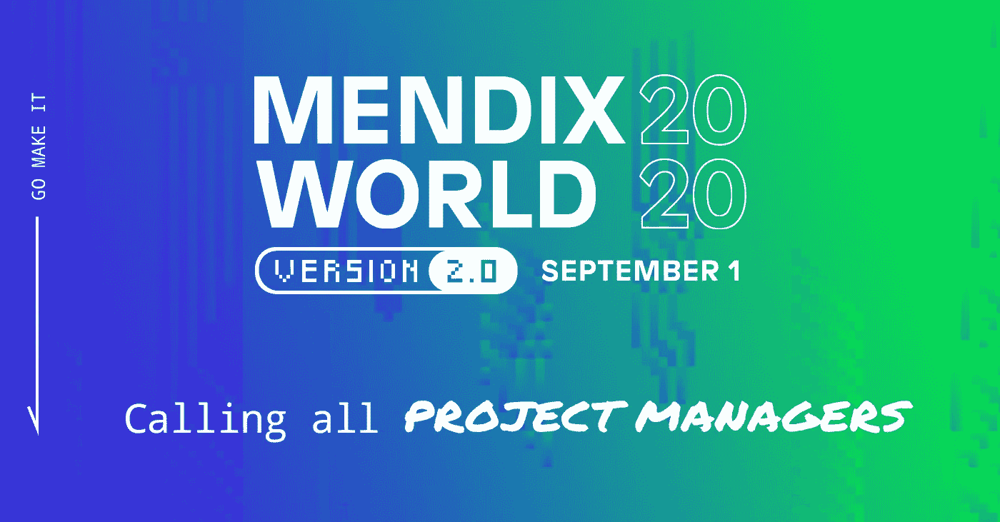

# 项目经理不应错过的 5 个 Mendix World 版本会议

> 原文：<https://medium.com/mendix/top-5-mendix-world-version-2-0-sessions-project-managers-shouldnt-miss-3f3c058431f1?source=collection_archive---------5----------------------->

Mendix World 一直是一个大事件，发布了许多激动人心的公告，并展望了低代码的未来。然而，今年的活动变得更加容易，因为你可以在家参加任何活动！没有旅行时间，没有服装，只有即时内容！

Maarten Bongers 是 Mendix 首席开发人员和 MVP(最有价值专业人员)。他报名参加了 Mendix 世界大会，并对项目经理参加的会议进行了评估。

# 以下是马尔滕的观点...

有很多不同的会议激发了我的兴趣。每当听到 CEO Derek Roos 和 CTO Johan de Haan 的主题演讲时，我总是非常兴奋。这些演讲总是能很好地洞察他们对低代码的看法，以及 Mendix 将会带来什么。

除了主题演讲之外，今年，我从一个项目经理的角度来看待这次活动。在我与 Mendix 一起工作的 8 年中，在每个项目中，项目管理都会以某种方式自然地出现。根据项目的规模、持续时间或重要性，要么我作为首席开发人员负责其中的一些方面，要么指派一名实际的项目经理。

作为一名项目经理，您可能有兴趣看到项目中其他被证明的成功，管理期望，以及评估风险。这些话题都可以在 [Mendix World 2.0](https://www.mendix.com/mendix-world/?utm_medium=referral&utm_source=CommunityBlog&utm_campaign=GL-CE-2020-09-01-Mendix-World) 会议中找到。为了帮助你做出选择，或者说服你参加，我列出了涵盖以下主题的五个重要会议:

**1。** [**从第一款应用开始创建应用组合路线图:规划和资金**](https://www.mendix.com/mendix-world/?utm_medium=referral&utm_source=CommunityBlog&utm_campaign=GL-CE-2020-09-01-Mendix-World)

项目经理都是关于计划，当然，还有预算。在本专题讲座中，您将了解低代码的投资组合规划和投资为何以及如何不同于其他技术，并了解您的应用计划是否符合“Mendix 泳道”。

在本次会议期间，数字转型全球总监 Arjo van Oost 将解释低代码的投资组合规划和融资为何以及如何不同于其他技术。他还将为您提供启动应用程序组合的参数，例如如何创建初始路线图。

**2。** [**爱之旅 Stops 和泰坦咨询如何用 SAP 加速 App 开发& Mendix**](https://www.mendix.com/mendix-world/?utm_medium=referral&utm_source=CommunityBlog&utm_campaign=GL-CE-2020-09-01-Mendix-World)

这一期和下一期都是客户的成功。当然你要看什么是可能的，别人做了什么。特别是这一个，向您展示了一个在 Mendix 之上使用 SAP 的优秀案例。

Love's Travel Stops 拥有 26，000 多名员工，在美国各地提供从卡车维修到接待的服务。业务系统高级经理 Daniel Parkhurst 和企业应用高级经理 Vijay Ponnavolu 将告诉您为什么 Mendix 成为与 SAP 互动的合适合作伙伴。与 Mendix 的合作将开发时间从几个月缩短到了几周，该团队还构建了各种应用程序来管理从房地产地图到客户奖励计划的运营。

**3。** [E **与 CNH Industrial**](https://www.mendix.com/mendix-world/?utm_medium=referral&utm_source=CommunityBlog&utm_campaign=GL-CE-2020-09-01-Mendix-World) 进行供应链协作和企业模型库定义

CNH Industrial 是全球最大的资本品公司之一。借助 Mendix，他们构建了一个应用程序，将来自 PLM (Siemens Teamcenter)、企业工程物料清单(EBoM)系统和传统文档管理存储库的数据整合在一起。Mendix 帮助将 3D 数据暴露和可视化到应用程序中，因此绝对是引人注目的！

NH IT 总监 Tom Grigas 和 Mendix 行业解决方案全球副总裁兼负责人 Rohit Tangri 将详细阐述该解决方案，以及它如何在内部设计、工程和采购团队之间实现更好的供应链协作。

**4。** [**通过明确的云部署方法降低风险和成本**](https://www.mendix.com/mendix-world/?utm_medium=referral&utm_source=CommunityBlog&utm_campaign=GL-CE-2020-09-01-Mendix-World)

降低风险和成本，这是我们所有项目的目标，对吗？本课程将向您展示 Mendix 云战略的范围，并通过一个客户使用案例说明如何充分利用您的云战略。此外，云部署和运营副总裁马尔滕·斯密茨和产品营销经理乔·卡罗尔将告诉您如何扩展您的应用程序开发实践，同时考虑安全管理和业务连续性等概念。

**5。** [**招募并指导顶尖的 Mendix App 开发团队**](https://www.mendix.com/mendix-world/?utm_medium=referral&utm_source=CommunityBlog&utm_campaign=GL-CE-2020-09-01-Mendix-World)

你可能想知道为什么这个会在列表上，但是作为一个项目经理，你可能会负责组建一个团队，或者被要求为你的项目创建一个团队结构。本课程涵盖这一主题，并让您深入了解什么样的技能最适合 Mendix 应用开发团队。

此外，Mendix 高级技术负责人 Eric Tieniber 和应用交付经理 Simone Mink 将分享最佳实践和与外部利益相关方合作的方式，以随着您的发展保持高效。

总之，这些会议将加深或扩展你对低代码和 Mendix 的理解，并给你作为一个项目经理一些有意义的见解。足够的理由报名参加！不要错过所有这些免费知识！

你可以在 Slack @Maarten Bongers 找我，但是你得先[注册](https://www.mendix.com/mendix-world/?utm_medium=referral&utm_source=CommunityBlog&utm_campaign=GL-CE-2020-09-01-Mendix-World)。现在注册，我们就可以开始谈论它会有多棒。那里见！