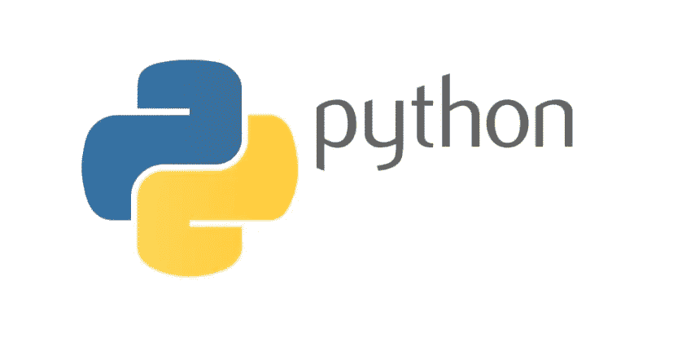

# Web 开发中你应该知道的 5 大 PHP 替代方案

> 原文：<https://medium.com/quick-code/top-5-php-alternatives-you-should-know-for-web-development-d3232b426a25?source=collection_archive---------0----------------------->

在 web 开发行业，PHP 已经有了自己的一席之地。首先，它是编程世界中最古老的脚本语言之一，对初学者和老手都有广泛的可用性。根据 SimilarTech 的数据，PHP 目前为网络世界中近 4300 万个网站提供支持。那是一些数字！

最新的版本是 PHP7，有很多改进，包括提高了速度。使用 PHP 的另一个好处是，它为开发人员提供了大量强大的 web 开发框架，如 Symfony、CodeIgniter 和 Laravel，由于它们的高级工具，这些框架使 [PHP 开发服务](https://www.hiddenbrains.com/php-development.html)更好、更容易、更高效。

最后但同样重要的是，PHP 得到了一个庞大社区的支持，这个社区为它提供了急需的进步。但是，并不是所有的东西都适合所有人，虽然有些开发人员喜欢使用这种多范例、通用脚本语言，但有些人更喜欢使用最新的技术。

然而，熟悉 PHP 的人可能会发现很难找到它的替代品，尤其是因为有如此多的选择。另一方面，其他开发人员只是希望避免这些语言的缺点。

因此，这篇文章为那些正在寻找合适的语言替代者的开发人员提供了 PHP 的五大替代方案。

# Web 开发人员的 5 个最佳 PHP 备选方案列表

## 1 JavaScript

这不是很明显吗？这种编程语言只比 PHP 年轻一岁，随着时间的推移，它已经成为 web 世界最流行的编程语言。它也是 web 开发人员必须学习的三种语言之一，另外两种是 HTML 和 CSS。

由于其简单的学习曲线和(再次)众多强大的框架和库的可用性， [JavaScript](/quick-code/7-free-typescript-courses-for-beginners-da0423ab5943) 被列为 PHP 的最佳替代品。它是面向对象的，具有动态绑定的特性。

它具有一流的功能，并支持命令式和事件驱动式编程风格。最好的事情之一是，几乎所有的主流浏览器，如 Chrome 和 Firefox，都包含一个专用的 JavaScript 引擎。难怪它被列为开发人员的首选 PHP

## 2.计算机编程语言

Python 已经成为一种健壮的编程语言，这种健壮的编程语言获得全世界的认可有几个原因。在它受欢迎的众多原因中，主要有两个——第一，它简单明了的语法，据说像英语一样简单，第二，它可以让开发人员用很少的代码行编写代码。

Python 提供了对 Windows、Linux、Raspberry 和 Mac 的跨平台支持。它具有广泛的标准库，并支持不同的编程范例，如函数式、过程式和面向对象式。使用它的另一个优点是它适合于快速原型制作，因为它可以在解释器系统上运行。

这种语言也因处理复杂的数学运算和大数据而闻名。Python 广泛用于服务器端 web 开发、系统脚本编写和复杂软件系统的开发。它已经被网飞、优步和 Dropbox 等网络世界的顶级巨头所使用。

## 3 C#

作为微软的一项技术，C#无疑是 PHP 的有力竞争者和可行的替代品。这也是一种多范例和通用的编程语言。NET 框架。它支持强类型、声明性、面向对象、基于组件和函数式编程原则。

与微软的其他技术相比，C#最大的好处之一是易于学习和使用。此外，它提供了一个清晰的编程结构和代码的可重用性，从而降低了整体开发时间。

因为这种语言源于 C 家族，所以开发人员很容易从 C 或 C++转换到 C#，反之亦然。C#的流行源于其广泛的可用性，因为它可以用于开发桌面应用程序、移动和 web 应用程序、web 服务、游戏和数据库应用程序以及许多其他应用程序。

## 4 走

Go，也被称为 [Golang](/quick-code/10-best-golang-tutorials-to-learn-go-programming-46fbd4b81d2c) ，是由谷歌概念化和设计的，直到今天，它仍然享有这个科技巨头的支持。选择 Go 的第一个原因是它支持多种平台，包括 Linux、Windows、Plan 9、macOS 和 Solaris。

从语法上来说，这种编译过的开源编程语言据说类似于 C，并提供对命令式、并发和面向对象编程原则的支持。它具有全面的标准库和内置的并发性，易于学习和使用。

尽管 Go 相对较新，但它已经在编程领域占据了一席之地，因为它编程简单、现代化，并且支持多核和网络计算。开发人员也更喜欢 Go，因为它可以减少编码的复杂性和混乱。

## 5 Java

我们正在讨论一些科技界最流行的编程语言，这意味着 Java 必须在这里。这种高级语言的打字纪律是主格的、强有力的和安全的。从语法上来说，Java 也类似于 C 和 C++。所以程序员在这些语言之间切换变得很容易。

与这里提到的其他 PHP 替代方案一样，Java 也提供多范式编程支持，包括基于类(即面向对象)、函数式、并发、反射和命令式。Java 的受欢迎程度可以通过它为超过 30 亿台设备提供支持这一事实来推断。

它具有跨平台支持和代码的可重用性，因此减少了总的编码时间。它的安全性和巨大的社区支持是它的其他福利。Java 可用于开发 web 和移动应用程序(尤其是 Android)、桌面应用程序、游戏和 web 服务器。

## 拿走

曾经有一段时间 PHP 开发服务如火如荼。它仍然在蓬勃发展，人们确实雇佣专门的 PHP 开发人员来开发他们的应用程序。但是其他技术的出现为开发者提供了更好的选择；其中最流行的是 JavaScript、Python、Go、Java 和 C#。

但是这并不意味着 PHP 正在失去它的魔力。这仅仅意味着开发者和企业可以有更多的选择。然而，技术的选择很大程度上取决于软件需求、预算和语言满足所有这些需求的能力。