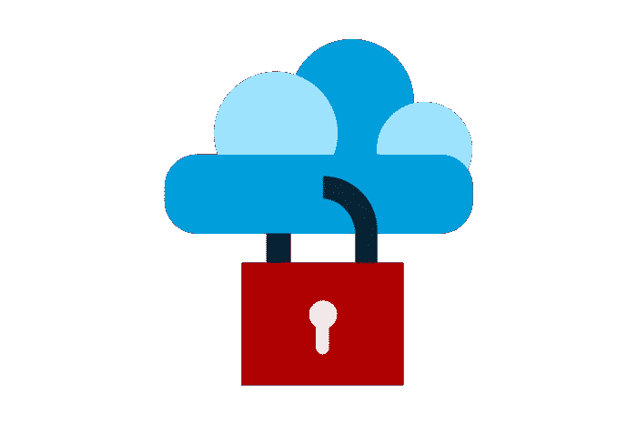

# 五大单点登录解决方案

> 原文：<https://medium.com/globant/top-5-sso-solutions-8b67e22c2bfa?source=collection_archive---------0----------------------->

Free image from needpix.com, author kreatikar (pixabay.com)

单点登录(SSO)解决方案为用户提供了一种简单明了的方式，让他们可以用同一个帐户轻松访问我们生态系统中的所有工具。另一个巨大的好处是，SSO 解决方案的实施允许您在我们公司集成它的任何工具中通过用户的帐户来集中用户的身份验证和授权。

单点登录允许管理员通过 SSO 解决方案或任何其他集成解决方案的集中管理面板管理所有用户和权限，从而帮助节省 IT 时间。

登录到您的 SSO 提供者会获得用户在我们公司拥有的所有帐户的访问权限和角色，并将其标识为合法的(如果合法的话)。在获得用户的所有信息后，SSO 将告诉工具用户可以登录，如果进行了配置，还会告诉工具授予用户哪些权限，拒绝哪些权限。登录后，SSO 会不断地将用户识别为已验证，以便他们可以无缝地通过我们公司的所有网站和工具。

单点登录(SSO)最重要的优势就是不需要管理几个不同的账号和密码，用户可以轻松登录我们公司的各个网站或工具。

如果你是创业公司的一员，或者没有专门的领域来研究哪种 SSO 解决方案最适合你的公司，不要担心；我会尽力帮助你。我在下面的列表中总结了我认为目前最好的 SSO 解决方案。

# 五大单点登录解决方案

为了生成这个列表，我使用了以下标准:

*   创业公司的盈利解决方案；
*   全功能解决方案；
*   对受资助和不受资助的组织都有用；
*   即使对于小型企业也易于使用和管理；
*   简化认证过程；
*   市场上广泛使用和熟知的解决方案。

非常感谢为这五大榜单贡献时间和数据的每一个人……下面是名单:

## 天空的八分之一

Okta 提供了一个经济高效的解决方案，几乎涵盖了我们所有的单点登录需求。它是一款领先的基于云的单点登录工具，使我们的公司，无论规模大小或行业，都能简化其用户身份验证程序，同时确保安全性不会受到影响。它还提供了一个策略，允许用户和第三方或关联公司灵活访问。

有趣的是，通过 Okta 的 SSO 解决方案，可以(并且直接)定制仪表板来快速找到最常用的应用程序。此外，我们可以从移动设备访问仪表板，从而允许我们在任何地方执行几乎任何类型的任务。

Okta 的一些特点是:

*   无缝安全和登录体验；
*   一直开着；
*   自适应认证；
*   实时安全报告；
*   AD/LDAP 集成；
*   安全目录；
*   它有多个稳定的集成。

 [## 身份| Okta

### Okta 的身份平台易于使用，中立，并与您现有的解决方案，所以你可以自由选择…

www.okta.com](https://www.okta.com/) 

## Auth0

Auth0 身份和管理平台提供了我们不断发展的组织所需的一切，例如更好的控制、卓越的安全性和易用性。无论是通过企业联盟、社交登录还是用户名和密码认证，SSO 都允许用户登录一次，然后使用他们被授权访问的所有应用程序。

这是一个云原生解决方案，提供身份验证即服务功能，并提供完整的 SSO 解决方案。Auth0 通常运行在他们的公共云上，但如果我们的公司需要，他们也提供在私有云上托管它的选项。

Auth0 的一些特性包括:

*   身份提供商服务；
*   活动目录；
*   LDAP/ADFS/SAML 集成；
*   一致的单点登录体验。

 [## Auth0:每个人的安全访问。但不是任何人。

### 阅读客户案例→从通过无缝登录改善客户体验到让 MFA 变得只需点击一下…

auth0.com](https://auth0.com/) 

## 赛博方舟

CyberArk Identity Single Sign-On 是一个易于管理的解决方案，只需点击一下即可访问您的云、移动和网站应用程序以及其他工具。这种单点登录解决方案为您提供了一种顺畅、安全的登录体验。它适用于根据风险进行调整的内部和外部用户。在现有公司凭证的帮助下，用户可以登录到 web 门户，从一个位置访问他们所有公开的应用程序和资源。

该解决方案通过减少持续登录的需求提高了工作效率，通过自助密码和帐户解锁工具减轻了 IT 人员的负担，并通过安全、集中的凭据存储消除了危险行为。

赛博方舟的一些特色包括:

*   自适应 MFA 接入；
*   与大量 SaaS、移动和定制应用程序无缝协作；
*   一键访问。

 [## 主页

### 2022 年 Gartner 魔力象限报告中 PAM 和访问管理的唯一领导者。首先。永远不会。赛博方舟…

www.cyberark.com](https://www.cyberark.com/) 

## 格鲁

Gluu 是市场领先的功能丰富的单点登录解决方案，用于身份验证和访问管理。他们设定的主要目标是保证我们组织的安全。也是市面上最好的创业公司 SSO 解决方案之一。它的单点登录跨越了上述协议的所有限制，令人印象深刻地改善了用户体验。

对于 web 和 API 认证，它提供了一个授权服务器。此外，它还提供了一个单独的目录来存储身份数据。它还为入站身份和目录集成提供双因素身份认证(2FA ),并提供一个目录来识别数据存储和身份认证中间件。

Gluu 的一些特性是:

*   面向 web 和移动应用的单点登录；
*   入站 SSO
*   社交登录；
*   强认证；
*   访问管理；
*   身份管理
*   目录服务集成；
*   社区支持和知识库。

 [## Gluu 身份和访问管理

### 我们在我们的网站上使用 cookies，通过记住您的偏好并重复…

gluu.org](https://gluu.org/) 

## 锻造岩石

ForgeRock SSO 帮助我们的组织提供一个“登录一次，访问全部”的环境，以便所有用户都可以访问他们的所有应用程序。

该解决方案的作者认为，每个应用程序需要不同的登录会导致用户沮丧和流失，收入损失和生产力下降。ForgeRock 允许您采用一种更好的方法，即建立一个由策略强制执行的可靠的单用户登录点。用户管弦乐队没有摩擦，但在一个安全的方式。通过 ForgeRock 智能访问及其低代码/无代码方法，您可以拖放不同的元素，如身份验证方法和上下文身份验证。

锻石的一些特征是:

*   简化用户登录；
*   实现智能登录决策；
*   无需密码和用户名的身份验证。

 [## 面向消费者和员工的数字身份| ForgeRock

### 在不破坏遗留系统的情况下解决任何身份使用案例。获得 ForgeRock 身份平台即服务或…

www.forgerock.com](https://www.forgerock.com/) 

# 摘要

在 SSO 解决方案的帮助下，我们可以跨组织内的所有系统有效且高效地管理身份验证凭据以及这些凭据的授权。上面提到的所有单点登录解决方案都是最受欢迎的，我认为是市场上可用的最佳解决方案，被初创公司和大型公司广泛使用。

如果您正在为您的企业或公司选择 SSO 解决方案，我建议您仔细阅读这个博客及其链接。