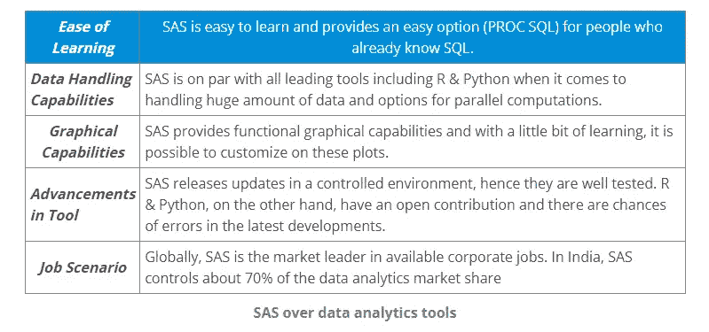
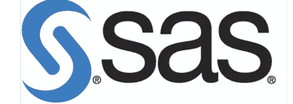
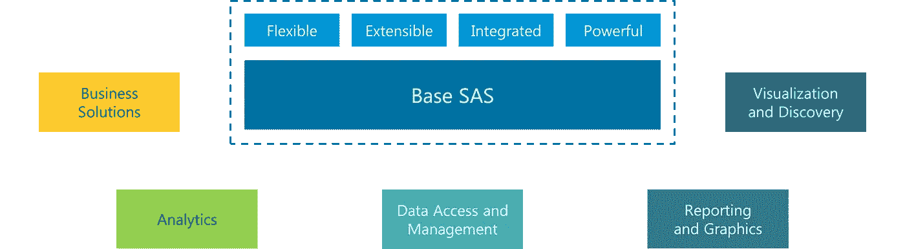
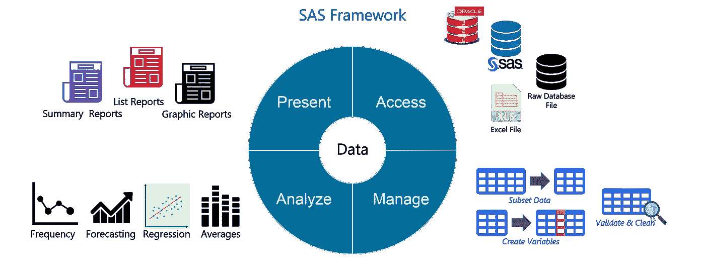

# 2021 年你必须准备的 50 个 SAS 面试问题

> 原文：<https://medium.com/edureka/top-50-sas-interview-questions-ea3939a119d0?source=collection_archive---------4----------------------->


SAS 是市场上最受欢迎的数据分析工具。这个博客是一个完美的指南，帮助你学习通过 SAS 面试所需的所有概念。我们已经根据难度将问题分开，这将帮助不同专业水平的人从我们的博客中获得最大的收益。SAS 面试问题博客将是一个一站式资源，你可以在那里提高你的面试准备。

在进入 SAS 面试问题之前，让我们先了解一下 ***为什么 SAS*** 很重要。SAS 简单易学，为已经了解 SQL 的人提供了一个简单的选项(PROC SQL)。在处理大量数据和并行计算选项方面，SAS 与包括 R & Python 在内的所有领先工具不相上下。在全球范围内，SAS 是企业职位的市场领导者。在印度，SAS 控制着大约 70%的数据分析市场份额，而 r 只占 15%。如果您打算涉足数据分析，现在正是开始参加 ***SAS 认证培训*** 的好时机。现在，让我们继续讨论一些最重要的 SAS 面试问题，这些问题可以在你的 SAS 面试中被问到。

# SAS 面试问题

## 1.列出选择 SAS 而不是其他数据分析工具的原因。

**回答:**我们将从以下几个方面比较 SAS 与市场上流行的替代产品:



## 2.什么是 SAS？

**回答:** SAS ( **统计分析系统**)



*   SAS 是用于高级分析、多元分析、商业智能、数据管理和预测分析的软件套件
*   它是由 SAS 研究所开发的。
*   SAS 为非技术用户提供了一个图形点击式用户界面，并通过 SAS 语言提供了更多高级选项。

## 3.SAS 有什么特点？

**答:**以下是 SAS 的特点:



**图:** *SAS 面试问题—SAS 的特点*

1.  **业务解决方案:** SAS 提供业务分析，可以作为业务产品供各公司使用。
2.  **分析:** SAS 是各种商业产品和服务分析领域的市场领导者。
3.  **数据存取&管理:** SAS 也可以作为 DBMS 软件使用。
4.  **报告&图形:** Hello SAS 有助于以摘要、列表和图形报告的形式可视化分析。
5.  **可视化:**我们可以用图形的形式可视化报告，从简单的散点图和条形图到复杂的多页分类面板。

## 4.提及 SAS 框架的一些功能。

**答:**以下是 SAS 框架中的四种能力:



**图:** *SAS 面试问题— SAS 框架*

1.  **访问:**从图中可以看出，SAS 允许我们从多个来源访问数据，如 Excel 文件、原始数据库、Oracle 数据库和 SAS 数据集。
2.  **管理:**然后，我们可以将这些数据管理为子集数据，创建变量，验证和清理数据。
3.  **分析:**进一步，对该数据进行分析。我们可以执行简单的分析，如频率和平均值，以及复杂的分析，包括回归和预测。SAS 是统计分析的黄金标准。
4.  **呈现:**最后，我们可以以列表、总结和图形报告的形式呈现我们的分析。我们可以打印这些报告，将它们写入数据文件或在线发布。

## 5.SAS 程序中 output 语句的作用是什么？

**答:**可以使用 OUTPUT 语句将汇总统计数据保存在 SAS 数据集中。这些信息可用于创建定制报告或保存流程的历史信息。

您可以使用 OUTPUT 语句中的选项来

1.  指定要保存在输出数据集中的统计数据，
2.  指定输出数据集的名称，并
3.  计算并保存能力过程不会自动计算的百分点。

## 6.SAS 程序中 Stop 语句的作用是什么？

**答:** *Stop 语句*使 SAS 立即停止处理当前数据步，并在当前数据步结束后继续处理语句。

## 7.在 data 语句和 set 语句中使用 drop = data set 选项有什么区别？

**答:**如果不希望处理某些变量，不希望它们出现在新的数据集中，那么在 *set* 语句中指定 drop = data set 选项。

然而，如果想要处理某些变量并且不希望它们出现在新的数据集中，那么在*数据*语句中指定 drop = data set 选项。

## 8.给定一个未排序的数据集，如何将最后一次观察读到一个新的数据集？

**答:**我们可以使用`end= data set` 选项将最后一次观察读取到新的数据集。

例如:

`data work.calculus;`
`set work.comp end=last;`
`If last;`


其中 *calculus* 是要创建的新数据集，而 *comp* 是现有数据集。 *last* 是临时变量(初始化为 0)，当 set 语句读取最后一个观察值时，该变量被设置为 1。

## 9.从外部文件读取数据和从现有数据集中读取数据有什么区别？

**答:**主要区别在于，在用 set 语句读取现有数据集时，SAS 会保留一次观测到下一次观测的变量值。而当从外部文件读取数据时，只读取观察值。如果需要使用这些变量，必须重新声明它们。

## 10.SAS 中有多少种数据类型？

**回答:**SAS 中有两种数据类型。字符和数字。除此之外，日期也被认为是字符，尽管有处理日期的隐式函数。

## 11.SAS 函数和程序有什么区别？

**答:**函数期望在 SAS 数据集中的一个观察中提供参数值，而过程期望每个观察有一个变量值。

例如:

`data average ;`
`set temp ;`
`avgtemp = mean( of T1 – T24 ) ;`


在这里，均值函数的论点是通过观察得出的。mean 函数计算单次观察中不同值的平均值。

`proc sort ;`
`by month ;`
`run ;`
`proc means ;`
`by month ;`
`var avgtemp ;`
`run ;`

Proc means 用于按月计算平均温度(在一次观测中取一个变量值)。在这里，程序*是指可变月份上的*。

## 12.sum 函数和使用“+”运算符有什么区别？

**答:** SUM 函数返回非缺失参数的和，而“+”运算符返回缺失值(如果任何参数缺失)。

例如:
`data mydata;`
`input x y z;`

`33 3 3`
`24 3 4`
`24 3 4`
`. 3 2`
`23 . 3`
`54 4 .`
`35 4 2`
`;`
`run;`

`data mydata2;`
`set mydata;`
`a=sum(x,y,z);`
`p=x+y+z;`


在输出中，第 4、第 5 和第 6 次观察的 p 值缺失，如下所示:

```
a p
39 39
31 31
31 31
5 .
26 .
58 .
41 41
```

## 13.PROC MEANS 和 PROC SUMMARY 有什么区别？

**答:** PROC MEANS 仅在使用了 by 语句且输入数据之前已由 BY 变量排序(使用 PROC SORT)时产生子组统计数据。

PROC SUMMARY 自动生成所有子组的统计数据，在一次运行中为您提供所有信息，您可以通过定义每个子组的变量和运行 PROC MEANS 对数据集进行重复排序来获得这些信息。PROC SUMMARY 不会在您的输出中产生任何信息。因此，您需要使用 OUTPUT 语句来创建一个新的数据集，并使用 PROC PRINT 来查看计算出的统计数据。

## 14.举例说明 SAS 无法自动将字符值转换为数值？

**答:**假设可变工资率的值以美元符号($)开始。当 SAS 试图自动将工资率值转换为数值时，美元符号会阻止该过程。这些值不能转换为数值。

因此，当转换发生时，最好在程序中包含*输入*和*输出*功能。

## 15.如何在 SAS 中删除重复的观察值？

**答:**有三种方法可以删除数据集中的重复观测值:

1.  通过使用`Proc sort data=SAS-Dataset nodups;`
    `by var;`
    `run;`程序中的 nodups

2.通过在过程中使用 SQL 查询

Proc sql
从旧 SAS 数据集创建 SAS 数据集作为 select *，其中 var = distinct(var)；
退出；

3.通过清理数据

设置温度；
按组；
如果 first.group 和 last.group 则
运行；

## 16.PROC SQL 是如何工作的？

**答:** PROC SQL 是一个针对所有观察的同步进程。执行 PROC SQL 时会发生以下步骤:

1.  SAS 扫描 SQL 过程中的每条语句，并检查语法错误，如缺少分号和无效语句。
2.  SQL optimizer 扫描语句中的查询。 *SQL 优化器*决定应该如何执行 SQL 查询，以最小化运行时间。
3.  *FROM* 语句中的任何表都被加载到数据引擎中，然后可以在内存中访问这些表。
4.  执行代码和计算。
5.  最终表在内存中创建。
6.  最终表被发送到 SQL 语句中描述的输出表。

## 17.简单解释一下输入和放函数？

**答案:**输入功能—字符到数字转换—输入(source，informat)

put 函数—数字到字符的转换—put(源，格式)

## 18.以下 SAS 函数的结果会是什么(假设 2000 年 12 月 31 日是星期天)？

Weeks = intck ('week '，' 2000 年 12 月 31 日' d，' 2001 年 1 月 1 日' d)；
Years = intck ('year '，' 2000 年 12 月 31 日' d，' 2001 年 1 月 1 日' d)；Months = intck ('month '，' 2000 年 12 月 31 日' d，' 2001 年 1 月 1 日' d)；

**答:**这里，我们将计算 2000 年 12 月 31 日到 2001 年 1 月 1 日之间的周数。2000 年 12 月 31 日是一个星期天。因此，2001 年 1 月 1 日将是同一周的星期一。因此，周= 0

Years = 1，因为这两天属于不同的日历年。

Months = 1，因为这两天在日历的不同月份中。

## 19.假设变量 address 存储以下表达式:

纽约州中心城拉德克利夫路 209 号，邮编 92716

在下列情况下，扫描函数返回的结果会是什么？

`**a=scan(address,3);**`
`**b=scan(address,3,’,’);**`

**答案:**a =路；b =纽约

## 20.扫描功能分配给目标变量的长度是多少？

**答案:** 200

## 21.列举几个 SAS 函数？

**答案:**扫描，Substr，trim，Catx，Index，tranwrd，find，Sum。

## 22.tranwrd 函数的工作是什么？

**答:** *TRANWRD* 函数替换或删除一个字符串中所有出现的字符模式。

## 23.考虑下面的 SAS 程序

`data finance.earnings;
Amount=1000;
Rate=.075/12;
do month=1 to 12;
Earned+(amount+earned)*(rate);
end;
run;`

## 数据步骤执行结束时一个月的值是多少，会有多少观察值？

**答案:**月的值应该是 13

观察值的数量为 1

## 24.日期在 SAS 数据中是如何工作的？

数据是每个数据集的核心。在 SAS 中，数据以表格形式提供，其中变量占用列空间，观察值占用行空间。

*   SAS 将数字视为数字数据，其他的都属于字符数据。因此，SAS 有两种数据类型数字和字符。
*   除此之外，与其他语言相比，SAS 中的日期以一种特殊的方式表示。


**图:** *SAS 面试问题— SAS 日期*

*   SAS 日期是一个数值，等于自 1960 年 1 月 1 日以来的天数。
*   除了日期值，还有许多工具可以处理日期，比如读取日期的信息、操作日期的函数和打印日期的格式。

## 25.考虑下面的 SAS 程序

`data finance;
Amount=1000;
Rate=.075/12;
do month=1 to 12;
Earned+(amount+earned)*(rate);
output;
end;
run;`

## 数据步骤执行结束时会有多少观察值？

**回答:** 12

## 26.如果不知道应该执行多少次 do 循环，如何使用 do 循环？

**回答:**我们可以用' *do until'* 或者 *'do while'* 来指定条件。

## 27.do while 和 do until 有什么区别？

**答:**DO UNTIL 和 *DO WHILE* 语句的一个重要区别是 DO WHILE 表达式是在 DO 循环的顶部求值的。如果表达式第一次求值时为 false，则 DO 循环永远不会执行。而 DO UNTIL 至少执行一次。

## 28.如何在一个 do 循环中指定迭代次数和特定条件？

**回答:**

`data work;
do i=1 to 20 until(Sum>=20000);
Year+1;
Sum+2000;
Sum+Sum*.10;
end;
run;`

这个迭代 DO 语句使您能够执行 DO 循环，直到 Sum 大于或等于 *20000* 或者直到 DO 循环执行 10 次，以先发生的为准。

## 29.扫描函数的参数是什么？

**回答:**扫描功能就是这么用的。

`scan(argument,n,delimiters)`

这里，*参数*指定了要扫描的字符变量或表达式，

*n* 指定要读取的单词，以及

*分隔符*是必须用单引号括起来的特殊字符。

`data mymerge;
merge mydata1 mydata2;
run;`

如果观察值不匹配，那么匹配合并是合适的

`data mydata1;
input id class $;
cards;
1 Sa
2 Sd
2 Sp
3 Rd
4 Uj
;`

`data mydata2;
input id class1 $;
cards;
1 Sac
2 Sdf
3 Rdd
3 Lks
5 Ujf
;`

`data mymerge;
merge mydata1 mydata2;
by id
run;`

我希望这一套 SAS 面试问题能帮助你准备面试。此外，我会推荐来自 Edureka 的 SAS 教程视频，以了解更多信息。

如果你想查看更多关于市场上最流行的技术的文章，如 Python、DevOps、道德黑客，那么你可以参考 [Edureka 的官方网站](https://www.edureka.co/blog/?utm_source=medium&utm_medium=content-link&utm_campaign=sas-interview-questions/)

*原载于 2019 年 3 月 29 日*[*【https://www.edureka.co】*](https://www.edureka.co/blog/interview-questions/sas-interview-questions/)*。*