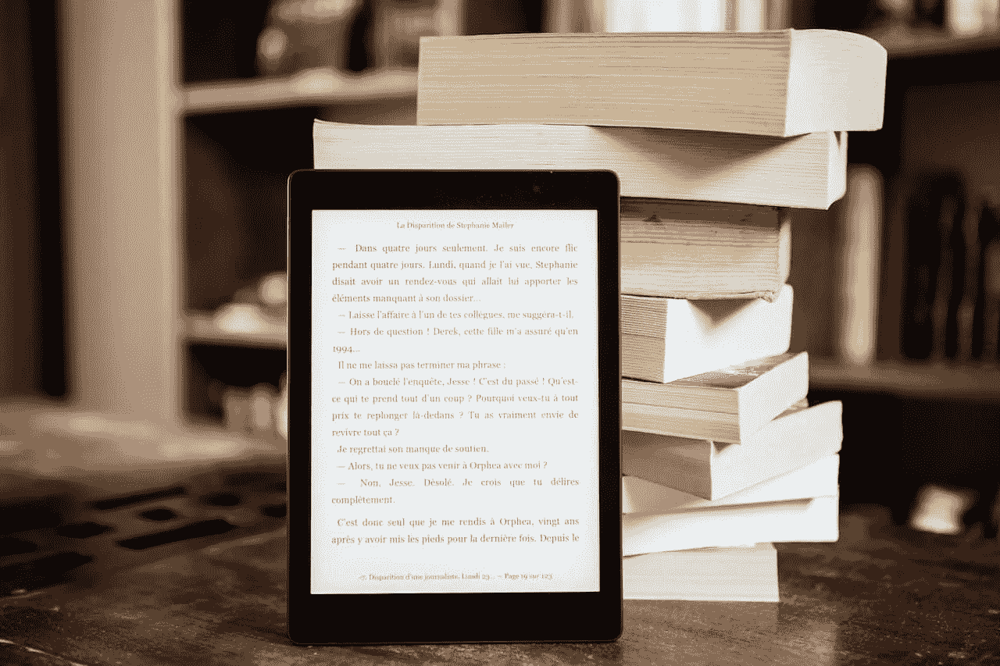

# 7 大电子书创作工具，打造出色的数字产品

> 原文：<https://medium.com/duomly-blockchain-online-courses/top-7-ebook-creating-tools-to-build-a-great-digital-product-ce1ce16b95aa?source=collection_archive---------3----------------------->

[Top 7 eBook Creating Tools](https://www.blog.duomly.com/top-ebook-creating-tools/)

本文最初发表于[https://www.blog.duomly.com/top-ebook-creating-tools/](https://www.blog.duomly.com/top-ebook-creating-tools/)

**目录:**

[补充]

# 7 大电子书创作工具简介

出于几个原因，电子书是内容创作的绝佳来源。首先，它们功能多样，结构紧凑，而且…