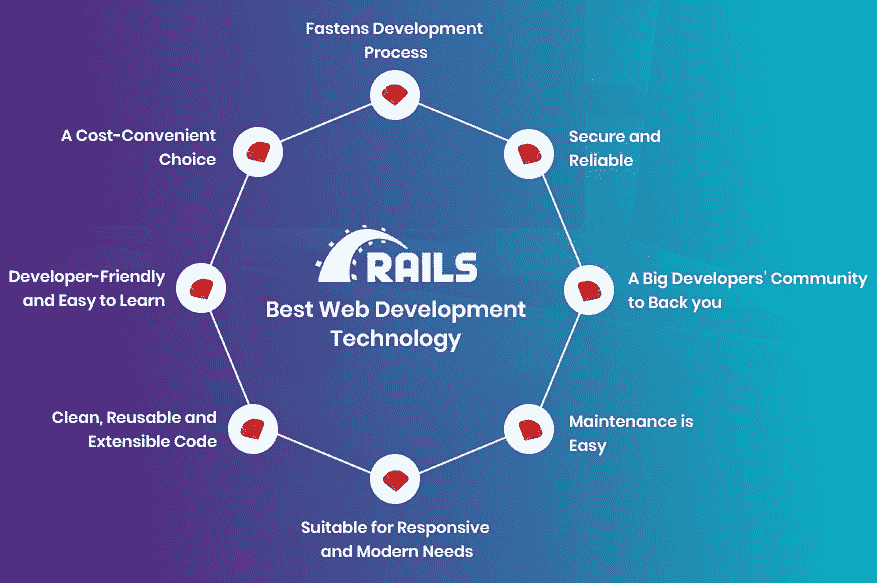

# 为什么 Ruby on Rails 是最好的 Web 开发技术的八大理由

> 原文：<https://medium.com/quick-code/top-8-reasons-why-ruby-on-rails-is-the-best-web-development-technology-3016824e6d34?source=collection_archive---------0----------------------->

Ruby 推出已经有 24 年了，Rails 框架(或称 RoR)推出也有大约 15 年了。从那时到现在，Ruby on Rails 仍然是最好的 web 开发选择之一。

Ruby on Rails 以其功能、易用性和健壮性而闻名。这就是为什么大量开发人员喜欢在他们的项目核心中使用它。

你是否也在考虑切换到 Ruby on Rails，或者为即将到来的项目雇佣 RoR 开发人员？

在 Bacancy，一家领先的 Ruby on Rails 开发公司，我们在过去的 9 年里一直使用 RoR，并且已经构建了 150 多个 RoR 应用程序。根据我们的经验，我们可以说您的选择是完美的。通过这篇文章，我们将为您提供越来越多的理由来考虑将 Ruby on Rails 作为您的 web 开发选择。更多附加信息请访问 [**红宝石认证**](https://onlineitguru.com/ruby-on-rails-online-training-placement.html)

# *这就是我们热爱 RoR 的原因:*

## 1.开发人员友好且易于学习

Ruby 在开发领域被广泛使用，采用它的主要原因是它简单且优化的语法。它和英语尽可能地一致。因此，开发人员不会觉得开始使用 Ruby on Rails 很难。

鲁比和 RoR 的文档管理得很好，写得很好，所以你不会发现学习它有任何困难。

对于 web 开发专业人员来说，阅读、理解或编写 RoR 代码很容易。Ruby on Rail framework 不仅易于学习，在其他方面也是开发人员友好的。与其他 web 开发选项相比，它让编码人员能够提供更少、更简洁的代码。

学习 Ruby on Rails 的另一个好处是它的高需求，这可以帮助开发人员在任何 Ruby on Rails 开发公司轻松获得好工作。

## 2.性价比高的选择

RoR 是一种开源技术。减少许可需求和头痛，它削减了运行一个网站的费用。这就是为什么许多初创公司和小企业认为 Ruby on Rails 是他们的最佳选择。

该技术非常适合于构建内容管理系统和电子商务网站，以及论坛和社交网站。它是在其上运行任何类型的动态门户的完美选择。

为了构建具有强大功能和高效率的优秀应用程序，您可以毫无疑问地选择 RoR。这不仅可以节省开发成本，还可以节省维护成本。

## 3.加快发展进程

无论是企业应用程序还是电子商务开发需求，Ruby on Rails 仍然是开发人员的最佳选择。很明显，原因是速度，在其中编码时可以达到的速度，以及它的效率。

与其他编程语言相比，使用 RoR 开发项目花费的时间更少。它可能少于总开发时间的 50%。这是因为你可以更快地编写 Ruby 代码。此外，与 Java、Python 或 PHP 相比，使用 Ruby 实现某些东西需要编写更少的代码。

RoR 不依赖于配置，所以你可以更快地工作，而使用它。

## 4.安全可靠

Ruby on Rails 位于数十个成功和知名项目的后端，如 Shopify、Zendesk、SoundCloud、CrunchBase 和 Airbnb。这些公司多年来一直在使用 RoR，证明该技术对您的项目也是可靠的。由于其健壮性，它被用于构建动态门户网站。

> 深入了解 [**Ruby On Rails 在线培训**](https://onlineitguru.com/ruby-on-rails-online-training-placement.html)

RoR 使用 REST API，让开发者为他们的网络应用程序使用标准协议，以保证它们的安全。其质量和安全保证流程包括多重安全和注射相关检查。自动化测试和简洁的代码是 RoR 安全代码背后的几个原因。

## 5.一个支持你的大型开发者社区

正如我们之前所说的，RoR 是一项开源技术，拥有一个庞大的开发者社区。这项技术由成千上万的技术极客支持、维护和维护，他们正努力保持更新和无错误。这种定期更新和扩展帮助 RoR 保持可用性，并推出新的代码库供重用。

有如此多的资源供你使用，如果你遇到困难，你将永远不会发现找到解决问题的方法很难。此外，在需要的时候，你可以雇佣或寻求其他 Ruby on Rails 开发人员的帮助，因为到处都有很多这样的专家。

## 6.维护很容易

RoR 非常适合程序员。如果你用 Ruby 编写代码，你已经知道它可以创建多么干净的代码片段。由于这种能力，RoR 已经成为一个一致的和易于维护的框架。

新开发人员理解旧代码或老开发人员从他离开的地方挑选代码需要的时间更少。Ruby 的这一特性的好处体现在对现有项目的快速简单的维护上。

## 7.适合快速响应的现代需求

RoR 与 HTML、CSS、JavaScript、Ajax 和其他 web 编程或脚本语言同步良好。有了它，您可以直接访问使用这些语言编写的代码或脚本。因此，您可以以协作良好的方式运行开发和设计任务。这仅仅意味着开发现代的、反应灵敏的和优雅的 RoR 应用程序总是可能的。

## 8.干净、可重用和可扩展的代码

上面我们也讲过。在 Ruby on Rail 框架项目上编写的代码经过了很好的优化。如果使用 RoR，Ruby on Rails 开发公司可以编写更小的代码，同时做更多的工作。它帮助开发人员开发出干净的、可扩展的代码，这些代码在将来很容易维护。

即使你计划在未来修改和扩展你的网络应用程序的功能，RoR 也会让你毫无困难地做到这一点。此外，RoR 有大量可重用的代码库，可以减少编码时间和代码的复杂性。

## 还有什么？

如果你认为就这样，那你就错了。我们可以不停地赞美 Ruby on Rails，因为我们从心底里热爱这项技术。Bacancy 使用 RoR 开发网络应用已经超过 9 年了。我们可以向你保证，RoR 在开发直观的、功能丰富的、动态的和强大的平台方面是强有力的。

最重要的是，它可以帮助你在搜索引擎中排名靠前(我们知道，网站的每个业务都想获得更好的 SEO 排名。

## 结论

Ruby on Rails 是一个可靠的 web 开发框架，可以更快地开发高性能的 web 应用程序。该技术已经使用了几十年，并将在市场上停留很长时间，因此您可以毫无疑问地依赖它。报名参加 [**Ruby On Rails 课程**](https://onlineitguru.com/ruby-on-rails-online-training-placement.html) 的现场免费演示

它是内容管理系统开发、电子商务门户开发、社交媒体平台创建和论坛开发等项目的最佳选择。然而，如果你想运行一个简单的博客网站或单页网站，这不是一个好的选择，因为开发这种解决方案的成本很高。