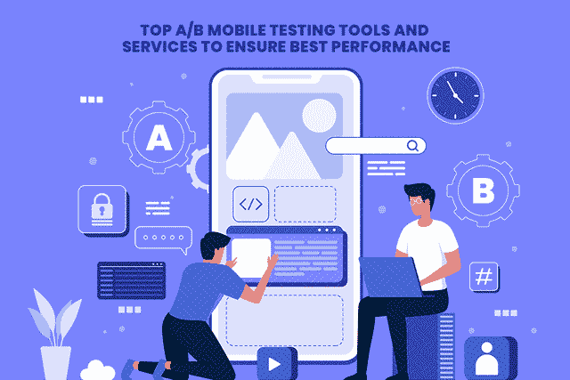
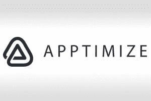
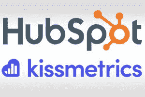
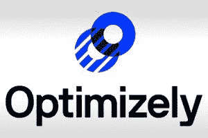
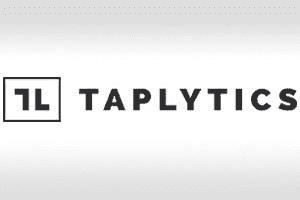
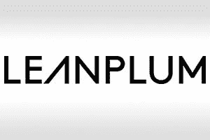
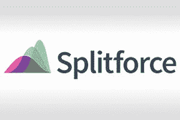

# 2020–21 年将采用的顶级 A/B 移动测试服务和工具

> 原文：<https://medium.com/quick-code/top-a-b-mobile-testing-services-and-tools-to-adopt-in-2020-21-665296e787db?source=collection_archive---------3----------------------->

Image Source: [https://www.freepik.com/vectors/technology](https://www.freepik.com/vectors/technology)

谷歌 Play 商店每月发布超过 100，000 个新的 Android 应用程序，预计用户将把 90%的互联网时间花在移动应用程序上，因此移动行业的快速发展也就不足为奇了。这突出了一个事实，即所有行业的公司都可以通过投资移动应用程序开发将业务提升到一个新的水平。

嗯，将业务从实体店转移到数字店的趋势并不新鲜，但新冠肺炎·疫情增加了所有行业对移动应用的需求。从远程购物到远程医疗，移动应用正在全球范围内掀起一场革命。

现在令人瞠目结舌的事实是，[在应用商店提交的 40%的应用程序](https://www.incapptic.com/blog/incapptic-connect-app-release-automation-lowers-rejection-rates)由于应用程序完整性、设计垃圾、不正确的元数据等等而被拒绝。苹果联邦政府事务总监 ***“蒂莫西·鲍德利说——应用审查团队每周审查超过 10 万份提交材料，并拒绝其中约 3.6 万份提交材料”。***

如果我们总结这些数字，那么解读为 5 个应用中有 3 个被拒绝就不会错。根据调查， [42%的应用由于完整性而被拒绝](https://www.incapptic.com/blog/incapptic-connect-app-release-automation-lowers-rejection-rates)，10%是由于设计垃圾，8%是由于元数据不正确等等。因此，如何让你的应用程序在应用程序商店中发布，以及如何让它在不同的应用程序商店中流畅运行，是开发人员关心的几个主要问题。

别担心，这个博客列出了 10 个最神奇的 A/B 测试工具和服务，帮助你提高你的移动应用的性能。

但是在开始使用工具和服务之前，理解 A/B 测试工具到底是什么以及为什么需要它是很重要的。

## **什么是 A/B 测试，为什么需要它？**

一个百万美元的应用程序开发想法可以帮助你取得成功，这是事实，但你不能忽视这个事实，即应用程序的成功在于你开发它的方式。因此，A/B 测试应该是移动应用策略的第一步，让你能够深入评估应用的每个元素。

A/B 测试通常对应用程序的各个方面进行测试，以了解什么工作，什么不工作。因此，这个测试由各种比较元素组成，帮助您了解哪一个驱动更多的流量和应用程序安装等。

**所以基本上 A/B 测试以两种方式进行:**

*   **App Store A/B 测试:**这将有助于测试商店列表和产品页面上的元素，如标题和描述、视觉效果、图库等。
*   **App A/B 测试:**您将在其中测试产品。

# **A/B 移动测试的好处**

每个人都想要一个完美的应用程序来为他们的业务带来更好的流量和线索，但这需要不断的优化和永无止境的实验，以使你的应用程序跟上下一次更新。A/B 测试将帮助您分析所有的统计数据，了解在您的移动应用程序中进行下一次更改的内容和时间。因此，A/B 测试工具和服务在提高移动应用程序性能方面发挥着不可或缺的作用。

现在的核心问题是，在 2020-21 年，你能找到的最好的 A/B 移动测试工具和服务是什么？在这篇文章中，我们收集了一份最佳测试工具和服务的列表，你可以考虑使用它们来提高移动应用的性能。

让我们从列表开始吧…

> **确保 2020–21 年最佳性能的 10 大 A/B 移动测试工具和服务**

## **1。** [**优化**](https://apptimize.com/) **:随处实验&随处跟踪**

***成立于:2013 年***

***定价使用:功能标志是免费的，但订阅计划是基于请求的。***

***主要用户:Glassdoor、Hotels.com、Delivery Hero 等。***

无论是测试原生、Web 还是混合移动应用，Apptimize 都是领先的 A/B 移动测试工具之一，为您提供无缝方式来优化应用在所有渠道上的性能。它最终是一个跨平台的 A/B 测试解决方案，允许您在任何平台上测试变化，并评估所有渠道的机会。

有了这个应用程序测试工具，无论您发布到哪个平台，您都可以完全控制功能发布。借助功能标志，您的移动应用开发团队可以轻松管理和加速移动、服务器端、OTT 和 web 更改，而不会有任何风险。Apptimize 让您可以满怀信心地在手机应用中推出新功能。

## **2。**[**Mixpanel**](https://mixpanel.com/home/)**:构建了更好的具有功耗分析功能的产品**

***成立于:2009 年***

定价使用:对初学者来说是免费的，但计划从每月 24 美元开始。

***主要用户:优步、Skyscanner、Expedia、Twitter 等。***

Mixpanel 是最强大的产品分析工具之一，可帮助您构建更好的产品，并使您能够通过应用程序转化、吸引和留住更多用户。使用 Mixpanel A/B 测试工具，您可以深入了解应用程序，生成简单的报告，并进行最适合您的应用程序的集成。这个工具主要用于分析、衡量和改善你的客户体验。这个工具的简单特性是产品分析、产品度量和产品基础。

此外，该工具易于访问，允许您更改应用程序的任何部分，而无需部署任何编码。

## **3。** [**轮毂&kiss metrics’**](https://offers.hubspot.com/ab-testing-kit?hubs_post-cta=body&hubs_signup-url=blog.hubspot.com%2Fmarketing%2Fa-b-testing-tools&hubs_signup-cta=null&_ga=2.43313765.1106797197.1602219359-1853666690.1601463546)**A/B 测试工具包**

***创立于:纳***

***定价使用:免费使用***

***主要用户:Humana、Unbounce、Groove 等。***

使用 HubSpot 提升您的移动应用程序的性能，因为它使您能够免费下载完整的 A/B 测试套件。使用此套件，您可以访问一个易于使用的重要性计算器，该计算器可以优化应用程序的变量。其次，获得一个模板跟踪功能，帮助你随着时间的推移提高转化率。

这是商业应用程序的理想测试工具，因为它可以帮助您测试从登录页面、电子邮件到行动号召的所有内容，这极大地影响了销售线索的数量。

## **4。** [**优化:**](https://www.optimizely.com/) **交付更好的软件、产品和成长**

***成立于:2010 年***

***定价使用:每月 1440 美元***

***主要用户:微软、IBM、Zendesk 等。***

Optimizely 是一款独立、功能强大、速度最快的 A/B 测试工具，允许您尝试各种元素，包括入职、功能发现和其他策略，这些策略总体上有助于提高参与度和保留率。使用该工具，开发人员可以轻松优化任何平台上的应用体验，包括网站、后端代码、移动和对话应用。

作为一个超级快速和强大的测试工具，它可以帮助您实时更新应用程序，而无需等待 App Store 和 Google Play store 的审查报告。

## **5。** [**VWO:**](https://vwo.com/) **世界上最值得信赖的 A/B 测试工具**

***成立于:2009 年***

***使用定价:每月 1440 美元***

***主要用户:希尔顿、易贝、迪士尼、塔吉特、彭斯泰特等***

当谈到选择最好的领先的 A/B 移动应用程序测试工具来提高应用程序的性能时，VMO 是开发者的首选。被世界上最好的品牌使用，包括易贝，塔吉特，维珍，假日，VMO 已经建立了作为最好的 A/B 测试工具的声誉，也有助于优化转化率。

为了简化测试过程，VMO 为您提供了一个强大的报告仪表板，您可以利用贝叶斯统计，使您能够以最快的模式运行测试。此外，它会让你更好地控制你的测试，并帮助你得出准确的应用测试结论。这个测试工具被设计成适合 A/B 测试、分离 URL 测试和带有拖放编辑器的多变量测试。

## 6。[**omni convert**](https://www.omniconvert.com/)**:用数据驱动的结果优化您的客户旅程**

***成立于:2013 年***

***定价使用:计划基于客户要求***

***主要用户:那***

Omniconvert 是一个知名的移动应用转化率平台，为您提供 A/B 测试工具以及调查、个性化、覆盖和细分工具，以帮助您获得更好的结果。使用他们的测试工具，您可以快速测试运行在不同平台(桌面、移动和平板电脑)上的应用。

使用 Omniconver，您可以获得更好的测试结论。它将他们的细分工具与 A/B 测试工具相结合，允许您测试大约 40 个细分参数，包括地理位置、流量来源、访问者行为、产品特性以及验证内容质量以吸引访问者的能力。Omniconvert 可以成为中型商业应用程序的理想 A/B 测试解决方案。

## **7。**[**Taplytics:**](https://taplytics.com/a-b-testing-experimentation/)**A/B 测试和实验**

***成立于:2011 年***

***定价使用:按要求***

***主要用户:Ticketmaster、Chick-Fil-A、CBS 等***

Taplytics 是一个独特的、广泛使用的测试工具，允许你改变你在 iOS 和 Android 应用中看到的任何东西。从按钮，图像到颜色，整个用户界面/UX，你都可以用这个工具访问，并保持跟踪。在这个工具的帮助下，你可以实时看到最近变化的影响，从而带来更好的用户体验。

Taplytics 采用先进的分析系统，可帮助您为您的团队和其他第三方数据系统获取准确的数据。此外，您还可以管理来自所有平台的 A/B 测试推送通知。要利用这个测试工具，你需要做的就是雇佣最好的 [**移动应用开发公司**](https://www.xicom.biz/offerings/mobile-app-development/) ，他们有使用它的技能和经验。

## **8。**[**lean plum**](https://www.leanplum.com/)**:多通道 A/B 测试平台**

***成立于:2012 年***

***定价使用:计划按需***

***主要用户:Tinder、Zynga、App Annie、NBC 等。***

Leanplum 是最著名的简单易用且灵活的 A/B 测试平台，可帮助您优化应用的方方面面，从用户参与到应用内体验。有了这个测试工具，您可以为活动设定任意数量的目标，并能够得出高度准确的客户影响和趋势。

由于 Leanplum 是一个高度灵活的测试工具，您可以使用它来了解每个活动的积极和消极影响。例如，您的上一次推送通知是否增加了应用转化率，但也导致了额外的应用卸载？像这样，这个测试工具将帮助你超越一般的应用程序测试策略，并允许你为更好的成功做出必要的步骤。

## 9。[**split force**](https://splitforce.com/resources/interpreting-results)**:驱动统计意义上的结果**

***成立于:2013 年***

***定价使用:每月 14 美元起的计划***

***主要用户:马克和斯潘塞、FreeCharge、Burpple 等。***

自 2003 年成立以来，它是一个广泛使用的 A/B 测试平台，支持所有主要的现有和新兴平台，并为 iOS 原生、Android 原生和 Unity 项目提供库。此外，它为您提供了一个独特的功能集，使您能够根据不同的标准(包括移动操作系统、区域等)对用户进行虚拟细分。这些设置将帮助您使用目标 API 收集存储在后端的信息。

SplitForce 基于自适应学习算法，但它通过自动化过程来帮助您自动化整个 A/B 测试。总的来说，使用这个工具进行测试将帮助您节省时间，并逐渐向您展示更好的结果。

## 10。 [**货币化**](https://monetate.com/) **:完整的 App 优化工具**

***成立于:2008 年***

***定价使用:价格根据需求***

***主要用户:北脸、国家地理、真教等。***

它是一个领先的 A/B 测试工具，旨在测试营销应用程序，因为它使用上下文数据作为决策和建议的核心。它用于测试的技术将帮助您汇集来自 CRM 和 POS 等来源的第一方数据，然后将它们与实时行为和背景观察相结合，以开发有影响力的客户群。

该测试工具为您提供了简单易用的界面与强大的后端测试和细分引擎的独特组合，帮助您创造令人印象深刻的客户体验，从而提高转化率和收入。

# **结论**

在这篇文章的最后，值得一提的是，这些是恒定的 A/B 移动应用测试工具，可以免费使用基本功能和特性。这些测试工具将为您提供一个平台来分析应用程序的各个方面，并通过准确的统计数据帮助您了解应用程序性能的改进范围。你可以选择雇佣一个 [**软件开发公司**](https://www.xicom.biz/) 来更好地利用这些测试工具的特性。

> 如果你觉得我们遗漏了什么，你可以在评论框里告诉我们！